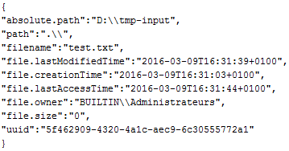
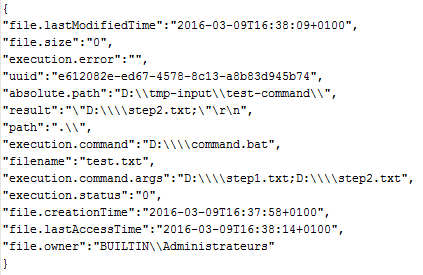

Few days ago, I just started to have a look into Apache NiFi which is now part of the [Hortonworks](http://hortonworks.com/) Data Flow distribution (HDF). Based on my experience at Capgemini and the kind of projects into I have been involved, I immediately realized that it is a powerful system that can be used in a wide range of situations and problems.

[Apache NiFi](https://nifi.apache.org/) is an easy to use, powerful, and reliable system to process and distribute data. It supports powerful and scalable directed graphs of data routing, transformation, and system mediation logic. Some of the high-level capabilities and objectives of Apache NiFi include:

- Web-based user interface
    - Seamless experience between design, control, feedback, and monitoring
- Highly configurable
    - Loss tolerant vs guaranteed delivery
    - Low latency vs high throughput
    - Dynamic prioritization
    - Flow can be modified at runtime
    - Back pressure
- Data Provenance
    - Track dataflow from beginning to end
- Designed for extension
    - Build your own processors and more
    - Enables rapid development and effective testing
- Secure
    - SSL, SSH, HTTPS, encrypted content, etc...
    - Pluggable role-based authentication/authorization

It must also be noted, that it is really easy to get started with NiFi (whatever the OS you are using): just download it, run it, and open your favorite web browser at localhost:8080.

Now you may tell yourself that it is just a tool to get data from a point A to a point B according to parameters, conditions, etc. In other words, you may think that it is just a tool to extract and load data. What are the transformation features offered by NiFi?

Just have a look to the list of 125+ processors available at this moment and you will have a good idea of what you can achieve. But let's say you need to do some very specific actions on your data and you don't see any processor suitable to your need. So what's next?

First, you can write your own processor, it is very easy and straightforward ([NiFi developer guide](https://nifi.apache.org/developer-guide.html)). Otherwise you can leverage some existing processors to execute custom code. For example you can achieve a lot of work with ExecuteScript and ExecuteStreamCommand processors. If you are interested by the first one, have a look on [this blog](http://funnifi.blogspot.fr/) to find useful and complete examples.

In this post, I want to focus on ExecuteStreamCommand and how it can be used to define data transformation flows. One common use case I see is to get files from one place and execute an application to transform the files.

For simplicity, let's say I have an input directory in which files to be processed are coming. For each file A of this directory, I want to execute an application to transform this data into a new file B:


This can be easily achieved by the combination of two processors: ListFiles and ExecuteStreamCommand.

Here is an example running on Windows: I look for any new file in "D:\\tmp-input" with a ListFiles processor using following properties:


For each new file coming in this directory, the processor will generate a FlowFile (see [NiFi documentation](https://nifi.apache.org/docs.html) to learn about NiFi principles) with some useful attributes and no content.

Now, I have a batch file that I want to be executed on each file. This batch file takes exactly one parameter which is the path of the file to be processed.

My batch file is the following (_command.bat_) and is very simple, it moves the given file into another directory (obviously, this is just an example, if we just want to move files, NiFi can do that without executing commands!):

```
@echo off
MOVE %1 "D:\tmp" >nul
```

Then my ExecuteStreamCommand will have the following properties:


Using the [Expression Language](https://nifi.apache.org/docs/nifi-docs/html/expression-language-guide.html) provided with NiFi, I can extract the path of the file previously listed by ListFiles processor by extracting information from the FlowFile attributes.

```
${absolute.path}${filename}
```

This is the concatenation of attributes "absolute.path" and "filename" from the incoming FlowFile (attributes set by ListFiles processor).

The processor can send to the executed process the content of the incoming FlowFile, but in my case there is no content and I don't want such a thing (Ignore STDIN = true). Besides, this processor can create a new FlowFile using the output of the command as content of the newly created FlowFile. But this is something I don't want with this command, so I set the property "Output Destination Attribute" with the value "result". This way, the output of my command is used as a new (or updated) attribute of my original FlowFile.

If you don't need this FlowFile anymore, you can auto-terminate the processor, and you have a ready-to-go flow for processing files using your own command.

If you want another process to run on the newly created file (in D:\\tmp), you can copy/paste this flow logic and use another ListFiles processor to scan the directory.


So far, it is a very basic operation. Something closer to real use case would be to create a flow where ExecuteStreamCommand processor gets information back from the executed command and passes it to the next processor.

Let's transform my batch file to return the parameters to be passed to the next processor. In my example, my batch file moves the file given as first parameter to file path given in second parameter. At the end, it displays the new path of the file (second parameter) and the third parameter to be used in next processor (again, this is an example, in real world such parameters would probably be computed by the executed process itself).

```
@echo off
ECHO %* >> %1
MOVE %1 %2 >nul
ECHO "%2;%3"
```

Note: since I configured my processor to accept arguments delimited with ";" I display parameters to be passed with this delimiter. It is possible to change the delimiter in the processor properties (I recommend reading the usage documentation associated to each processor, this is very helpful).

Let's have a look to the configuration of my first ExecuteStreamCommand processor:


This will execute my batch file with:

- 1st parameter:  path of my input file listed by ListFiles processor
- 2nd parameter: destination path of my file
- 3rd parameter: parameter to be passed to next processor

My batch file, once called, will move my file to "D:\\step1.txt" and will display:

"D:\\\\step1.txt;D:\\\\step2.txt"

This will be set at the value of the attribute with "result" as key in the generated FlowFile.

The second ExecuteStreamCommand processor has the following configuration:


Here, I use Expression Language functions (replaceAll) to remove special characters introduced in the process (it is possible to adapt the batch script to avoid this operation).

 

This will execute my batch file with:

- 1st parameter:  D:\\\\step1.txt
- 2nd parameter: D:\\\\step2.txt
- 3rd parameter: null

My batch file, once called, will move my file to "D:\\step2.txt" and will display:

"D:\\\\step2.txt"

In conclusion, by taking advantage of the Expression Language and by controlling the output of the executed commands, I can use the FlowFile initially created by ListFiles processors to carry information along the flow and propagate information and arguments to following steps.

For a better understanding, here is a picture of how the flow file has evolved through the flow:


Between the ListFiles processor and the first ExecuteStreamCommand processor, the flow file has the following attributes :



Then between the two ExecuteStreamCommand processors:


And at the end of the flow (if we want to add other processors):



As a side note, we can see that the return code of the executed command is available in the FlowFile with the attribute "execution.status". It easily allows to route FlowFile depending of what is the return code using RouteOnAttribute processor. Thus, it is possible to implement "catch" / "retry" strategies in case of error.

Please feel free to comment/ask questions about this post!
