Few days ago, on the mailing list, [a question has been asked](http://apache-nifi-developer-list.39713.n7.nabble.com/How-to-get-data-from-iPhone-td7899.html) regarding the possibility to retrieve data from a smartphone using [Apache NiFi](https://nifi.apache.org/). One suggestion was to use a cloud sharing service as an intermediary like Box, DropBox, Google Drive, AWS, etc.

Obviously, it already exists solutions to sync data from these services on your computer. But we could imagine using Apache NiFi to sync data between such services, or even better: to have an account on each of these services and use Apache NiFi as a single endpoint to use and manage all your accounts as a unique cloud storage facility. There are a lot of options out there.

For this post, let's just use Apache NiFi to get data from/to a [Dropbox](https://www.dropbox.com/) account. I let you guys use your imagination to develop amazing things!

First, I need to allow my account being accessed by an external application. To do that, I go on [this page](https://www.dropbox.com/developers/apps) and I click on the button "Create App". Then I choose the "Dropbox API" and, in my case, I select the "App folder" type of access (only one directory will be accessible to my application). In the end I choose the name of my application "NIFI". This will automatically create a folder Applications/NIFI in my Dropbox (this will be seen as the root directory of your Dropbox account from your application point of view: see it as "/").

Now you need to generate an access token for your application. On the page of your application you have a link to generate the token. Once generated, keep it securely for yourself!

OK! We have everything we need! Just to be sure all is working, you can check using curl that you have the access:

```
curl https://api.dropbox.com/1/account/info -H "Authorization:Bearer <YOUR-ACCESS-TOKEN>"
```

Note: here is [a post about the new Dropbox API](https://blogs.dropbox.com/developers/2015/04/a-preview-of-the-new-dropbox-api-v2/).

Now let's jump to Apache NiFi to have a flow to automatically download files from the Dropbox folder.

**1\. List content in Dropbox folder**

This can be achieved using :

```
curl -X POST https://api.dropboxapi.com/2-beta-2/files/list_folder \
    --header "Authorization: Bearer <access-token>" \
    --header "Content-Type: application/json" \
    --data "{\"path\": \"\"}"

```

With NiFi, we have to use the InvokeHTTP processor. At the time of writing, it is necessary to use an incoming FlowFile to set the content to be sent with a POST request. I will shortly open an issue about that and, hopefully, it should be possible to directly set the body in NiFi 0.7.0.

OK, so to get the content of the request set to

```
{\"path\": \"\"}
```

a workaround is to use a local file on your computer and to get it with a GetFile processor.

In conclusion, to issue the request to list the content of the folder we need:

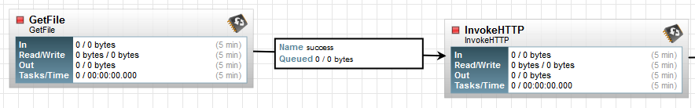

The GetFile processor has the following properties:

- regarding the scheduling, I set it CRON-based with "\*/5 \* \* \* \* ?" to issue the HTTP request every 5 seconds
- regarding the properties:

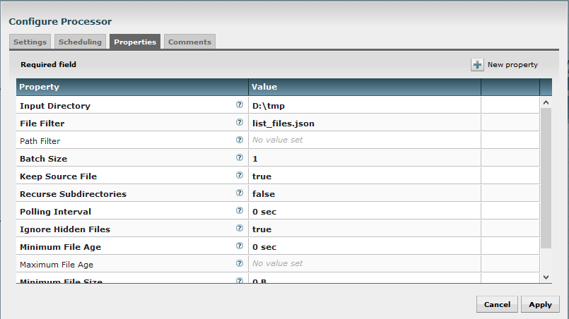

You notice that I reference a specific file in D:\\tmp. This file is named list\_files.json and its content is:

```
{"path": ""}
```

Also, I configure the processor not to delete the file (Keep Source File = true).

Every 5 seconds, a FlowFile with the expected content will be sent to the InvokeHTTP processor which has the following properties:

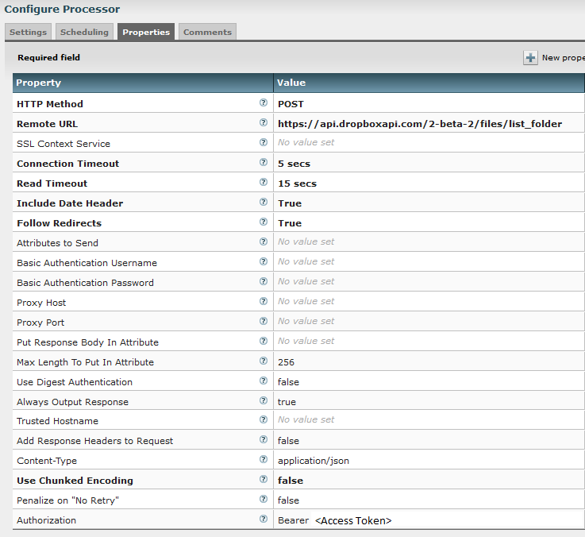

I set the method to POST and set the URL endpoint as specified by Dropbox API. I manually set the Content-Type to "application/json" (the content will be set with the content of the incoming FlowFile). And I manually add a property with the key "Authorization" and the value to "Bearer <Access Token>" (to be changed with your access token). This will add the expected header property.

That is it! At this point we are able to list the content of our Dropbox folder. The output of the InvokeHTTP processor (in response relationship) will have a content looking like:

```
{"entries": 
[
{".tag": "file", "name": "file_3.txt", "path_lower": "/file_3.txt", "path_display": "/file_3.txt", "id": "id:EoMhAg5eUKAAAAAAAAAAAQ", "client_modified": "2016-03-11T12:35:31Z", "server_modified": "2016-03-11T12:35:31Z", "rev": "145c5a2f7", "size": 13}, 
{".tag": "file", "name": "file_1.txt", "path_lower": "/file_1.txt", "path_display": "/file_1.txt", "id": "id:qNPLoI0buzAAAAAAAAAAAg", "client_modified": "2016-03-11T12:35:32Z", "server_modified": "2016-03-11T12:35:32Z", "rev": "245c5a2f7", "size": 13}, 
{".tag": "file", "name": "file_2.txt", "path_lower": "/file_2.txt", "path_display": "/file_2.txt", "id": "id:ib7z-SMEqYAAAAAAAAAAAQ", "client_modified": "2016-03-11T12:35:33Z", "server_modified": "2016-03-11T12:35:33Z", "rev": "345c5a2f7", "size": 13}
], 
"cursor": "AAG4qAdoMOQVhshkMwFchOjPUnMWuGIvrQkZMb3L1aFa9euMXonxsG0S0_RIfxfFxYMxoz2cKFqc3laWcyDdM5MixrJ3AZ4jAyebx5s70k69z6KrBTE_IUh4Vnd2UZCUIAA", "has_more": false}
```

We can see the three files I have added in my Dropbox folder.

**2\. Prepare requests to download files**

Let's have a look at the request we have to send to download a file:

```
curl -X POST https://api.dropboxapi.com/2-beta-2/files/download \
    --header "Authorization: Bearer <access-token>" \
    --header "Dropbox-API-Arg: {\"path\": \"/cupcake.png\"}"

```

So, we have to split our FlowFile to have one by file we want to download. Let's do that with a SplitJson processor with the following properties:

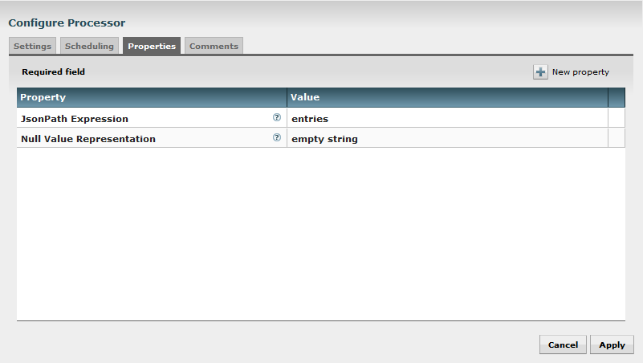

As we saw, we have our response with a JSON containing an array (named "entries") with each of the files present in the Dropbox folder. This processor is designed to output a FlowFile by entry of a JSON array located at the given JSON Path. At this point, we will have a FlowFile by file we want to download. Each one will have as content something like:

```
{".tag": "file", "name": "file_3.txt", "path_lower": "/file_3.txt", "path_display": "/file_3.txt", "id": "id:EoMhAg5eUKAAAAAAAAAAAQ", "client_modified": "2016-03-11T12:35:31Z", "server_modified": "2016-03-11T12:35:31Z", "rev": "145c5a2f7", "size": 13}
```

Now let's take advantage of the Expression Language of NiFi: we want to extract some values of this JSON content to add it in some attributes. For that, we use the EvaluateJsonPath processor with the following properties:

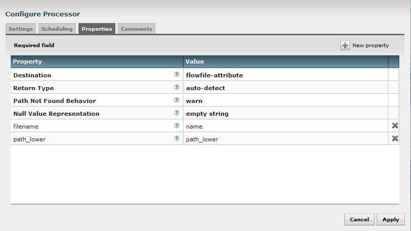

In this case I extract the value associated to "path\_lower" in the JSON to set it to an attribute with the key "path\_lower". For example, an output FlowFile will have an attribute with the key "path\_lower" and the value "/file\_3.txt".

I also override the attribute "filename" (this attribute is already existing since this is a core attribute in NiFi). So far this attribute was containing "list\_files.json" from my initial FlowFile at the very beginning of the flow. I change it with the name of the file I want to download (otherwise my files will be downloaded with the name "list\_files.json").

The last thing to do before being able to call a new InvokeHTTP processor is to clean the FlowFile content. This is due to the fact that the Dropbox API is not expecting any content in the request and will return an error if there is.

This is done with a ReplaceText processor with the following properties:

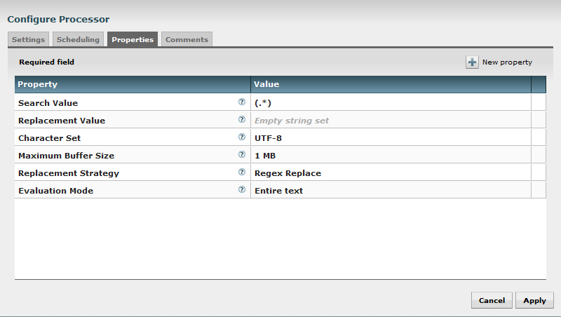

Here, I just delete all the content of my FlowFile to only keep the attributes.

**3\. Download files**

We are now ready to configure a last InvokeHTTP processor to download our files.

**Note**: the Dropbox API is expecting a POST request with no Content-Type otherwise it will return an error. It is kind of a strange behavior but no choice here... It was not possible, with the processor, to have a POST request without Content-Type, so I issued a JIRA and proposed a fix that should be made available in NiFi 0.6.0.

Here are the properties of the processor:

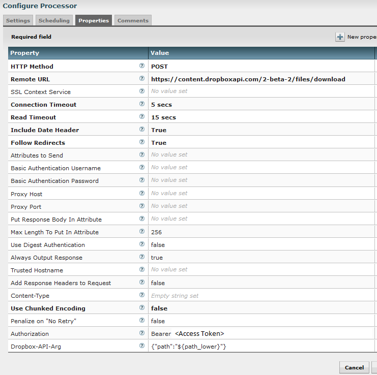

I set the method to POST and set the expected endpoint URL. I explicitly set the Content-Type as an empty string. And I manually add two properties for the header properties to add. One for authorization (to change with your access token) and one with the expected JSON (using NiFi Expression Language to get the attribute value of "path\_lower" we got earlier) to specify the file to download.

The final step is to add a PutFile processor to put downloaded files into the wanted location. Here are the properties:

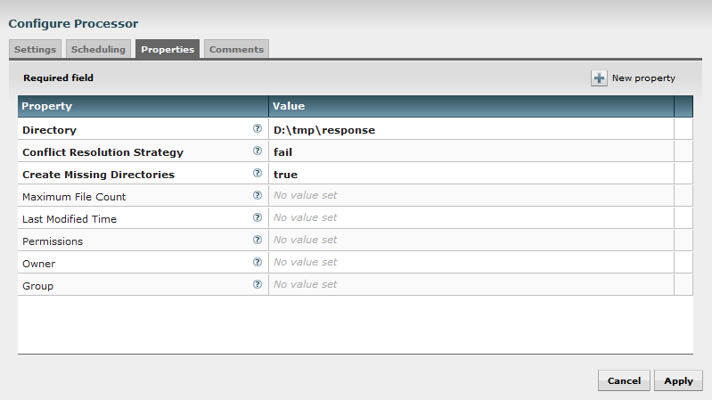

That's all! We now have a full flow ready to download files from your Dropbox account!

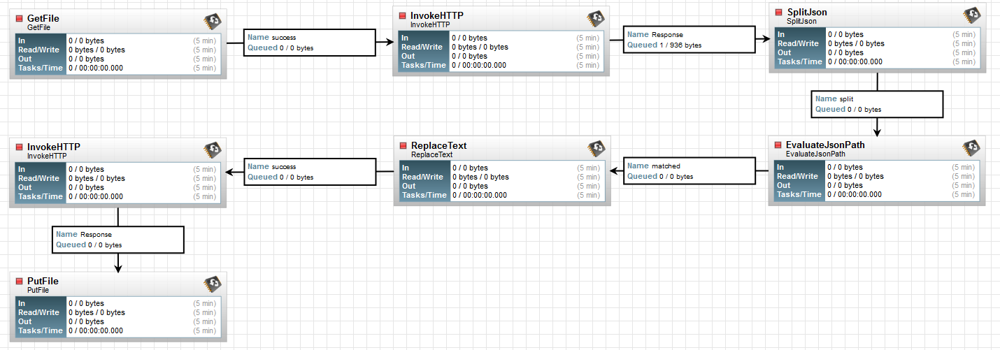

**3\. Upload files**

From this point, it is easy to have the same logic and to upload files based on the needed request:

```
curl -X POST https://api.dropboxapi.com/2-beta-2/files/upload \
     --header "Authorization: Bearer <access-token>" \
     --header "Content-Type: application/octet-stream" \
     --header "Dropbox-API-Arg: {\"path\": \"/cupcake.png\", \"mode\": \"overwrite\"}" \
     --data-binary @local-file.png

```

We just need to link a similar GetFile processor (as described before) with a new InvokeHTTP processor with the following properties:

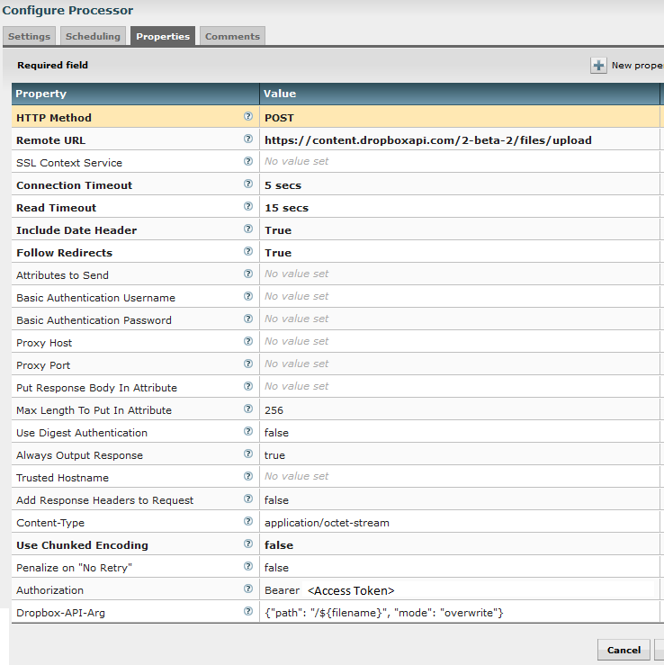

This way, it will upload the incoming FlowFile with the correct file name at the root of your Dropbox directory (don't forget to use your own Dropbox access token).

In conclusion, for upload, the flow is as simple as:

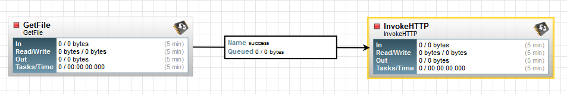

That is it! I think you have everything you need to enjoy NiFi if you want to play with it to handle content on your Dropbox account.

[Here is the template of the full upload/download flow (don't forget to update it with your access token)](https://github.com/pvillard31/nifi-templates/blob/7610117a9f41d95f550911a3ef65f053a025d962/templates/Dropbox_Upload_Download.xml).

Feel free to add comments and ask questions about this post!
