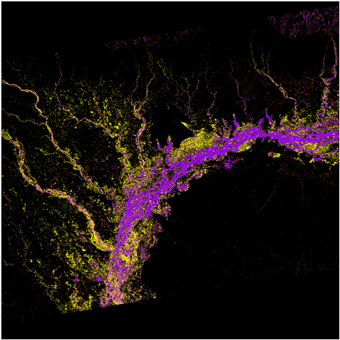

One of the last project on which I was involved at Capgemini was related to the study of the [Data Cube](http://www.datacube.org.au/) technology (developed by [Geoscience Australia](http://www.ga.gov.au/)) on behalf of CNES (French spatial agency). Part of this analysis was to develop a demonstrator  working on heterogeneous satellite data using this framework.

Using Sentinel-1 data, and based on work done by the scientific office at Capgemini Toulouse, we leveraged the Data Cube to manipulate Sentinel-1 images (radar data) to detect flooded areas.

Here is an example where flooded areas are detected after monsoon in India few months ago (purple are permanent water areas, yellow are flooded areas):

In addition to this detection algorithm, Capgemini has been working with the CESBIO (biosphere study laboratory) to implement a system producing a global flood risk map. This map is mainly based on data provided by SMOS satellite (products related to the soil moisture on earth).

This way, we have two parallel systems: one detecting flood events a posteriori, one forecasting flood events a priori. The idea is to combine both data and to use machine learning capabilities offered by Apache Spark to generate a new model providing better forecasting capabilities on resolution and accuracy aspects.

The abstract of the presentation I made during the Big Data from Space conference held in Tenerife on March 2016 is available on the official [JRC publications repository](http://publications.jrc.ec.europa.eu/repository/handle/JRC100655) (with a lot of other very interesting subjects!) or directly [here](https://pierrevillarddotcom.files.wordpress.com/2016/03/bids16_final_version.pdf).
