Let's have some fun with [Apache NiFi](https://nifi.apache.org/) by studying a new use case: analyze a [Flickr](https://www.flickr.com/) account to get some information regarding what kind of pictures the owner likes.

Before getting started, have a look on my previous posts if it is the first time you hear about NiFi. Also let me remind you that Flickr is one website where people can share their pictures. In addition, users can add pictures of others users as "favorites" (similar to a like on Facebook) and add other users as "contacts" to get all their recently published photos on their personal feed.

OK, so now I assume you know a little about Flickr. The nice thing is that there is an API exposed by this website to exchange information with it. To use it you need to request an [API key](https://www.flickr.com/services/apps/create/apply/). Once done, you'll have a key and secret passphrase. You will need this information to request Flickr through Apache NiFi.

Let's move to the global idea of what we are going to do: for a given account user we are going to get all the photos published by this user, all the photos liked (favorites) by this user, and most recent photos published by users followed by our guy. Next we will get all tags and groups associated to each photo. We will aggregate all this data and perform a word count to get an idea of what our initial user is looking for when using Flickr. Does it sound interesting? OK, let's go then.

First, if you want to have details about the Flickr API and all exposed methods, go on [this page](https://www.flickr.com/services/api/). In our case, we are going to only use methods that do not require authentication (we are not going to fetch data that requires the authorization of the concerned user). The methods are:

- flickr.people.getPhotos : to get photos published by a given user
- flickr.favorites.getList : to get favorite photos of a given user
- flickr.photos.getContactsPublicPhotos : to get recently published photos by contacts of a given user
- flickr.tags.getListPhoto : to get the list of tags for a given photo
- flickr.photos.getAllContexts : to get the list of groups (or pools) for a given photo

**Note**: regarding the photos published by contacts, we are only going to fetch the last 50 photos published by each contact of our user. It would be possible to have a workaround and to get all the pictures of each contact, but this could represent millions of photos (and consequently millions of API calls) and it could potentially deform the results of the analysis since the number of published photos can vary a lot between users in terms of quantity but also in terms of frequency. So let's focus on a sample of most recent pictures.

To "launch" our flow, I will start with a GenerateFlowFile processor to have only one Flow File (FF) created. Then I will use an UpdateAttribute processor to add attributes to my FF in order to store global properties that will be used along the flow:

- User ID (or NSID) of the user account we want to analyze
- API key to use
- Page (set to 1) that will be used to handle pagination of answers
- Format (set to json) to get JSON answers from the Flickr API

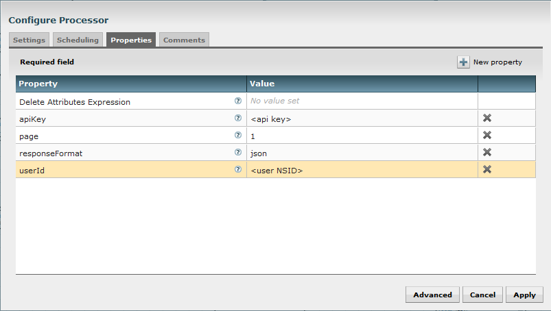

Then I use InvokeHTTP processors to perform calls to the FlickrAPI. It will almost be the same for each processor of this kind, so I will only describe one. Let's describe the processor used to get all favorite pictures of our user.

The only parameter I am going to change is the Remote URL. This parameter is accepting expression language so I can reference attributes of my FF. I set the Remote URL to:

**https://api.flickr.com/services/rest/?method=flickr.favorites.getList&api\_key=${apiKey}&user\_id=${userId}&per\_page=500&page=${page}&format=${responseFormat}**

As you can see, I give the method of the API I want to request, and also the expected parameters for this method. In this case, the API key, the user ID, the number of elements by page returned by the API (500 is the maximum authorized), the page number I want to request and the returned format.

The result will look like:

```
jsonFlickrApi({"photos":{"page":1,"pages":10,"perpage":500,"total":"4559","photo":[{"id":"26164116671","owner":"100524190@N04","secret":"3f80e32734","server":"1653","farm":2,"title":"STAIRWAY TO HEAVEN","ispublic":1,"isfriend":0,"isfamily":0,"date_faved":"1459772801"}]},"stat":"ok"})
```

As you can see, the Flickr API returns a string which is not directly a ready-to-use JSON string. So I add an intermediary step where I remove "jsonFlickrApi(" at the beginning and ")" at the end of the FF content using two ReplaceText processors.

Then I want a system to handle the pagination aspect. For that I create a process group with one input port where I'll send my FF, and with two output ports (I'll come back to this very soon).

In this processor group, I first use an EvaluateJsonPath processor to extract "page" and "pages" from the JSON string and get the values as attributes of my FF (you notice that this will update my already existing attribute "page").

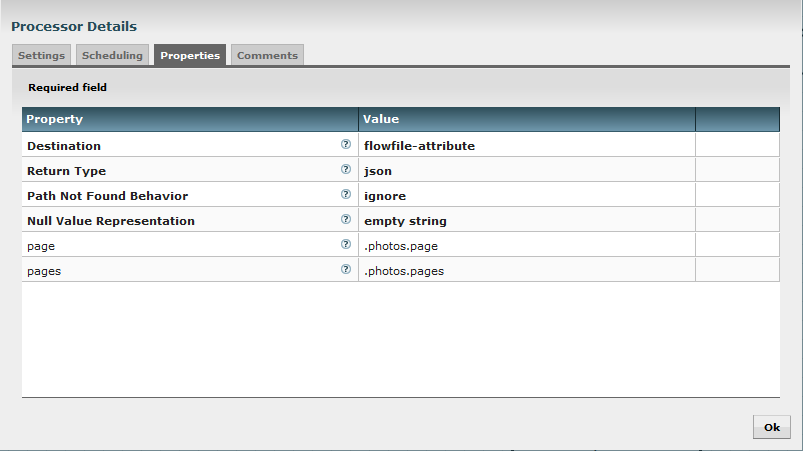

 

Then I use a RouteOnAttribute processor and I use the Expression language to check if the current page number (attribute "page") is equal to the total number of pages (attribute "pages").

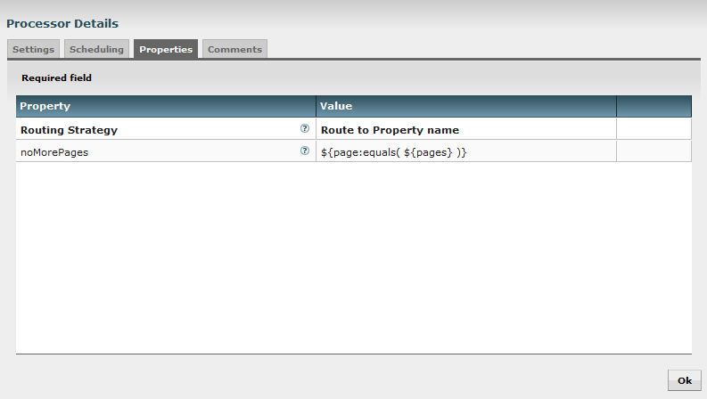

Whether it is true or not, I route my FF to the first input port that will send my FF to the next step of the flow. But if false, I use an UpdateAttribute processor to increment the attribute "page" to get the new page number I must request:

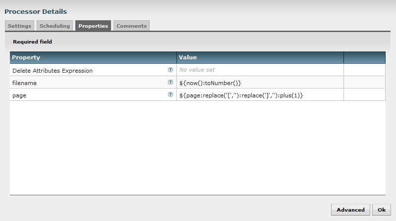

**Note**: I also update the "filename" attribute to ensure my FF have different filenames. It is useful when using PutFile processor along the flow for debug purposes.

Then I send this FF in the second output port which goes back to the InvokeHTTP processor but with a new page number. This way, it will loop over all pages to get all expected results.

The processor group looks like:

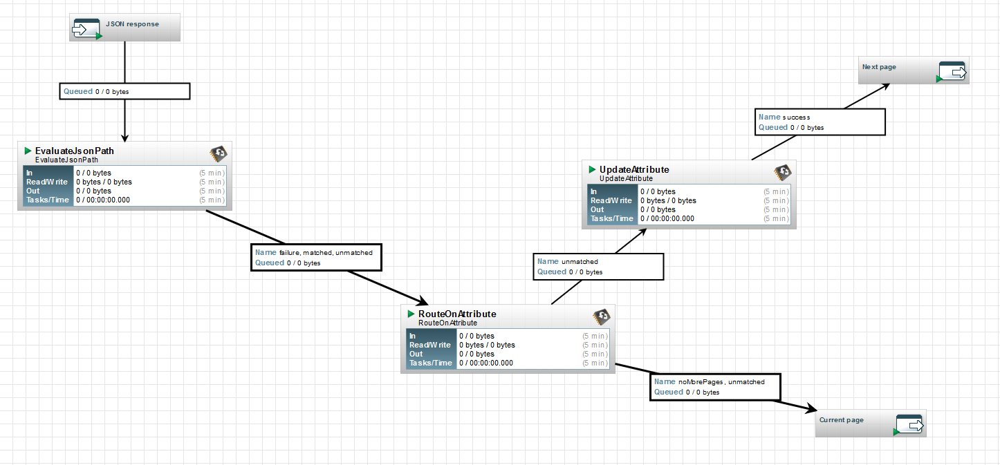

I use the same logic for the photos published by the user and for the photos published by the user's contacts. At this moment, I can use a funnel to regroup all my results : I am ready to continue at photo level. So far the flow looks like:

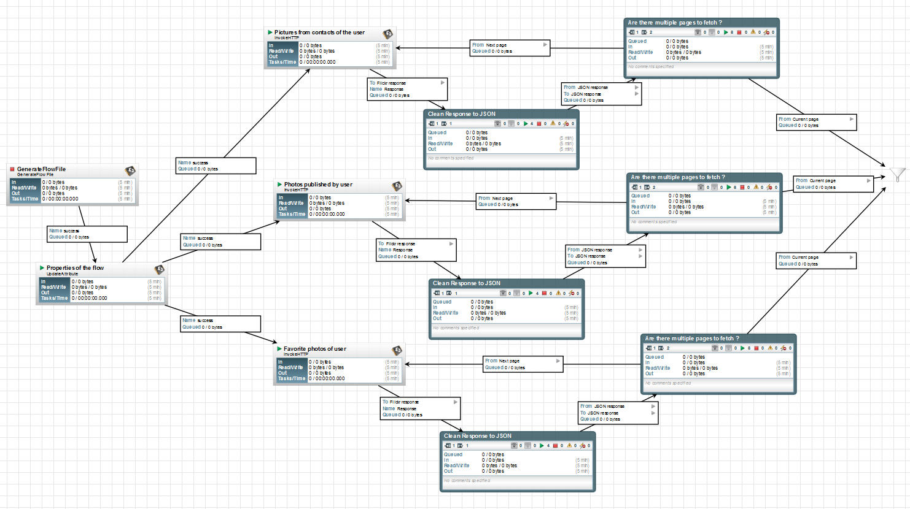

From this point, I use a SplitJson processor to get individual photo information:

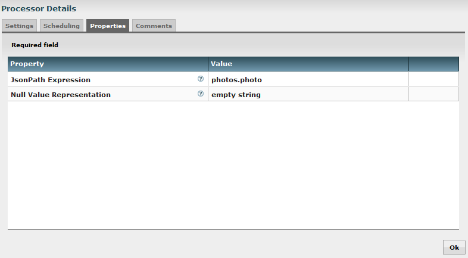

Then I use an EvaluateJsonPath to extract the photo ID of each photo and to get it as attribute of my FF:

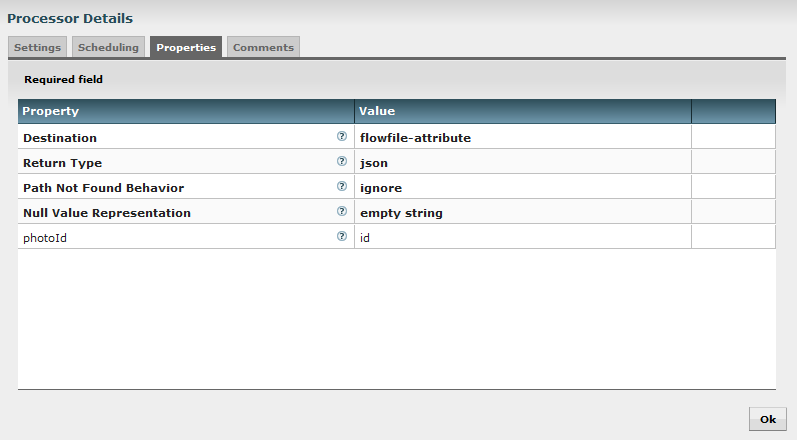

I am now able to call the two methods to get tags and groups associated to the picture. I use the following Remote URLs:

- For tags : https://api.flickr.com/services/rest/?method=flickr.tags.getListPhoto&api\_key=${apiKey}&photo\_id=${photoId}&format=${responseFormat}
- For groups : https://api.flickr.com/services/rest/?method=flickr.photos.getAllContexts&api\_key=${apiKey}&photo\_id=${photoId}&format=${responseFormat}

Then, I clean once more time the returned string to get a correct JSON string and I call again SplitJson processors to get each tag and group into individual FFs.

Splitting list of tags:

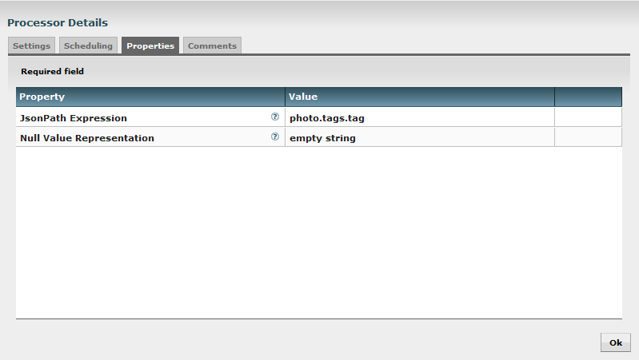

Splitting list of groups:

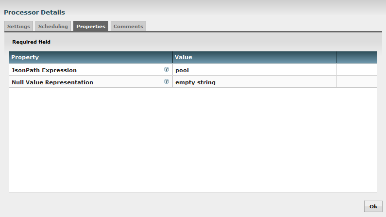

Then I use an EvaluateJsonPath to extract tag name and group name as my new FF content:

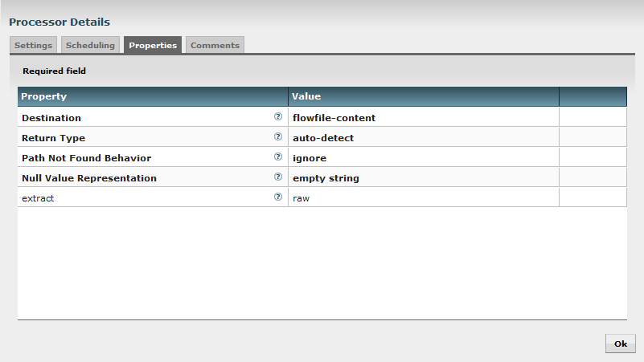

At the end, I use a MergeContent processor to concatenate my FFs into bigger FFs with a tag/group name by line. For this processor I use the following parameters:

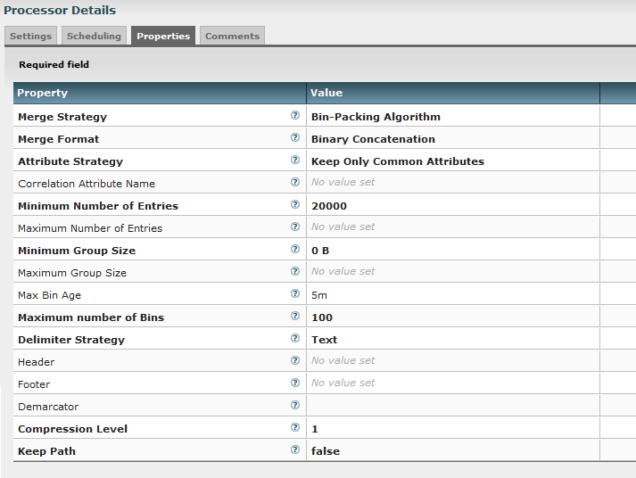

**Note**: for the demarcator parameter, I set Shift+Enter for the carriage return.

This way, I have FF of 20k lines except if my incoming queue did not reach this limit in less than 5 minutes.

I end my flow with a PutFile processor to store the results in a given directory.

The second part of the flow looks like:

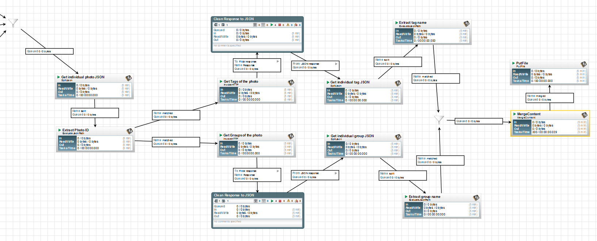

That's it! I have completed all the flow!

I ran this flow for a given user, it represented about 100k photos with about 450k tag/group names to analyze. To do that, I used [Apache Spark](http://spark.apache.org/) and the famous word count example to extract most used keywords.

Once pyspark launched, I used the following commands:

```
import re
data = sc.textFile("D:/tmp/*")
data.flatMap(lambda line: re.sub('[^0-9a-zA-Z ]+', '', line).lower().split())
    .map(lambda word: (word, 1))
    .reduceByKey(lambda a, b: a+b)
    .map(lambda (x,y): (y,x))
    .sortByKey(False)
    .take(200)
```

You can notice that I did some cleaning on the characters and changed my strings to lower case. Once I have the 200 most used words, I do some manual cleaning to remove all unwanted things like "flickr", "photo", "the", etc. And I finally get the 20-most used words related to the pictures I got through my flow for my given user:

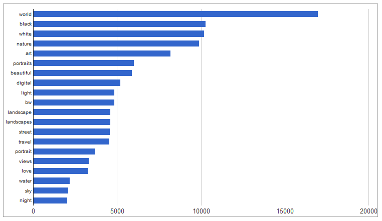

I hope you enjoyed going through this use case, and I am sure it will give you some ideas to have fun with Apache NiFi ! Please feel free to comment or to ask questions about this post.
