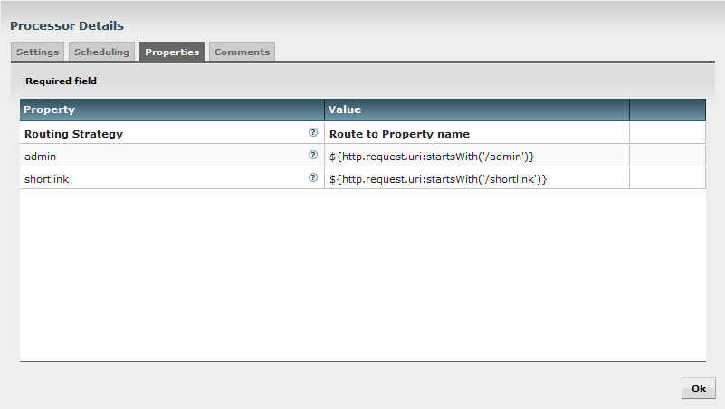
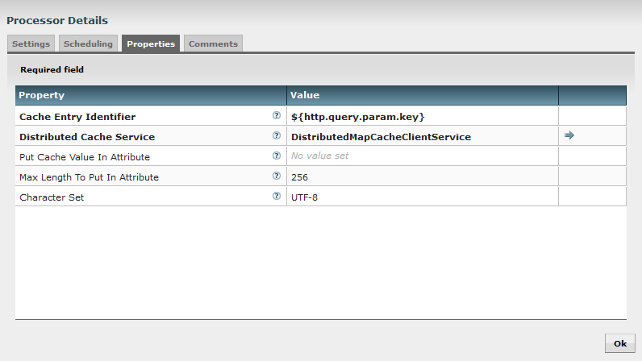
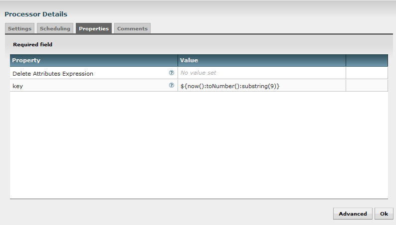
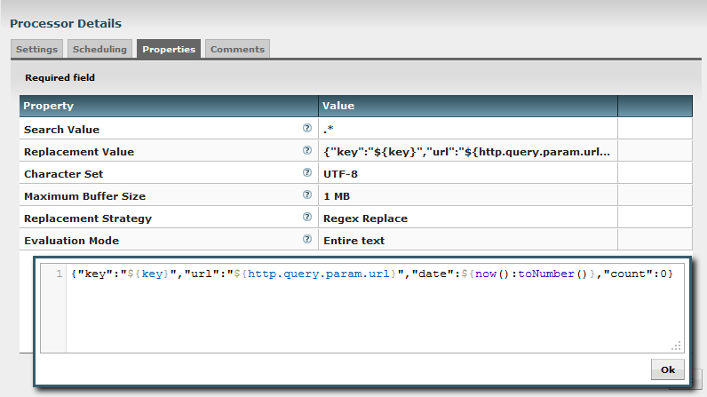
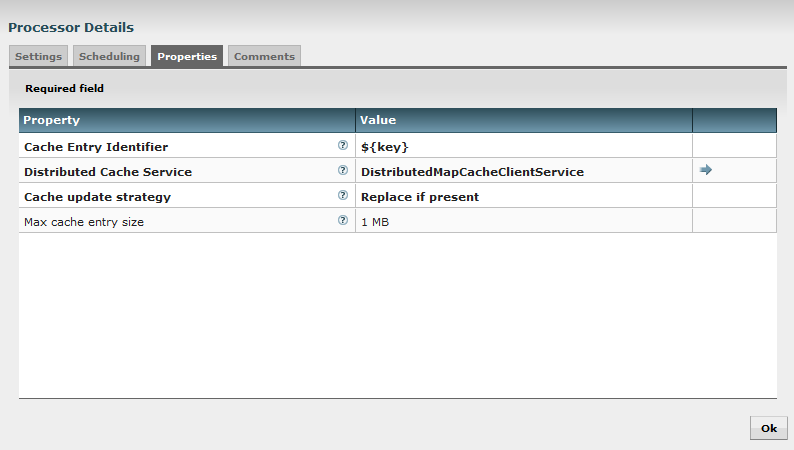
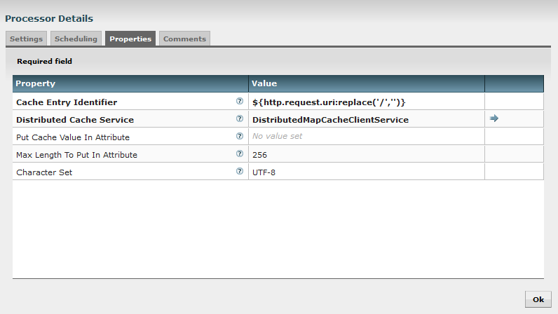
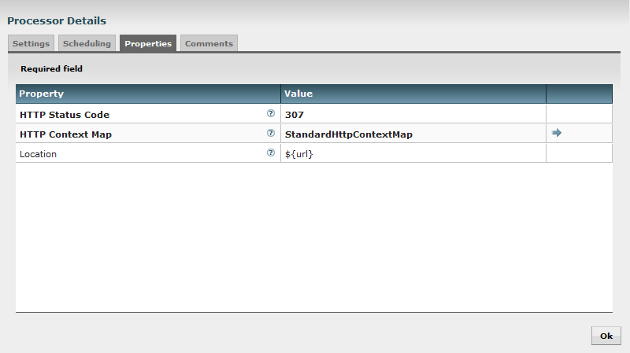

This blog will demonstrate a new use case using Apache NiFi: implement a URL shortener service. Let's be clear right now, I don't think Apache NiFi is the best option to propose such a service (this is not the idea behind this Apache project) but I believe this is an opportunity to play around with some processors/functionalities I never discussed so far.

Why this idea? Some months ago, for a job interview, I have been asked to develop a URL shortener service in Go using Docker and Redis. This is available on Github [here](https://github.com/pvillard31/url-shortener-go). Since this is something we can do with Apache NiFi, it is interesting to see how this can be achieved.

Before talking about [Apache NiFi](https://nifi.apache.org/) (if you don't know about this project, have a look on my previous posts, this is a great tool!), let's discuss what we want to achieve...

- **URL shortener service requirements**

I want to expose a web service that gives me the opportunity to shorten long URLs in order to be able to share/remember it easily. I also want to store statistics about the number of times my shortened URL has been used. And, in our use case, I want my shortened URL to be valid at least 24h.

- **Example**

I want to shorten this URL:

[https://pierrevillard.com/2016/04/04/analyze-flickr-account-using-apache/](https://pierrevillard.com/2016/04/04/analyze-flickr-account-using-apache/)

Let's say my service is running on my local computer, I am going to access it with my browser:

localhost/shortlink?url=https://pierrevillard.com/2016/04/04/analyze-flickr-account-using-apache/

I will get a web page displaying JSON data:

```
{"key":"6974","url":"https://pierrevillard.com/2016/04/04/analyze-flickr-account-using-apache/","date":1460238097015,"count":0}
```

From now on, I will be able to access my URL by using:

localhost/6974

And I will be able to access the statistics (JSON data) of my shortened URL at:

localhost/admin?key=6974

- **Implementation with Apache NiFi**

This use case gives me the opportunity to discuss about some nice features of Apache NiFi:

1. The possibility to expose web services with the use of HandleHttpRequest and HandleHttpResponse processors in combination with a StandardHttpContextMap controller service.The controller service provides the ability to store and retrieve HTTP requests and responses external to a Processor, so that multiple processors can interact with the same HTTP request. In other words, the HandleHttpRequest processor initializes a Jetty web server listening for requests on a given port. Once a request is received, a FlowFile is generated with attributes and content (if any). This request has been received asynchronously so that the FlowFile can be used along a data flow before generating the response to send back to the user using the HandleHttpResponse processor.
    
    Note: at this moment, for a given listening port, there can be only one instance of the HandleHttpRequest processor on the canvas. Handling different services with the same processor can be performed with the addition of a RouteOnAttribute processor (we'll see that in this implementation).
2. The possibility to store information across the NiFi cluster (but also to have a distributed map cache of key/value data) using PutDistributedMapCache and FetchDistributedMapCache processors in combination with a DistributedMapCacheServer and DistributedMapCacheClientService controller services.The map cache server controller service provides a map (key/value) cache that can be accessed over a socket. Interaction with this service is typically accomplished via a DistributedMapCacheClient service. This feature is mainly used to share information across a NiFi cluster but can also be used at local level to store data in memory to be used along the flow.
    
    It has to be noted that, when using the PutDistributedMapCache processor, the key is given through the processor properties and the value is the content of the incoming FlowFile.

Let's now describe the data flow I have created for the URL shortener service. First I have a single HandleHttpRequest processor with default configuration and a default StandardHttpContextMap controller service.

Then I use a RouteOnAttribute processor to define which URL has been accessed and to route the FlowFile (FF) accordingly. In the incoming FF, the attribute 'http.request.uri' contains the requested URL.



At this point, I have three routes for my FF: one for the /shortlink requests, one for the /admin requests and one for the others.

Let's start with the 'admin' flow part. When I receive a request at:

/admin?key=<key>

My incoming FF will have an attribute 'http.query.param.key' with the value <key>. This is useful to retrieve all the arguments passed along the URL.

I take the decision to use the map cache server as follow: the key will be the key value of my JSON data, and the value will be the JSON string itself. Consequently, I use a FetchDistributedMapCache processor to retrieve the JSON data associated to the given key.



If I don't find anything, I use a ReplaceText processor to set an arbitrary error message as the content of my FF and then a HandleHttpResponse processor with the 500 HTTP error code. This way, the user will see the error message:

```
No URL found for key=6666
```

If I find an entry in my cache server, then the FF content is now filled in with my JSON string and I just need to route my FF to a HandleHttpResponse processor with a 200 HTTP code. This way, the user will see the JSON string with related information.

Let's continue with the "shortlink" part of the flow. First of all I use a RouteOnAttribute processor to check that the URL provided at:

/shortlink?url=<URL>

is valid given a regular expression. If not I display an error message to the user with the combination of ReplaceText processor and HandleHttpResponse processor (as explained above).

If the URL is valid, I want to generate a key associated to this URL.

Note: for this part, I made the choice to keep it really simple and there are a lot of possible improvements/optimizations.

I make the decision that the key will be a 4-digits number and I create this number using time manipulation with [the expression language](https://nifi.apache.org/docs/nifi-docs/html/expression-language-guide.html). With an UpdateAttribute processor, I generate a 'key' attribute:



Once the key is generated I use a FetchDistributedMapCache processor to check if this key is already used or not.

If yes, my FF now contains the associated JSON string. I use an EvaluateJsonPath processor to extract the creation date information from the JSON string and then I use a RouteOnAttribute processor to check if this creation date if below the threshold of 24 hours. If yes, I route my FF back to the UpdateAttribute processor to generate a new random key, if no, it means the key can be overwritten and I route my FF to the next steps.

Once I have a generated key that is free to use, I use a ReplaceText processor to construct my JSON string:



Then I store this information in the cache using a PutDistributedMapCache processor:



Note the "replace if present" property in case we are overwriting an already existing key that is too old. Then I just route my FF to a HandleHttpResponse processor with a 200 HTTP code to display to the user the JSON string.

As I said, this part is simple, there are a lot of possible improvements such as (but not limited to):

- Have a text-based key with the possibility for the user to customize it in order to expand the number of possible shortened URL stored.
- Use the cache server to store a sequence ID for the generated key in order to avoid randomness and possible loops in the flow.
- Add the possibility to reuse the same key for two identical URLs to shorten.

Finally, let's complete our use case with the last part of the flow: when a HTTP request is received which is not shortlink/admin.

The accessed URL is obtained using the FF attributes, and I can directly use a FetchDistributedMapCache processor:



If I don't find any entry in my cache, I route the FF to a combination of ReplaceText and HandleHttpResponse processors to display an error message to the user with a 404 HTTP error code.

If I find a match, I use an EvaluateJsonPath processor to extract the counter value and the long URL from the JSON string retrieved in the cache. Then I first route my FF to a HandleHttpResponse processor with a 307 HTTP code (temporary redirection) and I add a HTTP header property to redirect the user to the corresponding URL:



Note: I use the 307 HTTP code to avoid my browser to cache the redirection and to perform the request each time I access my shortened URL.

I also route my FF to a ReplaceText processor in order to increment the count value in my JSON string and I use a PutDistributedMapCache processor to update the data in the cache.

That's it! We now have a running URL shortener service with Apache NiFi. The flow is available as a template [here](https://github.com/pvillard31/nifi-templates/blob/ef482a8d28bdbd7a7eca567f9bbbe298f2603b64/templates/URL_Shortener_Service.xml). As always, feel free to comment and/or ask questions about this post.
