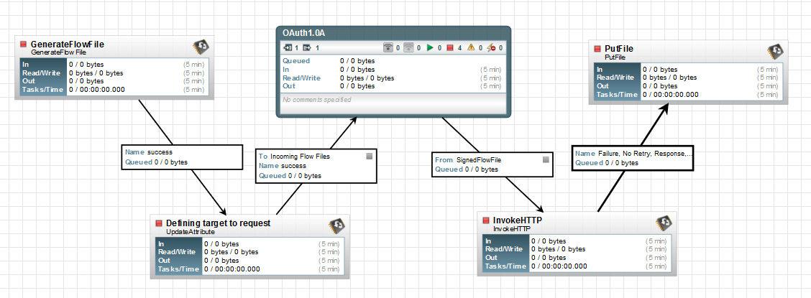
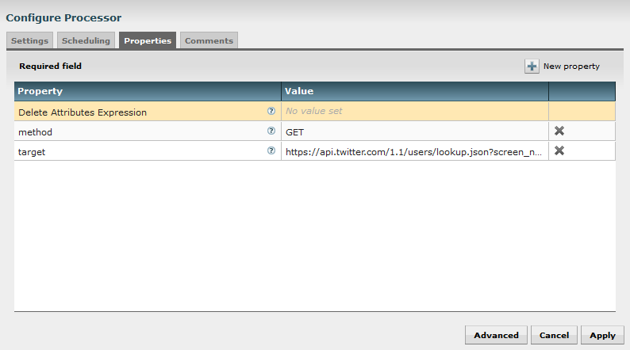
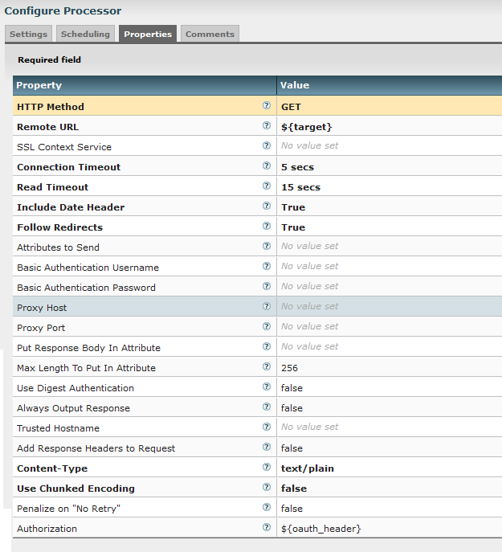
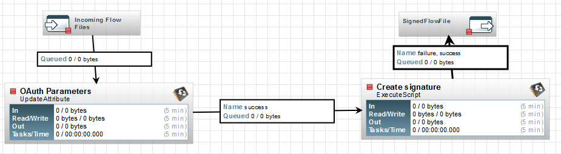
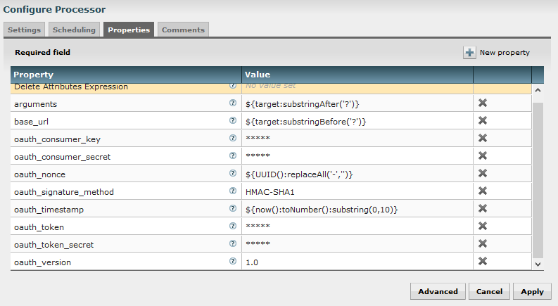

A lot of API are using OAuth  protocol to authorize the received requests and to check if everything is OK regarding the identity of the request sender.

> OAuth is an open standard for authorization, commonly used as a way for Internet users to log into third party websites using their Microsoft, Google, Facebook, Twitter, One Network etc. accounts without exposing their password. Generally, OAuth provides to clients a "secure delegated access" to server resources on behalf of a resource owner. It specifies a process for resource owners to authorize third-party access to their server resources without sharing their credentials. Designed specifically to work with Hypertext Transfer Protocol (HTTP), OAuth essentially allows access tokens to be issued to third-party clients by an authorization server, with the approval of the resource owner. The third party then uses the access token to access the protected resources hosted by the resource server.

As a remark, there are two versions of the protocol currently used out there: 1.0A and 2.0. As far as I know, 1.0A is the most commonly used. I already faced the need to use OAuth 1.0A protocol with the Flickr API but, back then, I found a way to get my data differently.

Recently, a question was asked on the [Hortonworks Community Connection](https://community.hortonworks.com/answers/index.html) regarding the use of [Apache NiFi](https://nifi.apache.org/) to get data from Twitter API using OAuth 1.0A protocol. So this time, I decided to have a look on this and to get the job done.

This post presents the flow I used to perform a request against Twitter API using OAuth protocol. It gives me the opportunity to use for the first time the ExecuteScript processor which allows user to execute custom scripts on the fly inside NiFi (you will find a lot of examples on this great [site](http://funnifi.blogspot.fr)).

Note 1: this was the first time I used Groovy language, be nice with me!

Note 2: I didn't test the flow on a lot of methods. Some modifications may be necessary for some cases.

OK. The objective was to request the "users/lookup" method of the Twitter API. You can read the documentation [here](https://dev.twitter.com/rest/reference/get/users/lookup).

I want to perform a HTTP GET on:

```
https://api.twitter.com/1.1/users/lookup.json?screen_name=twitterapi,twitter
```

So far it seems really easy to do with a simple InvokeHTTP processor. The thing is you need to identify yourself when sending the request. Here comes the OAuth protocol. The official specification for 1.0A can be read [here](http://oauth.net/core/1.0a/). But in the case of the Twitter API, you have a nice documentation [here](https://dev.twitter.com/oauth/overview/authorizing-requests).

Besides on the documentation of each method, you have an OAuth Signature Generator that can be accessed (if you have defined a Twitter App). The generator is [here](https://dev.twitter.com/oauth/tools/signature-generator/). It lets you play around and gives great insights on each request to debug your own implementation of OAuth protocol.

The global idea is: you have a lot of input parameters and you must follow the specifications to construct a string based on the parameters. This string will be the value associated to "Authorization" key in HTTP header properties.

Here is the list of the needed parameters. First the parameters directly linked to your request:

- Method of your HTTP request (example: GET)
- URL target of your HTTP request (example: https://api.twitter.com/1.1/users/lookup.json?screen\_name=twitterapi,twitter)

Then the global parameters related to OAuth:

- Consumer key (private information of your app provided by [Twitter](https://apps.twitter.com/app/))
- Consumer secret (private information of your app provided by [Twitter](https://apps.twitter.com/app/))
- Nonce (random string, uniquely generated for each request)
- Signature method (with Twitter it is HMAC-SHA1)
- Timestamp (in seconds)
- Token (private information of your app provided by [Twitter](https://apps.twitter.com/app/))
- Token secret (private information of your app provided by [Twitter](https://apps.twitter.com/app/))
- Version (in this case 1.0)

The first step is to construct the "**signature base string**". For that you first need to create the "**parameter string**". All is very well explained [here](https://dev.twitter.com/oauth/overview/creating-signatures). Once you have the signature base string, you can encode it using HMAC-SHA1 and you easily get the header property to set in your HTTP request:

```
Authorization: OAuth oauth_consumer_key="*******", oauth_nonce="a9ab2392e5158a4c4e029c7829164571", oauth_signature="4s4Hi5hQ%2FoLKprW7qsRlImds3Og%3D", oauth_signature_method="HMAC-SHA1", oauth_timestamp="1460453975", oauth_token="*******", oauth_version="1.0"
```

Let's get into the details using Apache NiFi. Here is the flow I created:



I use a GenerateFlowFile to generate an empty Flow File (FF) in order to execute my flow. Then I use an UpdateAttribute processor to add attributes to my FF. In this case, I only add the parameters related to the specific request I want to execute:



Then I send my FF into a process group that will compute the header property to set (I will come back to this part later). Then I perform my request using the InvokeHTTP processor:



I set the method to GET, the URL to my corresponding FF attribute, the content type to text/plain and I add a custom property named Authorization with the FF attribute I created in my process group (see below). This custom property will be added as a HTTP header in the request. At the end, I use a PutFile processor to write the result of my request in a local directory.

Let's go to the interesting part of our flow where all the magic is: the process group I named OAuth 1.0A. Here it is:



I just use two processors. The first one is an UpdateAttribute to add all the parameters I need as attributes of my FF. the second one is an ExecuteScript processor where I put my groovy code to compute the header property.

First... the parameters:



Note: I use Expression Language provided by NiFi for some attributes.

- arguments is used to extract the argument part in my target URL. In this example: screen\_name=twitterapi,twitter
- base\_url is the URL I request without any argument. In this example: https://api.twitter.com/1.1/users/lookup.json
- For the nonce parameter I use the "UUID" method of the expression language which generated a random string and I just take to replace the '-' characters to only keep an alphanumeric string.
- For the timestamp, I use the "now" method of the expression language and I use substring to only keep seconds.

Let's move to the ExecuteScript part. I set the script engine to Groovy and I put my script code in the "script body" property. The full code is available at the end of the post. Let's go through it piece by piece.

First thing, I want to trigger my code only when a FF is available:

```
def flowFile = session.get()
if (!flowFile) return
```

Then I define a method I will use for the HMAC-SHA1 encoding:

```
def static hmac(String data, String key) throws java.security.SignatureException
{
    String result
    try {
        // get an hmac_sha1 key from the raw key bytes
        SecretKeySpec signingKey = new SecretKeySpec(key.getBytes(), "HmacSHA1");
        // get an hmac_sha1 Mac instance and initialize with the signing key
        Mac mac = Mac.getInstance("HmacSHA1");
        mac.init(signingKey);
        // compute the hmac on input data bytes
        byte[] rawHmac = mac.doFinal(data.getBytes());
        result= rawHmac.encodeBase64()
    } catch (Exception e) {
        throw new SignatureException("Failed to generate HMAC : " + e.getMessage());
    }
    return result
}
```

For this part, I will need to add some imports at the beginning of my script body:

```
import java.security.SignatureException
import javax.crypto.Mac
import javax.crypto.spec.SecretKeySpec
```

Then I retrieve all the attributes of my FF and I extract some attributes I don't need to construct my parameter string:

```
def attributes = flowFile.getAttributes()
// retrieve arguments of the target and split arguments
def arguments = attributes.arguments.tokenize('&')
def method = attributes.method
def base_url = attributes.base_url
def consumerSecret = attributes.oauth_consumer_secret
def tokenSecret = attributes.oauth_token_secret
```

Then I create a TreeMap in which I add all the parameters I need to construct my parameter string. A TreeMap ensures me that it is sorted on keys in alphabetical order.

```
TreeMap map = [:]

for (String item : arguments) {
        def (key, value) = item.tokenize('=')
        map.put(key, value)
}

map.put("oauth_consumer_key", attributes.oauth_consumer_key)
map.put("oauth_nonce", attributes.oauth_nonce)
map.put("oauth_signature_method", attributes.oauth_signature_method)
map.put("oauth_timestamp", attributes.oauth_timestamp)
map.put("oauth_token", attributes.oauth_token)
map.put("oauth_version", attributes.oauth_version)
```

Then I add a method to the String class to allow percent encoding on String objects:

```
String.metaClass.encode = {
    java.net.URLEncoder.encode(delegate, "UTF-8").replace("+", "%20").replace("*", "%2A").replace("%7E", "~");
}
```

I am now able to construct the parameter string:

```
String parameterString = ""

map.each { key, value ->
    parameterString += key.encode()
    parameterString += '='
    parameterString += value.encode()
    parameterString += '&'
}

parameterString = parameterString.substring(0, parameterString.length()-1);
```

* * *

_**Update**_: the code above can be simplified as below (see [Andy's comment](https://pierrevillard.com/2016/04/12/oauth-1-0a-with-apache-nifi-twitter-api-example/comment-page-1/#comment-5))

```
String parameterString = map.collect { String key, String value ->
    "${key.encode()}=${value.encode()}"
}.join("&")
```

* * *

It is now possible to get the signature:

```
String signatureBaseString = ""
signatureBaseString += method.toUpperCase()
signatureBaseString += '&'
signatureBaseString += base_url.encode()
signatureBaseString += '&'
signatureBaseString += parameterString.encode()

String signingKey = consumerSecret.encode() + '&' + tokenSecret.encode()
String oauthSignature = hmac(signatureBaseString, signingKey)
```

I may add this information as a new attribute of my FF:

```
flowFile = session.putAttribute(flowFile, 'oauth_signature', oauthSignature)
```

Then I can construct the header property value to associate to Authorization key:

```
String oauth = 'OAuth '
oauth += 'oauth_consumer_key="'
oauth += attributes.oauth_consumer_key.encode()
oauth += '", '
oauth += 'oauth_nonce="'
oauth += attributes.oauth_nonce.encode()
oauth += '", '
oauth += 'oauth_signature="'
oauth += oauthSignature.encode()
oauth += '", '
oauth += 'oauth_signature_method="'
oauth += attributes.oauth_signature_method.encode()
oauth += '", '
oauth += 'oauth_timestamp="'
oauth += attributes.oauth_timestamp.encode()
oauth += '", '
oauth += 'oauth_token="'
oauth += attributes.oauth_token.encode()
oauth += '", '
oauth += 'oauth_version="'
oauth += attributes.oauth_version.encode()
oauth += '"'
```

I add this information as an attribute (that will be used in the InvokeHTTP processor as we saw before) and I forward my FF to the success relationship:

```
flowFile = session.putAttribute(flowFile, 'oauth_header', oauth)
session.transfer(flowFile, REL_SUCCESS)
```

That's it: I have an operational flow implementing OAuth 1.0A protocol to request against the Twitter API.

The full code is available [here](https://gist.github.com/pvillard31/71a4457e029e05a5d0698f58cafe4255) as a gist. The NiFi template is available [here](https://github.com/pvillard31/nifi-templates/blob/master/templates/OAuth_1.0A_with_Twitter_API_example.xml).

As always, feel free to ask questions and comment this post!
