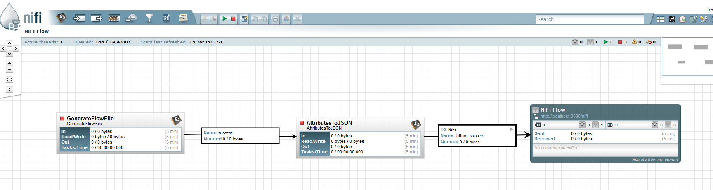
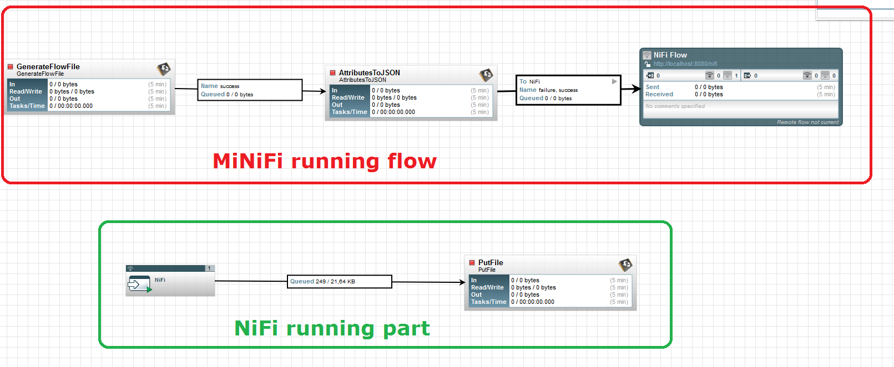

This is quite a busy period for Apache NiFi community: Apache NiFi 0.7.0 is about to be released (RC2 is coming), Apache NiFi 1.0.0 will probably be ready in the next few weeks (stay tuned) and... Apache MiNiFi 0.0.1 will officially be released next week (RC vote in progress and so far so good)! This a great step for the community and I wanted to write a quick article about this new amazing tool!

Here is my step-by-step article to get hands on MiNiFi and play with it. But first of all, if you want to know more about this great subproject, have a look here: [https://nifi.apache.org/minifi/index.html](https://nifi.apache.org/minifi/index.html)

- **Build MiNiFi from sources**

I downloaded the sources from this link: [https://dist.apache.org/repos/dist/dev/nifi/minifi-0.0.1/minifi-0.0.1-source-release.zip](https://dist.apache.org/repos/dist/dev/nifi/minifi-0.0.1/minifi-0.0.1-source-release.zip)

And built the sources using maven: mvn clean install.

There are two convenience binaries generated as part of this process.  The MiNiFi assembly and a MiNiFi Toolkit assembly.

- **Convert and validate MiNiFi templates**

The toolkit can be used to convert a NiFi template (XML) into a MiNiFi template (YAML) or to validate a MiNiFi template.

For this process, I created a very simple template using  NiFi. This template is made of a GenerateFlowFile processor to generate flow files with no content every 5 seconds, and an AttributeToJson processor to extract attributes of the flow file and generate a JSON in the flow file content. Then it is connected to a Remote Process Group pointing to a local running NiFi instance configured to allow Site-to-Site communication.



I then saved this template as a XML file (NiFi template).

If I look at the toolkit usage (in a Windows environment):

```
minifi-toolkit-0.0.1\bin> .\config.bat
Usage:

java org.apache.nifi.minifi.toolkit.configuration.ConfigMain <command> options

Valid commands include:
transform: Transform template xml into MiNiFi config YAML
validate: Validate config YAML
```

I now use the toolkit to convert my template:

```
.\config.bat transform MiNiFi-test.xml MiNiFi-test.yml
```

And I can also validate the generated configuration file:

```
.\config.bat validate MiNiFi-test.yml
```

Note: [here is the working configuration I then used in MiNiFi.](https://gist.github.com/pvillard31/0ea7abcf6b17ca93d63c885817041684)

- **Run MiNiFi**

I now take the generated configuration and use it to replace the default one:

```
minifi-0.0.1\conf\config.yml
```

And I now start MiNiFi:

```
minifi-0.0.1\bin\run-minifi.bat
```

By looking at the logs (minifi-0.0.1\\logs\\minifi-app.log), we can see all the processors that are shipped with MiNiFi. Here is a list of the currently standard processors included with MiNiFi:

```
    org.apache.nifi.processors.standard.PostHTTP || org.apache.nifi.nar.NarClassLoader[.\work\nar\extensions\minifi-standard-nar-0.0.1.nar-unpacked]
    org.apache.nifi.processors.standard.RouteOnContent || org.apache.nifi.nar.NarClassLoader[.\work\nar\extensions\minifi-standard-nar-0.0.1.nar-unpacked]
    org.apache.nifi.processors.standard.FetchFile || org.apache.nifi.nar.NarClassLoader[.\work\nar\extensions\minifi-standard-nar-0.0.1.nar-unpacked]
    org.apache.nifi.processors.standard.EvaluateXPath || org.apache.nifi.nar.NarClassLoader[.\work\nar\extensions\minifi-standard-nar-0.0.1.nar-unpacked]
    org.apache.nifi.processors.standard.SplitContent || org.apache.nifi.nar.NarClassLoader[.\work\nar\extensions\minifi-standard-nar-0.0.1.nar-unpacked]
    org.apache.nifi.processors.standard.ListSFTP || org.apache.nifi.nar.NarClassLoader[.\work\nar\extensions\minifi-standard-nar-0.0.1.nar-unpacked]
    org.apache.nifi.processors.standard.ReplaceText || org.apache.nifi.nar.NarClassLoader[.\work\nar\extensions\minifi-standard-nar-0.0.1.nar-unpacked]
    org.apache.nifi.processors.standard.MergeContent || org.apache.nifi.nar.NarClassLoader[.\work\nar\extensions\minifi-standard-nar-0.0.1.nar-unpacked]
    org.apache.nifi.processors.standard.ConvertCharacterSet || org.apache.nifi.nar.NarClassLoader[.\work\nar\extensions\minifi-standard-nar-0.0.1.nar-unpacked]
    org.apache.nifi.processors.standard.PutDistributedMapCache || org.apache.nifi.nar.NarClassLoader[.\work\nar\extensions\minifi-standard-nar-0.0.1.nar-unpacked]
    org.apache.nifi.processors.standard.HandleHttpRequest || org.apache.nifi.nar.NarClassLoader[.\work\nar\extensions\minifi-standard-nar-0.0.1.nar-unpacked]
    org.apache.nifi.processors.standard.PutSyslog || org.apache.nifi.nar.NarClassLoader[.\work\nar\extensions\minifi-standard-nar-0.0.1.nar-unpacked]
    org.apache.nifi.processors.standard.CompressContent || org.apache.nifi.nar.NarClassLoader[.\work\nar\extensions\minifi-standard-nar-0.0.1.nar-unpacked]
    org.apache.nifi.processors.standard.ParseSyslog || org.apache.nifi.nar.NarClassLoader[.\work\nar\extensions\minifi-standard-nar-0.0.1.nar-unpacked]
    org.apache.nifi.processors.standard.GetFile || org.apache.nifi.nar.NarClassLoader[.\work\nar\extensions\minifi-standard-nar-0.0.1.nar-unpacked]
    org.apache.nifi.processors.standard.RouteOnAttribute || org.apache.nifi.nar.NarClassLoader[.\work\nar\extensions\minifi-standard-nar-0.0.1.nar-unpacked]
    org.apache.nifi.processors.standard.ModifyBytes || org.apache.nifi.nar.NarClassLoader[.\work\nar\extensions\minifi-standard-nar-0.0.1.nar-unpacked]
    org.apache.nifi.processors.standard.ControlRate || org.apache.nifi.nar.NarClassLoader[.\work\nar\extensions\minifi-standard-nar-0.0.1.nar-unpacked]
    org.apache.nifi.processors.standard.HashAttribute || org.apache.nifi.nar.NarClassLoader[.\work\nar\extensions\minifi-standard-nar-0.0.1.nar-unpacked]
    org.apache.nifi.processors.standard.Base64EncodeContent || org.apache.nifi.nar.NarClassLoader[.\work\nar\extensions\minifi-standard-nar-0.0.1.nar-unpacked]
    org.apache.nifi.processors.standard.TailFile || org.apache.nifi.nar.NarClassLoader[.\work\nar\extensions\minifi-standard-nar-0.0.1.nar-unpacked]
    org.apache.nifi.processors.standard.GetHTTP || org.apache.nifi.nar.NarClassLoader[.\work\nar\extensions\minifi-standard-nar-0.0.1.nar-unpacked]
    org.apache.nifi.processors.standard.HashContent || org.apache.nifi.nar.NarClassLoader[.\work\nar\extensions\minifi-standard-nar-0.0.1.nar-unpacked]
    org.apache.nifi.processors.standard.EvaluateXQuery || org.apache.nifi.nar.NarClassLoader[.\work\nar\extensions\minifi-standard-nar-0.0.1.nar-unpacked]
    org.apache.nifi.processors.standard.IdentifyMimeType || org.apache.nifi.nar.NarClassLoader[.\work\nar\extensions\minifi-standard-nar-0.0.1.nar-unpacked]
    org.apache.nifi.processors.standard.GetJMSQueue || org.apache.nifi.nar.NarClassLoader[.\work\nar\extensions\minifi-standard-nar-0.0.1.nar-unpacked]
    org.apache.nifi.processors.standard.ListenTCP || org.apache.nifi.nar.NarClassLoader[.\work\nar\extensions\minifi-standard-nar-0.0.1.nar-unpacked]
    org.apache.nifi.processors.standard.GetFTP || org.apache.nifi.nar.NarClassLoader[.\work\nar\extensions\minifi-standard-nar-0.0.1.nar-unpacked]
    org.apache.nifi.processors.standard.FetchDistributedMapCache || org.apache.nifi.nar.NarClassLoader[.\work\nar\extensions\minifi-standard-nar-0.0.1.nar-unpacked]
    org.apache.nifi.processors.standard.PutJMS || org.apache.nifi.nar.NarClassLoader[.\work\nar\extensions\minifi-standard-nar-0.0.1.nar-unpacked]
    org.apache.nifi.processors.standard.SplitXml || org.apache.nifi.nar.NarClassLoader[.\work\nar\extensions\minifi-standard-nar-0.0.1.nar-unpacked]
    org.apache.nifi.processors.standard.EvaluateRegularExpression || org.apache.nifi.nar.NarClassLoader[.\work\nar\extensions\minifi-standard-nar-0.0.1.nar-unpacked]
    org.apache.nifi.processors.standard.ListenSyslog || org.apache.nifi.nar.NarClassLoader[.\work\nar\extensions\minifi-standard-nar-0.0.1.nar-unpacked]
    org.apache.nifi.processors.standard.ScanContent || org.apache.nifi.nar.NarClassLoader[.\work\nar\extensions\minifi-standard-nar-0.0.1.nar-unpacked]
    org.apache.nifi.processors.standard.ConvertJSONToSQL || org.apache.nifi.nar.NarClassLoader[.\work\nar\extensions\minifi-standard-nar-0.0.1.nar-unpacked]
    org.apache.nifi.processors.standard.EncryptContent || org.apache.nifi.nar.NarClassLoader[.\work\nar\extensions\minifi-standard-nar-0.0.1.nar-unpacked]
    org.apache.nifi.processors.standard.FetchSFTP || org.apache.nifi.nar.NarClassLoader[.\work\nar\extensions\minifi-standard-nar-0.0.1.nar-unpacked]
    org.apache.nifi.processors.attributes.UpdateAttribute || org.apache.nifi.nar.NarClassLoader[.\work\nar\extensions\minifi-update-attribute-nar-0.0.1.nar-unpacked]
    org.apache.nifi.processors.standard.GetJMSTopic || org.apache.nifi.nar.NarClassLoader[.\work\nar\extensions\minifi-standard-nar-0.0.1.nar-unpacked]
    org.apache.nifi.processors.standard.ReplaceTextWithMapping || org.apache.nifi.nar.NarClassLoader[.\work\nar\extensions\minifi-standard-nar-0.0.1.nar-unpacked]
    org.apache.nifi.processors.standard.SplitJson || org.apache.nifi.nar.NarClassLoader[.\work\nar\extensions\minifi-standard-nar-0.0.1.nar-unpacked]
    org.apache.nifi.processors.standard.ListFile || org.apache.nifi.nar.NarClassLoader[.\work\nar\extensions\minifi-standard-nar-0.0.1.nar-unpacked]
    org.apache.nifi.processors.standard.TransformXml || org.apache.nifi.nar.NarClassLoader[.\work\nar\extensions\minifi-standard-nar-0.0.1.nar-unpacked]
    org.apache.nifi.processors.standard.EvaluateJsonPath || org.apache.nifi.nar.NarClassLoader[.\work\nar\extensions\minifi-standard-nar-0.0.1.nar-unpacked]
    org.apache.nifi.processors.standard.ExecuteProcess || org.apache.nifi.nar.NarClassLoader[.\work\nar\extensions\minifi-standard-nar-0.0.1.nar-unpacked]
    org.apache.nifi.processors.standard.MonitorActivity || org.apache.nifi.nar.NarClassLoader[.\work\nar\extensions\minifi-standard-nar-0.0.1.nar-unpacked]
    org.apache.nifi.processors.standard.ValidateXml || org.apache.nifi.nar.NarClassLoader[.\work\nar\extensions\minifi-standard-nar-0.0.1.nar-unpacked]
    org.apache.nifi.processors.standard.ExecuteSQL || org.apache.nifi.nar.NarClassLoader[.\work\nar\extensions\minifi-standard-nar-0.0.1.nar-unpacked]
    org.apache.nifi.processors.standard.SegmentContent || org.apache.nifi.nar.NarClassLoader[.\work\nar\extensions\minifi-standard-nar-0.0.1.nar-unpacked]
    org.apache.nifi.processors.standard.PutSFTP || org.apache.nifi.nar.NarClassLoader[.\work\nar\extensions\minifi-standard-nar-0.0.1.nar-unpacked]
    org.apache.nifi.processors.standard.ExecuteStreamCommand || org.apache.nifi.nar.NarClassLoader[.\work\nar\extensions\minifi-standard-nar-0.0.1.nar-unpacked]
    org.apache.nifi.processors.standard.LogAttribute || org.apache.nifi.nar.NarClassLoader[.\work\nar\extensions\minifi-standard-nar-0.0.1.nar-unpacked]
    org.apache.nifi.processors.standard.DistributeLoad || org.apache.nifi.nar.NarClassLoader[.\work\nar\extensions\minifi-standard-nar-0.0.1.nar-unpacked]
    org.apache.nifi.processors.standard.GenerateFlowFile || org.apache.nifi.nar.NarClassLoader[.\work\nar\extensions\minifi-standard-nar-0.0.1.nar-unpacked]
    org.apache.nifi.processors.standard.ListenHTTP || org.apache.nifi.nar.NarClassLoader[.\work\nar\extensions\minifi-standard-nar-0.0.1.nar-unpacked]
    org.apache.nifi.processors.standard.ListenUDP || org.apache.nifi.nar.NarClassLoader[.\work\nar\extensions\minifi-standard-nar-0.0.1.nar-unpacked]
    org.apache.nifi.processors.standard.PutSQL || org.apache.nifi.nar.NarClassLoader[.\work\nar\extensions\minifi-standard-nar-0.0.1.nar-unpacked]
    org.apache.nifi.processors.standard.PutFile || org.apache.nifi.nar.NarClassLoader[.\work\nar\extensions\minifi-standard-nar-0.0.1.nar-unpacked]
    org.apache.nifi.processors.standard.PutFTP || org.apache.nifi.nar.NarClassLoader[.\work\nar\extensions\minifi-standard-nar-0.0.1.nar-unpacked]
    org.apache.nifi.processors.standard.RouteText || org.apache.nifi.nar.NarClassLoader[.\work\nar\extensions\minifi-standard-nar-0.0.1.nar-unpacked]
    org.apache.nifi.processors.standard.ListenRELP || org.apache.nifi.nar.NarClassLoader[.\work\nar\extensions\minifi-standard-nar-0.0.1.nar-unpacked]
    org.apache.nifi.processors.standard.InvokeHTTP || org.apache.nifi.nar.NarClassLoader[.\work\nar\extensions\minifi-standard-nar-0.0.1.nar-unpacked]
    org.apache.nifi.processors.standard.ExtractText || org.apache.nifi.nar.NarClassLoader[.\work\nar\extensions\minifi-standard-nar-0.0.1.nar-unpacked]
    org.apache.nifi.processors.standard.UnpackContent || org.apache.nifi.nar.NarClassLoader[.\work\nar\extensions\minifi-standard-nar-0.0.1.nar-unpacked]
    org.apache.nifi.processors.standard.AttributesToJSON || org.apache.nifi.nar.NarClassLoader[.\work\nar\extensions\minifi-standard-nar-0.0.1.nar-unpacked]
    org.apache.nifi.processors.standard.PutEmail || org.apache.nifi.nar.NarClassLoader[.\work\nar\extensions\minifi-standard-nar-0.0.1.nar-unpacked]
    org.apache.nifi.processors.standard.DetectDuplicate || org.apache.nifi.nar.NarClassLoader[.\work\nar\extensions\minifi-standard-nar-0.0.1.nar-unpacked]
    org.apache.nifi.processors.standard.ScanAttribute || org.apache.nifi.nar.NarClassLoader[.\work\nar\extensions\minifi-standard-nar-0.0.1.nar-unpacked]
    org.apache.nifi.processors.standard.SplitText || org.apache.nifi.nar.NarClassLoader[.\work\nar\extensions\minifi-standard-nar-0.0.1.nar-unpacked]
    org.apache.nifi.processors.standard.GetSFTP || org.apache.nifi.nar.NarClassLoader[.\work\nar\extensions\minifi-standard-nar-0.0.1.nar-unpacked]
    org.apache.nifi.processors.standard.HandleHttpResponse || org.apache.nifi.nar.NarClassLoader[.\work\nar\extensions\minifi-standard-nar-0.0.1.nar-unpacked]
    org.apache.nifi.processors.standard.DuplicateFlowFile || org.apache.nifi.nar.NarClassLoader[.\work\nar\extensions\minifi-standard-nar-0.0.1.nar-unpacked]
    org.apache.nifi.processors.standard.QueryDatabaseTable || org.apache.nifi.nar.NarClassLoader[.\work\nar\extensions\minifi-standard-nar-0.0.1.nar-unpacked]
```

As you can see, we can, with a default installation, do a lot of amazing things!!!

Once MiNiFi is started, the configured flow will be automatically started, and I am now able to see in my running NiFi instance all the files I received from the MiNiFi instance through Site-to-Site communication into the input port I configured:



For the purpose of the demonstration, the above screenshot shows all the processors involved in this demonstration:

- I used the red-circled elements to generate a NiFi template, convert it into a MiNiFi template and get it running into a MiNiFi 0.0.1 instance.
- The green-circled part is the only part really running on my NiFi instance and it is receiving all the flow files generated by the MiNiFi instance.

That's all for this quick demonstration of this new tool. Hope you enjoyed it and that you will give it a try!

- **Conclusion**

MiNiFi is a very lightweight tool (40Mo !) that can be easily deployed on a lot of remote machines/servers as a single running instance to collect and quickly process data or to be a remote relay to communicate with NiFi. Perspectives of the role of MiNiFi should be from the perspective of the agent acting immediately at, or directly adjacent to, source sensors, systems, or servers.

It is really easy to use and deploy and will, hopefully, be widely used in the Internet of Things! Besides, it comes with the top level security features coming with NiFi! A must!
