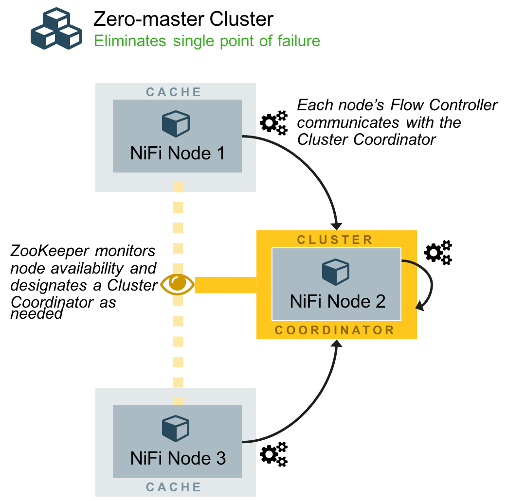

As you may know a version 1.0.0-BETA of Apache NiFi has been released few days ago. The upcoming 1.0.0 release will be a great moment for the community as it it will mark a lot of work over the last few months with many new features being added.

The objective of the Beta release is to give people a chance to try this new version and to give a feedback before the official major release which will come shortly. If you want to preview this new version with a completely new look, you can download the binaries [here](https://nifi.apache.org/download.html), unzip it, and run it ('_./bin/nifi.sh start_' or '_./bin/run-nifi.bat_' for Windows), then you just have to access _http://localhost:8080/nifi/_.

The objective of this post is to briefly explain how to setup an unsecured NiFi cluster with this new version (a post for setting up a secured cluster will come shortly with explanations on how to use a new tool that will be shipped with NiFi to ease the installation of a secured cluster).

One really important change with this new version is the new paradigm around cluster installation. From the NiFi documentation, we can read:

> Starting with the NiFi 1.0 release, NiFi employs a Zero-Master Clustering paradigm. Each of the nodes in a NiFi cluster performs the same tasks on the data but each operates on a different set of data. Apache ZooKeeper elects one of the nodes as the Cluster Coordinator, and failover is handled automatically by ZooKeeper. All cluster nodes report heartbeat and status information to the Cluster Coordinator. The Cluster Coordinator is responsible for disconnecting and connecting nodes. As a DataFlow manager, you can interact with the NiFi cluster through the UI of any node in the cluster. Any change you make is replicated to all nodes in the cluster, allowing for multiple entry points to the cluster.
> 
> 

OK, let's start with the installation. As you may know it is greatly recommended to use an odd number of ZooKeeper instances with at least 3 nodes (to maintain a majority also called quorum). NiFi comes with an embedded instance of ZooKeeper, but you are free to use an existing cluster of ZooKeeper instances if you want. In this article, we will use the embedded ZooKeeper option.

I will use my computer as the first instance. I also launched two virtual machines (with a minimal Centos 7). All my 3 instances are able to communicate to each other on requested ports. On each machine, I configure my /etc/hosts file with:

> **192.168.1.17 node-3** **192.168.56.101 node-2** **192.168.56.102 node-1**

I deploy the binaries file on my three instances and unzip it. I now have a NiFi directory on each one of my nodes.

The first thing is to configure the list of the ZK (ZooKeeper) instances in the configuration file '_./conf/zookeeper.properties_'. Since our three NiFi instances will run the embedded ZK instance, I just have to complete the file with the following properties:

> server.1=node-1:2888:3888 server.2=node-2:2888:3888 server.3=node-3:2888:3888

Then, everything happens in the '_./conf/nifi.properties_'. First, I specify that NiFi must run an embedded ZK instance, with the following property:

> nifi.state.management.embedded.zookeeper.start=true

I also specify the ZK connect string:

> nifi.zookeeper.connect.string=node-1:2181,node-2:2181,node-3:2181

As you can notice, the ./_conf/zookeeper.properties_ file has a property named _dataDir_. By default, this value is set to _./state/zookeeper_. If more than one NiFi node is running an embedded ZK, it is important to tell the server which one it is.

To do that, you need to create a file name _myid_ and placing it in ZK's data directory. The content of this file should be the index of the server as previously specify by the _server._ property.

On node-1, I'll do:

> mkdir ./state mkdir ./state/zookeeper echo 1 > ./state/zookeeper/myid

The same operation needs to be done on each node (don't forget to change the ID).

If you don't do this, you may see the following kind of exceptions in the logs:

> Caused by: java.lang.IllegalArgumentException: ./state/zookeeper/myid file is missing

Then we go to clustering properties. For this article, we are setting up an unsecured cluster, so we must keep:

> nifi.cluster.protocol.is.secure=false

Then, we have the following properties:

> nifi.cluster.is.node=true nifi.cluster.node.address=node-1 nifi.cluster.node.protocol.port=9999 nifi.cluster.node.protocol.threads=10 nifi.cluster.node.event.history.size=25 nifi.cluster.node.connection.timeout=5 sec nifi.cluster.node.read.timeout=5 sec nifi.cluster.firewall.file=

I set the FQDN of the node I am configuring, and I choose the arbitrary 9999 port for the communication with the elected cluster coordinator. I apply the same configuration on my other nodes:

> nifi.cluster.is.node=true nifi.cluster.node.address=node-2 nifi.cluster.node.protocol.port=9999 nifi.cluster.node.protocol.threads=10 nifi.cluster.node.event.history.size=25 nifi.cluster.node.connection.timeout=5 sec nifi.cluster.node.read.timeout=5 sec nifi.cluster.firewall.file=

and

> nifi.cluster.is.node=true nifi.cluster.node.address=node-3 nifi.cluster.node.protocol.port=9999 nifi.cluster.node.protocol.threads=10 nifi.cluster.node.event.history.size=25 nifi.cluster.node.connection.timeout=5 sec nifi.cluster.node.read.timeout=5 sec nifi.cluster.firewall.file=

We have configured the exchanges between the nodes and the cluster coordinator, now let's move to the exchanges between the nodes (to balance the data of the flows). We have the following properties:

> nifi.remote.input.host=node-1 nifi.remote.input.secure=false nifi.remote.input.socket.port=9998 nifi.remote.input.http.enabled=true nifi.remote.input.http.transaction.ttl=30 sec

Again, I set the FQDN of the node I am configuring and I choose the arbitrary 9998 port for the Site-to-Site (S2S) exchanges between the nodes of my cluster. The same applies for all the nodes (just change the host property with the correct FQDN).

It is also important to set the FQDN for the web server property, otherwise we may get strange behaviors with all nodes identified as 'localhost' in the UI. Consequently, for each node, set the following property with the correct FQDN:

> nifi.web.http.host=node-1

And that's all! Easy, isn't it?

OK, let's start our nodes and let's tail the logs to see what's going on there!

> ./bin/nifi.sh start && tail -f ./logs/nifi-app.log

If you look at the logs, you should see that one of the node gets elected as the cluster coordinator and then you should see heartbeats created by the three nodes and sent to the cluster coordinator every 5 seconds.

You can connect to the UI using the node you want (you can have multiple users connected to different nodes, modifications will be applied on each node). Let's go to:

> http://node-2:8080/nifi

Here is what it looks like:

As you can see in the top-left corner, there are 3 nodes in our cluster. Besides, if we go in the menu (button in the top-right corner) and select the cluster page, we have details on our three nodes:

We see that my node-2 has been elected as cluster coordinator, and that my node-3 is my primary node. This distinction is important because some processors must run on a unique node (for data consistency) and in this case we will want it to run "On primary node" (example below).

We can display details on a specific node ("information" icon on the left):

OK, let's add a processor like GetTwitter. Since the flow will run on all nodes (with balanced data between the nodes), this processor must run on a unique processor if we don't want to duplicate data. Then, in the scheduling strategy, we will choose the strategy "On primary node". This way, we don't duplicate data, and if the primary node changes (because my node dies or gets disconnected), we won't loose data, the workflow will still be executed.

Then I can connect my processor to a PutFile processor to save the tweets in JSON by setting a local directory (_/tmp/twitter_):

If I run this flow, all my JSON tweets will be stored on the primary node, **the data won't be balanced**. To balance the data, I need to use a RPG (Remote Process Group), the RPG will connect to the coordinator to evaluate the load of each node and balance the data over the nodes. It gives us the following flow:

I have added an input port called "RPG", then I have added a Remote Process Group that I connected to " http://node-2:8080/nifi " and I enabled transmission so that the Remote Process Group was aware of the existing input ports on my cluster. Then in the Remote Process Group configuration, I enabled the RPG input port. I then connected my GetTwitter to the Remote Process Group and selected the RPG input port. Finally, I connected my RPG input port to my PutFile processor.

When running the flow, I now have balanced data all over my nodes (I can check in the local directory '_/tmp/twitter_' on each node).

That's all for this post. I hope you enjoyed it and that it will be helpful for you if setting up a NiFi cluster. All comments/remarks are very welcomed and I kindly encourage you to download Apache NiFi, to try it and to give a feedback to the community if you have any.
