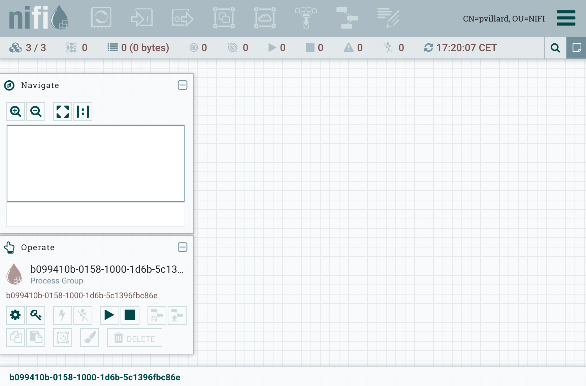

[Apache NiFi 1.1.0 is now out](https://nifi.apache.org/), and I want to discuss a specific subject in a couple of posts: how to scale up and down a NiFi cluster without loosing data? Before going into this subject, I want to setup a 3-nodes secured cluster using the NiFi toolkit. It will be my starting point to scale up my cluster with an additional node, and then scale down my cluster.

There are already great posts describing how to setup a secured cluster using embedded ZK and taking advantage of the NiFi toolkit for the certificates, so I won't go in too much details. For reference, here are some great articles I recommend:

- [Apache NiFi 1.0.0 - Authorization and Multi-Tenancy](http://bryanbende.com/development/2016/08/17/apache-nifi-1-0-0-authorization-and-multi-tenancy)
- [Apache NiFi tls-toolkit multi-node standalone in Docker](https://blog.rosander.ninja/nifi/toolkit/tls/2016/09/20/tls-toolkit-standalone-multi.html)
- [Using the TLS toolkit to simplify security](https://community.hortonworks.com/content/kbentry/58233/using-the-tls-toolkit-to-simplify-security.html)

OK... let's move on. My initial setup is the following:

- My OS X laptop
- 2 CentOS 7 VM

All nodes have required prerequisites (network, java, etc), have the NiFi 1.1.0 binary archive uncompressed available, and have the NiFi toolkit 1.1.0 binary archive uncompressed available.

On my OS X laptop, I will use the NiFi TLS toolkit in server mode so that it acts as a Certificate Authority that can be used by clients to get Certificates.

Here is the description of how to use the TLS toolkit in server mode:

```
./bin/tls-toolkit.sh server

usage: org.apache.nifi.toolkit.tls.TlsToolkitMain [-a <arg>] [-c <arg>] [--configJsonIn <arg>] [-d <arg>] [-D <arg>] [-f <arg>] [-F] [-g] [-h] [-k <arg>] [-p
       <arg>] [-s <arg>] [-T <arg>] [-t <arg>]

Acts as a Certificate Authority that can be used by clients to get Certificates

 -a,--keyAlgorithm <arg>                   Algorithm to use for generated keys. (default: RSA)
 -c,--certificateAuthorityHostname <arg>   Hostname of NiFi Certificate Authority (default: localhost)
    --configJsonIn <arg>                   The place to read configuration info from (defaults to the value of configJson), implies useConfigJson if set.
                                           (default: configJson value)
 -d,--days <arg>                           Number of days issued certificate should be valid for. (default: 1095)
 -D,--dn <arg>                             The dn to use for the CA certificate (default: CN=YOUR_CA_HOSTNAME,OU=NIFI)
 -f,--configJson <arg>                     The place to write configuration info (default: config.json)
 -F,--useConfigJson                        Flag specifying that all configuration is read from configJson to facilitate automated use (otherwise configJson will
                                           only be written to.
 -g,--differentKeyAndKeystorePasswords     Use different generated password for the key and the keyStore.
 -h,--help                                 Print help and exit.
 -k,--keySize <arg>                        Number of bits for generated keys. (default: 2048)
 -p,--PORT <arg>                           The port for the Certificate Authority to listen on (default: 8443)
 -s,--signingAlgorithm <arg>               Algorithm to use for signing certificates. (default: SHA256WITHRSA)
 -T,--keyStoreType <arg>                   The type of keyStores to generate. (default: jks)
 -t,--token <arg>                          The token to use to prevent MITM (required and must be same as one used by clients)
```

In my case, I run the TLS toolkit on my node-3, and I run the following command:

```
./bin/tls-toolkit.sh server -c node-3 -t myTokenToUseToPreventMITM -p 9999
```

On each of my node, I created a nifi directory in /etc and I ran a command using the toolkit to get my signed certificates generated into my current directory:

```
.../bin/tls-toolkit.sh client -c node-3 -t myTokenToUseToPreventMITM -p 9999
```

And I have the following generated files on each of my nodes:

- config.json
- keystore.jks
- nifi-cert.pem
- truststore.jks

I now configure ZooKeeper as described [here](https://pierrevillard.com/2016/08/13/apache-nifi-1-0-0-cluster-setup). Here is a short list of the tasks (in bold what slightly changed in comparison with my previous post):

- configure conf/zookeeper.properties to list the ZK nodes
- configure ZK state ID file
- set nifi.state.management.embedded.zookeeper.start
- set nifi.zookeeper.connect.string
- **set nifi.cluster.protocol.is.secure=true**
- set nifi.cluster.is.node=true
- set nifi.cluster.node.address=node-<1-3>
- **set nifi.cluster.node.protocol.port=9998**
- set nifi.remote.input.host=node-<1-3>
- **set nifi.remote.input.secure=true**
- **set nifi.remote.input.socket.port=9997**
- **set nifi.web.https.host=node-<1-3>**
- **set nifi.web.https.port=8443**

(ports are changed to ensure there is no conflict with the TLS toolkit running the CA server)

I now configure the following properties with what has been generated by the toolkit:

```
nifi.security.keystore=
nifi.security.keystoreType=
nifi.security.keystorePasswd=
nifi.security.keyPasswd=
nifi.security.truststore=
nifi.security.truststoreType=
nifi.security.truststorePasswd=
nifi.security.needClientAuth=
```

For one of my node, it gives:

```
nifi.security.keystore=/etc/nifi/keystore.jks
nifi.security.keystoreType=jks
nifi.security.keystorePasswd=4nVzULZ+CBiPCePvFSCw4LDAvzNoumAqu+TcyeDQ1ac
nifi.security.keyPasswd=4nVzULZ+CBiPCePvFSCw4LDAvzNoumAqu+TcyeDQ1ac
nifi.security.truststore=/etc/nifi/truststore.jks
nifi.security.truststoreType=jks
nifi.security.truststorePasswd=0fFJ+pd4qkso0jC0jh7w7tLPPRSINYI6of+KnRBRVSw
nifi.security.needClientAuth=true
```

Then I generate a certificate for myself as a client to be able to authenticate against NiFi UI:

```
.../bin/tls-toolkit.sh client -c node-3 -t myTokenToUseToPreventMITM -p 9999 -D "CN=pvillard,OU=NIFI" -T PKCS12
```

Don't forget the -T option to get your client certificate in a format that is easy to import in your browser (PKCS12). This command also generates a nifi-cert.pem file that corresponds to the CA certificate, you will need to import it in your browser as well (and you might need to manually update the trust level on this certificate to ensure you have access to the UI).

At this point I'm able to fill the authorizers.xml file. I need to specify myself as initial admin identity (to access the UI with full administration rights), and specify each nodes of my cluster (using the DN provided with the generated certificates). It gives:

```
<authorizers>
    <authorizer>
        <identifier>file-provider</identifier>
        <class>org.apache.nifi.authorization.FileAuthorizer</class>
        <property name="Authorizations File">./conf/authorizations.xml</property>
        <property name="Users File">./conf/users.xml</property>
        <property name="Initial Admin Identity">CN=pvillard, OU=NIFI</property>
        <property name="Legacy Authorized Users File"></property>

        <property name="Node Identity 1">CN=node-1, OU=NIFI</property>
        <property name="Node Identity 2">CN=node-2, OU=NIFI</property>
        <property name="Node Identity 3">CN=node-3, OU=NIFI</property>
    </authorizer>
</authorizers>
```

> **WARNING** - Please be careful when updating this file because identities are case-sensitive and blank-sensitive. For example, even though I specified
> 
> ```
> -D "CN=pvillard,OU=NIFI"
> ```
> 
> when executing the command to generate the certificates, it introduced a white space after the comma. The correct string to use in the configuration file is given in the output of the TLS toolkit when executing the command.

Once I've updated this file on each node, I'm now ready to start each node of the cluster.

```
./bin/nifi.sh start && tail -f ./logs/nifi-app.log
```

Once all nodes are correctly started, I am now able to access the NiFi UI using any of the nodes in the cluster:

\[caption id="attachment\_1277" align="alignnone" width="1740"\] NiFi UI / 3-nodes secured cluster\[/caption\]

That's all! Next post will use the current environment as a starting point to demonstrate how to scale up/down a NiFi cluster.
