## Scaling up - add a new node in the cluster

You have a NiFi cluster and you are willing to increase the throughput by adding a new node? Here is a way to do it without restarting the cluster. This post starts with [a 3-nodes secured cluster with embedded ZooKeeper](https://pierrevillard.com/2016/11/29/apache-nifi-1-1-0-secured-cluster-setup/) and we are going to add a new node to this cluster (and this new node won't have an embedded ZK).

The node I'm going to add is a CentOS 7 virtual machine running an [Apache NiFi](https://nifi.apache.org/) 1.1.0 instance. All prerequisites are met (network, firewall, java, etc) and I uncompressed the NiFi and NiFi toolkit binaries archives.

First thing to do is, if you don't have DNS resolution, to update the /etc/hosts file on all the nodes so that each node can resolve the others.

Then, I want to issue a certificate signed by my Certificate Authority for my new node. For this purpose, I use the NiFi toolkit and issue a CSR against my running CA server (see [secured cluster setup](http://pierrevillard.com/2016/11/29/apache-nifi-1-1-0-secured-cluster-setup/)). I created a directory /etc/nifi, and from this directory I ran the command:

```
.../bin/tls-toolkit.sh client -c node-3 -t myTokenToUseToPreventMITM -p 9999
```

node-3 being the node where my CA server is running.

It generates:

- config.json
- keystore.jks
- nifi-cert.pem
- truststore.jks

Then I can configure my new node with the following properties in ./conf/nifi.properties (to match the configuration used on the running cluster):

 

```
nifi.cluster.protocol.is.secure=true
nifi.cluster.is.node=true
nifi.cluster.node.address=node-4
nifi.cluster.node.protocol.port=9998
nifi.remote.input.host=node-4
nifi.remote.input.secure=true
nifi.remote.input.socket.port=9997
nifi.web.https.host=node-4
nifi.web.https.port=8443
nifi.zookeeper.connect.string=node-1:2181,node-2:2181,node-3:2181
```

And the following properties **based on the information from the generated config.json file**:

```
nifi.security.keystore=/etc/nifi/keystore.jks
nifi.security.keystoreType=jks
nifi.security.keystorePasswd=JBJUu5MGhGdBj6pTZkZaBR2jRijtcjEMlwqnqc9WkMk
nifi.security.keyPasswd=JBJUu5MGhGdBj6pTZkZaBR2jRijtcjEMlwqnqc9WkMk
nifi.security.truststore=/etc/nifi/truststore.jks
nifi.security.truststoreType=jks
nifi.security.truststorePasswd=gQ7Bw9kbkbr/HLZMxyIvq3jtMeTkoZ/0anD1ygbtSt0
nifi.security.needClientAuth=true
```

Then we need to configure the ./conf/authorizers.xml file to specify the initial admin identity and the nodes identities:

```
<authorizers>
    <authorizer>
        <identifier>file-provider</identifier>
        <class>org.apache.nifi.authorization.FileAuthorizer</class>
        <property name="Authorizations File">./conf/authorizations.xml</property>
        <property name="Users File">./conf/users.xml</property>
        <property name="Initial Admin Identity">CN=pvillard, OU=NIFI</property>
        <property name="Legacy Authorized Users File"></property>

        <property name="Node Identity 1">CN=node-1, OU=NIFI</property>
        <property name="Node Identity 2">CN=node-2, OU=NIFI</property>
        <property name="Node Identity 3">CN=node-3, OU=NIFI</property>
    </authorizer>
</authorizers>
```

> **IMPORTANT**: the authorizers.xml file must match the file that is on the other nodes. We do not specify the Node Identity of the new node, this will be handled when the node is joining the cluster. Also, before starting your new node, delete the ./conf/flow.xml.gz file so that this new node will pick up the current flow definition from the running cluster.

At this point, you can start the new node:

```
./bin/nifi.sh start && tail -f ./logs/nifi-app.log
```

And you will be able to see in the cluster view in the NiFi UI that your new node has joined the cluster:

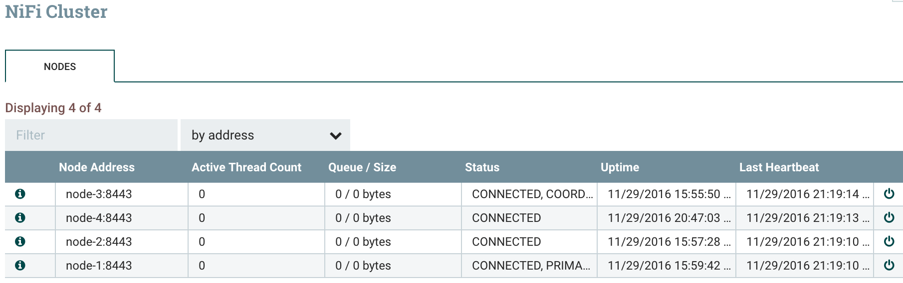

You now need to add the new user corresponding to the new node:

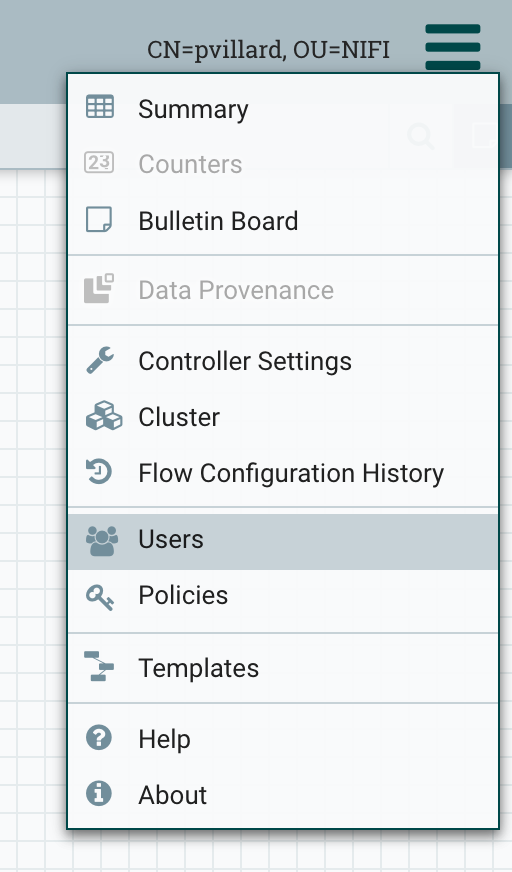

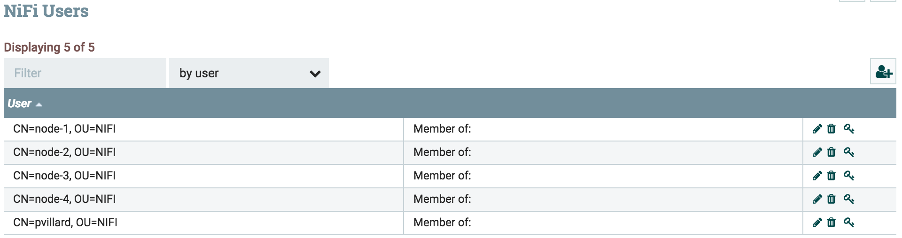

And then update the policies to grant proxy "user requests" write access to the new node.

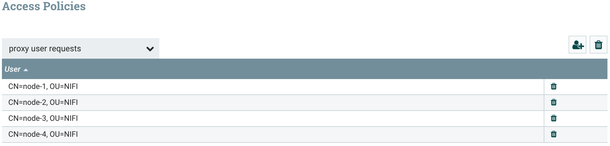

Now I want to confirm that my new node is used in the workflow processing. I am going to create a simple workflow that generates flow files on primary node, distribute the load on all the nodes of the cluster and store the generated files in /tmp. To do that, I first need to grant me the rights to modify the root process group content:

Click on the key symbol on the canvas and grant yourself all the access.

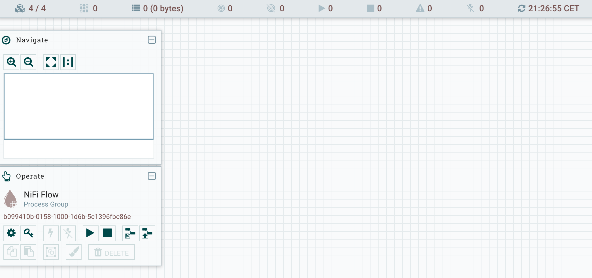

Then in order to simplify the next tasks (grant permissions to nodes for site-to-site communications), I recommend you to create a group called "nodes" and to add all the nodes user inside this group:

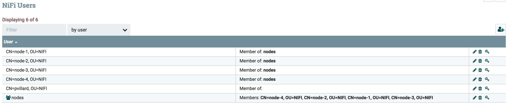

Then I create my workflow with a Remote Process Group and an Input Port to ensure the load balancing:

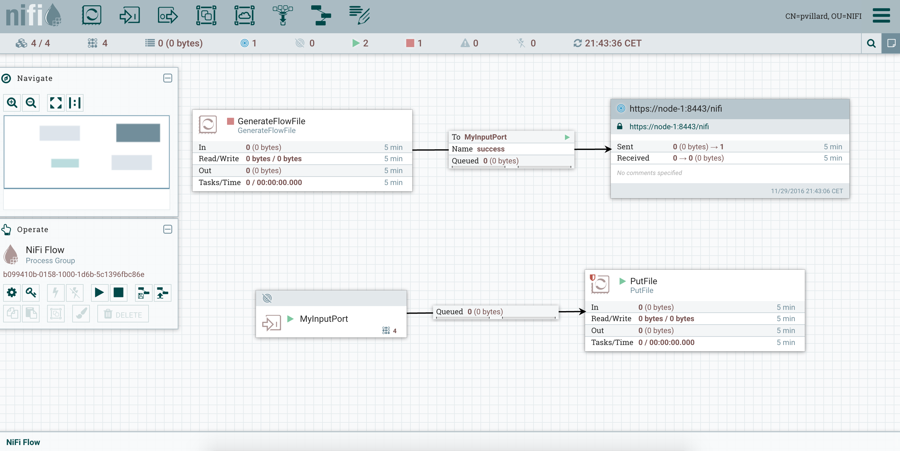

And I also specify that my GenerateFlowFile processor is running on primary node only:


Besides, I add specific rights to the Input Port to allow site-to-site communication between nodes. To do that, select the Input Port, then click on the key symbol in the Operate Panel and grant "receive site-to-site data" to the "nodes" group.

I can now start my workflow and confirm that data is stored in /tmp on each one of my nodes. I now have a new node participating in the execution of the workflow by the NiFi cluster!

## Scaling down - decommission a node of the cluster

OK... now we want to check how a node can be decommissioned. There is a lot of reasons to be in this situation but the most common ones are:

- upgrade the cluster in a rolling fashion (decommission a node, upgrade the node, move back the node in the cluster and move on to the next one)
- add a new processor NAR to the cluster (decommission a node, add NAR in the node's library, restart NiFi on this node, move back the node in the cluster and move on to the next one)

To do that, you just need to go in the cluster view, disconnect your node, stop your node, perform your modifications and restart the node to get it back in the cluster. Coordinator and primary roles will be automatically assigned to a new node if needed.

But let's say we are in more a "destructive" situation (removing a node for good) and we want to ensure that the data currently processed by the node we are decommissioning is correctly processed before shutting down NiFi on this node.For this purpose, I am going to change the end point of my workflow with a PutHDFS instead of a PutFile and send the data to an external cluster. The objective is to check that all the generated data is correctly going into HDFS without any issue.Here is my workflow: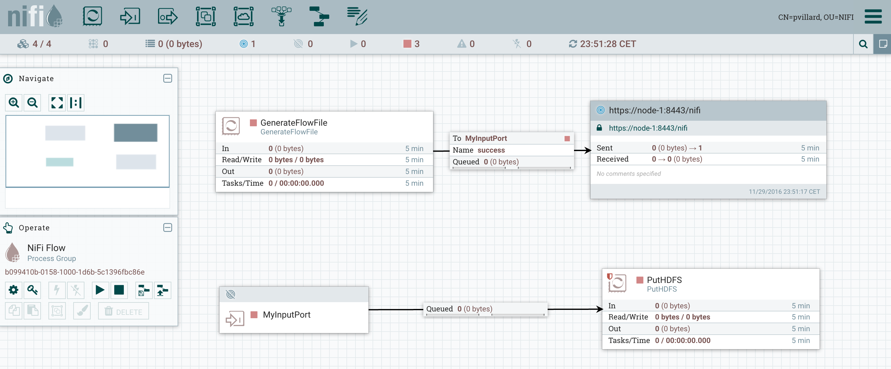And here is the current status of my cluster: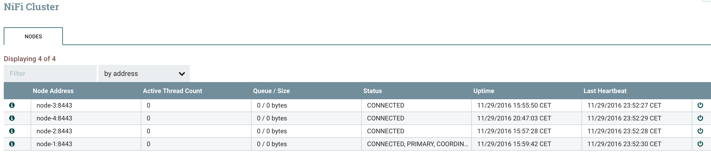My GenerateFlowFile is running on the primary node only (node-1) and I'll generate a file every 100ms. I'll decommission the node-1 to also demonstrate the change of roles.

> As a note: when you define a remote process group, you need to specify one of the nodes of the remote cluster you want to send data to. This specific node is only used when you are starting the remote process group to connect to the remote cluster. Once done, the RPG will be aware of all the nodes of the remote cluster and will be able to send data to all the nodes even though the specified remote node is disconnected. In a short future, it'll be possible to specify multiple remote nodes in order to be more resilient (in case the RPG is stopped/restarted and the specified remote node is no more available).

To decommission a node, I only need to click on the "disconnect" button on the cluster view for the node I want to disconnect.Before disconnecting my node, I can check that my workflow is running correctly and I have flow files queued in my relationships: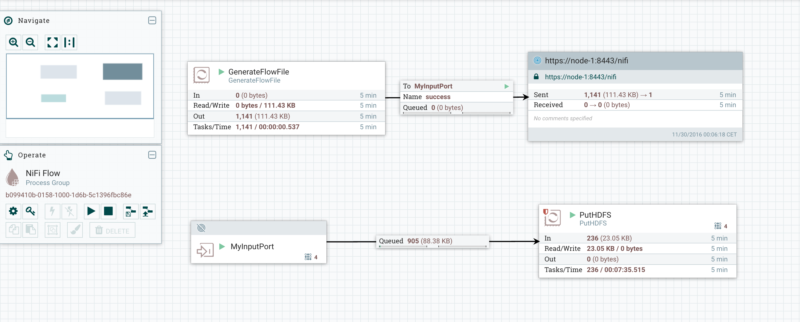I can now disconnect my node-1 and check what is going on. Roles have been reassigned and the workflow is still running: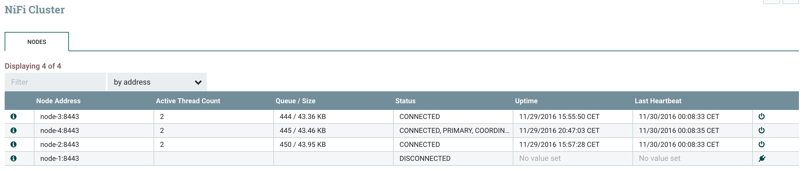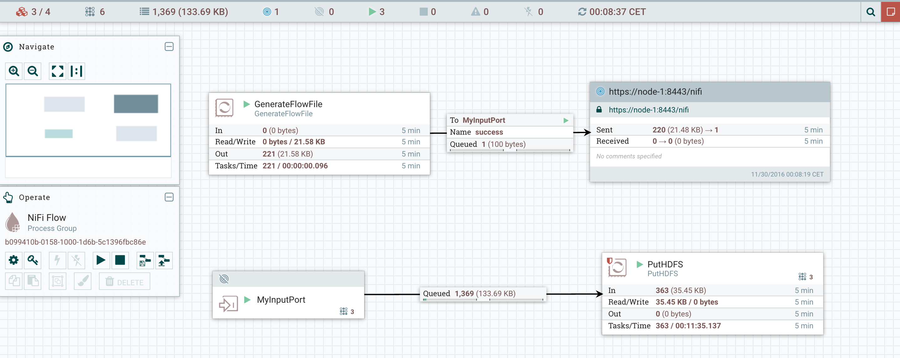Note that, as I explained, the remote process group is still working as expected even though it was using node-1 as remote node (see note above).I can now access the UI of the node I just disconnected and check the current status of this node (https://node-1:8443/nifi). When I access the node, I've the following warning: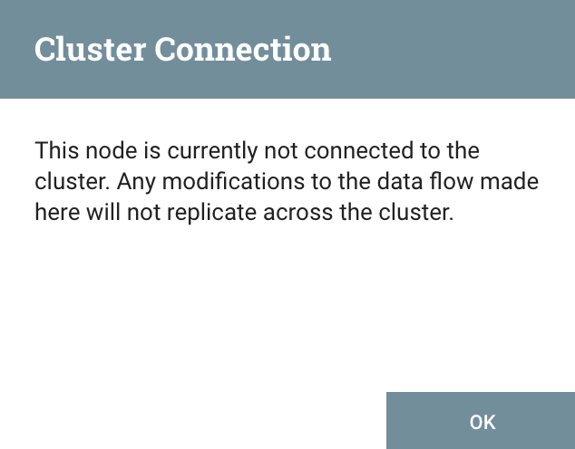And I can see that the workflow is still running on this node. This way, I can wait until all flow files currently on this node are processed: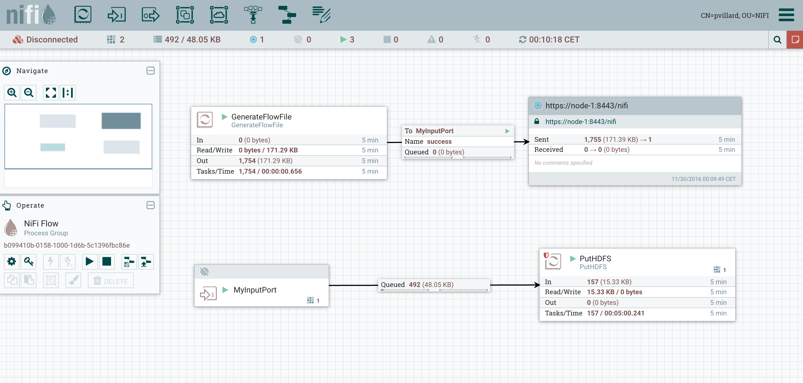My GenerateFlowFile is not running anymore since my node lost its role of Primary Node, and we can wait for the end of the processing of all flow files on this node. Once all flow files are processed, we have the guarantee that there will be no data loss and we can now shutdown the node if needed.If you want to reconnect it once you have performed your updates, you just need to go on the UI (from a node in the cluster), go in the cluster view and reconnect the node:The node is now reconnected and used in the workflow processing: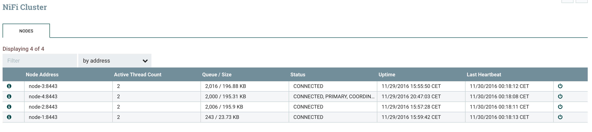I can check that all the files I've generated have been transferred, as expected, on my HDFS cluster.That's all for this blog! As you can see, scaling up and down your NiFi cluster is really easy and it gives you the opportunity to ensure no service interruption.As always, comments and suggestions are welcomed.
