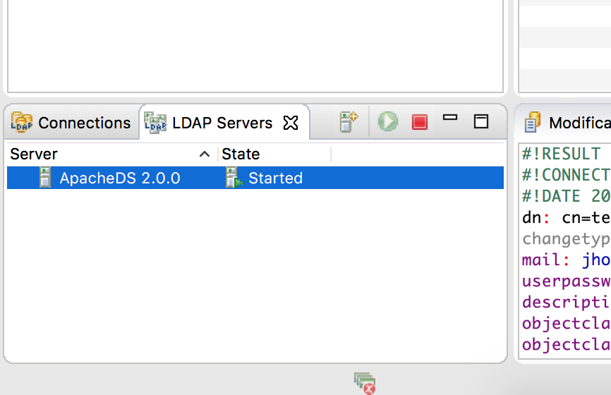
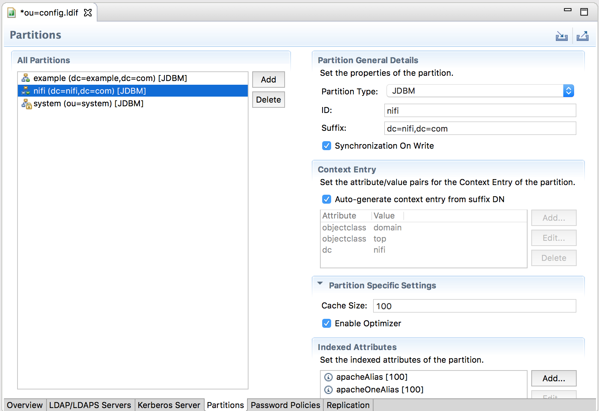

Once your cluster is secured, you probably want to start allowing users to access the cluster and you may not want to issue individual certificates for each user. In this case, one of the option is to use LDAP as the authentication provider of NiFi. This is quite simple, and we'll see in this post how to easily setup a local LDAP server and integrate NiFi with it.

In terms of configuration, everything is done with two files:

- ./conf/nifi.properties
- ./conf/login-identity-providers.xml

In nifi.properties, we are interested by two properties:

```
nifi.login.identity.provider.configuration.file
nifi.security.user.login.identity.provider
```

The first one is used to give the path to the login-identity-providers.xml and the second one is used to define the name of the identity provider to use from the XML file (in case you configured multiple providers).

A quick quote from the documentation:

> NiFi supports user authentication via client certificates or via username/password. Username/password authentication is performed by a _Login Identity Provider_. The Login Identity Provider is a pluggable mechanism for authenticating users via their username/password. Which Login Identity Provider to use is configured in two properties in the _nifi.properties_ file.
> 
> The `nifi.login.identity.provider.configuration.file` property specifies the configuration file for Login Identity Providers. The `nifi.security.user.login.identity.provider` property indicates which of the configured Login Identity Provider should be used. If this property is not configured, NiFi will not support username/password authentication and will require client certificates for authenticating users over HTTPS. By default, this property is not configured meaning that username/password must be explicitly enabled.
> 
> **NiFi does not perform user authentication over HTTP. Using HTTP all users will be granted all roles.**

In other words, if you want login/password authentication, your cluster needs to be secured first!

OK, so I set the following values in nifi.properties:

```
nifi.login.identity.provider.configuration.file=./conf/login-identity-providers.xml
nifi.security.user.login.identity.provider=ldap-provider
```

And then I just need to configure my XML files and to restart NiFi. Here are the LDAP parameters (and we can notice that the identifier is matching the value set in nifi.properties):

```
<provider>
        <identifier>ldap-provider</identifier>
        <class>org.apache.nifi.ldap.LdapProvider</class>
        <property name="Authentication Strategy">START_TLS</property>
        <property name="Manager DN"></property>
        <property name="Manager Password"></property>
        <property name="TLS - Keystore"></property>
        <property name="TLS - Keystore Password"></property>
        <property name="TLS - Keystore Type"></property>
        <property name="TLS - Truststore"></property>
        <property name="TLS - Truststore Password"></property>
        <property name="TLS - Truststore Type"></property>
        <property name="TLS - Client Auth"></property>
        <property name="TLS - Protocol"></property>
        <property name="TLS - Shutdown Gracefully"></property>
        <property name="Referral Strategy">FOLLOW</property>
        <property name="Connect Timeout">10 secs</property>
        <property name="Read Timeout">10 secs</property>
        <property name="Url"></property>
        <property name="User Search Base"></property>
        <property name="User Search Filter"></property>
        <property name="Identity Strategy">USE_DN</property>
        <property name="Authentication Expiration">12 hours</property>
    </provider>
```

And here is the associated documentation:

> Identity Provider for users logging in with username/password against an LDAP server.
> 
> **'Authentication Strategy'** - How the connection to the LDAP server is authenticated. Possible values are ANONYMOUS, SIMPLE, LDAPS, or START\_TLS.
> 
> **'Manager DN'** - The DN of the manager that is used to bind to the LDAP server to search for users. **'Manager Password'** - The password of the manager that is used to bind to the LDAP server to search for users.
> 
> **'TLS - Keystore'** - Path to the Keystore that is used when connecting to LDAP using LDAPS or START\_TLS. **'TLS - Keystore Password'** - Password for the Keystore that is used when connecting to LDAP using LDAPS or START\_TLS. **'TLS - Keystore Type'** - Type of the Keystore that is used when connecting to LDAP using LDAPS or START\_TLS (i.e. JKS or PKCS12). **'TLS - Truststore'** - Path to the Truststore that is used when connecting to LDAP using LDAPS or START\_TLS. **'TLS - Truststore Password'** - Password for the Truststore that is used when connecting to LDAP using LDAPS or START\_TLS. **'TLS - Truststore Type'** - Type of the Truststore that is used when connecting to LDAP using LDAPS or START\_TLS (i.e. JKS or PKCS12). **'TLS - Client Auth'** - Client authentication policy when connecting to LDAP using LDAPS or START\_TLS. Possible values are REQUIRED, WANT, NONE. **'TLS - Protocol'** - Protocol to use when connecting to LDAP using LDAPS or START\_TLS. (i.e. TLS, TLSv1.1, TLSv1.2, etc). **'TLS - Shutdown Gracefully'** - Specifies whether the TLS should be shut down gracefully before the target context is closed. Defaults to false.
> 
> **'Referral Strategy'** - Strategy for handling referrals. Possible values are FOLLOW, IGNORE, THROW. **'Connect Timeout'** - Duration of connect timeout. (i.e. 10 secs). **'Read Timeout'** - Duration of read timeout. (i.e. 10 secs).
> 
> **'Url'** - Url of the LDAP server (i.e. ldap://<hostname>:<port>). '**User Search Base'** - Base DN for searching for users (i.e. CN=Users,DC=example,DC=com). '**User Search Filter'** - Filter for searching for users against the 'User Search Base'. (i.e. sAMAccountName={0}). The user specified name is inserted into '{0}'.
> 
> **'Identity Strategy'** - Strategy to identify users. Possible values are USE\_DN and USE\_USERNAME. The default functionality if this property is missing is USE\_DN in order to retain backward compatibility. USE\_DN will use the full DN of the user entry if possible. USE\_USERNAME will use the username the user logged in with. **'Authentication Expiration'** - The duration of how long the user authentication is valid for. If the user never logs out, they will be required to log back in following this duration.

OK, enough theory, let's install a LDAP server using [Apache Directory Studio](http://directory.apache.org/). This project provides an easy way to setup a LDAP server but is also providing a great GUI to manage/administrate existing LDAP servers.I'll go quick because it's quite simple to setup and if needed the documentation of the official website is very useful.

Once downloaded and installed, just launch it. On the workbench, we are going to create a new server. Click on the '+' symbol in the "LDAP Servers" tab:



Then, select Apache DS and give it a name:


Create a connection: right click on your server / create a connection. And start your server to access it. You should be able to access the Overview tab of your server. We are going to create a partition/branch for NiFi users:


Click on Advanced Partitions configuration and then Add a new partition. Here I decided to call my partition "dc=nifi,dc=com":



At this point, you need to restart your server (right click / stop, right click / start).

Now we are going to create an organizational unit for groups and an organizational unit for people. In the ou=groups, we will define two groups, one for normal users and one for administrators. And we are going to create one user in each group, a user "test" in the group "users", and a user "admin" in the group "admins". This can be done through the GUI but in this case, I'll do it by importing the below LDIF file:

```
dn: ou=people,dc=nifi,dc=com
objectclass: organizationalUnit
objectClass: extensibleObject
objectclass: top
ou: people

dn: ou=groups,dc=nifi,dc=com
objectclass: organizationalUnit
objectClass: extensibleObject
objectclass: top
ou: groups

dn: cn=users,ou=groups,dc=nifi,dc=com
objectClass: groupOfUniqueNames
objectClass: top
cn: users
uniqueMember: cn=test,ou=people,dc=nifi,dc=com

dn: cn=admins,ou=groups,dc=nifi,dc=com
objectClass: groupOfUniqueNames
objectClass: top
cn: admins
uniqueMember: cn=admin,ou=people,dc=nifi,dc=com

dn: cn=test,ou=people,dc=nifi,dc=com
objectclass: inetOrgPerson
objectclass: organizationalPerson
objectclass: person
objectclass: top
cn: test
description: A test user
sn: test
uid: test
mail: test@nifi.com
userpassword: password

dn: cn=admin,ou=people,dc=nifi,dc=com
objectclass: inetOrgPerson
objectclass: organizationalPerson
objectclass: person
objectclass: top
cn: admin
description: A admin user
sn: admin
uid: admin
mail: admin@nifi.com
userpassword: password
```

To import it, right click on dc=nifi,dc=com, then Import, then LDIF import and select your file.

This will give you the following structure:


Now we want to configure NiFi to connect to our LDAP server. For that you have to note that, by default, the manager of the server (for an Apache DS LDAP server) has "uid=admin,ou=system" as DN and "secret" as password. Then the XML file is configured as below (no LDAPS/TLS in this example):

```
<?xml version="1.0" encoding="UTF-8" standalone="yes"?>
<loginIdentityProviders>
    <provider>
        <identifier>ldap-provider</identifier>
        <class>org.apache.nifi.ldap.LdapProvider</class>
        <property name="Authentication Strategy">SIMPLE</property>

        <property name="Manager DN">uid=admin,ou=system</property>
        <property name="Manager Password">secret</property>

        <property name="Referral Strategy">FOLLOW</property>
        <property name="Connect Timeout">10 secs</property>
        <property name="Read Timeout">10 secs</property>

        <property name="Url">ldap://localhost:10389</property>
        <property name="User Search Base">ou=people,dc=nifi,dc=com</property>
        <property name="User Search Filter">uid={0}</property>

        <property name="Identity Strategy">USE_USERNAME</property>
        <property name="Authentication Expiration">12 hours</property>
    </provider>
</loginIdentityProviders>
```

We need to restart NiFi to take into account the modifications. Note: if NiFi is clustered, configuration files must be the same on all nodes.

Now... if you try to connect as test or admin, you will get the following error:

> **Unknown user with identity 'admin'. Contact the system administrator.**

This is because you first need to add this user in the list of users through NiFi UI using the initial admin account (see [Apache NiFi 1.1.0 – Secured cluster setup](http://pierrevillard.com/2016/11/29/apache-nifi-1-1-0-secured-cluster-setup/)). At there is no syncing mechanism to automatically add LDAP users/groups into NiFi.

When connected with your initial admin account (using your individual certificate), go into users to add your users, and then into policies to grant access and rights to the users:


You have now a NiFi instance integrated with a LDAP server and you can connect as different users defined in your LDAP. It gives you the opportunity to add users and play with the policy model implemented in NiFi.

Important note: NiFi has a large and active community, new features regarding LDAP integration could be provided very soon (for example: [NIFI-3115](https://issues.apache.org/jira/browse/NIFI-3115)).

As always, comments/remarks are welcomed!
