A lot of famous websites are allowing you to develop custom applications to interact with their API. In a previous example, [we saw how to use NiFi to perform OAuth 1.0A authentication against Flickr API](http://pierrevillard.com/2016/04/12/oauth-1-0a-with-apache-nifi-twitter-api-example/). However a lot of websites are using OAuth 2.0 mechanism to authenticate your applications. You can find more details [here](https://oauth.net/), and check the differences between the two versions [here](https://aaronparecki.com/oauth-2-simplified/#differences).

Since this blog is hosted and powered by Wordpress, and since [Wordpress is allowing you to develop applications and is using Oauth 2.0 as authentication mechanism](https://developer.wordpress.com/docs/oauth2/), let's try [to get the statistics of my blog](https://developer.wordpress.com/docs/api/1.1/get/sites/%24site/stats/) using NiFi.

Before going into the details, let's recap the behavior in play with the example of Wordpress: a user A develops an application X, this application X is running on the Internet. Then a user B is accessing to the application X. This application X is asking B to grant a set of permissions to access **AS** user B to WordPress. If user B accepts, then application X can interact with WordPress as user B.

This is something you must have experienced with some applications like Facebook, Google, Instagram, LinkedIn, etc... All asking your permissions to post some content in your name on other websites/applications.

Now let's understand what is going on from an OAuth 2.0 point of view.

When user B accesses application X, the application X is issuing a request to WordPress saying that the application X is requesting access to WordPress resources. The user B will be asked to authenticate with its WordPress credentials and to approve the request of the application X to grant the application a set of permissions on the resources belonging to B. Once done, the application X will get from WordPress a short time limited code. Then, the application is going to issue another request to WordPress using this code and telling which resource the application wants to access. WordPress will then return an access token and the ressource ID the application is allowed to use in API calls. At this point, the application is able to request all the API endpoints to get all the data of the given resource (a WordPress blog in this example).

OK... So now, let's build our application using NiFi!

I'll demonstrate something "simple": a web service exposed by NiFi that gives users access to the stats of their blog. (in the example, it will be my blog since I'll be connecting to my application using my credentials, but that could be any WordPress user)

Let's define my application in WordPress so that WordPress is aware of this application and generates me some secret tokens to identify my application. I go [here](https://developer.wordpress.com/apps/) and I create an application that I call NiFi. Notice that the redirect URL is http://localhost:9999/ because this is where the web service created in NiFi will be listening. This could be something online but my NiFi would need to be opened on the Internet.

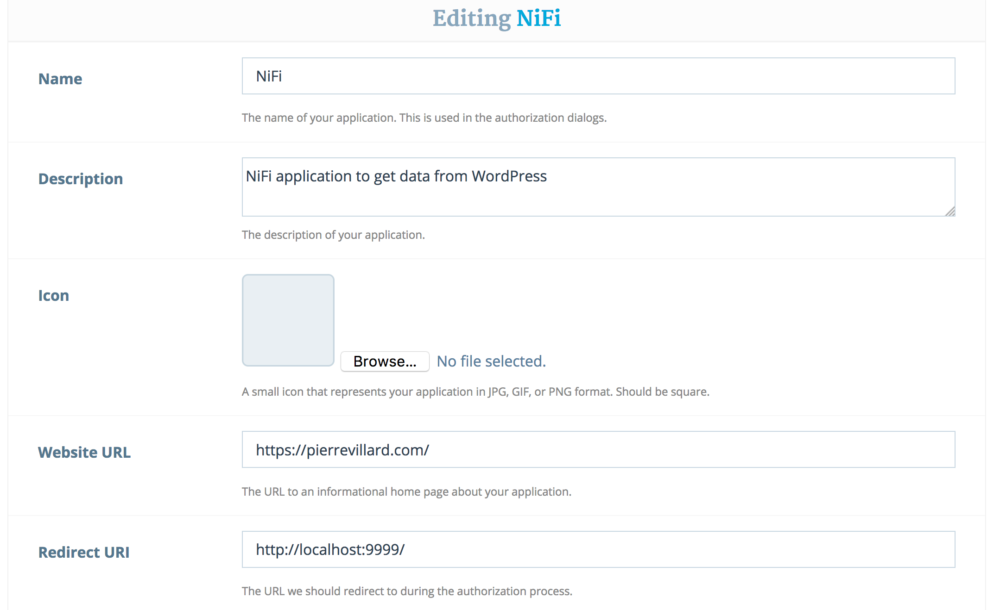

The redirect URL will be the endpoint where the user will be redirected once the user has granted access to the application to WordPress resources belonging to the user. In this case we want to send back the user to our listening web service. It might be easier to understand later with the example, don't worry ;-)

Once my application is created, WordPress gives me some information that will be particularly useful:

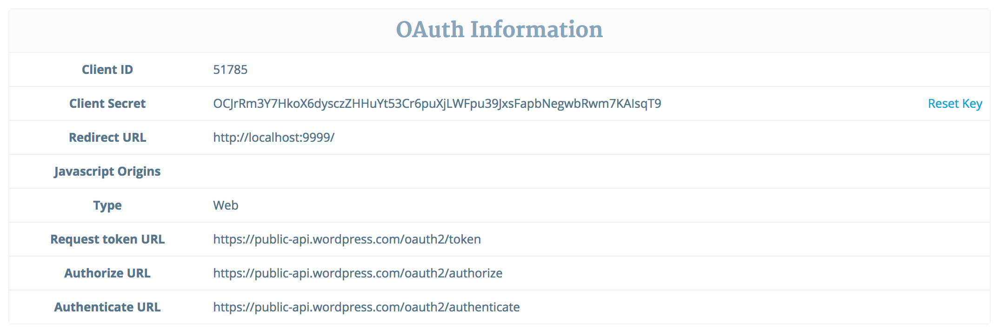

That's all we need on WordPress side. Let's start building our NiFi workflow!

In the end the workflow will be:

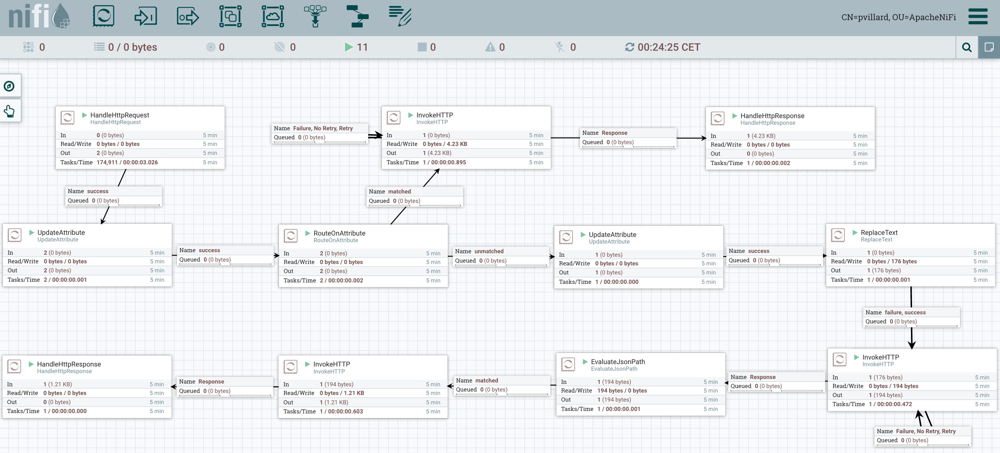

We start with a HandleHttpRequest that is listening to requests performed by the user. We specify the processor to listen on localhost:9999.

Then I use an UpdateAttribute processor to add all the "common properties" I want to access in all my processors through expression language:

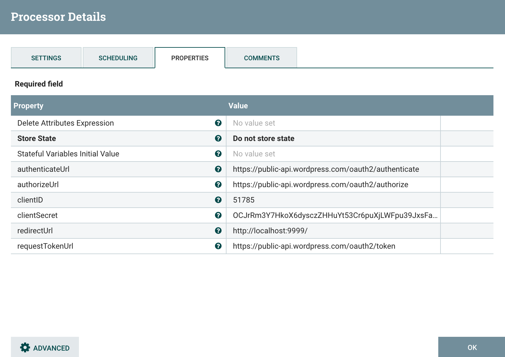

Then I use a RouteOnAttribute to route the request based on the URL. Indeed, I am expecting users to access my web service with the URL http://localhost:9999/getCode but WordPress will also send requests to my service when redirecting users on URL like http://localhost:9999/code=...&state.

Here is my RouteOnAttribute:

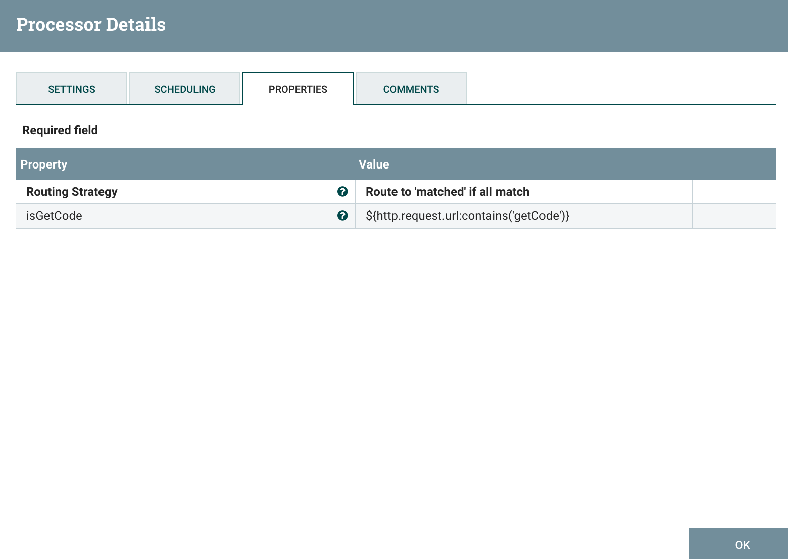

When this is a request sent by a user (containing "getCode" in the URL), then I use a InvokeHTTP processor to send a request to WordPress. This will give me the page where I need to send my user so that the user can authenticate and grant my application all permissions.

Based on WordPress documentation, the URL to request with a GET is:

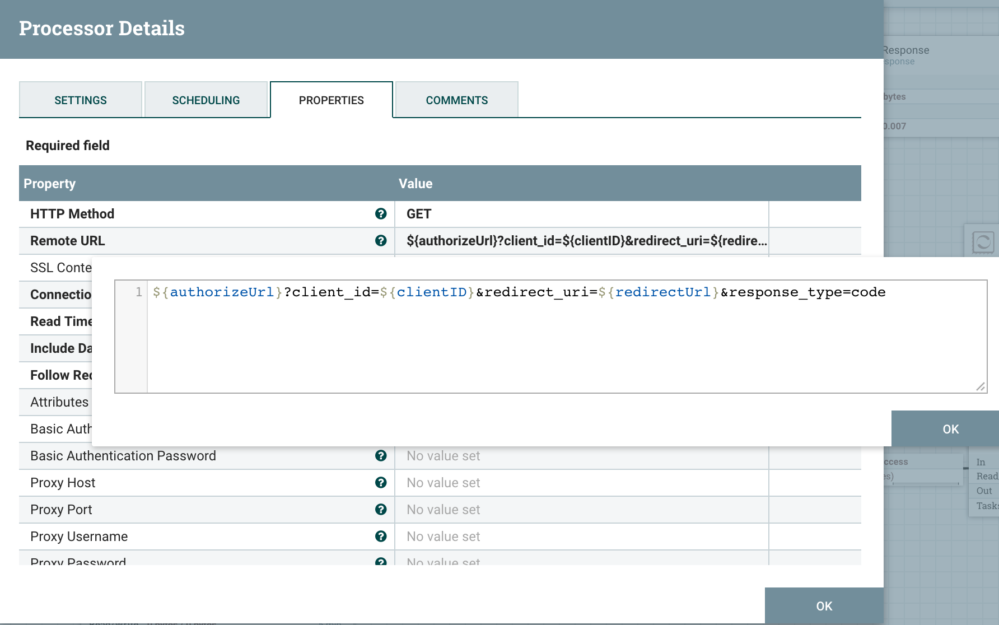

And what I received from WordPress (basically the page to let the user authenticate himself) is what I return to the user through a HandleHttpResponse processor. This way the user will access the page to authenticate on WordPress and grant my application all permissions, then the user will be redirected back to my application with a URL containing the code I need to get a token (thanks to the redirect URL we defined).

When the redirection is performed, I am back to my HandleHttpRequest, but, this time, at the RouteOnAttribute, I'll go in unmatched relationship (no "getCode" in the URL since, this time, this is the redirect URL). At this point, I use an UpdateAttribute to extract the code from the callback URL used by WordPress:

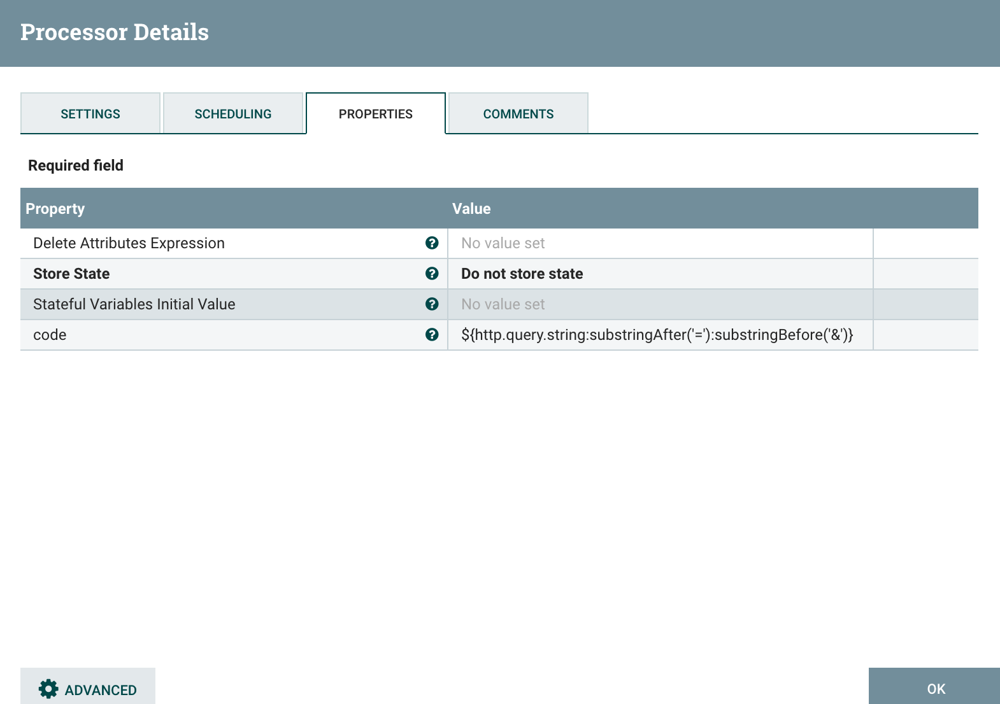

I am now able to create the content that will be sent to WordPress in the next request using a ReplaceText processor (indeed, since it will be a POST request, I need to update the content of my FlowFile because this will be used as the body of my next HTTP request):

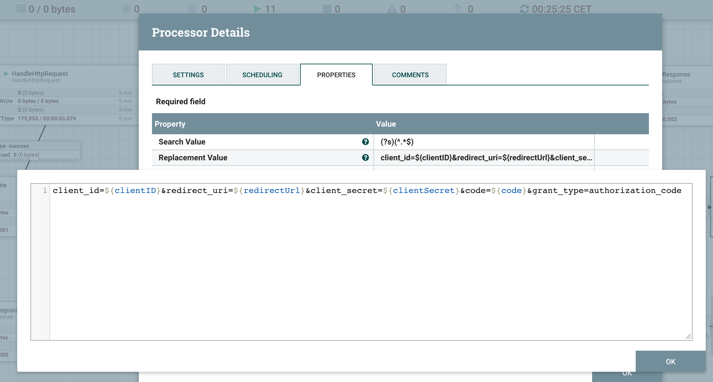

And I can perform my POST request using a InvokeHTTP processor in which I specify the content type to "application/x-www-form-urlencoded".

This request will give me back a JSON looking like:

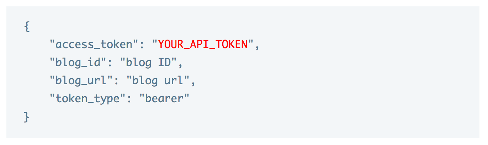

So I use an EvaluateJsonPath processor to extract the blog ID and the access token:

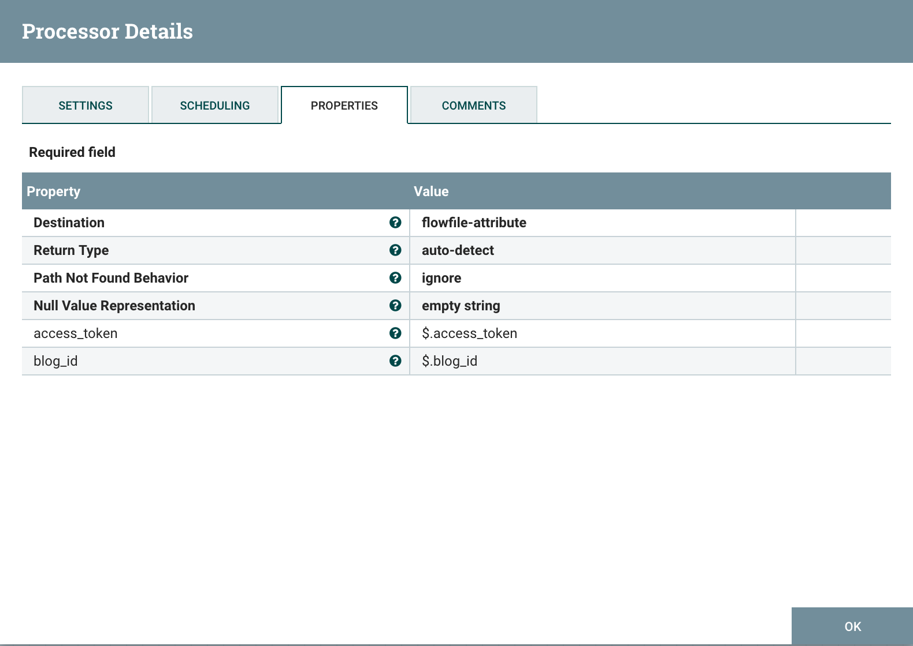

And I am now able to perform my last request with a InvokeHttp to request the API endpoint of WordPress to get statistics associated to the blog ID:

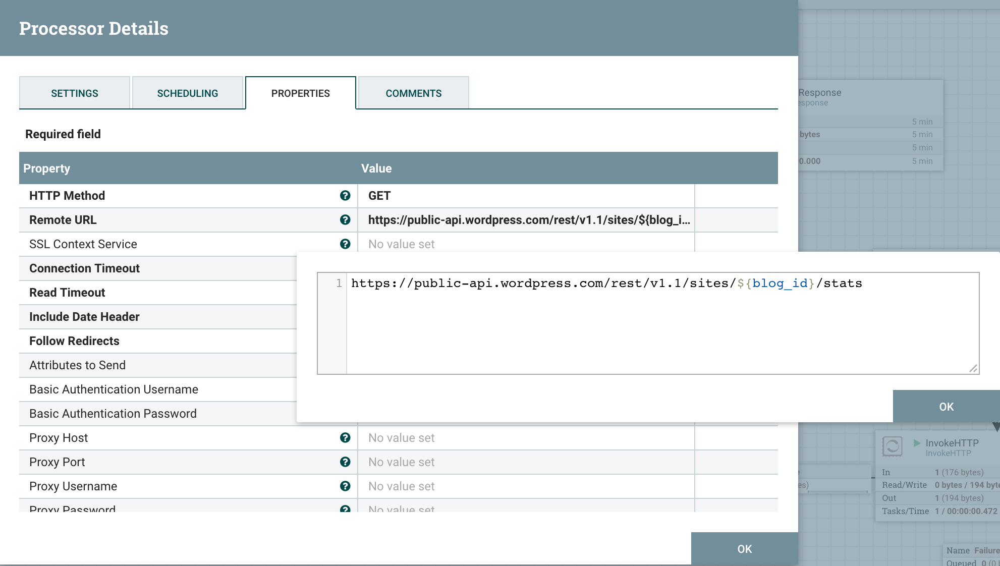

And I add a property to specify my access token as a header property:

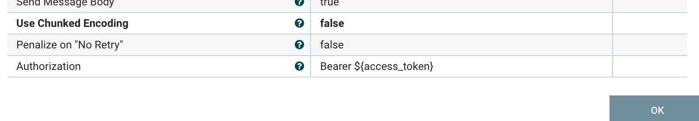

Then I send back the result to a HandleHttpResponse to display the result of the request to the user. Obviously at this point we could do something nicer with the statistics and display some charts for example... but that's outside the purpose of this blog: I just return the JSON containing the statistics :-)

That's all! Let's now see what it looks like when connecting to the web service while the full flow is running:

When I go to http://localhost:9999/getCode

I get to this page:

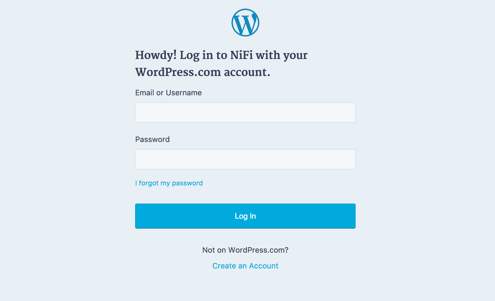

I enter my credentials, and since I've a two-steps authentication, I get on a web page asking for another access code that I received on my smartphone. Once the code is entered, I am asking to grant permissions to the application:

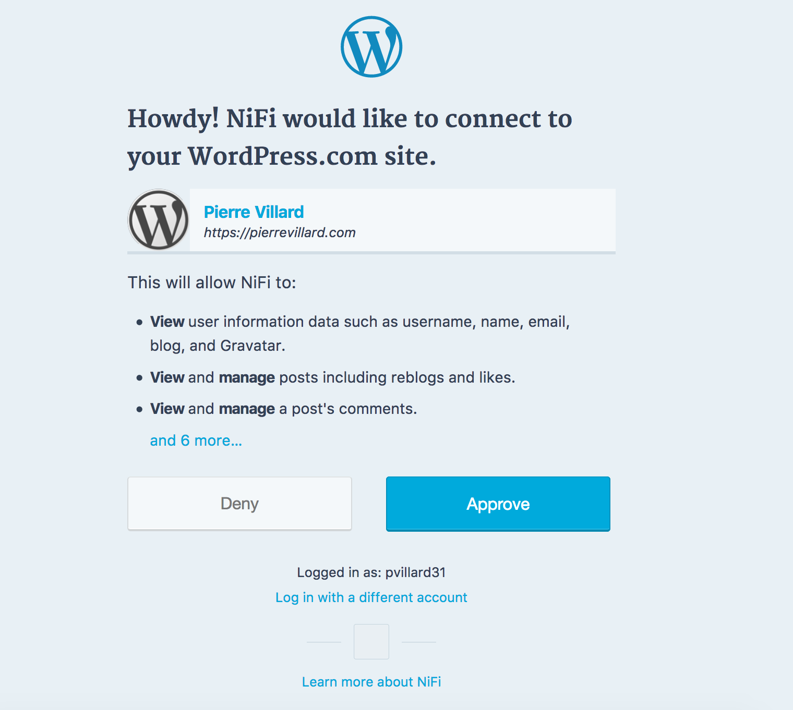

Then I approve, and I finally get the statistics in a JSON:

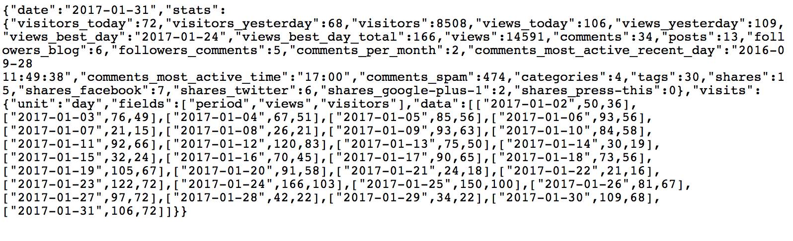

That's pretty cool, isn't it? The template is available [here](https://gist.github.com/pvillard31/c2926fdcff57b017a771d2d1acdb5cba).

Now I'm sure you can imagine a lot of great applications using OAuth 2.0 mechanism to interact with various existing APIs!

As always, comments and questions are welcomed! I hope you enjoyed this blog!
