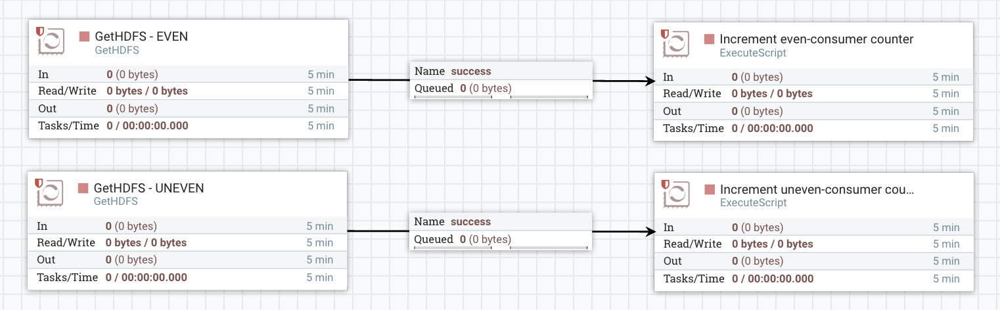

You may not know it but you have the availability to define and play with counters in NiFi. If policies are correctly configured (if your NiFi is secured), you should be able to access the existing counters using the menu:


Counters are just values that you can increase or decrease of a given delta. This is useful if you want to monitor particular values along your workflow. At the moment, unless you use a processor that explicitly uses counters or provides a way to define counters, there is nothing available out of the box.

The best way to define and update counters is to use ExecuteScript processor with the following piece of Groovy code:

```
def flowFile = session.get()
if(!flowFile) return
session.adjustCounter("my-counter", 1, true)
session.transfer(flowFile, REL_SUCCESS)
```

With this example, the ExecuteScript processor will just transmit the flow file without any modification to the success relationship but will also increment the counter "my-counter" of 1. If this counter does not exist it will be initialized with the delta value given as argument.

Here is the documentation of this method:

```
    /**
     * Adjusts counter data for the given counter name and takes care of
     * registering the counter if not already present. The adjustment occurs
     * only if and when the ProcessSession is committed.
     *
     * @param name the name of the counter
     * @param delta the delta by which to modify the counter (+ or -)
     * @param immediate if true, the counter will be updated immediately,
     *            without regard to whether the ProcessSession is commit or rolled back;
     *            otherwise, the counter will be incremented only if and when the
     *            ProcessSession is committed.
     */
    void adjustCounter(String name, long delta, boolean immediate);
```

Let's see an example: I want to confirm the correct behavior of the GetHDFS processor when I have multiple instances of this processor looking into the same directory but getting different flow files based on a regular expression.

Here is the first part of my flow:


Basically, I am generating flow files every 1ms with GenerateFlowFile. The generated flow files will be named after the generation date timestamp (without any extension). I am sending the files into HDFS and then I'm using a RouteOnAttribute where I check the filename according to a regular expression to split files according to even and uneven names. This way I can increment counters tracking the number of files I sent to HDFS with even names and with uneven names.

Here is the second part of my flow:



I have two instances of GetHDFS processor configured to look into the same input directory but one with a regular expression to look for files with an even name, and one to look for files with an uneven name, this way there is no concurrent access. Besides, the processor is configured to delete the file on HDFS once the file is retrieved in NiFi. Then I update two different counters to track the number of files with an even name that I retrieved from HDFS, and one for files with an uneven name.

If everything is working correctly, I should be able to let run my workflow a bit, then stop the generation of flow files, wait for all the flow files to be processed and confirm that:

- even-producer counter is equal to even-consumer counter
- unenven-producer counter is equal to uneven-consumer counter

Let's have a look into our counters table:


It looks like we are all good ;-)

As a remark, if you have multiple processors updating the same counter, then you will have the global value of the counter but also the value at each processor level. For example, if I have:


With both ExecuteScript incrementing the same "test" counter, then, I'll have:


Also, as a last remark, you can notice that it's possible to reset a counter to 0 from the counters table with the button in the last column (assuming you have write access to the counters based on the defined policies). It can be useful when doing some tests.

As always, questions/comments are welcomed!
