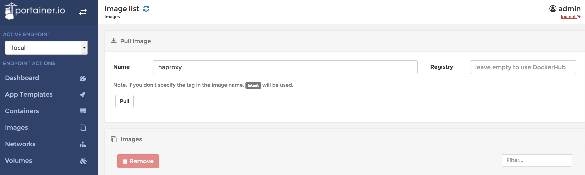
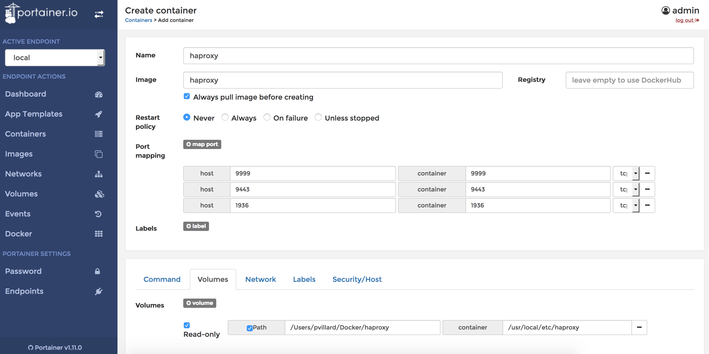
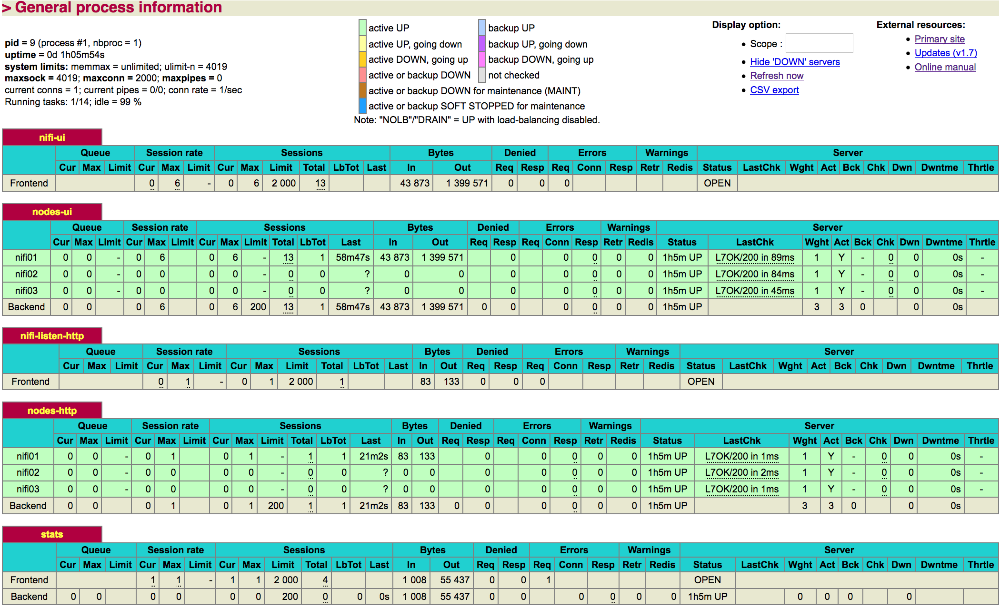
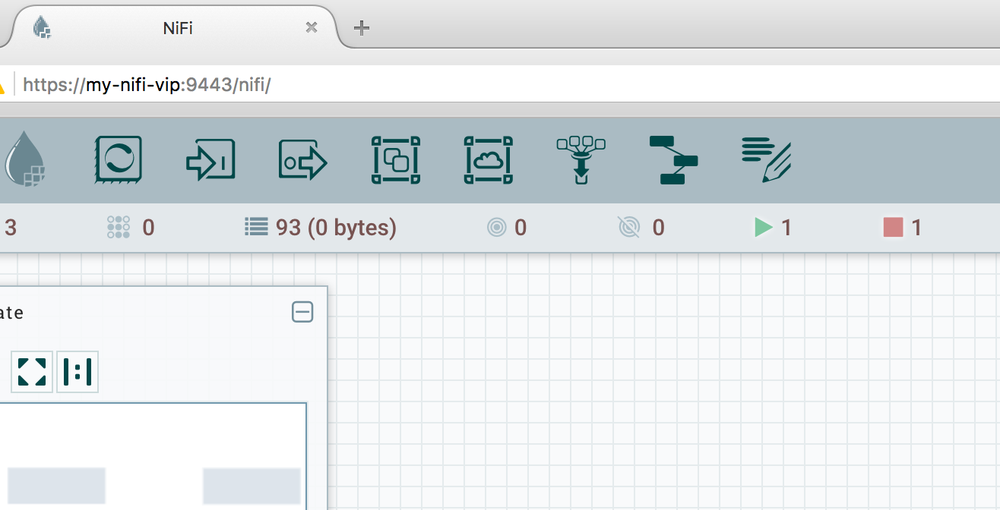
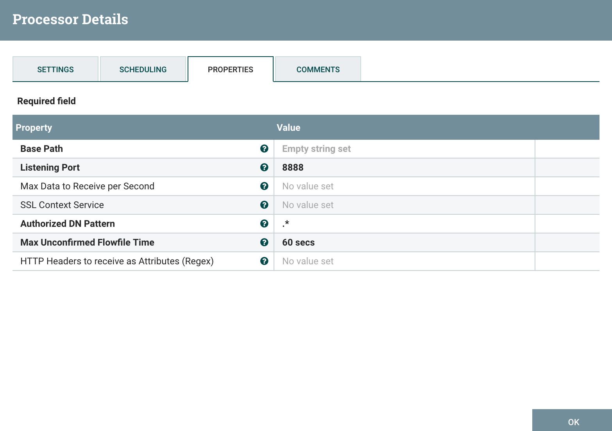
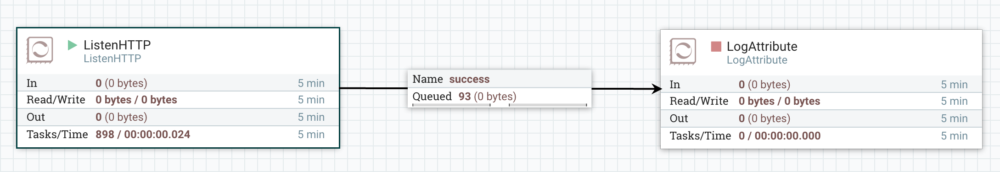
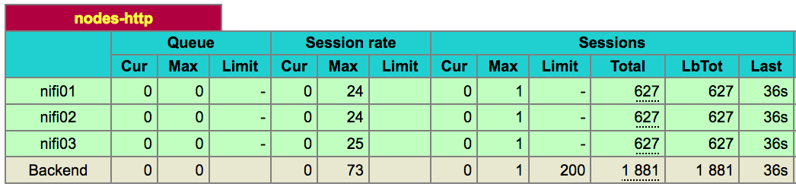

There is a lot of situations where load balancing is necessary even more so when you are in a clustered architecture. In the context of NiFi you may want to consider two situations:

- You have a NiFi cluster and you don't want to give users the IP address of your NiFi nodes to access the UI (remember: every node of the cluster can be used for the UI or to make REST API calls) and besides you want to load balance users on every node of the cluster. In addition, in case you [scale up/down your cluster](http://pierrevillard.com/2016/11/30/scaling-updown-a-nifi-cluster/), you don't want to inform all the users of such a change.
- You have Listen\[X\] processors (HTTP, TCP, UDP, Syslog, etc) in your workflow that are not running on the primary node only and you want to have all the nodes receiving the data (to increase performances and have full scalability). Again you don't want to configure/inform the data senders with all the IPs of your NiFi nodes, and in case of a cluster change you don't want to make some changes on client side.

In such situations you need a load balancer that will stand in front of your NiFi cluster and will provide a VIP (Virtual IP). For this purpose, you have hardware options, software options and also cloud options. Keep in mind that, if you want a production setup, you'll need to have your load balancer installed in a high availability fashion otherwise it'll become a single point of failure.

In this article, I'll use HAProxy which is the most widely used open source software based load balancing solution. And I'll launch my HAProxy instance in a Docker container (I'll also use Portainer as a UI helping me to manage my Docker environment).

Some useful links that can help you with the different tools I'm going to use:

- [HAProxy website](http://www.haproxy.org/)
- [HAProxy documentation](http://cbonte.github.io/haproxy-dconv/)
- [Docker](https://www.docker.com/)
- [HAProxy Docker reference](https://hub.docker.com/_/haproxy/)
- [Portainer](http://portainer.io/)

I assume I already have my [secured NiFi 3-nodes cluster up and running](http://pierrevillard.com/2016/11/29/apache-nifi-1-1-0-secured-cluster-setup/). And also, I've already setup my Docker and Portainer environment: I'm ready to pull HAProxy Docker image and to create my container.

Let's start with my HAProxy instance. First of all, in Portainer, I just need to pull the image I want (in this case I want the latest version and I just need to enter haproxy):



I now have the image available:


Let's build a container. In order to ease the modification of the configuration file of HAProxy, I'll define a bind mount to bind the configuration file inside the container to a file I have on my computer. I also need to define all the ports I want to expose in my container. Since my container will run on one of the nodes of my cluster I don't want to use the same ports (but in practice, your HAProxy would probably be on its own host).

- Open my container on 9443, and I'll configure HAProxy to listen on 9443 and to redirect requests made on 9443 to my NiFi nodes on port 8443 (port of my NiFi UI)
- Open my container on 9999, and I'll configure HAProxy to listen on 9999 and to redirect requests made on 9999 to my NiFi nodes on port 8888 (port that I'll use for my ListenHTTP processors)
- Open my container on 1936 and map on port 1936 inside my container (that's the port used by the HAProxy management UI)

In Portainer, I add a container and define the following:



When I create my container, it will immediately stop because I didn't configure my configuration file so far and the container won't start if the configuration file is invalid or does not exist. You can check the logs of your container in Portainer in case of issue.

In our case we'll have HTTP access to send data to our ListenHTTP processors and HTTPS to access the UI. In case of HTTPS, I don't want to have my load balancer taking care of certificates and I just want to have my requests going through (pure TCP load balancing)... this will raise an issue to users accessing the UI because the certificate presented by the NiFi node won't match the address the client is requesting (load balancer address), this could be solved by adding a SAN (Subject Alternative Name) in the certificate of the nodes but this will be discussed in another article (in the mean time you can have a look at [NIFI-3331](https://issues.apache.org/jira/browse/NIFI-3331)). In this case (and just because this is a demo!), I'll accept the SSL exceptions in my browser.

OK so let's see my HAProxy configuration file:

```
global

defaults
    log     global
    mode    http
    option  httplog
    option  dontlognull
    timeout connect 5000
    timeout client  50000
    timeout server  50000

frontend nifi-ui
    bind *:9443
    mode tcp
    default_backend nodes-ui

backend nodes-ui
    mode tcp
    balance roundrobin
    stick-table type ip size 200k expire 30m
    stick on src
    option httpchk HEAD / HTTP/1.1\r\nHost:localhost
    server nifi01 node-1:8443 check check-ssl verify none
    server nifi02 node-2:8443 check check-ssl verify none
    server nifi03 node-3:8443 check check-ssl verify none

frontend nifi-listen-http
    bind *:9999
    mode http
    default_backend nodes-http

backend nodes-http
    mode http
    balance roundrobin
    option forwardfor
    http-request set-header X-Forwarded-Port %[dst_port]
    option httpchk HEAD / HTTP/1.1\r\nHost:localhost
    server nifi01 node-1:8888 check
    server nifi02 node-2:8888 check
    server nifi03 node-3:8888 check

listen stats
    bind *:1936
    mode http
    stats enable
    stats uri /
    stats hide-version
    stats auth admin:password
```

Let's see the different parts:

- **global** - I put nothing in here
- **defaults** - Just some timeouts and log configuration, nothing special
- **frontend nifi-ui** - here I define a front end called "nifi-ui". This is where I define on what port HAProxy should listen (in this case on port 9443, for TCP mode) and where I should redirect the requests (in this case to my back end called nodes-ui).
- **backend nodes-ui** - here I define my back end where will be redirected my requests received by my front end. I define TCP mode, round robin load balancing, stickiness (to ensure that a connected user, based on its IP, will remain on the same node over multiple requests), and the nodes available. I also define the health check operation performed by HAProxy to confirm if nodes are up or down. In this case it's a HEAD HTTP request and I don't check the SSL certificates.
- **frontend nifi-listen-http** - here I define the front end that will be used to send data to my ListenHTTP processors on port 9999.
- **backend nodes-ui** - here I define the back end with my servers, the HTTP mode, the health check, and also the addition of two HTTP headers (x-forwarded-port and x-forwarded-for) to keep track of IP and port of my client (otherwise I'd only know about the IP and port of my load balancer when receiving data in NiFi).
- **listen stats** - here are some parameters about the HAProxy management UI, like the port, the login and password, etc.

I restart my container to take into account the configuration, and I can have a look to the management UI:



All is green meaning that our health checks are OK.

Assuming my load balancer has the following host name "my-nifi-vip", I can now access the UI through https://my-nifi-vip:9443/nifi :



On my UI, I can configure a ListenHTTP processor as below:





And send data to my cluster using the virtual IP provided by my load balancer:

```
while true; do curl -X POST http://my-nifi-vip:9999/test; done;
```

In the HAProxy management UI, I can confirm that my requests are correctly load balanced on all the nodes of my cluster:



It is now really easy to add or remove new nodes in your NiFi cluster without impacting the clients sending data into NiFi since they only need to know about the virtual IP exposed by the load balancer. You just need to update the configuration file when you are adding nodes, and restart your HAProxy container.

Keep in mind that even if the data is correctly load balanced over the nodes, all the requests are going through a single point, the load balancer. Consequently, on a performance standpoint, your load balancer may become a bottleneck in case you need to handle a very large number of connections per second. However load balancers are designed to be as efficient as possible and you should be OK in most cases.

As always questions/comments are welcomed.
