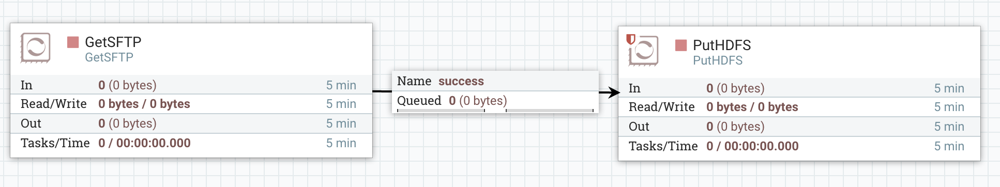

**Note - if you're using NiFi 1.8+, this post is no longer up to date. It is useful to understand how NiFi works but things have changed a bit. [Have a look here](https://pierrevillard.com/2018/10/29/nifi-1-8-revolutionizing-the-list-fetch-pattern-and-more/).**

I do see a lot of questions about how is working the List\[X\]/Fetch\[X\] processors and how to load balance the data over the nodes of a NiFi cluster once the data is already in the cluster. Since the question comes up quite often, let's discuss the subject and let's try to understand how things are working here.

I will assume that you are running a NiFi cluster since there is no problem about data balancing with a standalone instance ;-)

The first thing to understand is: when running a cluster, one of the node is randomly designated as the "Primary node". The election takes place when the cluster starts, and there is no way to decide which node will be the primary node. OK... you could force things when your cluster starts but there is no point to do such a thing if you want real high availability. So short line is: all nodes may have to be the Primary node at one point and don't assume that the Primary node will be a given node in particular.

Second thing to understand is: the flow that you are designing on your canvas is running on all the nodes independently. Each node of the cluster is responsible of its own data and a relationship between two processors does not mean that the data going into this relationship will be balanced over the nodes. Unless you use a Remote Process Group (see below) the data will remain on the same node from the beginning to the end of the flow.

I will use a the following example to illustrate my explanations: I want to get files from a remote SFTP server and put the files into HDFS.

- **First idea (bad idea!) / GetSFTP -> PutHDFS**

The first option could be the pattern Get/Put which is perfectly fine with a standalone instance. However this will cause issues if you have a NiFi cluster. Remember? The flow is running on all hosts of your cluster. Problem is that you will have concurrent accesses from your nodes to the same files on the SFTP server... and if the processor is configured to delete the file once retrieved (default behavior) you will have errors showing up. Conclusion: always have in mind that a processor is running on all the nodes and can cause concurrent access errors depending on the remote system.

- **Second idea (not efficient!) / GetSFTP on Primary Node -> PutHDFS**

The second option is to configure the GetSFTP processor to only run on the Primary Node (in the Scheduling tab of the processor configuration):

This way, you will solve the concurrent accesses since only one node of your cluster (the Primary node) will run the GetSFTP processor.

Brief aside: remember, the flow is running on all the nodes, however if the processor is configured to run on the primary node only, the processor won't be scheduled on nodes not being the primary node. That's all.

With this approach the problem is that it's not efficient at all. First reason is that you get data from only one node (this does not scale at all), and, in the end, only the primary node of your cluster is actually handling the data. Why? Because, unless you explicitly use a remote process group, the data will remain on the same node from the beginning to the end. In this case, only the primary node will actually get data from SFTP server and push it into HDFS.

- **Recommended pattern : ListSFTP -> RPG / Input Port -> FetchSFTP -> PutHDFS**

To solve the issues, the List/Fetch pattern has been developed and widely used for a lot of processors. The idea is the following: the List processor will only list the data to retrieve on the remote system and get the associated metadata (it will not get the data itself). For each listed item, a flow file (with no content) will be generated and attributes will be populated with the metadata. Then the flow file is sent to the Fetch processor to actually retrieved the data from the remote system based on the metadata (it can be the path of the file on the remote system for example). Since each flow file contains the metadata of a specific item on the remote system, you won't have concurrent accesses even if you have multiple Fetch processors running in parallel.

Obviously the List processor is meant to be run on the Primary node only. Then you have to balance the generated flow files over the nodes so that the Fetch processor on each node is dealing with flow files. For this purpose you have to use a Remote Process Group.

A Remote Process Group is an abstract object used to connect two NiFi setup together (the communication between the two NiFi is what we call Site-to-Site or S2S). It can be a MiNiFi instance to a NiFi cluster, a NiFi cluster to another NiFi cluster, a NiFi standalone to a NiFi cluster, etc. And it can also be used to connect a NiFi cluster to itself! This way the flow files will be balanced over all the nodes of the cluster. Few things to know with a Remote Process Group:

1. You need to have an input port on the remote instance you are connecting to (in our case, you need a remote input port on your canvas).
2. The address you give when configuring your remote process group does not matter in terms of high availability: once the connection is established with one of the nodes of the remote instance, the remote process group will be aware of all the nodes of the remote instance and will manage the case where the node specified in the address goes down.
3. Your instances need to be configured to allow remote access. The required properties are:

> \# Site to Site properties nifi.remote.input.host= nifi.remote.input.secure= nifi.remote.input.socket.port= nifi.remote.input.http.enabled= nifi.remote.input.http.transaction.ttl=

In the case of our SFTP example, it looks like:

Let's try to understand what is going on from a cluster perspective. Here is what we have in the case of a 3-nodes NiFi cluster with ListSFTP running on the primary node only:

The ListSFTP when scheduled is going to list the three files on my remote SFTP server and will generate one flow file for each remote file. Each flow file won't have any content but will have attributes with metadata of the remote files. In the case of ListSFTP, I'll have ([check the documentation at the "Write attributes" paragraph](https://nifi.apache.org/docs/nifi-docs/components/org.apache.nifi.processors.standard.ListSFTP/)):

| Name | Description |
| --- | --- |
| sftp.remote.host | The hostname of the SFTP Server |
| sftp.remote.port | The port that was connected to on the SFTP Server |
| sftp.listing.user | The username of the user that performed the SFTP Listing |
| file.owner | The numeric owner id of the source file |
| file.group | The numeric group id of the source file |
| file.permissions | The read/write/execute permissions of the source file |
| file.lastModifiedTime | The timestamp of when the file in the filesystem waslast modified as 'yyyy-MM-dd'T'HH:mm:ssZ' |
| filename | The name of the file on the SFTP Server |
| path | The fully qualified name of the directory on the SFTP Server from which the file was pulled |

The ListSFTP processor will generate 3 flow files and, for now, all flow files are only on the primary node:

Now the Remote Process Group has been configured to connect to the cluster itself, and I set the relationship going from ListSFTP to the Remote Process Group to connect with the input port I created (you may have multiple input ports in the remote system to connect with and you can choose the input port to connect to, that's up to your needs). When the RPG (Remote Process Group) has the communication enabled, the RPG is aware of the three nodes and will balance the data to each remote node (be aware that there is a lot of parameters for Site-to-Site to improve efficiency). In my case that would give something like:

_Note: that would be an ideal case in terms of balancing but, for efficiency purpose, the Site-to-Site mechanism might send batch of flow files to the remote node. In the above example, with only 3 flow files, I would probably not end up with one flow file per node._

Now, since we have everything in the attributes of our flow files, we need to use the [Expression Language](https://nifi.apache.org/docs/nifi-docs/html/expression-language-guide.html) to set the properties of the FetchSFTP processor to use the attributes of the incoming flow files:

This way, each instance of the FetchSFTP processor will take care of its own file (to actually fetch the content of the remote data) and there won't be any concurrent access:

All your nodes are retrieving data and you really can scale up your cluster depending on your requirements. Note also that the PutHDFS won't be an issue neither since each node will write its own file.

As I said previously a lot of processors are embracing this pattern (and this is recommended way to use such processors with a NiFi cluster), and I'd strongly encourage you to do the same when developing your custom processors.

As always questions/comments are welcome.
