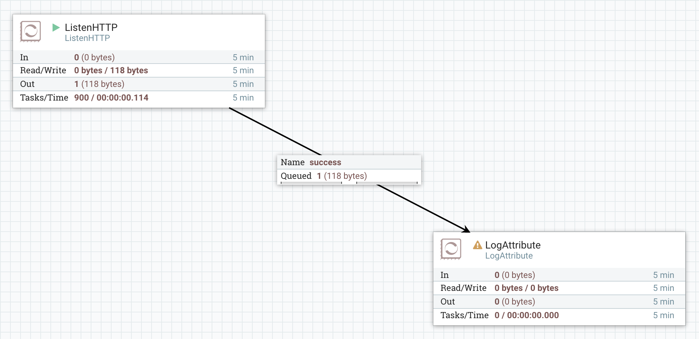

_Note - [This article is part of a series discussing subjects around NiFi monitoring](http://pierrevillard.com/2017/05/11/monitoring-nifi-introduction/)._

When NiFi is running, there is more than one process running on the server. Let's have a look:

```
[root@pvillard-hdf-2 ~]# ps -ef | grep nifi
nifi     19380     1  0 12:33 ?        00:00:00 /bin/sh /usr/hdf/current/nifi/bin/nifi.sh start
nifi     19382 19380  0 12:33 ?        00:00:06 /usr/java/jdk1.8.0_131//bin/java -cp /usr/hdf/current/nifi/conf:/usr/hdf/current/nifi/lib/bootstrap/* -Xms12m -Xmx24m -Dorg.apache.nifi.bootstrap.config.log.dir=/var/log/nifi -Dorg.apache.nifi.bootstrap.config.pid.dir=/var/run/nifi -Dorg.apache.nifi.bootstrap.config.file=/usr/hdf/current/nifi/conf/bootstrap.conf org.apache.nifi.bootstrap.RunNiFi start
nifi     19419 19382  7 12:33 ?        00:07:36 /usr/java/jdk1.8.0_131/bin/java -classpath /usr/hdf/current/nifi/conf:/usr/hdf/current/nifi/lib/jcl-over-slf4j-1.7.12.jar:/usr/hdf/current/nifi/lib/jul-to-slf4j-1.7.12.jar:/usr/hdf/current/nifi/lib/log4j-over-slf4j-1.7.12.jar:/usr/hdf/current/nifi/lib/logback-classic-1.1.3.jar:/usr/hdf/current/nifi/lib/logback-core-1.1.3.jar:/usr/hdf/current/nifi/lib/nifi-runtime-1.1.0.2.1.2.0-10.jar:/usr/hdf/current/nifi/lib/nifi-api-1.1.0.2.1.2.0-10.jar:/usr/hdf/current/nifi/lib/nifi-documentation-1.1.0.2.1.2.0-10.jar:/usr/hdf/current/nifi/lib/nifi-framework-api-1.1.0.2.1.2.0-10.jar:/usr/hdf/current/nifi/lib/nifi-nar-utils-1.1.0.2.1.2.0-10.jar:/usr/hdf/current/nifi/lib/slf4j-api-1.7.12.jar:/usr/hdf/current/nifi/lib/nifi-properties-1.1.0.2.1.2.0-10.jar -Dorg.apache.jasper.compiler.disablejsr199=true -Xmx512m -Xms512m -Dambari.application.id=nifi -Dambari.metrics.collector.url=http://pvillard-hdf-1:6188/ws/v1/timeline/metrics -Dsun.net.http.allowRestrictedHeaders=true -Djava.net.preferIPv4Stack=true -Djava.awt.headless=true -XX:+UseG1GC -Djava.protocol.handler.pkgs=sun.net.www.protocol -Dnifi.properties.file.path=/usr/hdf/current/nifi/conf/nifi.properties -Dnifi.bootstrap.listen.port=39585 -Dapp=NiFi -Dorg.apache.nifi.bootstrap.config.log.dir=/var/log/nifi org.apache.nifi.NiFi -k A2EA52795B33AB2F21C93E7E820D08369F1448478C877F4C710D6E85FD904AE6
```

As you can see, the script is running a bootstrap (running a JVM between 12 and 24MB) that is in charge of the NiFi JVM itself. In this example, the script is running with the PID 19380 and is the parent of the bootstrap process running with PID 19382. The bootstrap itself is the parent of NiFi running with the PID 19419.

If you only kill the NiFi process, the bootstrap will detect it and automatically relaunch NiFi for you:

```
kill -9 19419
```

Then I have:

```
nifi     19380     1  0 12:33 ?        00:00:00 /bin/sh /usr/hdf/current/nifi/bin/nifi.sh start
nifi     19382 19380  0 12:33 ?        00:00:06 /usr/java/jdk1.8.0_131//bin/java -cp /usr/hdf/current/nifi/conf:/usr/hdf/current/nifi/lib/bootstrap/* -Xms12m -Xmx24m -Dorg.apache.nifi.bootstrap.config.log.dir=/var/log/nifi -Dorg.apache.nifi.bootstrap.config.pid.dir=/var/run/nifi -Dorg.apache.nifi.bootstrap.config.file=/usr/hdf/current/nifi/conf/bootstrap.conf org.apache.nifi.bootstrap.RunNiFi start
nifi     24702 19382 99 14:20 ?        00:00:05 /usr/java/jdk1.8.0_131/bin/java -classpath /usr/hdf/current/nifi/conf:/usr/hdf/current/nifi/lib/jcl-over-slf4j-1.7.12.jar:/usr/hdf/current/nifi/lib/jul-to-slf4j-1.7.12.jar:/usr/hdf/current/nifi/lib/log4j-over-slf4j-1.7.12.jar:/usr/hdf/current/nifi/lib/logback-classic-1.1.3.jar:/usr/hdf/current/nifi/lib/logback-core-1.1.3.jar:/usr/hdf/current/nifi/lib/nifi-runtime-1.1.0.2.1.2.0-10.jar:/usr/hdf/current/nifi/lib/nifi-api-1.1.0.2.1.2.0-10.jar:/usr/hdf/current/nifi/lib/nifi-documentation-1.1.0.2.1.2.0-10.jar:/usr/hdf/current/nifi/lib/nifi-framework-api-1.1.0.2.1.2.0-10.jar:/usr/hdf/current/nifi/lib/nifi-nar-utils-1.1.0.2.1.2.0-10.jar:/usr/hdf/current/nifi/lib/slf4j-api-1.7.12.jar:/usr/hdf/current/nifi/lib/nifi-properties-1.1.0.2.1.2.0-10.jar -Dorg.apache.jasper.compiler.disablejsr199=true -Xmx512m -Xms512m -Dambari.application.id=nifi -Dambari.metrics.collector.url=http://pvillard-hdf-1:6188/ws/v1/timeline/metrics -Dsun.net.http.allowRestrictedHeaders=true -Djava.net.preferIPv4Stack=true -Djava.awt.headless=true -XX:+UseG1GC -Djava.protocol.handler.pkgs=sun.net.www.protocol -Dnifi.properties.file.path=/usr/hdf/current/nifi/conf/nifi.properties -Dnifi.bootstrap.listen.port=39585 -Dapp=NiFi -Dorg.apache.nifi.bootstrap.config.log.dir=/var/log/nifi org.apache.nifi.NiFi -k A2EA52795B33AB2F21C93E7E820D08369F1448478C877F4C710D6E85FD904AE6
```

As you can see the NiFi process has a new PID since it is a new process launched by the bootstrap.

You can find more information about the bootstrap system in [the administration guide](https://nifi.apache.org/docs/nifi-docs/html/administration-guide.html#bootstrap_properties). One interesting feature with this bootstrap approach is the bootstrap notifier. It allows you to configure a [notification service](https://nifi.apache.org/docs/nifi-docs/html/administration-guide.html#notification_services) that will be triggered when the bootstrap starts, stops or detects an interruption of the NiFi process.

With the new version of Apache NiFi (1.2.0), you can send notification to an HTTP(S) endpoint. If you need a custom notification service (example: send SNMP traps), it's not that hard: you just need to extend [AbstractNotificationService](https://github.com/apache/nifi/blob/master/nifi-bootstrap/src/main/java/org/apache/nifi/bootstrap/notification/AbstractNotificationService.java). You can have a look at the two existing implementations: [email notifier](https://github.com/apache/nifi/blob/master/nifi-bootstrap/src/main/java/org/apache/nifi/bootstrap/notification/email/EmailNotificationService.java) and [HTTP notifier](https://github.com/apache/nifi/blob/master/nifi-bootstrap/src/main/java/org/apache/nifi/bootstrap/notification/http/HttpNotificationService.java).

Let's configure our NiFi to use the email notification service and see what is the result. On each node of our cluster, we need to update the bootstrap.conf configuration file as below:

```
###
# Notification Services for notifying interested parties when NiFi is stopped, started, dies
###

# XML File that contains the definitions of the notification services
notification.services.file=./conf/bootstrap-notification-services.xml

# In the case that we are unable to send a notification for an event, how many times should we retry?
notification.max.attempts=5

# Comma-separated list of identifiers that are present in the notification.services.file; which services should be used to notify when NiFi is started?
nifi.start.notification.services=email-notification

# Comma-separated list of identifiers that are present in the notification.services.file; which services should be used to notify when NiFi is stopped?
nifi.stop.notification.services=email-notification

# Comma-separated list of identifiers that are present in the notification.services.file; which services should be used to notify when NiFi dies?
nifi.dead.notification.services=email-notification
```

In this case, we are saying that the configuration of our notification services (we can define and use multiple notifiers) is in the file

```
./conf/bootstrap-notification-services.xml
```

and that we want to use the notifier called "email-notification" (that's the default name defined in the XML configuration file) for stop, start, and dead events. As stated in the documentation, it's possible to define a list of notifiers for each type of event.

For this demonstration, I'll use my Gmail account and the Gmail SMTP server to send the notifications (obviously, with this example, NiFi needs a public internet access to send the requests to the SMTP server). Here is the configuration file:

```
<services>
     <service>
        <id>email-notification</id>
        <class>org.apache.nifi.bootstrap.notification.email.EmailNotificationService</class>
        <property name="SMTP Hostname">smtp.gmail.com</property>
        <property name="SMTP Port">587</property>
        <property name="SMTP Username">my-email-address@gmail.com</property>
        <property name="SMTP Password">myPassword</property>
        <property name="SMTP TLS">true</property>
        <property name="From">"NiFi Service Notifier"</property>
        <property name="To">email address that will receive the notifications</property>
     </service>
</services>
```

Here are the emails I received when restarting NiFi or killing the NiFi process:

- **Start event**

> Title: NiFi Started on Host pvillard-hdf-2 (172.26.249.33)
> 
> Hello,
> 
> Apache NiFi has been started on host pvillard-hdf-2 (172.26.249.33) at 2017/04/27 22:15:01.376 by user nifi

- **Stop event**

> Title: NiFi Stopped on Host pvillard-hdf-2 (172.26.249.33)
> 
> Hello,
> 
> Apache NiFi has been told to initiate a shutdown on host pvillard-hdf-2 (172.26.249.33) at 2017/04/27 22:14:35.702 by user nifi

- **Dead event**

> Title: NiFi Died on Host pvillard-hdf-2 (172.26.249.33)
> 
> Hello,
> 
> It appears that Apache NiFi has died on host pvillard-hdf-2 (172.26.249.33) at 2017/04/28 09:52:01.973; automatically restarting NiFi

OK, now let's see how to configure the HTTP notification service. Let's say I have a web server listening here:

```
http://pvillard-hdf-4:9999/notification
```

My XML configuration is now:

```
<services>
     <service>
        <id>email-notification</id>
        <class>org.apache.nifi.bootstrap.notification.email.EmailNotificationService</class>
        <property name="SMTP Hostname">smtp.gmail.com</property>
        <property name="SMTP Port">587</property>
        <property name="SMTP Username">my-email-address@gmail.com</property>
        <property name="SMTP Password">myPassword</property>
        <property name="SMTP TLS">true</property>
        <property name="From">"NiFi Service Notifier"</property>
        <property name="To">email address that will receive the notifications</property>
     </service>
     <service>
        <id>http-notification</id>
        <class>org.apache.nifi.bootstrap.notification.http.HttpNotificationService</class>
        <property name="URL">http://pvillard-hdf-4:9999/notification</property>
     </service>
</services>
```

And my bootstrap.conf configuration file now contains:

```
###
# Notification Services for notifying interested parties when NiFi is stopped, started, dies
###

# XML File that contains the definitions of the notification services
notification.services.file=./conf/bootstrap-notification-services.xml

# In the case that we are unable to send a notification for an event, how many times should we retry?
notification.max.attempts=5

# Comma-separated list of identifiers that are present in the notification.services.file; which services should be used to notify when NiFi is started?
nifi.start.notification.services=email-notification,http-notification

# Comma-separated list of identifiers that are present in the notification.services.file; which services should be used to notify when NiFi is stopped?
nifi.stop.notification.services=email-notification,http-notification

# Comma-separated list of identifiers that are present in the notification.services.file; which services should be used to notify when NiFi dies?
nifi.dead.notification.services=email-notification,http-notification
```

I now restart NiFi, and I can confirm that I receive a notification (I used a standalone NiFi to confirm the reception of the notification):



The content of the notification is the same as with the email notification service. Note that it's also possible to configure properties for a keystore and a truststore to send notifications using HTTPS:

```
<service>
   <id>http-notification</id>
   <class>org.apache.nifi.bootstrap.notification.http.HttpNotificationService</class>

   /* The URL to send the notification to */
   <property name="URL"></property>

   /* Max wait time for connection to remote service - default is 10s */
   <property name="Connection timeout"></property>

   /* Max wait time for remote service to read the request sent - default is 10s */
   <property name="Write timeout"></property>

   /* The fully-qualified filename of the Truststore */
   <property name="Truststore Filename"></property>

   /* The Type of the Truststore. Either JKS or PKCS12 */
   <property name="Truststore Type"></property>

   /* The password for the Truststore */
   <property name="Truststore Password"></property>

   /* The fully-qualified filename of the Keystore */
   <property name="Keystore Filename"></property>

   /* The Type of the Keystore. Either JKS or PKCS12 */
   <property name="Keystore Type"></property>

   /* The password for the Keystore */
   <property name="Keystore Password"></property>

   /* The password for the key. If this is not specified, but the Keystore Filename, Password, and Type are specified, then the Keystore Password will be assumed to be the same as the Key Password */
   <property name="Key Password"></property>

   /* The algorithm to use for this SSL context. Either TLS or SSL */
   <property name="SSL Protocol"></property>
</service>
```

Note that I also received an email notification since I specified the two notifiers in the configuration.

Again, if you need a custom notifier, this should not be really difficult and you are more than welcome to contribute your notifier code to the Apache community. It will give more options to users when setting a bootstrap notifier.

As usual feel free to ask questions and comment this post.
