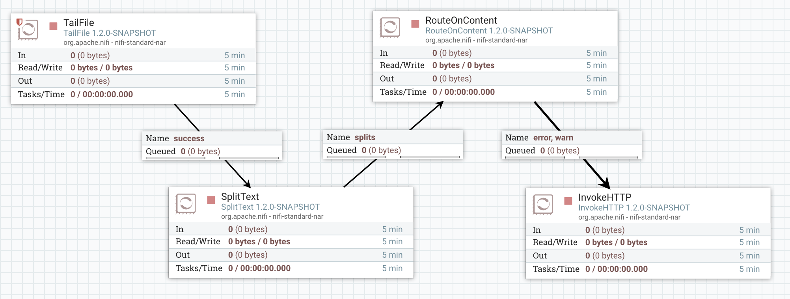

_Note - [This article is part of a series discussing subjects around NiFi monitoring](http://pierrevillard.com/2017/05/11/monitoring-nifi-introduction/)._

There is one configuration file in NiFi that manages all the logging operations performed by NiFi: this file is in the configuration directory (NIFI\_HOME/conf) and is named **_logback.xml_**. It is good to know that this file can be modified "on-the-fly" and it won't be required to restart NiFi for the modifications to be taken into account.

This file is a common configuration file for the logback library which is a successor of the famous log4j project. [Here is the official website](https://logback.qos.ch/). I won't get into the details of logback itself ([documentation is here](https://logback.qos.ch/manual/index.html)) but here is a quick overview of the default configuration when using NiFi.

The most important log file in NiFi is certainly nifi-app.log which is created according to this configuration block:

```
    <appender name="APP_FILE" class="ch.qos.logback.core.rolling.RollingFileAppender">
        <file>${org.apache.nifi.bootstrap.config.log.dir}/nifi-app.log</file>
        <rollingPolicy class="ch.qos.logback.core.rolling.SizeAndTimeBasedRollingPolicy">
            <fileNamePattern>${org.apache.nifi.bootstrap.config.log.dir}/nifi-app_%d{yyyy-MM-dd_HH}.%i.log</fileNamePattern>
            <maxFileSize>100MB</maxFileSize>
            <maxHistory>30</maxHistory>
        </rollingPolicy>
        <immediateFlush>true</immediateFlush>
        <encoder class="ch.qos.logback.classic.encoder.PatternLayoutEncoder">
            <pattern>%date %level [%thread] %logger{40} %msg%n</pattern>
        </encoder>
    </appender>

    <root level="INFO">
        <appender-ref ref="APP_FILE"/>
    </root>
```

In this case, log file is rolling every hour or when the file is going over 100MB. Besides we only keep up to 30 files worth of history. Based on your retention policies you can update this file to meet your requirements.

Also note that, by default, you will have the following log files:

- ./logs/nifi-app.log
- ./logs/nifi-bootstrap.log
- ./logs/nifi-user.log

Now... what can we do to use this file for monitoring purpose? Some options here:

- We can use the TailFile processor of NiFi to let NiFi tails its own log file and perform the required operation when some conditions are met. Example to send an HTTP request when logs of WARN and ERROR levels are detected:



- We can also define new appenders in the log configuration file and change it according to our needs. In particular, we could be interested by the SMTP Appender that can send logs via emails based on quite a large set of conditions. [Full documentation here](https://logback.qos.ch/manual/appenders.html#SMTPAppender).
- Obviously you can also configure this configuration file so that NiFi log files integrate with your existing systems. An idea could be to configure a [Syslog appender](https://logback.qos.ch/manual/appenders.html#SyslogAppender) to also redirect the logs to an external system.

Few remarks regarding the logs as I see recurrent questions:

- At the moment, there is no option to have a log file per processor or per process group. It is discussed by [NIFI-3065](https://issues.apache.org/jira/browse/NIFI-3065). However such an approach could have performance implications since each log message would need to be routed to the correct log file.
- Also, at the moment, the custom name of the processor is not displayed in the log messages (only the type is used). It is discussed by [NIFI-3877](https://issues.apache.org/jira/browse/NIFI-3877). Right now it looks like:

> 2017-05-12 10:43:37,780 INFO \[Timer-Driven Process Thread-4\] o.a.nifi.processors.standard.InvokeHTTP InvokeHTTP\[id=f7ebb153-015b-1000-f590-599786e16340\] my log message...

This could be a solution in a multi-tenant environment (to get one log file per workflow/use case) assuming each "team" is following the same convention to name the components in the workflows.

As usual feel free to ask questions and comment this post.
