_Note – [This article is part of a series discussing subjects around NiFi monitoring](https://pierrevillard.com/2017/05/11/monitoring-nifi-introduction/)._

If we look at [the development documentation](https://nifi.apache.org/docs/nifi-docs/html/developer-guide.html#reporting-tasks) about reporting tasks:

> So far, we have mentioned little about how to convey to the outside world how NiFi and its components are performing. Is the system able to keep up with the incoming data rate? How much more can the system handle? How much data is processed at the peak time of day versus the least busy time of day?
> 
> In order to answer these questions, and many more, NiFi provides a capability for reporting status, statistics, metrics, and monitoring information to external services by means of the `ReportingTask` interface. ReportingTasks are given access to a host of information to determine how the system is performing.

Out of the box, you have quite a lot of available reporting tasks and, in this article, we are going to focus on few of them (have a look at the other articles to find more about the other reporting tasks).

Before going into the details, I am going to discuss Site To Site related reporting tasks and we need to understand what is Site To Site (S2S):

> When sending data from one instance of NiFi to another, there are many different protocols that can be used. The preferred protocol, though, is the NiFi Site-to-Site Protocol. Site-to-Site makes it easy to securely and efficiently transfer data to/from nodes in one NiFi instance or data producing application to nodes in another NiFi instance or other consuming application.

In this case, we are going to use S2S reporting tasks, it means that the reporting tasks are continually running to collect data and to send this data to a remote NiFi instance, but you can use S2S to send data to the instance running the reporting task as well. This way, by using an input port on the canvas, you can actually receive the data generated by the reporting task and use it in a NiFi workflow. That's really powerful because, now, you can use all the NiFi capabilities to process this data and do whatever you want with it.

Let's go over some examples!

- **Monitoring bulletins**

With the new version of Apache NiFi (1.2.0), you can transform every bulletin into a flow file sent to any NiFi instance using Site-To-Site. This way, as soon as a processor / controller service / reporting task is generating a bulletin this can be converted into a flow file that you can use to feed any system you want.

Let's configure this reporting task to send the bulletins (as flow files) to an input port called "bulletinMonitoring" and use the flow files to send emails.

First, since my NiFi cluster is secured, I create a StandardSSLContextService in the Controller Services tab of the Controller Settings menu (this way, it can be used by reporting tasks).

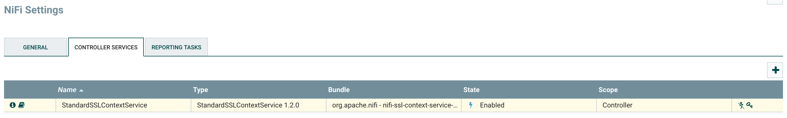

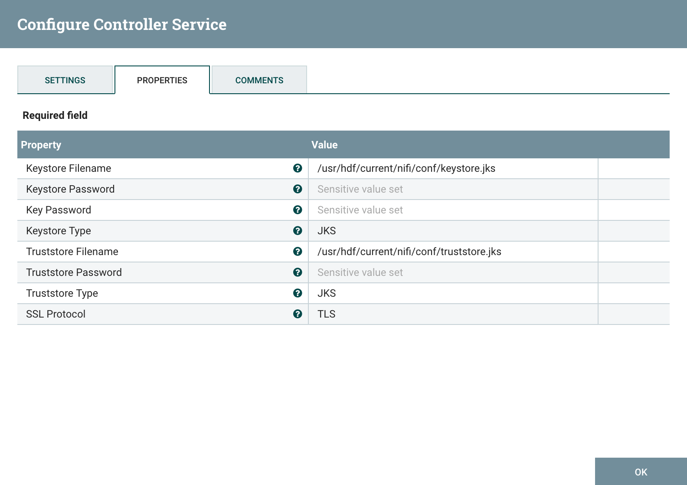

Then, I can define my reporting task by adding a new SiteToSiteBulletinReportingTask:

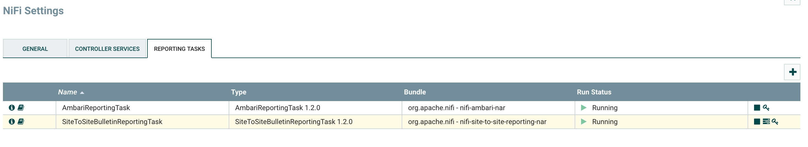

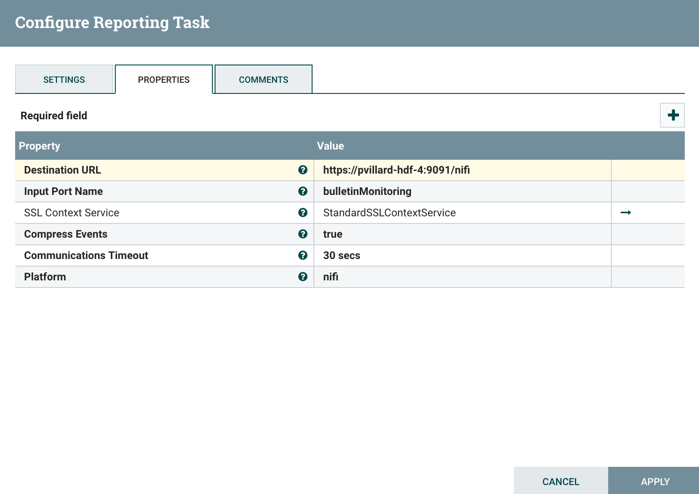

Before starting the task, on my canvas, I have the following:

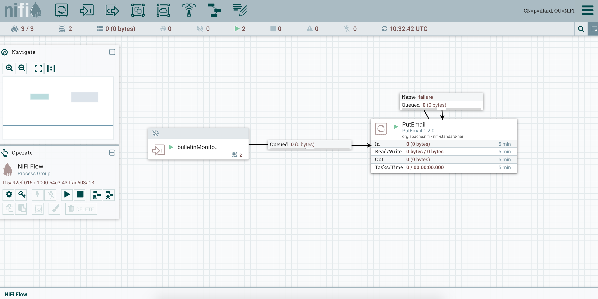

Note - in a secured environment, you need to set the correct permissions on the components. You need to allow NiFi nodes to receive data via site-to-site on the input port and you also need to grant the correct permissions on the root process group so the nodes are able to see the component, view and modify the data.

I configured my PutEmail processor to send emails using the Gmail SMTP server:

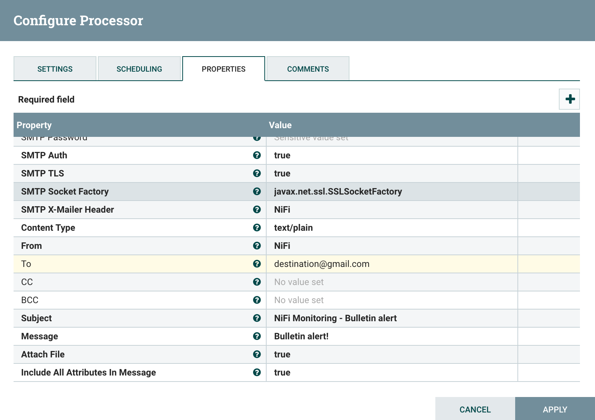

Now, as soon as bulletins are generated I'll receive a notification by email containing my message with the attributes of the flow file, and there will the bulletins as attachment of my email.

Obviously, instead of sending emails, you could, for example, use some other processors to automatically open tickets in your ticketing system (like JIRA using REST API).

- **Monitoring disk space**

Now, using the task we previously set, we can take advantage of the task monitoring disk space. This reporting task will generate warn logs (in the NiFi log file) and bulletins when the disk partition to monitor is used over a custom threshold. In case I want to monitor the Content Repository, I could configure my reporting task as below:

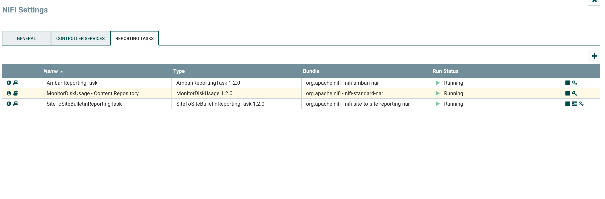

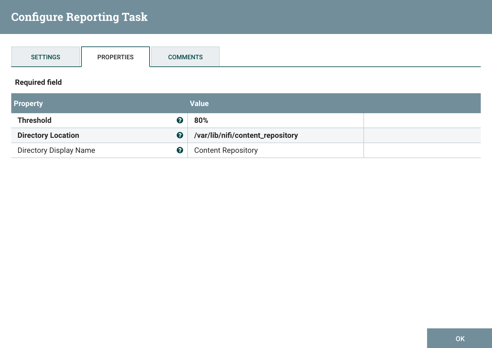

Using the combination of this Reporting Task and the SiteToSiteBulletinReportingTask, I'm able to generate flow files when the disk utilization is reaching a critical point and to receive notifications using all the processors I want.

- **Monitoring memory use**

The same approach can be used to monitor the memory utilization within the NiFi JVM using the MonitorMemory reporting task. Have a look at the documentation of this reporting task [here](https://nifi.apache.org/docs/nifi-docs/components/org.apache.nifi/nifi-standard-nar/1.2.0/org.apache.nifi.controller.MonitorMemory/index.html).

- **Monitoring back pressure on connections**

There is also the SiteToSiteStatusReportingTask that will send details about the NiFi Controller status over Site-to-Site. This can be particularly useful to be notified when some processors are stopped, queues are full (and back pressure is enabled), or to build reports regarding NiFi performances. This reporting task will slightly be improved regarding back pressure (with [NIFI-3791](https://issues.apache.org/jira/browse/NIFI-3791)). In the meantime, if you want to receive notifications when back pressure is enabled on any connection, here is what you can do (assuming you know the back pressure thresholds):

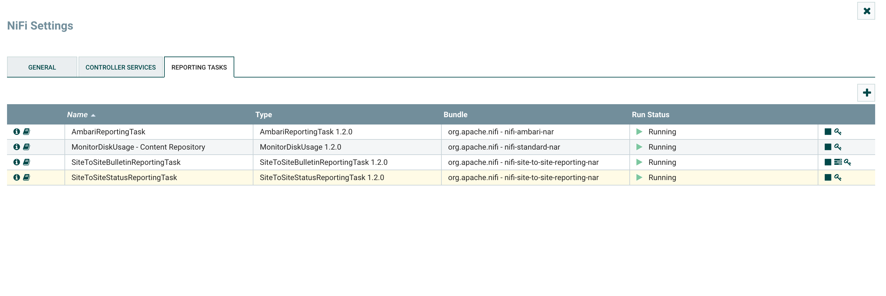

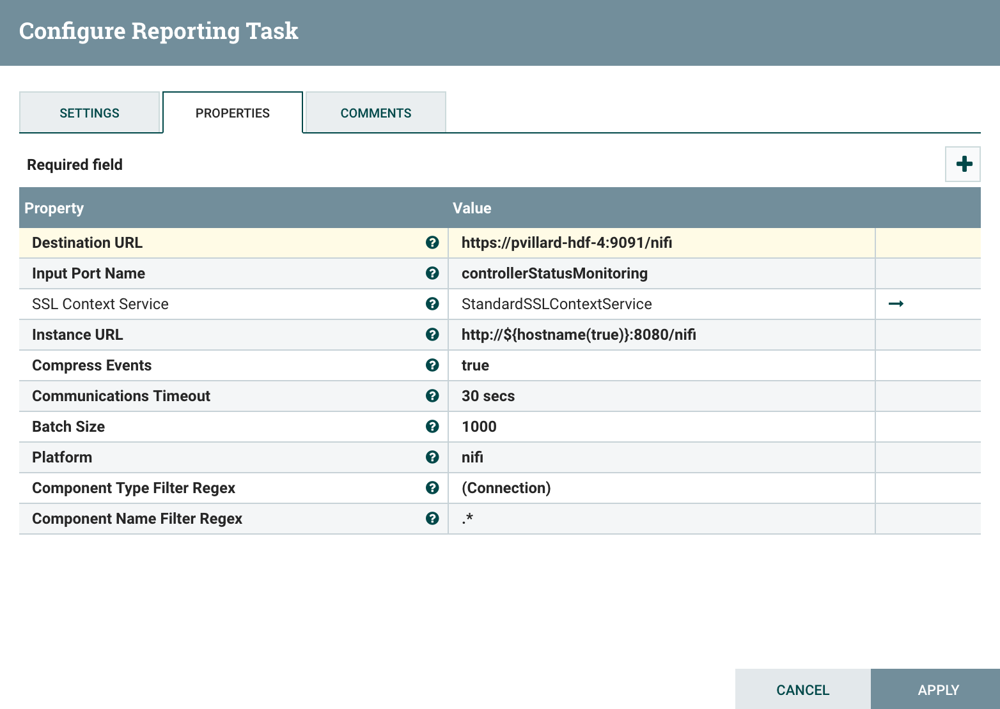

Note that I configured the task to only send data about the connections but you can receive information for any kind of component.

And I use the following workflow: my input port to receive the flow files with the controller status (containing an array of JSON elements for all of my connections), then I split my array using SplitJson processor, then I use EvaluateJsonPath to extract as attributes the values queuedCount and queuedBytes and then I use a RouteOnAttribute processor to check if one of the two attributes I have is greater or equal than my thresholds, and if that's the case I send the notification by email.

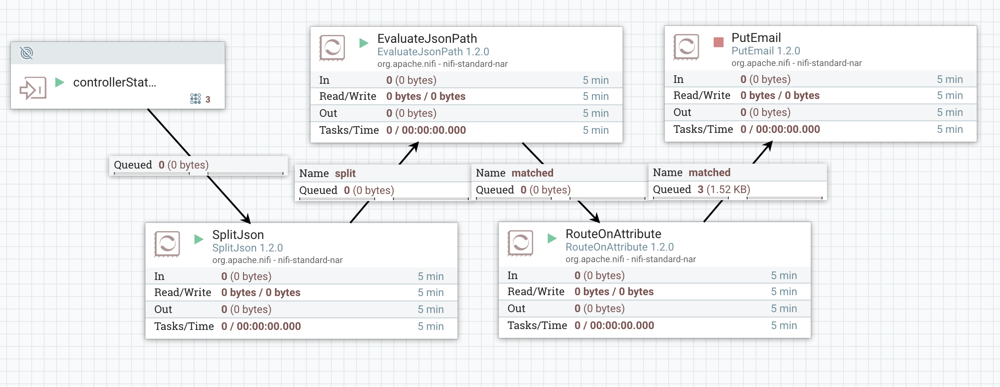

My RouteOnAttribute configuration:

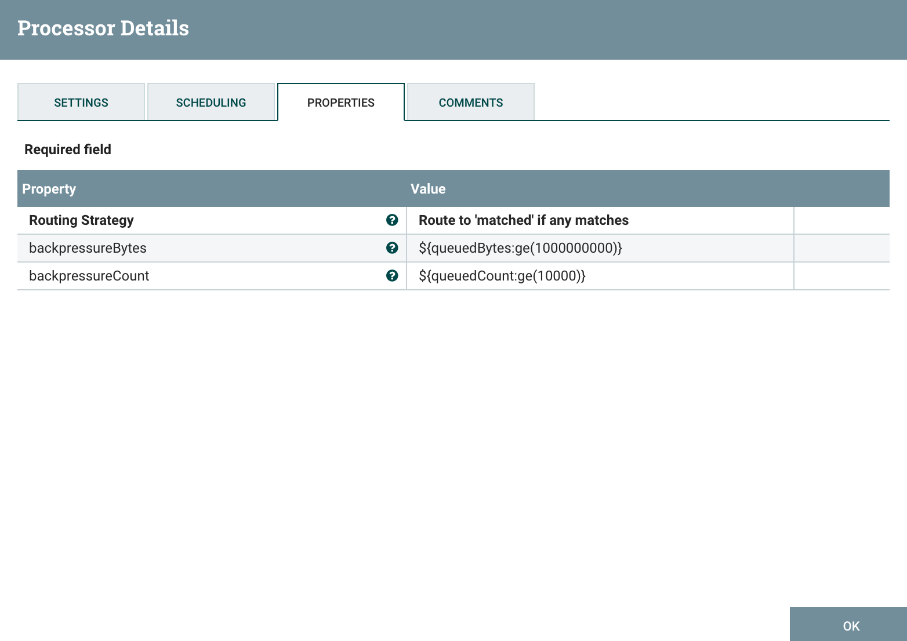

Site to site reporting tasks are really useful and there are many ways to use the data they can send for monitoring purpose.

- **SiteToSiteProvenanceReportingTask**

Note that you have also a Site2Site reporting task to send all [the provenance events](https://nifi.apache.org/docs/nifi-docs/html/user-guide.html#data_provenance) over S2S. This can be really useful if you want to send this information to external system.

> While monitoring a dataflow, users often need a way to determine what happened to a particular data object (FlowFile). NiFi’s Data Provenance page provides that information. Because NiFi records and indexes data provenance details as objects flow through the system, users may perform searches, conduct troubleshooting and evaluate things like dataflow compliance and optimization in real time. By default, NiFi updates this information every five minutes, but that is configurable.

Besides, with [NIFI-3859](https://issues.apache.org/jira/browse/NIFI-3859), this could also be used in a monitoring approach to only look for specific events according to custom parameters. It could be used, for instance, to check how long it takes for an event to go through NiFi and raise alerts in case an event took an unusual duration to be processed (have a look to the next article to see how this can be done differently).

As usual feel free to ask questions and comment this post.
