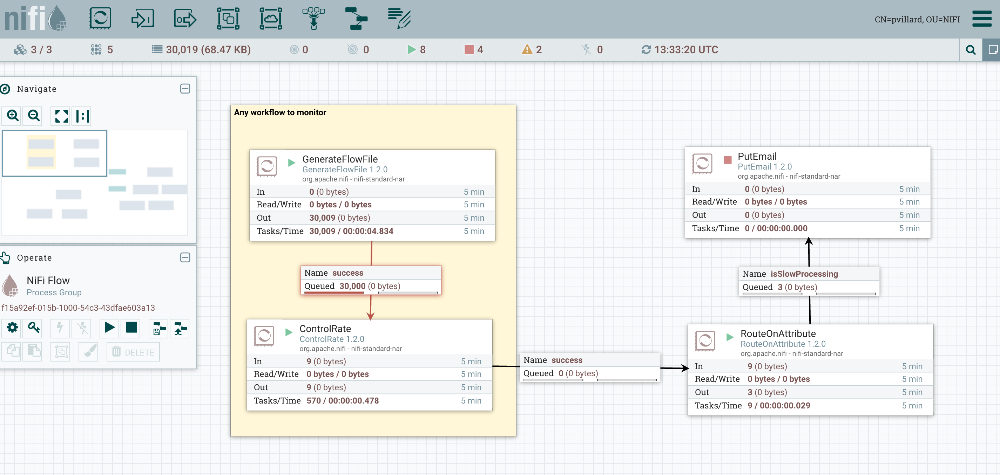
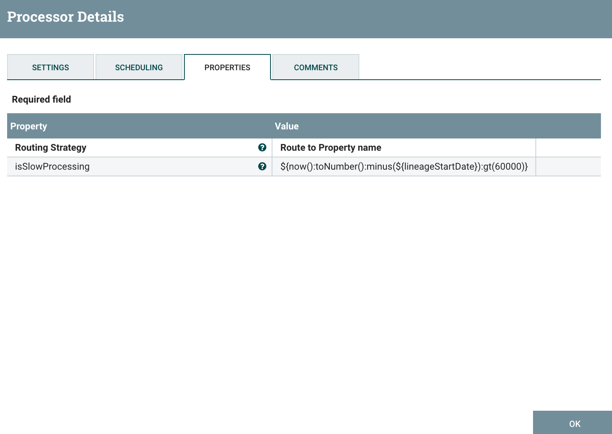

_Note – [This article is part of a series discussing subjects around NiFi monitoring](https://pierrevillard.com/2017/05/11/monitoring-nifi-introduction/)._

Depending of the workflows and use cases, you may want to retrieve some metrics per use-case/workflow instead of high level metrics. One of the things you could be looking after is Workflow SLA.

First of all, we need to agree on what is "Workflow SLA". In this article, by SLA (Service-Level Agreement) monitoring I mean that I want to ensure that a workflow is processing every single event quickly enough. In other words, if an event took a long time to be processed, I want to be aware of that so I can understand what is going on. A workflow could be perfectly running in NiFi (no bulletin generated, no error) but the processing time could get bigger because of external causes (resources exhaustion, network bandwidth with external systems, abnormal event size, etc).

Luckily for us, every single flow file within NiFi contains two core attributes that are perfectly designed for our needs. From the [documentation](https://nifi.apache.org/docs/nifi-docs/html/getting-started.html#common-attributes):

> - **entryDate**: The date and time at which the FlowFile entered the system (i.e., was created). The value of this attribute is a number that represents the number of milliseconds since midnight, Jan. 1, 1970 (UTC).
> - **lineageStartDate**: Any time that a FlowFile is cloned, merged, or split, this results in a "child" FlowFile being created. As those children are then cloned, merged, or split, a chain of ancestors is built. This value represents the date and time at which the oldest ancestor entered the system. Another way to think about this is that this attribute represents the latency of the FlowFile through the system. The value is a number that represents the number of milliseconds since midnight, Jan. 1, 1970 (UTC).

In our case we are really interested by the "lineageStartDate" attribute but based on your specific use cases and needs you could also be interested by "entryDate".

At the end of my workflow I want to monitor, I could use a RouteOnAttribute processor to route the event if and only if the duration since the lineage start date is over a given threshold (let's say one minute for the below example). And if an event took longer than expected, I'm routing the flow file to a PutEmail processor to send an email and receive a notification.

My RouteOnAttribute configuration:

This way, at a workflow level, you are able to check if the processing time of an event is meeting your requirements. You could obviously follow the same approach to check the processing time at multiple critical points of the workflow.

Note that, instead of sending an email notification, you could perfectly use any other kind of processor to integrate this alert/event with any system you are using on your side.

One last comment, I recommend you to check out the article about the Ambari Reporting Task and Grafana where I'm also discussing Workflow SLA and how to send the metrics to Ambari Metrics System and display the information into a Grafana dashboard.

As usual feel free to ask questions and comment this post.
