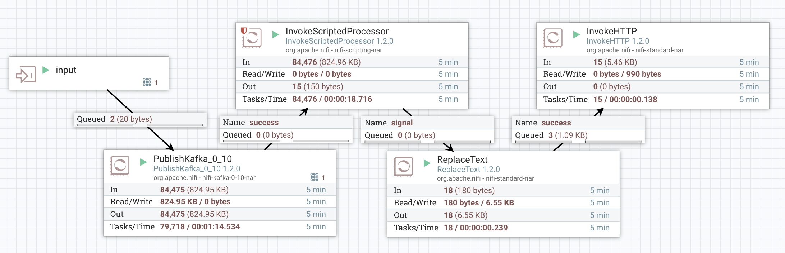

_Note - [This article is part of a series discussing subjects around NiFi monitoring](http://pierrevillard.com/2017/05/11/monitoring-nifi-introduction/)._

When using [Apache NiFi (note that version 1.2.0 is now released!)](https://nifi.apache.org/download.html) as part of [HDF](https://hortonworks.com/products/data-center/hdf/), a lot of of things are simplified using [Apache Ambari](https://ambari.apache.org/) to deploy NiFi and manage its configuration. Also, using Ambari Metrics service and Grafana, you have a way to easily and visually monitor NiFi performances. And you can also use [Apache Ranger](http://ranger.apache.org/) to centralize the authorizations management for multiple components (NiFi, Kafka, etc) in one single place.

This article will discuss how you can use Ambari Metrics and Grafana to improve your NiFi monitoring. Let's start with a quick discussion around AMS (Ambari Metrics System). By default this service is running a Metrics Collector with an embedded HBase instance (and a Zookeeper instance) to store all the metrics, and Ambari will also deploy Metrics Monitor instances on all the nodes of the cluster. The monitors will collect the metrics at system level and send the metrics to the collector. However, the collector also exposes a REST API and that's what NiFi is going to use with the AmbariReportingTask.

Source and documentation is on the Hortonworks website [here](https://fr.hortonworks.com/blog/hood-ambari-metrics-grafana/).

When using HDF, the Ambari Reporting task should be already up and running for you. If not, you can add it and configure it with a frequency of one minute (it does matter) and use the following parameters:

Note that "ambari.metrics.collector.url" is an environment variable already set for you when Ambari is starting NiFi. You could also directly give the address, in my case:

> http://pvillard-hdf-1:6188/ws/v1/timeline/metrics

Once this reporting task is up and running, you should be able to see the metrics on the NiFi service page in Ambari:

Also, you can go into Grafana to display dashboards with the metrics of your components. You have pre-configured dashboards and here is the one for NiFi:

Now, all the metrics we have here are at cluster level. We are not able to display metrics for specific workflows. With the latest release of Apache NiFi (1.2.0), there is now an optional parameter in the AmbariReportingTask to specify a process group ID. This way, by creating a second reporting task (keep the one providing cluster-level metrics) and by specifying the ID of a specific process group, you can actually create your Grafana dashboards at workflow level.

Let's say I've the following workflow:

And inside my process group, I have:

Now, my process group having the ID "75973b6e-2d38-1cf3-ffff-fffffdea8cbc", I can define the following Ambari reporting task:

Note - you must keep "nifi" as the Application ID as it has to match the configuration of the Ambari Metrics System.

Once your reporting task is running, in Grafana, you can create your own dashboard for this workflow and display the metrics you want:

For my Kafka example, here is the dashboard I defined:

In this example, I can see that my workflow is running fine but the free disk space on one of my node is decreasing very quickly. It turns out that when my disk is completely filled, back pressure will be enabled in my workflow and there is no more data sent to Kafka. Instead data is queued in NiFi.

This simple example gives me a lot of information:

- Everything is default configuration in Ambari and I chose my three NiFi nodes to also host Kafka brokers. By default, for Kafka, the replication factor is set to 1, the number of partitions is set to 1 and the automatic creation of topic is allowed (that's why I didn't need to create the topic before starting my workflow). Because of the default parameters, all of the data is sent to only one Kafka broker (pvillard-hdf-2) and that's why the disk space is quickly decreasing on this node since my three NiFi nodes are sending data to this broker.
- Also, we clearly see that's not a good idea to collocate NiFi and Kafka on the same nodes since they are both IO intensive. In this case, they are using the same disk... and we can see that the task duration (for NiFi) is clearly higher on the Kafka node that is receiving the data (pvillard-hdf-2). Long story short: keep NiFi and Kafka on separated nodes (or at the very least with different disks).

With HDF and the Ambari Metrics System, it gives you the ability to create custom relevant dashboards for specific use cases. It also allows you to mix information from Kafka, from NiFi and from the hosts to have all the needed information in one single place.

Also, by using the REST API of the Metrics Collector (you may be interested by [this article](http://bryanbende.com/development/2015/07/31/ambari-metrics-part1-metrics-collector)), you could also send your own data (not only the data gathered at the process group level) to add more information into your dashboards. An example that comes in mind would be to send the lineage duration (see [Monitoring of Workflow SLA](http://pierrevillard.com/2017/05/15/monitoring-nifi-workflow-sla/)) at the end of the workflow using an InvokeHTTP processor and sending a JSON payload using a POST request to the API endpoint.

Let's say I want to monitor how long it takes between my GenerateFlowFile and the end of my workflow to check if some particular events are taking longer. Then I could have something like:

What am I doing here? I want to send to AMS the information about the lineage duration of the flow files I sent into my Kafka topic. However I don't want to send the duration of every single event (that's not really useful and it's going to generate a lot of requests/data). Instead I want to make an API call only once per minute. The idea is to compute the mean and max of the lineage duration with a rolling window of one minute and to only send this value to AMS.

I could use the new AttributeRollingWindow processor but it is not as fast as the PublishKafka and I don't want to generate back pressure in my relationships. So I use the InvokeScriptedProcessor to build my own rolling processor (it's faster because I am not using any state information):

- this processor takes a frequency duration as a parameter (that I'll set to 1 minute in this example)
- for every flow file coming in, it will extract the lineage start date to compute max and mean lineage duration over the rolling window. If the last flow file sent in the success relationship was less than one minute ago, I'll route the flow file to drop relationship (that I set to auto-terminated). If it was more than one minute ago, I update the attributes of the current flow file with the mean and max of all the flow files since the last "success" flow file and route this flow file in the success relationship

Since I've flow files coming in my processor at a high rate, I know that my processor will release one flow file every minute with the mean and max of the linage duration for the flow files of the last minute.

Then I use a ReplaceText processor to construct the JSON payload that I'll send to the Metrics Collector using the InvokeHttp processor.

Here is the configuration of the InvokeScriptedProcessor:

The Groovy script used can be found [here](https://github.com/pvillard31/toolbox/blob/master/hdf/nifi/InvokeScriptedProcessor/ControlRateAndDropLineageMeanMax.groovy).

Then I create the JSON payload with the ReplaceText processor:

Note that I use the ID of the processor as the "instanceid" attribute in the JSON.

Then, I use the InvokeHttp processor (with a scheduling/frequency of 1 minute):

Now, I can use this information to build the corresponding graph in my Grafana dashboard:

I can see that, in average, it takes about 150 milliseconds to generate my flow file, publish it in my Kafka topic and get it into my scripted processor. I could also generate one metric per host of my cluster to check if a node is performing badly compared to the others.

Now you can easily send your custom data into AMS and create dashboards for your specific use cases and workflows.

As usual feel free to ask questions and comment this post.
