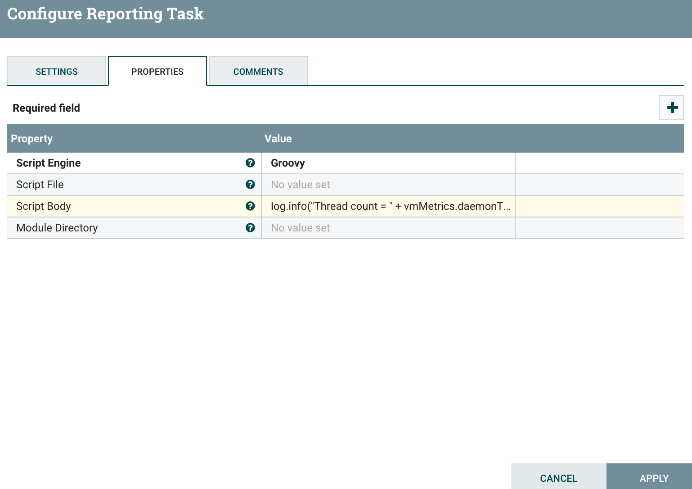
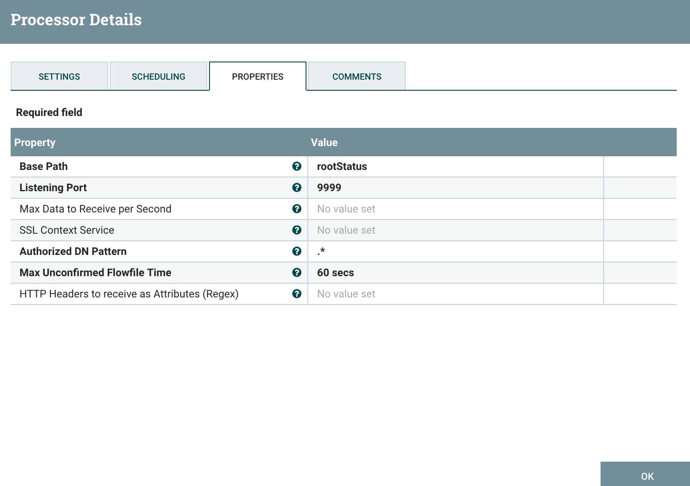
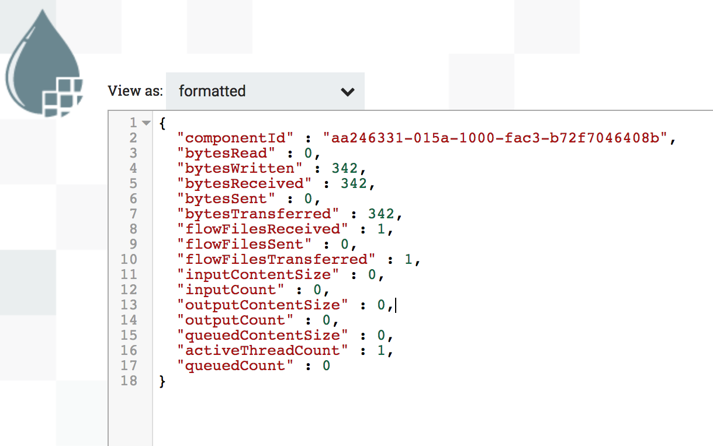

_Note – [This article is part of a series discussing subjects around NiFi monitoring](https://pierrevillard.com/2017/05/11/monitoring-nifi-introduction/)._

[In the new release of Apache NiFi (1.2.0)](https://nifi.apache.org/), you can now develop [Scripted Reporting Task](https://nifi.apache.org/docs/nifi-docs/components/org.apache.nifi/nifi-scripting-nar/1.2.0/org.apache.nifi.reporting.script.ScriptedReportingTask/index.html) thanks to [NIFI-1458](https://issues.apache.org/jira/browse/NIFI-1458). It is the same approach as with the [ExecuteScript](https://nifi.apache.org/docs/nifi-docs/components/org.apache.nifi/nifi-scripting-nar/1.2.0/org.apache.nifi.processors.script.ExecuteScript/index.html) processor for which you have tons of great examples [here](http://funnifi.blogspot.com/).

You might also want to read the following posts:

- [ExecuteScript cookbook part 1](https://community.hortonworks.com/articles/75032/executescript-cookbook-part-1.html)
- [ExecuteScript cookbook part 2](https://community.hortonworks.com/articles/75545/executescript-cookbook-part-2.html)
- [ExecuteScript cookbook part 3](https://community.hortonworks.com/articles/77739/executescript-cookbook-part-3.html)

With the ScriptedReportingTask you can define your own implementation of the _onTrigger()_ method and get access to:

- _ReportingContext_ **context** (which gives you access to various information such as events, provenance, bulletins, controller services, process groups, etc)
- _VirtualMachineMetrics_ **vmMetrics** (to access the metrics of the JVM)
- _ComponentLog_ **log** (if you want to log messages)

Let's start with a very easy example: I want to log the number of threads inside my JVM every minute. Here is my code:

```
log.info("Thread count = " + vmMetrics.daemonThreadCount())
```



And I can check in my nifi-app.log file that I do have:

> 2017-05-12 17:43:27,639 INFO \[Timer-Driven Process Thread-5\] o.a.n.r.script.ScriptedReportingTask ScriptedReportingTask\[id=fd1668eb-015b-1000-1974-5ef96e1f9a8b\] Thread count = 29

OK... now I won't go into the details of all the information you can access using the "context" variable but let's try another example...

_I want to send a POST request over HTTP containing a JSON representation of the summary of my root process group._

I'm not really used to Groovy so please excuse my coding style ;-). But here is a working code ([available here as well](https://github.com/pvillard31/toolbox/blob/master/hdf/nifi/ScriptedReportingTask/SendHttpRootStatus.groovy)):

```
def json = Class.forName("javax.json.Json")
def httpClients = Class.forName("org.apache.http.impl.client.HttpClients")
def contentType = Class.forName("org.apache.http.entity.ContentType")

def status = context.getEventAccess().getControllerStatus();
def factory = json.createBuilderFactory(Collections.emptyMap());
def builder = factory.createObjectBuilder();

builder.add("componentId", status.getId());
builder.add("bytesRead", status.getBytesRead());
builder.add("bytesWritten", status.getBytesWritten());
builder.add("bytesReceived", status.getBytesReceived());
builder.add("bytesSent", status.getBytesSent());
builder.add("bytesTransferred", status.getBytesTransferred());
builder.add("flowFilesReceived", status.getFlowFilesReceived());
builder.add("flowFilesSent", status.getFlowFilesSent());
builder.add("flowFilesTransferred", status.getFlowFilesTransferred());
builder.add("inputContentSize", status.getInputContentSize());
builder.add("inputCount", status.getInputCount());
builder.add("outputContentSize", status.getOutputContentSize());
builder.add("outputCount", status.getOutputCount());
builder.add("queuedContentSize", status.getQueuedContentSize());
builder.add("activeThreadCount", status.getActiveThreadCount());
builder.add("queuedCount", status.getQueuedCount());

def requestEntity = new org.apache.http.entity.StringEntity(builder.build().toString(), contentType.APPLICATION_JSON);
def httpclient = httpClients.createDefault();
def postMethod = new org.apache.http.client.methods.HttpPost("http://localhost:9999/rootStatus");
postMethod.setEntity(requestEntity);
httpclient.execute(postMethod);
httpclient.close();
```

_Note_ - this should be improved to, for instance, properly handle potential exceptions.

To get this code working, I also have to specify the required dependencies (JSON, Apache HTTP, etc). For that, in the module directory property of the reporting task, I gave the following paths (because I'm lazy, I am pointing to much dependencies than required):

- /var/lib/nifi/work/nar/extensions/nifi-standard-nar-1.2.0.nar-unpacked/META-INF/bundled-dependencies/
- /var/lib/nifi/work/nar/extensions/nifi-site-to-site-reporting-nar-1.2.0.nar-unpacked/META-INF/bundled-dependencies/

In my example I'm sending my JSON payload with a POST HTTP request to localhost on port 9999 with the path rootStatus. To receive the request, I started a ListenHttp processor with the following configuration:



Once my reporting task is started, I start receiving the information as flow files:



This scripted reporting task allows you to quickly develop proof of concept to send information to your internal systems using the interfaces you want. However, according to your needs, it might be more interesting to develop your own reporting task in Java and to build the corresponding NAR. It will give you more flexibility/options (you'll be able to implement more interfaces) and better performances.

As usual feel free to ask questions and comment this post.
