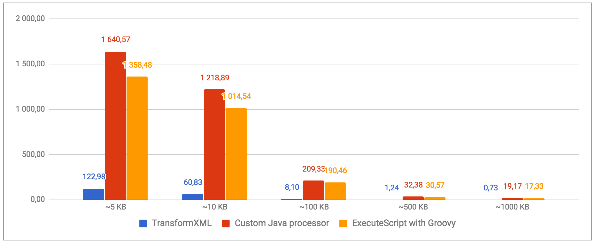
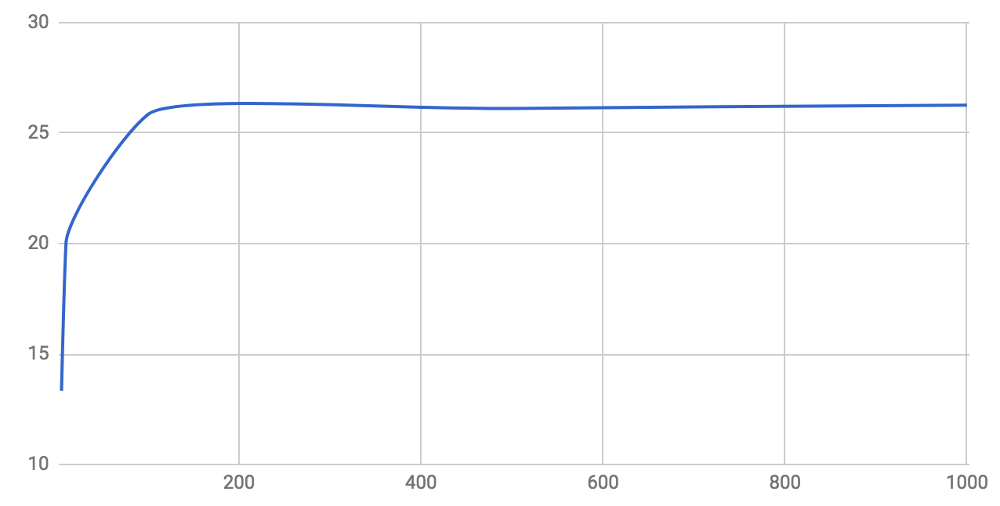

**Note - [look at the new features in NiFi 1.7+ about XML processing in this post](http://pierrevillard.com/2018/06/28/nifi-1-7-xml-reader-writer-and-forkrecord-processor/)**

I recently had to work on a NiFi workflow to process millions of XML documents per day. One of the step being the conversion of the XML data into JSON. It raises the question of the performances and I will briefly expose my observations in this post.

The two most natural approaches to convert XML data with [Apache NiFi](https://nifi.apache.org/) are:

- Use the TransformXML processor with a XSLT file
- Use a scripted processor or use a custom Java processor relying on a library

There are few XSLT available on the internet providing a generic way to transform any XML into a JSON document. That's really convenient and easy to use. However, depending of your use case, you might need specific features.

In my case, I'm processing a lot of XML files based on the same input schema (XSD) and I want the output to be compliant to the same Avro schema (in order to use the record-oriented processors in NiFi). The main issue is to force the generation of an array when you only have one single element in your input.

## XSLT approach

**Example #1:**

```
<MyDocument>
  <MyList>
    <MyElement>
      <Text>Some text...</Text>
      <RecordID>1</RecordID>
    </MyElement>
    <MyElement>
      <Text>Some text...</Text>
      <RecordID>1</RecordID>
    </MyElement>
  </MyList>
</MyDocument>

```

This XML document will be converted into the following JSON:

```
{
   "MyDocument" : {
     "MyList" : {
       "MyElement" : [ {
           "Text" : "Some text...",
           "RecordID" : 1
         }, {
           "Text" : "Some text...",
           "RecordID" : 2
         } ]
      }
   }
}
```

**Example #2:**

However, if you have the following XML document:

```
<MyDocument>
  <MyList>
    <MyElement>
      <Text>Some text...</Text>
      <RecordID>1</RecordID>
    </MyElement>
  </MyList>
</MyDocument>

```

The document will be converted into:

```
{
  "MyDocument" : {
    "MyList" : {
      "MyElement" : {
        "Text" : "Some text...",
        "RecordID" : 1
      }
    }
  }
}
```

**Force array**

And here start the problems... because we don't have the same Avro schema. That is why I recommend using the XSLT file provided [by Bram Stein here on Github](https://github.com/bramstein/xsltjson). It provides a way to force the creation of an array. To do that, you need to insert a tag into your XML input file. The tag to insert is

```
json:force-array="true"
```

But for this tag to be correctly interpreted, you also need to specify the corresponding namespace:

```
xmlns:json="http://json.org/"
```

In the end, using ReplaceText processors with regular expressions, you need to have the following input (for the example #2):

```
<MyDocument xmlns:json="http://json.org/">
  <MyList>
    <MyElement json:force-array="true">
      <Text>Some text...</Text>
      <RecordID>1</RecordID>
    </MyElement>
  </MyList>
</MyDocument>

```

And this will give you:

```
{
  "MyDocument" : {
    "MyList" : {
      "MyElement" : [ {
        "Text" : "Some text...",
        "RecordID" : 1
      } ]
    }
  }
}
```

And now I do have the same schema describing my JSON documents. Conclusion: you need to use regular expressions to add a namespace in the first tag of your document and add the JSON array tag in every tag wrapping elements that should be part of an array.

## Java approach

Now, let's assume you're not afraid about using scripted processors or developing your own custom processor. Then it's really easy to have a processor doing the same using a Java library like [org.json](https://mvnrepository.com/artifact/org.json/json) (note that library is \***NOT**\* Apache friendly in terms of licensing and that's why the following code cannot be released with Apache NiFi). [Here is an example of custom processor doing the conversion](https://gist.github.com/pvillard31/408c6ba3a9b53880c751a35cffa9ccea). And here is a [Groovy version for the ExecuteScript processor](https://gist.github.com/pvillard31/7d88482f3f8d71c94e372a6d6f2e2362).

What about arrays with this solution? Guess what... It's kind of similar: you have to use a ReplaceText processor before and after to ensure that arrays are arrays in the JSON output for any number of elements in your input. Also, you might have to do some other transformations like removing the namespaces or replacing empty strings

```
""
```

by

```
null
```

values (by default, everything will be converted to an empty string although you might want null record instead).

To force arrays, the easiest approach is to double every tag that should be converted into an array. With the example #2, I transform my input to have:

```
<MyDocument>
  <MyList>
    <MyElement /><MyElement>
      <Text>Some text...</Text>
      <RecordID>1</RecordID>
    </MyElement>
  </MyList>
</MyDocument>
```

It'll give me the following JSON:

```
{
  "MyDocument" : {
    "MyList" : {
      "MyElement" : [ "", {
        "Text" : "Some text...",
        "RecordID" : 1
      } ]
    }
  }
}
```

And, then, I can use another ReplaceText processor to remove the unwanted empty strings created by the conversion.

Conclusion: with the two approaches you'll need to be a bit intrusive in your data to get the expected results. What about the performances now?

## Benchmark

I remove the ReplaceText processors from the equation as I usually need the same amount of regular expressions work in both cases. I want to only focus on:

- the TransformXML processor using the [XSLT file provided above](https://github.com/bramstein/xsltjson)
- the [custom Java processor I provided above](https://gist.github.com/pvillard31/408c6ba3a9b53880c751a35cffa9ccea)
- the [Groovy version](https://gist.github.com/pvillard31/7d88482f3f8d71c94e372a6d6f2e2362) that can be used with the ExecuteScript processor

I'll compare the performances of each case using input of different sizes (data generated using a GenerateFlowFile processor) with **default configuration** (one thread, no change on run duration, etc) on my laptop.

Method: I'm generating as much data as possible (it's always the same file during a single run) using the GenerateFlowFile processor. I wait at least 5 minutes to have a constant rate of processing and I get the mean on a 5 minutes window of constant processing.


For each run, I'm only running the GenerateFlowFile, one of the three processors I'm benchmarking, and the UpdateAttribute (used to only drop the data).

The input data used for the benchmark is a fairly complex XML document with arrays of arrays, lot of elements in the arrays, deeply nested records, etc. To reduce the size of the input size, I'm not changing the structure but only removing elements in the arrays. In other words: the schema describing the output data remains the same for each run.

Note that the custom Java/Groovy option is loading the full XML document in memory. To process very large XML document, a streaming approach with another library would certainly be better suited.

Here are the results with input data of 5KB, 10KB, 100KB, 500KB and 1000KB. The below graph gives the number of XML files processed **per second** based on the input size for each solution.



It's clear that the custom Java processor is the most efficient one. The XSLT option is really nice when you want to do very specific transformations but it can quickly get slow. Using a generic XSLT file for XML to JSON transformation is easy and convenient but won't be the most efficient option.

We can also notice that the Groovy option is a little bit less efficient than the Java one, but that's expected. Nevertheless, the Groovy option provides pretty good performances and does not require building and compiling a custom processor: everything can be done directly from the NiFi UI.

To improve the performances, it's then possible to play with the "run duration" parameter and increase the number of concurrent tasks. Actually it's quite easy to reach the I/O limitations of the disks. Using a NiFi cluster and multiple disks for the content repository, it's really easy to process hundreds of millions of XML documents per day.

If we display the performance ratio based on the file size between the XSLT solution and the Java based solution, we have:



We can see that with very small files, the processing using Java-based processor is about 13x more efficient than the XSLT approach. But with files over 100KB, the Java solution is about 26x more efficient. That's because the NiFi framework is doing few things before and after a flow file has been processed. When processing thousands of flow files per second it creates a small overhead that explains the difference.

## XML Record Reader

Since few versions, Apache NiFi contains [record-oriented processors](https://nifi.apache.org/docs/nifi-docs/html/record-path-guide.html). It provides very powerful means to process record-oriented data. In particular, it allows users to process batches of data instead of a "per-file" processing. This provides a very robust and high rate processing. While I'm writing this post there is no reader for XML data yet. However there is a JIRA for it and it would provide few interesting features:

- By using a schema describing the XML data, it'd remove the need to use ReplaceText processors to handle the "array problem".
- It'd give the possibility to merge XML documents together to process much more data at once providing even better performances.

This effort can be tracked under [NIFI-4366](https://issues.apache.org/jira/browse/NIFI-4366).

As usual, feel free to post any comment/question/feedback.

https://gist.github.com/pvillard31/408c6ba3a9b53880c751a35cffa9ccea.js
