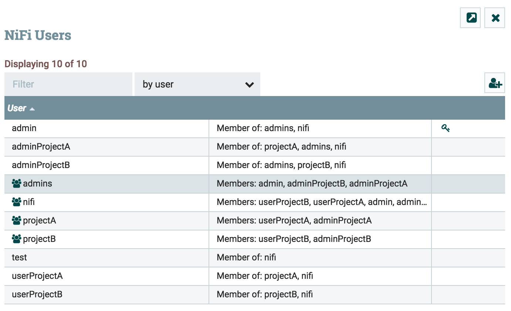

With the release of Apache NiFi 1.4.0, quite a lot of new features are available. One of it is the improved management of the users and groups. Until this release, it was possible to configure a LDAP (or Active Directory) server but it was only used during the authentication process. Once authenticated it was necessary to have explicit policies for this user to access NiFi resources. And to create a policy for a given user, it was first necessary to manually create this user in NiFi users/groups management view. This time is now over. Users/groups management is now greatly simplified in terms of lifecycle management.

In addition to that, if you are using Apache Ranger as the external authorizer system for NiFi, you can now define rules based on LDAP groups. Before, you had to configure, in Ranger, rules explicitly based on users.

In this article, we are going to discuss how this is actually working and how you can configure it.

If you’re interested by the technical details of the implementation, you can look at the corresponding JIRAs ([NIFI-4032](https://issues.apache.org/jira/browse/NIFI-4032), [NIFI-4059](https://issues.apache.org/jira/browse/NIFI-4059), [NIFI-4127](https://issues.apache.org/jira/browse/NIFI-4127)) and Github pull requests ([#1923](https://github.com/apache/nifi/pull/1923), [#1978](https://github.com/apache/nifi/pull/1978), [#2019](https://github.com/apache/nifi/pull/2019)).

Basically, the authorizer mechanism evolved quite a bit. Before NiFi 1.4, the authorizers.xml was containing a list of configurations for any authorizer implementation you wanted to use to manage policies in NiFi. Unless you developed your own implementations, you had the choice between the FileAuthorizer (default implementation that stores the policies in a local file) and the RangerNiFiAuthorizer to user Apache Ranger as the external mechanism managing the policies.

If using the FileAuthorizer, the configuration was looking like (in a single node installation):

```
    <authorizer>
        <identifier>file-provider</identifier>
        <class>org.apache.nifi.authorization.FileAuthorizer</class>
        <property name="Authorizations File">./conf/authorizations.xml</property>
        <property name="Users File">./conf/users.xml</property>
        <property name="Initial Admin Identity”>admin</property>
        <property name="Legacy Authorized Users File"></property>
    </authorizer>
```

And we set the corresponding property in the nifi.properties file:

```
nifi.security.user.authorizer=file-provider
```

Starting with NiFi 1.4, the authorizers.xml file provides much more functionalities (note that the changes are backward compatible and do not require any change from your side if you don’t want to change it).

Let’s start by the new implementation of the authorizer: the Standard Managed Authorizer.

_Note - there is also a new Managed Ranger Authorizer, but I won't go into the details of this implementation in this blog. This implementation gives you the possibility to use Apache Ranger as the external system managing the authorizations but you still have access to the policies in the NiFi UI, and you can also manage additional users. It's also this implementation that allows you to define group-based policies in Ranger._

It’s configured as below:

```
    <authorizer>
        <identifier>managed-authorizer</identifier>
        <class>org.apache.nifi.authorization.StandardManagedAuthorizer</class>
        <property name="Access Policy Provider">file-access-policy-provider</property>
    </authorizer>
```

This new implementation expects the identifier of the Access Policy Provider implementation you want to use. This new abstraction will be used to access and manage users, groups and policies… and to enforce policies when dealing with requesting access to NiFi resources. In the above example, our authorizer is identified with name “managed-authorizer”, and that’s what you need to set in nifi.properties to user it:

```
nifi.security.user.authorizer=managed-authorizer
```

You can see that this authorizer expects a property Access Policy Provider with the identifier of the provider you want to use… Let’s move on to the Access Policy Provider. For now, there is a single implementation which is the FileAccessPolicyProvider. If you already know about the previous FileAuthorizer, you shouldn’t be very surprised by the expected properties. Here is a configuration example:

```
    <accessPolicyProvider>
        <identifier>file-access-policy-provider</identifier>
        <class>org.apache.nifi.authorization.FileAccessPolicyProvider</class>
        <property name="User Group Provider">file-user-group-provider</property>
        <property name="Authorizations File">./conf/authorizations.xml</property>
        <property name="Initial Admin Identity"></property>
        <property name="Legacy Authorized Users File"></property>

        <property name="Node Identity 1"></property>
    </accessPolicyProvider>
```

Note: as you can see the identifier of this Access Policy Provider is “file-access-policy-provider”, and that’s what we referenced in the property of the authorizer (see above).

As with the FileAuthorizer, you have the Initial Admin Identity property which lets you configure the identity of the user with the admin permissions to set the first policies after a fresh install of NiFi. As the documentation says:

> Initial Admin Identity - The identity of an initial admin user that will be granted access to the UI and given the ability to create additional users, groups, and policies. The value of this property could be a DN when using certificates or LDAP, or a Kerberos principal. This property will only be used when there are no other policies defined. If this property is specified then a Legacy Authorized Users File cannot be specified.
> 
> NOTE: Any identity mapping rules specified in nifi.properties will also be applied to the initial admin identity, so the value should be the unmapped identity. This identity must be found in the configured User Group Provider.

Then you still have the Legacy Authorized Users File property in case you are upgrading from a NiFi 0.x install and you want to keep your previous policies in place.

You have the Authorizations File property that defines the path to the file that will locally store all the policies. You also find the Node Identity properties in case you are in a NiFi cluster. Nothing changed on this side, but just in case, a quick reminder from the official documentation:

> Node Identity \[unique key\] - The identity of a NiFi cluster node. When clustered, a property for each node should be defined, so that every node knows about every other node. If not clustered these properties can be ignored. The name of each property must be unique, for example for a three nodes cluster: "Node Identity A", "Node Identity B", "Node Identity C" or "Node Identity 1", "Node Identity 2", "Node Identity 3".
> 
> NOTE: Any identity mapping rules specified in nifi.properties will also be applied to the node identities, so the values should be the unmapped identities (i.e. full DN from a certificate). This identity must be found in the configured User Group Provider.

OK… now we have a new property called “User Group Provider” and that’s where we’re going to specify the identifier of the User Group Provider to be used. This User Group Provider is a new abstraction allowing you to define how users and groups should be automatically retrieved to then define policies on them.

You have multiple implementations available:

- CompositeUserGroupProvider
- CompositeConfigurableUserGroupProvider
- LdapUserGroupProvider
- FileUserGroupProvider

As the name suggests, the CompositeUserGroupProvider implementation allows you to use at the same time multiple implementations of the User Group Provider. This is very useful, mainly because when using NiFi in clustering mode, you need to define some policies for the nodes belonging to the cluster. And, as you may know, in NiFi, nodes are considered as users. In case your nodes are not defined in your LDAP or Active Directory, you will certainly want to use the composite implementation.

Now you need to consider the CompositeConfigurableUserGroupProvider implementation which is the one you will certainly want to use in most cases. This implementation will also provide support for retrieving users and groups from multiple sources. But the huge difference is that this implementation expects a single **configurable** user group provider. It means that users and groups from the configurable user group provider are configurable from the UI (as you did when creating users/groups from NiFi UI in previous versions). However, users/groups loaded from one of the other User Group Providers will not be.

Note that it's up to each User Group provider implementation to define if it is configurable or not. For instance, the LDAP User Group Provider is **not** configurable: NiFi is not going to manage users and groups in the LDAP/AD server.

A typical configuration will be the definition of the Composite Configurable User Group provider with the File User Group provider as the configurable instance and one instance of the LDAP User Group provider:

```
    <userGroupProvider>
       <identifier>composite-configurable-user-group-provider</identifier>
       <class>org.apache.nifi.authorization.CompositeConfigurableUserGroupProvider</class>
       <property name="Configurable User Group Provider">file-user-group-provider</property>
       <property name="User Group Provider 1">ldap-user-group-provider</property>
    </userGroupProvider>
```

In this case, in the definition of the access policy provider, we need to change the property to use the correct user group provider:

```
    <accessPolicyProvider>
        <identifier>file-access-policy-provider</identifier>
        <class>org.apache.nifi.authorization.FileAccessPolicyProvider</class>
        <property name="User Group Provider">composite-configurable-user-group-provider</property>
        <property name="Authorizations File">./conf/authorizations.xml</property>
        <property name="Initial Admin Identity"></property>
        <property name="Legacy Authorized Users File"></property>

        <property name="Node Identity 1"></property>
    </accessPolicyProvider>
```

Now, let's look at the File User Group provider. The objective of this provider is to provide the same functionalities as before: the user can manage users and groups from the UI and everything is stored locally in a file. Configuration looks like:

```
    <userGroupProvider>
       <identifier>file-user-group-provider</identifier>
       <class>org.apache.nifi.authorization.FileUserGroupProvider</class>
       <property name="Users File">./conf/users.xml</property>
       <property name="Legacy Authorized Users File"></property>

       <property name="Initial User Identity 1"></property>
    </userGroupProvider>
```

The initial user identities are users that should automatically populated when creating the users.xml file for the first time. Typically you would define here your initial admin identity (if this user is not defined via the LDAP user group provider). From the documentation:

> Initial User Identity \[unique key\] - The identity of a users and systems to seed the Users File. The name of each property must be unique, for example: "Initial User Identity A", "Initial User Identity B", "Initial User Identity C" or "Initial User Identity 1", "Initial User Identity 2", "Initial User Identity 3".
> 
> NOTE: Any identity mapping rules specified in nifi.properties will also be applied to the user identities, so the values should be the unmapped identities (i.e. full DN from a certificate).

OK... now let's move to the last user group provider: the one allowing an automatic synchronisation of your users and groups with a LDAP/AD server. Here is the configuration part:

```
    <userGroupProvider>
       <identifier>ldap-user-group-provider</identifier>
       <class>org.apache.nifi.ldap.tenants.LdapUserGroupProvider</class>
       <property name="Authentication Strategy">START_TLS</property>

       <property name="Manager DN"></property>
       <property name="Manager Password"></property>

       <property name="TLS - Keystore"></property>
       <property name="TLS - Keystore Password"></property>
       <property name="TLS - Keystore Type"></property>
       <property name="TLS - Truststore"></property>
       <property name="TLS - Truststore Password"></property>
       <property name="TLS - Truststore Type"></property>
       <property name="TLS - Client Auth"></property>
       <property name="TLS - Protocol"></property>
       <property name="TLS - Shutdown Gracefully"></property>

       <property name="Referral Strategy">FOLLOW</property>
       <property name="Connect Timeout">10 secs</property>
       <property name="Read Timeout">10 secs</property>

       <property name="Url"></property>
       <property name="Page Size"></property>
       <property name="Sync Interval">30 mins</property>

       <property name="User Search Base"></property>
       <property name="User Object Class">person</property>
       <property name="User Search Scope">ONE_LEVEL</property>
       <property name="User Search Filter"></property>
       <property name="User Identity Attribute"></property>
       <property name="User Group Name Attribute"></property>
       <property name="User Group Name Attribute - Referenced Group Attribute"></property>

       <property name="Group Search Base"></property>
       <property name="Group Object Class">group</property>
       <property name="Group Search Scope">ONE_LEVEL</property>
       <property name="Group Search Filter"></property>
       <property name="Group Name Attribute"></property>
       <property name="Group Member Attribute"></property>
       <property name="Group Member Attribute - Referenced User Attribute"></property>
    </userGroupProvider>
```

You can find the usual parameters that you configured for the [LDAP authentication](http://pierrevillard.com/2017/01/24/integration-of-nifi-with-ldap/) part, but there is also a lot of new parameters to only synchronized specific parts of your remote LDAP/AD servers. The documentation says:

> 'Url' - Space-separated list of URLs of the LDAP servers (i.e. ldap://<hostname>:<port>).
> 
> 'Page Size' - Sets the page size when retrieving users and groups. If not specified, no paging is performed.
> 
> 'Sync Interval' - Duration of time between syncing users and groups (i.e. 30 mins). Minimum allowable value is 10 secs.
> 
> 'User Search Base' - Base DN for searching for users (i.e. ou=users,o=nifi). Required to search users.
> 
> 'User Object Class' - Object class for identifying users (i.e. person). Required if searching users.
> 
> 'User Search Scope' - Search scope for searching users (ONE\_LEVEL, OBJECT, or SUBTREE). Required if searching users.
> 
> 'User Search Filter' - Filter for searching for users against the 'User Search Base' (i.e. (memberof=cn=team1,ou=groups,o=nifi) ). Optional.
> 
> 'User Identity Attribute' - Attribute to use to extract user identity (i.e. cn). Optional. If not set, the entire DN is used.
> 
> 'User Group Name Attribute' - Attribute to use to define group membership (i.e. memberof). Optional. If not set group membership will not be calculated through the users. Will rely on group membership being defined through 'Group Member Attribute' if set. The value of this property is the name of the attribute in the user ldap entry that associates them with a group. The value of that user attribute could be a dn or group name for instance. What value is expected is configured in the 'User Group Name Attribute - Referenced Group Attribute'.
> 
> 'User Group Name Attribute - Referenced Group Attribute' - If blank, the value of the attribute defined in 'User Group Name Attribute' is expected to be the full dn of the group. If not blank, this property will define the attribute of the group ldap entry that the value of the attribute defined in 'User Group Name Attribute' is referencing (i.e. name). Use of this property requires that 'Group Search Base' is also configured.
> 
> 'Group Search Base' - Base DN for searching for groups (i.e. ou=groups,o=nifi). Required to search groups.
> 
> 'Group Object Class' - Object class for identifying groups (i.e. groupOfNames). Required if searching groups.
> 
> 'Group Search Scope' - Search scope for searching groups (ONE\_LEVEL, OBJECT, or SUBTREE). Required if searching groups.
> 
> 'Group Search Filter' - Filter for searching for groups against the 'Group Search Base'. Optional.
> 
> 'Group Name Attribute' - Attribute to use to extract group name (i.e. cn). Optional. If not set, the entire DN is used.
> 
> 'Group Member Attribute' - Attribute to use to define group membership (i.e. member). Optional. If not set group membership will not be calculated through the groups. Will rely on group membership being defined through 'User Group Name Attribute' if set. The value of this property is the name of the attribute in the group ldap entry that associates them with a user. The value of that group attribute could be a dn or memberUid for instance. What value is expected is configured in the 'Group Member Attribute - Referenced User Attribute'. (i.e. member: cn=User 1,ou=users,o=nifi vs. memberUid: user1)
> 
> 'Group Member Attribute - Referenced User Attribute' - If blank, the value of the attribute defined in 'Group Member Attribute' is expected to be the full dn of the user. If not blank, this property will define the attribute of the user ldap entry that the value of the attribute defined in 'Group Member Attribute' is referencing (i.e. uid). Use of this property requires that 'User Search Base' is also configured. (i.e. member: cn=User 1,ou=users,o=nifi vs. memberUid: user1)
> 
> NOTE: Any identity mapping rules specified in nifi.properties will also be applied to the user identities. Group names are not mapped.

Please find more information [in the documentation here](https://nifi.apache.org/docs/nifi-docs/html/administration-guide.html#authorizers-setup).

If I have to summarize a bit the new authorizers.xml file structure, I could use this image:

 


Now we discussed the technical details. Let's demo it. I'll re-use Apache Directory Studio to setup a local LDAP server as I did in [my article about LDAP authentication with NiFi](http://pierrevillard.com/2017/01/24/integration-of-nifi-with-ldap/). I'll skip the details (please refer to the article if needed) and create the following structure:


In a group, I have:


And for a user, I have:


Note that I'm using a very bad hack because, by default, the attribute 'memberOf' is not available unless you define additional objectClass. As a workaround, I'm using the 'title' attribute to represent the membership of a user to different groups. It's quick and dirty, but it'll do for this demo.

Now, here is my authorizers.xml file:

```
<?xml version="1.0" encoding="UTF-8" standalone="yes"?>
<authorizers>
  <userGroupProvider>
    <identifier>file-user-group-provider</identifier>
    <class>org.apache.nifi.authorization.FileUserGroupProvider</class>
    <property name="Users File">./conf/users.xml</property>
    <property name="Legacy Authorized Users File"></property>
    <property name="Initial User Identity 1"></property>
  </userGroupProvider>

  <userGroupProvider>
    <identifier>ldap-user-group-provider</identifier>
    <class>org.apache.nifi.ldap.tenants.LdapUserGroupProvider</class>
    <property name="Authentication Strategy">SIMPLE</property>

    <property name="Manager DN">uid=admin,ou=system</property>
    <property name="Manager Password">secret</property>

    <property name="Referral Strategy">FOLLOW</property>
    <property name="Connect Timeout">10 secs</property>
    <property name="Read Timeout">10 secs</property>

    <property name="Url">ldap://localhost:10389</property>
    <property name="Page Size"></property>
    <property name="Sync Interval">30 mins</property>

    <property name="User Search Base">ou=people,dc=nifi,dc=com</property>
    <property name="User Object Class">person</property>
    <property name="User Search Scope">ONE_LEVEL</property>
    <property name="User Search Filter">(title=cn=nifi,ou=groups,dc=nifi,dc=com)</property>
    <property name="User Identity Attribute">cn</property>
    <property name="User Group Name Attribute">title</property>
    <property name="User Group Name Attribute - Referenced Group Attribute"></property>

    <property name="Group Search Base"></property>
    <property name="Group Object Class">group</property>
    <property name="Group Search Scope">ONE_LEVEL</property>
    <property name="Group Search Filter"></property>
    <property name="Group Name Attribute">cn</property>
    <property name="Group Member Attribute"></property>
    <property name="Group Member Attribute - Referenced User Attribute"></property>
  </userGroupProvider>

  <userGroupProvider>
    <identifier>composite-configurable-user-group-provider</identifier>
    <class>org.apache.nifi.authorization.CompositeConfigurableUserGroupProvider</class>
    <property name="Configurable User Group Provider">file-user-group-provider</property>
    <property name="User Group Provider 1">ldap-user-group-provider</property>
  </userGroupProvider>

  <accessPolicyProvider>
    <identifier>file-access-policy-provider</identifier>
    <class>org.apache.nifi.authorization.FileAccessPolicyProvider</class>
    <property name="User Group Provider">composite-configurable-user-group-provider</property>
    <property name="Authorizations File">./conf/authorizations.xml</property>
    <property name="Initial Admin Identity">admin</property>
    <property name="Legacy Authorized Users File"></property>
    <property name="Node Identity 1"></property>
 </accessPolicyProvider>

  <authorizer>
    <identifier>managed-authorizer</identifier>
    <class>org.apache.nifi.authorization.StandardManagedAuthorizer</class>
    <property name="Access Policy Provider">file-access-policy-provider</property>
  </authorizer>
</authorizers>
```

In this case, I decide to go through the users defined in my 'people' OU, to filter only the users belonging to the 'nifi' group and to use the 'cn' attribute as the username. I also specify that the 'title' attribute is the group membership of a user. This way, NiFi is able to do the mapping between the users and groups. Note that my 'admin' user that I defined as my initial admin identity is in my LDAP server, and I don't need to define it in the File User Group provider definition.

When starting NiFi and connecting to it as the 'admin' user, I can go in the Users view and I can find:



Note that the button to add users and groups is available since I used the Composite Configurable User Group provider and defined the File User Group provider. That's how I would specify my nodes as users if I don't want to have the servers in my LDAP/AD.

Also note that this will automatically be synchronized with LDAP/AD based on the "Sync Interval" you specified in the authorizers configuration file.

Finally, as mentioned in the docs, remember that the order is important when using composite providers in case you have users/groups collisions between multiple sources.

With this configuration, I don't have to care anymore about defining users and groups in NiFi and I can directly create my policies. It's much more efficient to manage everything in case people are leaving, or changing of projects. Cool, isn't it?

Let me know if you have any comment/question.
