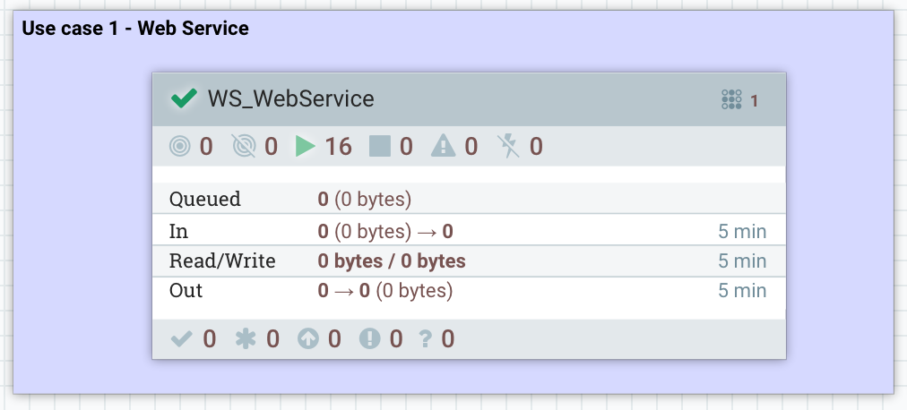
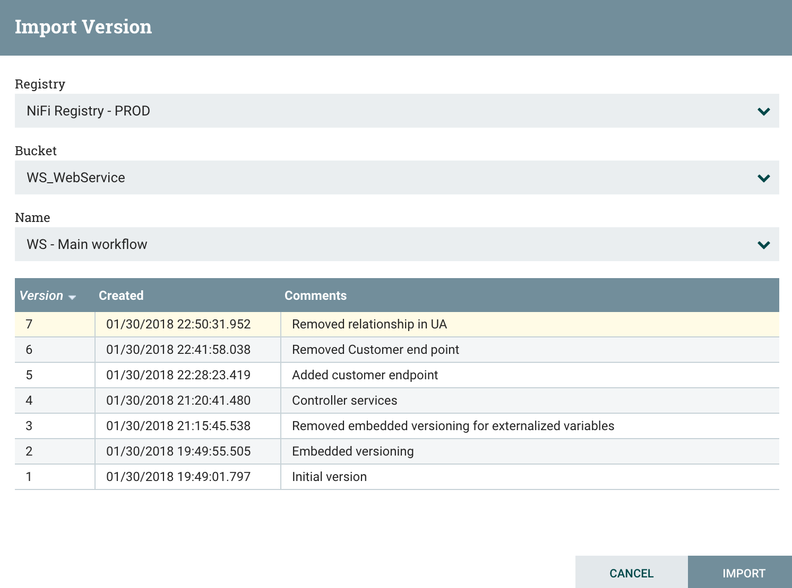

I got the chance to talk a bit about NiFi during the last [Future of Data meetup in Paris](https://www.meetup.com/fr-FR/futureofdata-paris/events/245994331/), and I wanted to share in a blog what I explained during this event.

First of all, I want to remind you that Apache NiFi 1.5.0, MiNiFi 0.4.0 and NiFi Registry 0.1.0 are out and it represents a huge step forward in the community as it brings flow development life cycle (FDLC) to a completely new level. Besides, this first version of the registry is a solid foundation for what will come in the future.

Ok let's get back to what I discussed at the meetup.

- **Introduction to NiFi Registry**

What is the NiFi Registry? It's a new component of the NiFi ecosystem, it's a web-based application that is meant to be used as a central location for storage and management of shared resources across one or more instances of NiFi and/or MiNiFi.

In a typical multi-clusters environment, this could be represented as below:

At the moment, the integration between NiFi and the NiFi Registry allows you to store, retrieve, and upgrade versioned flows. Next versions will allow users to store more different types of resources. And if you're asking... yes the NiFi Registry can be secured and provides authorization support to control users and access policies to the versioned flows.

Note that, even if you have a single environment, using the NiFi Registry will also make a lot of sense. Firstly, it's a convenient way to save your work and to version it (and to be honest, this argument alone should convince you), but it's also a practical way to share common reusable parts of flows between multiple workflows.

For example, let's say you have a process group designed to perform a very common task like transforming XML data to JSON and adding attributes to the flow files. If you have to update this process groups with few changes and if this process group is used in multiple places, you don't need to copy/paste your changes everywhere. You just have to version it and as soon as you update it, you'll be able to update all the other instances of this process group to the latest version.

- **NiFi monitoring NiFi**

I already posted some [blogs](https://pierrevillard.com/2017/05/11/monitoring-nifi-introduction/) around NiFi monitoring but that's a recurrent subject and we have quite a lot of options to answer monitoring requirements someone might have.

What do we mean by "monitoring"? In my opinion, we have two main subjects:

1. _Dashboarding_: expose various metrics data to measure the application performance and stability.
2. _Alerting_: send notifications when something is wrong.

In the context of NiFi, we can also have two types of monitoring:

1. _"Technical" monitoring_: is the NiFi service working as expected? are the nodes up and alive?
2. _"Business" monitoring_: is a particular workflow for a given project behaving as expected?

For both types of monitoring, my recommendation is to use the reporting tasks available in NiFi. Reporting tasks provide an efficient way to extract and process the data generated by the framework for technical related metrics as well as workflow related metrics.

- **Use case study**

I'm going to articulate this blog around a very simple use case that will demonstrate the use of the NiFi Registry to perform FDLC tasks. And I'll also use it as a baseline to show various ways of monitoring both the NiFi service and a particular workflow.

The use case is to expose an HTTP REST end point using NiFi so that an application can send data through HTTP calls to NiFi. The idea is to route the received data based on the URI used in the HTTP call. For each type of data, I'll perform XML validation against a schema, XML to JSON conversion, perform simple data transformations and send the data into a Kafka topic.

- **NiFi monitoring: survival kit**

Before going into the details of the use case, I'll give my personal opinion of what should be the minimum setup for efficient NiFi monitoring. Here are the 6 reporting tasks that should be configured:

\# The Ambari reporting task is used to send metrics to the Ambari Metrics Service (obviously, this reporting task only makes sense if you have Ambari and AMS available, and, if not, there are similar reporting tasks for different systems). When using the reporting task, the following metrics will be available in Ambari on the NiFi service page:

Things to monitor carefully are:

1. JVM heap usage to avoid OutOfMemory errors. Even though NiFi is not requiring a lot of RAM, some processors/use cases might need more RAM. It also depends how much flow files NiFi is going to handle at one time.
2. Active threads is the mean number of active threads per node in the NiFi cluster. By default, each NiFi node will initialize a pool of 10 threads for timer driven components. If you see that this metric is always equal to the size of the thread pool, then you might need to increase the thread pool size. But this number needs to be changed with care in coordination with CPU/load metrics of your NiFi nodes. To change the thread pool size, go into Controller Settings / General (change will be immediately effective, no restart required).
3. Flow files queued is the number of flow files currently being processed by NiFi. If this graph is continually increasing, it can be a symptom of something going wrong. It can totally be expected to have peaks at some specific hours of the day based on the use cases, and NiFi will protect itself using the backpressure mechanism but, in any case, always good to keep an eye on this metric.
4. Total task duration can also be something to look at: in case this graph is constantly going higher, it means that it takes more and more time to process the data. It can be expected if volumetry is changing or if workflows are updated but it can also be the symptom that a processor is not performing well.

\# The MonitorDiskUsage reporting tasks are useful to be sure that bulletins will be emitted before having a "no space left on device" error message. I recommend setting one per repository (at least 3, but it can be more if you have multiple content/provenance repositories). In my screenshot, I defined one for provenance repository, one for content repository and one for flow file repository.

\# The Site to Site bulletin reporting task is used to reingest all the generated bulletins into NiFi. Generally speaking Site to Site reporting tasks are a really powerful tool as it allows you to reingest data generated by NiFi's framework into NiFi itself so you can use all the processors you want to process this data. With this specific reporting task, you're able to deal with every generated bulletins into a dedicated workflow and do whatever suits you: email notification, dashboarding, automatic issue creation in JIRA, etc...

\# The Site to Site status reporting task is used to frequently take a screenshot of what is going on in all the workflows existing on the canvas. It will generate an JSON array of JSON documents representing the status of every components (processors, ports, relationships, etc) including the last 5-minutes statistics data.

- **NiFi monitoring NiFi**

Using strict naming conventions, you can leverage generic workflows dedicated to monitoring and perform quite powerful things. My approach is really to use NiFi as a way to monitor itself. You might ask: what is going to monitor the workflows dedicated to monitoring? To be honest, if there is something wrong going on with the monitoring workflows, you will detect it very quickly through the technical monitoring / Ambari reporting task. Or the NiFi service will just be red in Ambari...

Consequently, my personal recommendation is to ask each project team to respect a strict naming convention and to deliver a workflow designed to fulfill the monitoring requirements for the project workflows. Each workflow will certainly require different notification mechanisms, and different metrics in the dashboards.

At the root level of the canvas, I'll have one process group per project in order to ensure proper authorization policies. I'll also have a process group dedicated to monitoring, and two input ports to receive the data sent by reporting tasks (with NIFI-4814, it'll be possible to only use one):

In this use case study, I assume that the naming convention is the following: <acronym of the project>\_<meaningful component name>

Besides, if the metrics of a component should be captured for dashboarding, the name should be suffixed by \_GRAFANA.

With the above assumptions, here is what I have in my monitoring process group:

The UpdateAttribute is used to add a "type" attribute with the value "bulletins" or "status". I'll use this attribute to perform routing at a later stage.

The UpdateRecord is used to populate a "project" field by extracting the acronym from the component name. Here is [the schema I use for bulletins](https://gist.github.com/pvillard31/801335947240fecb345e6033d44e6b95), and here is [the schema I use for status](https://gist.github.com/pvillard31/845c93ccc62f6c35f117106f649115ca).

For bulletins:

For status data:

At this point, I have bulletins and status data and I'm able to link this data to every project running in NiFi. Now I send this data in two process groups: one that is dedicated to technical monitoring (used and managed by the team in charge of NiFi service), and one that is dedicated to business (per-project) monitoring:

**Technical monitoring**

In the technical monitoring, it's really up to you regarding what you want... What I usually do is to send the bulletin data in a tool like AMS, Solr or Elasticsearch to have dedicated dashboards. I also set email notifications when backpressure is enabled in a connection.

For bulletins dashboarding, I slightly change the schema of the data and send it into an Elasticsearch instance:

I then create a dashboard in Grafana:

If necessary I can use the notification mechanism available in Grafana to get email messages when some thresholds are reached.

With the status data, I decided to design a workflow sending email notifications as soon as backpressure is enabled in a connection:

To do that, I use the QueryRecord processor to only select records representing connections with backpressure enabled:

Again... with the site to site reporting tasks you are ingesting into NiFi its own data and you can use all the processors you want to process this data and fulfill your requirements.

**Business (per-project) monitoring**

If we go back to the first level of my monitoring process group, you noticed that I'm also sending both bulletin and status data to another process group for "per-project" monitoring:

In this process group, here is what I'm doing:

I'm using a PartitionRecord processor to partition all the data based on the field /project that we computed earlier. This way, each flow file will only contain data with a unique value for the /project field and this value is also extracted as an attribute of the flow files. Then I just have to use a RouteOnAttribute processor to route the data based on the project that generated this data (if a project didn't respect the naming convention, the project value will not match any project acronym and the data will be dropped, unless you want to process it somehow - to detect teams not respecting the naming convention!). After the RouteOnAttribute, you have one process group per project and that's this specific piece that should be developed by every project deployed in NiFi. This way, each project receives both bulletins and status related to the project and each project can implement its own workflow to deal with bulletin and status data.

Before presenting what monitoring I'm doing for the use case of this post, I'll step back a little and present the use case itself and how I leverage the NiFi Registry to deploy my workflow from a development environment to a production environment.

- **Use case presentation**

The use case itself is pretty simple and I won't go too much in the details since it's not the purpose of this blog. I'm using a HandleHttpRequest processor to listen for HTTP calls on a given port. Then based on what URI has been called by the client I'm routing the flow files to different process group. I'm expecting to receive HTTP POST requests on specific endpoint, each one representing a type of data. The received data is expected to be XML and I'm checking that the data is valid according to an XSD schema. At this point, three options:

1. if the client requests an endpoint that is not expected, I route the flow file to the HandleHttpResponse processor and return a 404 HTTP code.
2. if the client posts data on the expected endpoint but the data is not valid, I route the flow file to the HandleHttpResponse processor and return a 400 HTTP code.
3. if the received data is valid, then I return a 200 HTTP code.

What I'm doing with valid data in the process group does not really matter and I won't describe that (this post is already way too long and I'm surprised you're still reading...).

- **Deployment with NiFi Registry**

Let's try to keep things simple. The NiFi Registry is a web application living outside of NiFi. However, NiFi integrates with the NiFi Registry. This is done by going into the Controller Settings menu where there is a new tab to define the registries to connect with:

With this integration between NiFi and NiFi Registry, you have new icons in the UI you need to get familiar with:

From left to right:

1. Number of versioned Process Groups that are up to date with the Registry
2. Number of versioned Process Groups that are locally modified (you can commit your local changes to create a new version of your process group in the Registry)
3. Number of versioned Process Groups that are stale (there is a more recent version of the Process Group in the Registry and you can update your local process group to this version)
4. Number of versioned Process Groups that are stale and also with local changes
5. Number of versioned Process Groups with a synchronization failure (the Registry is not available / unreachable, etc)

The interactions with the Registry through the NiFi UI can be done by right clicking on a process group or on the canvas inside a process group: this will show a Version menu with available commands.

On the NiFi Registry side, here is what is looks like:

In the Registry, it's possible to create buckets (you'll usually have one bucket per project). Then, from the NiFi UI, you'll be able to start versioning a workflow in a bucket. To do that: right click on the process group, Version menu, start version control.

Then you'll be able to choose the bucket and to give some information about your workflow:

You now have your workflow versioned in the registry !

Now... how do I deploy my workflow on the production cluster?

I just have to drag and drop a process group component on the canvas, and I'll see:

And I can just click on Import to select the bucket, workflow and version I want:

I now have my workflow imported on the production cluster. Two things to do:

1. Update the variables of the process group that are used to externalize environment-specific properties of the workflow components. Note that changes to the variables value are not considered as local changes from Registry point of view because two instances of the same workflow version will have different values for different environments.
2. Start the controller services and processors. When importing a new workflow for the first time, everything is stopped to let users change the variables. When updating an existing workflow to a new version, only the new components will need to be started (no service interruption).

To access variables, you can right click on the process group and click on the Variables menu:

And then you can update the variables with values corresponding to your environment:

If you have multi-levels process groups and if you defined variables at different levels, you will also need to update variables in sub-process groups.

- **Business monitoring for my use case**

If you paid attention, in my screenshot of the NiFi Registry, you probably noticed two versioned workflows in the bucket dedicated to my use case. The other workflow is the one dedicated to the monitoring that you also noticed in a previous screenshot:

Let's quickly discuss what I suggest for project-specific monitoring. The first thing you might want to do is to receive email notifications when bulletins are generated by components of your workflow.

Then, what I usually suggest for per-project dashboarding is to export the statistics of specific points of the workflow to an external tool and create dashboards. As I said before, in my example, I'm exporting to the Ambari Metrics Service the last 5-minutes count and bytes sum of the flow files going through connections with a name suffixed with \_GRAFANA. In my example, I renamed connections to automatically export statistics to get the number of HTTP code 200, 400 and 404:

And here is my monitoring workflow for this specific use case:

I route the monitoring data to have a specific processing for bulletins (email notifications in this case) and a specific processing for status. First, I use a PartitionRecord processor and a RouteOnAttribute to only extract status data for connections (I ignore data about processors, process groups, ports, etc).

Then I split my JSON arrays and extract the field containing the name of the connection to only keep the connections suffixed by \_GRAFANA. Then I transform the content to match the format expected by AMS and send the request to AMS ([more details here](https://pierrevillard.com/2017/05/16/monitoring-nifi-ambari-grafana/)).

And... that's it... I'm now able to create Grafana dashboards for my specific use case:

Another thing you might want to do is to define a dedicated Ambari Reporting Task with the UUID of the process group dedicated to the project. This way you have additional statistics about this specific process group: number of active threads, number of flow files queued, volume of data received, etc.

- **What about workflow update?**

Ok... so I deployed my workflows in production and have great ways to monitor things. What if I've a new endpoint to handle in my workflow. Really simple! So far I only process "purchase" data, let's add another process group to deal with "customer" data:

I updated my RouteOnAttribute to accept a new endpoint and added a process group to process this data. I added my HTTP 200 & 400 relationships for this new type of data and I carefully renamed the output connections to automatically get this new data into my dashboards.

I can now see that my process group does have local changes:

And I can commit the changes as a new version of my workflow:

I can now check that, on production's side, there is a new version available and I can update to this new version:

I can right click on the process group and update to the latest version:

I select the version I want:

And that's it! Note that the update from a version A to a version B will stop and restart existing components if and only if modifications have been done on the components. In my case, the HandleHttpRequest has not been modified... consequently, the update of the workflow will not cause any service interruption. That's pretty cool!

Also note that the update will not cause any data loss in case the update includes the deletion of connections that are currently containing flow files.

And finally, I do have to update, if necessary, the variables of my newly added process group (for customer data) and to start it.

- **Conclusion**

I've already talked about way too much things, but I hope it'll get you excited about the NiFi Registry! Please install it and use it, that's really going to ease your life. As always I invite you to join the Apache NiFi community by subscribing to [mailing lists](https://nifi.apache.org/mailing_lists.html), submitting [JIRAs for NiFi](https://issues.apache.org/jira/projects/NIFI), [MiNiFi Java](https://issues.apache.org/jira/projects/MINIFI)/[C++](https://issues.apache.org/jira/projects/MINIFICPP), [NiFi Registry](https://issues.apache.org/jira/projects/NIFIREG), and contribute code on [NiFi](https://github.com/apache/nifi), [MiNiFi Java](https://github.com/apache/nifi-minifi)/[C++](https://github.com/apache/nifi-minifi-cpp) and [NiFi Registry](https://github.com/apache/nifi-registry).

Feel free to comment and ask your questions on this post! Thanks for reading me!
