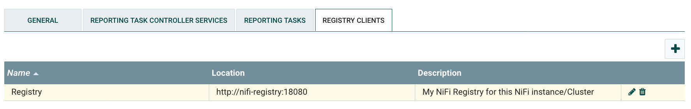
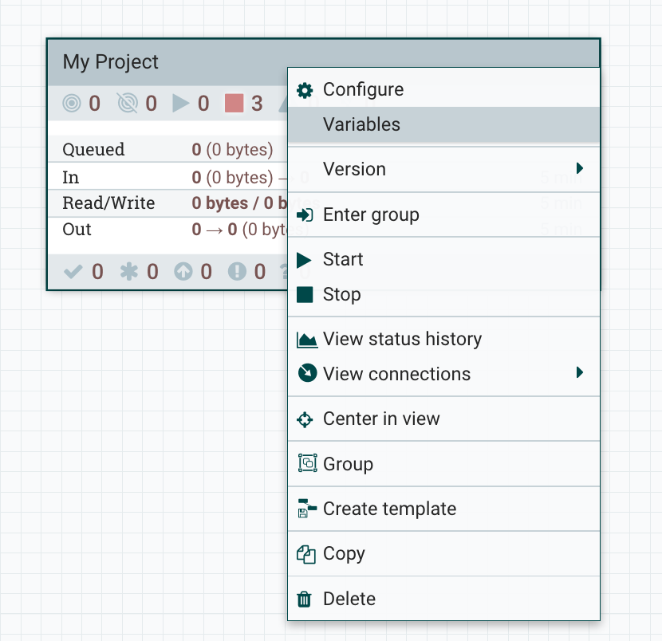

[Apache NiFi 1.6](https://nifi.apache.org/download.html) ([release note](https://issues.apache.org/jira/secure/ReleaseNote.jspa?projectId=12316020&version=12342422)) is now out and one of the great new features is the addition of a Command Line Interface in the NiFi Toolkit binary that allows you to interact with NiFi instances and NiFi Registry instances.

In this post, I'll discuss about the ways you have to automate deployment and promotion of workflows between multiple environments using the NiFi Registry. I'll discuss and demonstrate two options you have that you need to know about:

- **the NiFi CLI released with the NiFi Toolkit 1.6.0 ([download](https://nifi.apache.org/download.html)) ([github](https://github.com/apache/nifi/tree/master/nifi-toolkit/nifi-toolkit-cli))**
- **The NiPyAPI python library 0.8.0 ([github](https://github.com/Chaffelson/nipyapi))**

Before going into the details, let's discuss about the different scenarios we have... First, how many NiFi Registry instances do you have? According to your security requirements, it might not be allowed to have a single NiFi Registry available from all your environments. In that case, you could be in a situation where you need to have a NiFi Registry instance running for each of your NiFi environments. And, in such a case, you'd need to export/import the workflows information between the NiFi Registry instances to take benefit of all the great features you have with the Registry.

- **Scenario 1 - one Registry to rule them all**


- **Scenario 2 - one Registry per environment**


Then you have two kind of situations to handle:

- Deployment of a completely new workflow from one environment to another
- Update to a newer version of an existing workflow in production

I'll go into the details of each of the 4 cases using each one of the two clients available for you to use. It's up to you to decide what client you prefer to use. For each one of the cases I'll only do one "hop" from Dev to Prod, but I'd expect you to have at least one additional hop to actually test your workflow in an integration environment.

**Note 1** - I won't use a secured environment in the following demos, but both of the tools are supporting secured deployments so that you can authenticate using certificates to perform the actions as a given user having the appropriate authorizations.

**Note 2** - For this post, I choose to have the following workflow:

For the first version of the workflow I will have:

_ListFile => FetchFile_ => _PutHDFS_

Then I'll add a connection from _FetchFile_ to also push the data into Elasticsearch by adding a _PutElasticSearchHttp_ processor. The idea is also to show you how to handle variables that need to be changed according to the environment.

**Before starting anything**... How to configure your NiFi instance/cluster to exchange with the NiFi Registry? To do that, you need to go in the top right menu, to go in Controller Settings, and in the Registry Clients tab:




In scenario 1, both the NiFi dev and the NiFi prod are configured to communicate with the same NiFi Registry instance. In scenario 2, each environment is configured with its own NiFi Registry instance.

**Important** - even if case 1 is not the case you are interested in, that's where I'm describing the initial workflow and what are the differences between versions 1 and 2. Please have a look as I won't go into as much details when describing the other cases.

* * *

- **Case 1 - One NiFi Registry using the NiFi CLI**

Environment details: - **NiFi Dev** - http://nifi-dev:8080/nifi - **NiFi Prod** - http://nifi-prod:8080/nifi - **NiFi Registry** - http://nifi-registry:18080/nifi-registry

First of all, I create a process group that will contain my workflow. I call this process group "My Project".


Then, I design my workflow:


I have externalized some properties because I know the value will change depending on which environment my workflow is running. To use process group variables in a property, you first need to check that Expression Language is supported. Besides, you cannot use variables for sensitive properties (I'll come back to this point at the end of this article). To check if expression language is support on a property, you can hover the question mark next to it:


To add variables for a process group, you need to right click in the canvas (when inside the process group) and click on "variables", or directly right click on the process group and click on "variables":



Here I define my variables that I will use in the configuration of the processors belonging to my workflow:


This view allows you to define key/value pairs that can be referenced in components using the expression language. You can also view the list of the components referencing the variables you create.

Here is the configuration of my _ListFile_ processor:


Here is the configuration of my _FetchFile_ processor:


Here is the configuration of my _PutHDFS_ processor:


As you can see I'm using external variables for:

\- the input directory used in _ListFile_ - the list of configuration files used in _PutHDFS_ - the Kerberos principal used in _PutHDFS_ - the Kerberos keytab used in _PutHDFS_ - the output directory used in _PutHDFS_

Next step is to create a bucket for my project in the NiFi Registry. To do that, go to the NiFi Registry home page, and go in Settings (top right):


I create a bucket for the project I'm working on:


A bucket is a logical place to store versioned items/resources and that's on buckets that permissions/authorizations are assigned to users/groups. Currently the only resource type to store in buckets are versioned flows (or workflows). Each versioned flow has a name, a description, and 1 or more “snapshots” (versions). Each snapshot (or version) has metadata and content: the metadata contains a version number, a commit message, an author, and a commit date ; the content contains the representation of the workflow itself when it has been committed.

Once my bucket is created, I can start versioning my workflow in the registry. To do that, right click on the process group and start version control:


Choose the bucket in which you want to register you workflow:


Once your workflow is version controlled in the Registry, you should be able to see it in the Registry:


Also, in NiFi, you can see that your process group is now versioned and up-to-date with the Registry (green icon in the top left corner of the process group):


We are now ready to deploy this workflow in production! Here is what we're going to do:

\- import the versioned workflow in production - update the variables to set the values for the production environment - start the process group

For the demo I'll use it with the interactive shell, but you can script the commands (have a look [here](https://github.com/apache/nifi/tree/master/nifi-toolkit/nifi-toolkit-cli)).

```
$ ./cli.sh
 _ ___ _
 Apache (_) .' ..](_) ,
 _ .--. __ _| |_ __ )\
[ `.-. | [ |'-| |-'[ | / \
| | | | | | | | | | ' '
[___||__][___][___] [___]', ,'
 `'
 CLI v1.6.0

Type 'help' to see a list of available commands, use tab to auto-complete.

Session loaded from /Users/pvillard/.nifi-cli.config

#>
```

Let's list the buckets in my Registry:

```
#> registry list-buckets -u http://nifi-registry:18080

# Name      Id                                   Description
- --------- ------------------------------------ -----------
1 MyProject 2a5566b5-7380-46b8-9598-328e092e8899 (empty)
```

Let's list the workflows in the bucket referenced by the ID 1 (I'm using back reference, but you could use the full identifier for fully scripted solutions):

```
#> registry list-flows -b &1 -u http://nifi-registry:18080

Using a positional back-reference for 'MyProject'

# Name       Id                                   Description
- ---------- ------------------------------------ ----------------------------------------
1 MyWorkflow 9c2874ca-673a-4553-bbb1-5b370ff23b70 This a workflow to demonstrate workfl...
```

I now want to deploy the last version (-fv 1) of this workflow in my production NiFi:

```
#> nifi pg-import -b &1 -f &1 -fv 1 -u http://nifi-prod:8080

Using a positional back-reference for 'MyProject'

Using a positional back-reference for 'MyWorkflow'

76f015f8-0162-1000-5470-a7c6511e5685
```

My process group is now imported in the production NiFi with everything stopped since it's the first time I deploy it. If I didn't want to deploy it at the root level of my production NiFi I could have specified a parent process group ID in the previous command.

Let's now list the variables of this process group:

```
#> nifi pg-get-vars -pgid 76f015f8-0162-1000-5470-a7c6511e5685 -u http://nifi-prod:8080

# Name                    Value
- ----------------------- ----------------------------------------
1 HDFSconfFiles           /Users/pvillard/Documents/nifi-workdir/fieldcloud/core-site.xml,/Users/pvillard/Documents/nifi-workdir/fieldcloud/hdfs-site.xml
2 HDFSdirectory           /dev/dest/directory
3 HDFSkeytab              myproject-dev.keytab
4 HDFSprincipal           myproject-dev@EXAMPLE.COM
5 ListFilesInputDirectory /dev/tmp
```

I can now update the variables with the values of my production environment:

```
#> nifi pg-set-var -pgid 76f015f8-0162-1000-5470-a7c6511e5685 -var HDFSconfFiles -val /etc/hadoop/conf/current/hdfs-site.xml,/etc/hadoop/conf/current/core-site.xml -u http://nifi-prod:8080
#> nifi pg-set-var -pgid 76f015f8-0162-1000-5470-a7c6511e5685 -var HDFSdirectory -val /prod/dest/directory -u http://nifi-prod:8080
#> nifi pg-set-var -pgid 76f015f8-0162-1000-5470-a7c6511e5685 -var HDFSkeytab -val myproject-prod.keytab -u http://nifi-prod:8080
#> nifi pg-set-var -pgid 76f015f8-0162-1000-5470-a7c6511e5685 -var HDFSprincipal -val myproject-prod@EXAMPLE.COM -u http://nifi-prod:8080
#> nifi pg-set-var -pgid 76f015f8-0162-1000-5470-a7c6511e5685 -var ListFilesInputDirectory -val /prod/tmp -u http://nifi-prod:8080
```

I can confirm in the the UI of my production NiFi that variables have been updated:


I just need to start my process group and we're done:

```
#> nifi pg-start -pgid 76f015f8-0162-1000-5470-a7c6511e5685 -u http://nifi-prod:8080
```

We've successfully deployed a new workflow in production. Let's now update our workflow in the development NiFi and create a new version of it:


I've added a _PutElasticsearchHttp_ processor to also send my data into Elasticsearch. Here is the configuration of my processor:


And I've added a new variable for the URL of my Elasticsearch instance:


I can see on my process group, that I now have local changes to commit in the NiFi Registry:


To commit the changes, right click, version, commit local changes:


You can comment your changes before committing the changes in the NiFi Registry:


My processor is now up-to-date and I can see the new version in the Registry:


In production I can see that my process group is not up-to-date anymore and a new version is available:


To update the production environment to the latest version, you just need to do the following with the NiFi CLI:

```
#> nifi pg-change-version -pgid 76f015f8-0162-1000-5470-a7c6511e5685 -u http://nifi-prod:8080
```

Not only the flow is updated, but there is no downtime: running processors remain running, previously existing variables remain unchanged. You just have to update the new variable and start the process group to start the stopped _PutElasticsearchHttp_ processor:

```
#> nifi pg-get-vars -pgid 76f015f8-0162-1000-5470-a7c6511e5685 -u http://nifi-prod:8080

# Name                    Value
- ----------------------- ----------------------------------------
1 HDFSconfFiles           /etc/hadoop/conf/current/hdfs-site.xml,/etc/hadoop/conf/current/core-site.xml
2 HDFSdirectory           /prod/dest/directory
3 HDFSkeytab              myproject-prod.keytab
4 HDFSprincipal           myproject-prod@EXAMPLE.COM
5 ListFilesInputDirectory /prod/tmp
6 ElasticsearchURL        http://es-dev:9200

#> nifi pg-set-var -pgid 76f015f8-0162-1000-5470-a7c6511e5685 -var ElasticsearchURL -val http://es-prod:9200 -u http://nifi-prod:8080
#> nifi pg-start -pgid 76f015f8-0162-1000-5470-a7c6511e5685 -u http://nifi-prod:8080
```

You now have the latest version of your workflow in production and you didn't experience any downtime since you didn't modify your source processor at all.


* * *

- **Case 2 - One NiFi Registry using NiPyAPI**

Environment details: - **NiFi Dev** - http://nifi-dev:8080/nifi - **NiFi Prod** - http://nifi-prod:8080/nifi - **NiFi Registry** - http://nifi-registry:18080/nifi-registry

###### _(it is recommended to read the case 1 as it gives an overview of the overall story)_

The first version of my workflow has been committed in the NiFi Registry, I want to deploy it in my production NiFi for the first time.

I assume that you already have a Python environment where you can use the nipyapi library ([please refer to the documentation if needed](https://nipyapi.readthedocs.io/en/latest/)).

```
>>> help(nipyapi)
...
VERSION
 0.8.0

AUTHOR
 Daniel Chaffelson
...

>>> devNiFi = 'http://nifi-dev:8080/nifi-api'
>>> registry = 'http://nifi-registry:18080/nifi-registry-api'
>>> prodNiFi = 'http://nifi-prod:8080/nifi-api'
```

Right now there is no method available to deploy for the first time a versioned workflow as a new process group. This will be added in the next version of the library. In the meantime, you can use the below option:

```
def deploy_flow_version(parent_pg, location, bucketId, flowId, registryID, ver):
  assert isinstance(parent_pg, nipyapi.nifi.ProcessGroupEntity)
  assert isinstance(location, tuple)
  try:
    return nipyapi.nifi.ProcessgroupsApi().create_process_group(
      id=parent_pg.id,
      body=nipyapi.nifi.ProcessGroupEntity(
        revision=parent_pg.revision,
        component=nipyapi.nifi.ProcessGroupDTO(
          position=nipyapi.nifi.PositionDTO(
            x=float(location[0]),
            y=float(location[1])
          ),
          version_control_information=nipyapi.nifi.VersionControlInformationDTO(
            bucket_id=bucketId,
            flow_id=flowId,
            registry_id=registryID,
            version=ver
          )
        )
      )
    ).id
  except nipyapi.nifi.rest.ApiException as e:
    raise e
```

I can now create a process group with my versioned workflow:

```
>>> nipyapi.utils.set_endpoint(prodNiFi)
True
>>> nipyapi.utils.set_endpoint(registry)
True
>>> bucketName = "MyProject"
>>> workflowName = "MyWorkflow"
>>> registryName = "Registry"
>>>
>>> rootPgId = nipyapi.canvas.get_root_pg_id()
>>> rootPg = nipyapi.canvas.get_process_group(rootPgId, identifier_type='id')
>>> bucketID = nipyapi.versioning.get_registry_bucket(bucketName).identifier
>>> workflowID = nipyapi.versioning.get_flow_in_bucket(bucketID, workflowName).identifier
>>> registryID = nipyapi.versioning.get_registry_client("Registry").id
>>> ver = 1
>>> location = (200, 200)
>>>
>>> deploy_flow_version(rootPg, location, bucketID, workflowID, registryID, ver)
'01621009-0a4c-1704-e137-e564eadb11e2'
```

With the above list of commands we have retrieved the bucket ID, the workflow ID, the ID of the registry client in the production NiFi, and we deployed the versioned flow at the root level (using the root process group) at a given location.

The last command returns the ID of the newly created process group that contain our versioned workflow.

We can now update the variables of the process group:

```
versionedPg = nipyapi.canvas.get_process_group('01621009-0a4c-1704-e137-e564eadb11e2', identifier_type='id')
nipyapi.canvas.update_variable_registry(versionedPg, [('HDFSprincipal', 'myproject-prod@EXAMPLE.COM'), ('HDFSkeytab', 'myproject-prod.keytab'), ...]
```

And we now just have to start the process group:

```
>>> nipyapi.canvas.schedule_process_group('01621009-0a4c-1704-e137-e564eadb11e2', True)
True
```

Let's now imagine that we have a new version available for our workflow and we want to update it to the latest version. Then we just need to do the following:

```
>>> versionedPg = nipyapi.canvas.get_process_group('01621009-0a4c-1704-e137-e564eadb11e2', identifier_type='id')
>>> nipyapi.versioning.update_flow_ver(versionedPg)
```

We can now update the variables if needed, and start the newly added processors as we did at the end of case 1 description.

* * *

- **Case 3 - Two NiFi Registries using the NiFi CLI**

Environment details: - **NiFi Dev** - http://nifi-dev:8080/nifi - **NiFi Prod** - http://nifi-prod:8080/nifi - **NiFi Registry Dev** - http://registry-dev:18080/nifi-registry - **NiFi Registry Prod** - http://registry-prod:18080/nifi-registry

###### _(it is recommended to read the case 1 as it gives an overview of the overall story)_

In this case, security requirements prevent us to have a single NiFi Registry reachable from all our NiFi environments. Consequently, we have one Registry instance per environment and we have to setup a mechanism to move versioned workflow from one Registry instance to another. I will go very quickly on the basic functionalities (that I described in previous cases) of the CLI and focus on the export/import between two registries.

I assume that each NiFi environment has been configured to register its Registry in the controller settings. If not, refer to the beginning of the article.

Starting point: the initial version of the workflow is committed in the Dev Registry and should be deployed in production.

I first list the buckets in my Dev Registry, list the flows in the bucket I want, and export the flow I'm looking for at the given version into a JSON file:

```
#> registry list-buckets -u http://registry-dev:18080

# Name      Id                                   Description
- --------- ------------------------------------ -----------
1 MyProject 2a5566b5-7380-46b8-9598-328e092e8899 (empty)

#> registry list-flows -b &1 -u http://registry-dev:18080

Using a positional back-reference for 'MyProject'

# Name       Id                                   Description
- ---------- ------------------------------------ -----------
1 MyWorkflow 3403c78c-7074-45c3-bc3b-aeac75970e85

#> registry export-flow-version -f &1 -fv 1 -o /tmp/my-flow.json -ot json -u http://registry-dev:18080

Using a positional back-reference for 'MyWorkflow'
```

Since this is first time I deploy this workflow in production, it's possible I don't have a bucket for it yet in the Prod Registry. Let's create one, and let's create the workflow resource in the bucket so that we can do the import:

```
#> registry create-bucket -bn "MyProjectProd" -u http://registry-prod:18080

33aacd91-ca5d-4405-a657-05de37da1fb7

#> registry list-buckets -u http://registry-prod:18080

# Name          Id                                   Description
- ------------- ------------------------------------ -----------
1 MyProjectProd 33aacd91-ca5d-4405-a657-05de37da1fb7 (empty)

#> registry create-flow -b &1 -fn "MyWorkflowProd" -u http://registry-prod:18080

Using a positional back-reference for 'MyProjectProd'

67576995-fb0f-4324-987a-dfcf186a24c8
```

We can now import the versioned workflow that we exported as JSON file from the Dev Registry into the Prod Registry:

```
#> registry list-buckets -u http://registry-prod:18080

# Name          Id                                   Description
- ------------- ------------------------------------ -----------
1 MyProjectProd 33aacd91-ca5d-4405-a657-05de37da1fb7 (empty)

#> registry list-flows -b &1 -u http://registry-prod:18080

Using a positional back-reference for 'MyProjectProd'

# Name           Id                                   Description
- -------------- ------------------------------------ -----------
1 MyWorkflowProd 67576995-fb0f-4324-987a-dfcf186a24c8 (empty)

#> registry import-flow-version -f &1 -i /tmp/my-flow.json -u http://registry-prod:18080

Using a positional back-reference for 'MyWorkflowProd'

1
```

Now the versioned workflow is available in the Prod Registry, and we can do exactly the same as we did in the case 1 to deploy it in the production NiFi.

Assuming a new version of the workflow is available in the Dev Registry, you just need to export the version of your choice (using the option -fv) and import it in the existing bucket/workflow in the Prod Registry. The version on the Prod Registry side will be automatically incremented. One benefit of this approach/separation with two registries is that you can move from one registry to another \*only\* the versions that are considered ready enough to be promoted in the next environment. The full lifecycle workflow could be represented like this:


Using explanations in both case 1 and 3, you should be able to manage the complete life cycle deployment of your workflows using the CLI.

* * *

- **Case 4 - Two NiFi Registries using the NiPyAPI**

Environment details: - **NiFi Dev** - http://nifi-dev:8080/nifi - **NiFi Prod** - http://nifi-prod:8080/nifi - **NiFi Registry Dev** - http://registry-dev:18080/nifi-registry - **NiFi Registry Prod** - http://registry-prod:18080/nifi-registry

###### _(it is recommended to read the case 1 as it gives an overview of the overall story)_

In this case, security requirements prevent us to have a single NiFi Registry reachable from all our NiFi environments. Consequently, we have one Registry instance per environment and we have to setup a mechanism to move versioned workflow from one Registry instance to another. I will go very quickly on the basic functionalities (that I described in previous cases) of NiPyAPI and focus on the export/import between two registries.

I assume that each NiFi environment has been configured to register its Registry in the controller settings. If not, refer to the beginning of the article.

Starting point: the initial version of the workflow is committed in the Dev Registry and should be deployed in production.

I export the flow I'm looking for, at the given version (in this case, version 1), into a JSON file:

```
>>> devNiFi = 'http://nifi-dev:8080/nifi-api'
>>> devRegistry = 'http://registry-dev:18080/nifi-registry-api'
>>> prodNiFi = 'http://nifi-prod:8080/nifi-api'
>>> prodRegistry = 'http://registry-prod:18080/nifi-registry-api'
>>> bucketName = "MyProject"
>>> workflowName = "MyWorkflow"

>>> nipyapi.utils.set_endpoint(devRegistry)
>>> bucketID = nipyapi.versioning.get_registry_bucket(bucketName).identifier
>>> workflowID = nipyapi.versioning.get_flow_in_bucket(bucketID, workflowName).identifier
>>> nipyapi.versioning.export_flow_version(bucketID, workflowID, version='1', file_path='/tmp/my-flow.json', mode='json'
```

Since this is first time I deploy this workflow in production, it's possible I don't have a bucket for it yet in the Prod Registry. Let's create one so that we can do the import:

```
>>> nipyapi.utils.set_endpoint(prodRegistry)
True
>>> nipyapi.utils.set_endpoint(prodNiFi)
True
>>> bucketNameProd = "MyProjectProd"
>>> nipyapi.versioning.create_registry_bucket(bucketNameProd)
{'created_timestamp': 1522430434276,
 'description': None,
 'identifier': '8a9e46b0-722e-40f6-9401-98103de56435',
 'link': {'params': {'rel': 'self'},
 'rel': None,
 'rels': None,
 'title': None,
 'type': None,
 'uri': None,
 'uri_builder': None},
 'name': 'MyProjectProd',
 'permissions': {'can_delete': True, 'can_read': True, 'can_write': True}}
>>> bucketProdID = nipyapi.versioning.get_registry_bucket(bucketNameProd).identifier
```

I can now import my versioned workflow in this bucket:

```
>>> workflowNameProd = "MyWorkflowProd"
>>> nipyapi.versioning.import_flow_version(bucketProdID, encoded_flow=None, file_path='/tmp/my-flow.json', flow_name=workflowNameProd, flow_id=None
```

Now the versioned workflow is available in the Prod Registry, and we can do exactly the same as we did in the case 2 to deploy it in the production NiFi.

Let's assume you do modifications in the Dev NiFi and you want to deploy the new version of the workflow in the existing bucket of the Prod Registry, then you would do (assuming you already the export, as before, in /tmp/my-flow.json):

```
>>> workflowProdID = nipyapi.versioning.get_flow_in_bucket(bucketProdID, workflowNameProd).identifier
>>> nipyapi.versioning.import_flow_version(bucketProdID, encoded_flow=None, file_path='/tmp/my-flow.json', flow_name=None, flow_id=workflowProdID
```

And you can now update the process group of the production NiFi to the latest version using the commands already described in case 2.

* * *

- **Using the CLI in a non-interactive mode**

Refer to [the CLI documentation](https://github.com/apache/nifi/tree/master/nifi-toolkit/nifi-toolkit-cli) for more details, but you'd probably use the CLI in the non interactive mode in your deployments.

I create 4 configuration files:

_nifi-dev.properties_

```
baseUrl=http://nifi-dev:8080
keystore=
keystoreType=
keystorePasswd=
keyPasswd=
truststore=
truststoreType=
truststorePasswd=
proxiedEntity=
```

_nifi-prod.properties_

```
baseUrl=http://nifi-prod:8080
keystore=
keystoreType=
keystorePasswd=
keyPasswd=
truststore=
truststoreType=
truststorePasswd=
proxiedEntity=
```

_registry-dev.properties_

```
baseUrl=http://registry-dev:8080
keystore=
keystoreType=
keystorePasswd=
keyPasswd=
truststore=
truststoreType=
truststorePasswd=
proxiedEntity=
```

_registry-prod.properties_

```
baseUrl=http://registry-prod:8080
keystore=
keystoreType=
keystorePasswd=
keyPasswd=
truststore=
truststoreType=
truststorePasswd=
proxiedEntity=
```

I can now use the following commands to automatically export/import a given bucket, workflow, version from the Dev Registry to the Prod Registry. In order to ease the process, I'm specifying "json" as the output type, and I'm using the jq command to parse the results.

```
#!/bin/sh

set -e

# Set the variables
BUCKET="MyProject"
WORKFLOW="MyWorkflow"
BUCKETPROD="MyProjectProd"
WORKFLOWPROD="MyWorkflowProd"
VERSION=1
FILE="/tmp/my-flow.json"

set_endpoints() {
 ./cli.sh session set nifi.props $1
 ./cli.sh session set nifi.reg.props $2
}

get_bucketid() {
 result=$(./cli.sh registry list-buckets -ot json | jq '.[] | select(.name=="'$1'") | .identifier')
 if [ -z "$result" ]; then
   >&2 echo "No bucket with name $1"
   return 1
 else
   echo $result
 fi
}

get_workflowid() {
 result=$(./cli.sh registry list-flows -b $1 -ot json | jq '.[] | select(.name=="'$2'") | .identifier')
 if [ -z "$result" ]; then
   >&2 echo "No workflow with name $2 in bucket $1"
   return 1
 else
   echo $result
 fi
}

# Set the endpoints
set_endpoints "nifi-dev.properties" "registry-dev.properties"

# Export the workflow
BUCKETID=$(get_bucketid $BUCKET)
WORKFLOWID=$(get_workflowid $BUCKETID $WORKFLOW)
./cli.sh registry export-flow-version -f $WORKFLOWID -fv $VERSION -o $FILE -ot json

# Change the endpoints
set_endpoints "nifi-prod.properties" "registry-prod.properties"

# Import the workflow
BUCKETID=$(get_bucketid $BUCKETPROD)
WORKFLOWID=$(get_workflowid $BUCKETID $WORKFLOWPROD)
./cli.sh registry import-flow-version -f $WORKFLOWID -i $FILE
```

I'm sure you are all set to script all the operations you need.

Also, be aware that there is a command

```
registry transfer-flow-version
```

that you can use to do the export/import I described above:

```
#> registry transfer-flow-version help

Transfers a version of a flow directly from one Registry to another,
without needing to export/import. If --sourceProps is not specified,
the source flow is assumed to be in the same registry as the
destination flow. If --sourceFlowVersion is not specified, then the
latest version will be transferred
```

Also, instead of using the 'session' command to set the endpoint, you can directly use the properties file in the command using the '-p' option:

```
./bin/cli.sh registry list-buckets -p /path/to/local-nifi-registry.properties
```

Using the 'session' command will change the default settings of the interactive shell for the next time you're using it.

* * *

- **What is next? Are there some limitations?**

There are already few JIRAs opened to improve the CLI, and Dan Chaffelson is very active and keen to improve his library. So it will definitely improve over time on both sides and, as I said, in the future, the Registry will also store much more than just workflows.

If you want to see new features in the CLI, feel free to open a [JIRA](https://issues.apache.org/jira/projects/MINIFI) here or send an email on [the users mailing list of the Apache NiFi project](https://nifi.apache.org/mailing_lists.html). If you want to see improvements in the Python library, you can quickly and easily interact [on the Github repository](https://github.com/Chaffelson/nipyapi).

Few limitations to keep in mind right now:

1. Support for embedded versioned process groups is not fully ready yet when you have multiple Registry instances and you need to export/import things between the instances. You can check the status on [NIFI-5029](https://issues.apache.org/jira/browse/NIFI-5029).
2. When versioning a process group and deploying it in NiFi, all the sensitive properties are emtpied for security reasons. Just like the variables, you would need to set the values using the REST API or NiPyAPI (no support in the CLI yet) when you deploy the workflow for the first time (or when adding new sensitive properties between two versions). Regarding support in the CLI, you can check the status on [NIFI-5028](https://issues.apache.org/jira/browse/NIFI-5028).
3. The example I gave is not using any controller service defined at process group level. If you're using controller services, the CSs will be stopped when deploying the versioned workflow for the first time. Using pg-start won't start the controller services, they need to be started before you can actually start the process group. There is no support for this in the CLI yet, but you can use the REST API of NiPyAPI. Regarding support in the CLI, you can check the status on [NIFI-5027](https://issues.apache.org/jira/browse/NIFI-5027). >> **Note**: _The improvement has been merged in master code of NiFi but didn't make it in NiFi 1.6.0. You can, however, build the CLI from master code and use it with NiFi 1.6.0._

There is much more on the roadmap, so stay tuned!

I hope this overview is already going to help you a lot in automating Flow Development Life Cycle (FDLC). It should integrate nicely in your DevOps pipelines and make your life much easier. Keep in mind that a lot of developments are currently in progress and that this article could quickly be "out dated". I'll try to do my best to keep this one up-to-date or to post new articles in case of new major features.

As usual, thanks for reading me, and feel free to comment/ask questions.
