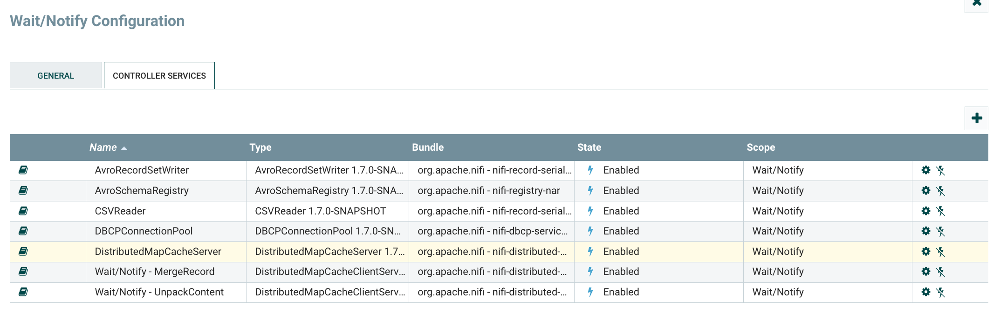
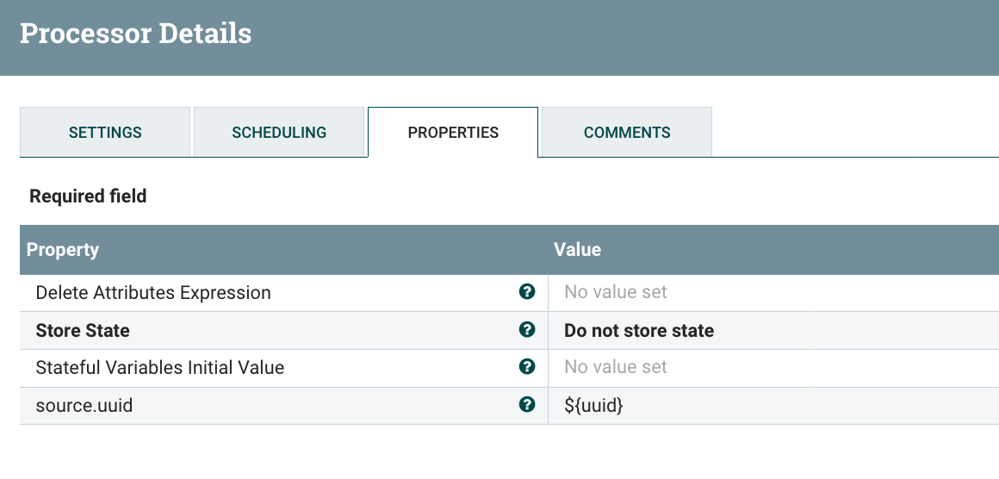
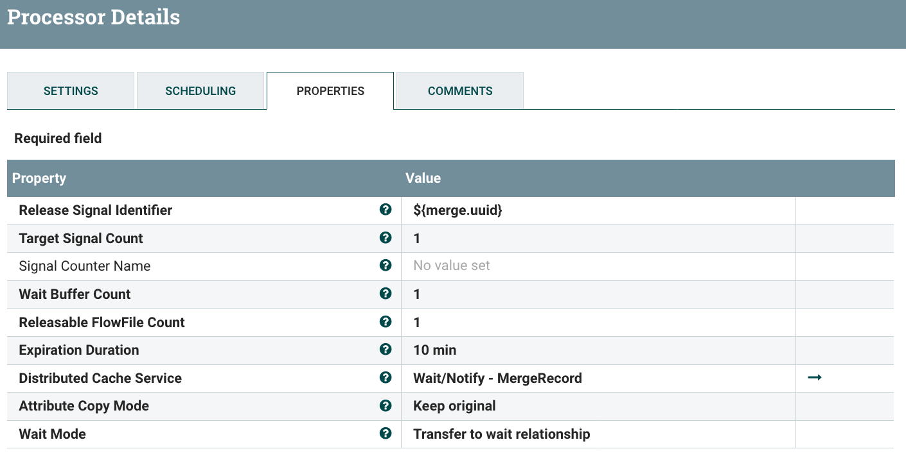

Thanks to [NIFI-4262](https://issues.apache.org/jira/browse/NIFI-4262) and [NIFI-5293](https://issues.apache.org/jira/browse/NIFI-5293), NiFi 1.7.0 contains a small improvement allowing users to extend the Wait/Notify pattern to merging situations.

If you're not familiar with the Wait/Notify concept in NiFi, I strongly recommend you to read [this great post from Koji about the Wait/Notify pattern](http://ijokarumawak.github.io/nifi/2017/02/02/nifi-notify-batch/) (it'll be much easier to understand this post).

When using the Merge\* processors, you have one relationship to route the flow file containing the merged data and one relationship to route the original flow files used in the merging operation. With NIFI-4262 for the MergeContent processor (and NIFI-5293 for the MergeRecord processor), the original flow files used in the merge operation will now contain an attribute with the UUID of the flow file generated by the merge operation. This way, you now have a way to link things together and that's really useful to leverage the Wait/Notify pattern.

### **Use case presentation**

Let's demonstrate the feature with a use case: I'm receiving ZIP files containing multiple CSV files that I want to merge together while converting the data into Avro and send it into a file system (for simplicity here, I'll send the data to my local file system, but it could be HDFS for instance).

The idea is the following:

**ListFile -> FetchFile -> UnpackContent -> MergeRecord -> PutFile**

That's easy and it works great... BUT... I want to be able to monitor and track exactly how each ZIP file is handled and when the data contained in a ZIP file is stored in the destination. I have a requirement to maintain in real-time the following tables:

Table 'zip\_files\_processing'

- zip\_file\_name - unique name of the received ZIP files
- ff\_uuid - flow file UUID (useful to replay events in case of errors)
- ingestion\_date - date when the zip file starts being processing in NiFi
- storage\_date - date when all the data of the ZIP file has been processed
- number\_files - number of CSV files contained in the ZIP file
- number\_files\_OK - number of files successfully stored in the destination
- number\_files\_KO - number of files unsuccessfully processed
- status - current status of the process for the ZIP file (IN\_PROGRESS, OK, KO)

Table 'files\_ingestion'

- zip\_file\_name - unique name of the zip file containing the CSV file
- file\_name - name of the CSV file
- ff\_uuid - flow file UUID (useful to replay events in case of errors)
- storage\_date - date when the CSV file has been processed
- storage\_name - name of the destination file containing the data
- status - current status of the process for the CSV file (IN\_PROGRESS, OK, KO)

That's where the Wait/Notify is going to be extremely useful.

### **High level description of the workflow**

Here is the main idea behind the workflow:


Let's describe the workflow at a high level:

- List the data available and insert rows in my zip\_files\_processing table for each listed file so that I can track ingested data
- Fetch the data (in case of error, I update the zip\_files\_processing table to set the status to KO)
- I unpack my ZIP files to get a flow file per CSV file, and I route the original flow file to a Wait processor. The flow file representing the ZIP file will be released only once all the associated CSV files will be fully processed
- For each CSV file, I insert a row in my files\_ingestion table to track the status of each CSV file being processed
- I merge the data together while converting the data from CSV to Avro, and I route the original flow files to a Wait processor. The flow files will be released only once the merged flow file will be sent to the final destination
- I send the merged flow file to the destination (local file system in this case) and then use the Notify processor to release all the original flow files used to create the merged flow file
- Then I use the released flow files to notify the first Wait processor and also release the flow file representing the corresponding ZIP file
- With all the released flow files, I can update my monitoring tables with the appropriate information

### Workflow details

Here is the full configuration of the workflow and some explanations around the parameters I used. Also, [here is the template of the workflow I used](https://gist.github.com/pvillard31/86bbd983057d3386611692d217a359b0) - it'll be easier to understand if you have a look, give it a try and play around with it (even without the SQL processors) - note that you will need to add a Distributed Map Cache server controller service to have the Distributed Map Cache clients working with Wait/Notify processors:



Let's start describing the ingestion part:


Nothing very strange here. Just note the UpdateAttribute processor I'm using to store the original UUID to a dedicated attribute so that I don't loose it with the UnpackContent processor (that creates new flow files with new UUIDs).



The first PutSQL is used to insert new lines in my ZIP monitoring table for each ZIP file I'm listing. I'm executing the below query:


The second PutSQL is used in case of error when fetching the file from the local file system or when an error occurs while unpacking the archive. In such a case, I'm executing the below query:


Let's now focus on the second part of the workflow:


The UnpackContent processor is used to extract the CSV files from the ZIP file. For one flow file representing the ZIP file, it will generate one flow file per CSV files contained in the ZIP file. The original flow file will then be routed in the original relationship while flow files for CSV data will be routed in the success relationship. The flow files containing the CSV data will have a 'fragment.identifier' attribute and that's the common attribute between the original flow file and the generated ones that I'm going to use for Wait/Notify (this attribute is automatically generated by the processor). Besides the original flow file also has a 'fragment.count' attribute containing the number of generated flow files for the CSV data.

The Wait processor is configured as below:


Basically I'm setting the identifier of the release signal to the common attribute shared between the original and the generated flow files, and I'm saying that I have to wait for 'fragment.count' signal before releasing the original flow file to the success relationship. Until then, the flow file is transferred to the 'wait' relationship which is looping back on the Wait processor. Also, I configured a 10 minutes timeout in case I didn't received the expected signals, and in this case the flow file would be routed to 'expired' relationship.

After my Wait processor, in case of error, I'm using an UpdateAttribute to retain this error:


And after that, I'm using the PutSQL processor to update the ZIP monitoring table by executing the below query:


The 'wait.\*' attributes are generated by the Wait processor when releasing the flow file and contain the number of signals sent by the Notify processor (I'll come back to that when describing the corresponding Notify processor). In this case, it allows me to know how many files contained in the ZIP file have been successfully processed and how many have not been successfully processed.

After the UnpackContent and the success relationship, I'm using a PutSQL to insert lines in my CSV monitoring table by executing the below query:


The 'segment.original.filename' is the name of the ZIP file from which the CSV files have been extracted.

Let's move to the final part of the workflow (it's a bit loaded because I wanted to have everything in my screenshot):


The MergeRecord is used to merge the data together while converting from CSV to Avro:


In a real world use case, you would configure the processor to merge much more data together... but for the below demonstration I'm merging few flow files together so that I can quickly see the results.

Also I'm generating dummy data like:


And the corresponding schema I'm using in the Avro Schema Registry controller service is:


After the MergeRecord processor, there is the 'original' relationship where are routed the flow files used during the merge operation, and there is the 'merged' relationship where are routed the flow files containing the merged data. As explained above, the original flow files are containing a 'merge.uuid' attribute with the UUID of the merged flow file. That's the attribute I'm using in the Wait processor configuration:



Basically, I'm creating a signal identifier in the distributed cache with the 'merge.uuid' processor and as long as the signal counter is greater than 1, I'm releasing one flow file at a time. You'll see in my Notify configuration (coming back to that in a bit) that, once my merged data is processed, I'm using the Notify processor to set the signal counter associated to the identifier with a value equal to the number of merged flow files. This way, once there is the notification, all the corresponding flow files will be released one by one.

I won't describe the PutFile processor which is used to store my data (it could be a completely different processor), but just notice the UpdatAttribute I'm using in case of failure:


And the UpdateAttribute I'm using in case of success:


Note that I'm setting attributes with the same prefix 'wn\_ingestion.\*'. Then, look at my Notify processor:


The 'uuid' attribute is equal to the 'merge.uuid' I mentioned above for the original flow files used in the merge operation. Besides, I'm using the Attribute Cache Regew property to copy the corresponding attributes to all the flow files going to be released thanks to this signal. It means that when a merged flow file is sent to the Notify processor, all the original flow files with the corresponding in the 'merge.uuid' in the 'wait' relationship will be released and will get the 'wn\*' attributes of the merged flow file. That's how I'm "forwarding" the information about when the merged flow file has been sent to the destination, if the merged flow file has been successfully processed or not, and what is the filename used to save the file in the destination.

Once the original flow files are released from the Wait processor, they are sent to the Notify processor with the below configuration:


In this case, I'm using the attribute inherited from the merged flow file sent to the destination to determine if the processing has been successful or not. If yes, then I'm setting the counter name to 'OK', otherwise it's set to 'KO'. That's how I'm getting the information about how many CSV files from a given ZIP have been successfully processed or not. (remember the 'wait.counter.OK' and 'wait.counter.KO' attributes created when the flow file corresponding to the ZIP file is released?).

And now... I can execute my SQL query to update my CSV monitoring table with the latest information:


### Demonstration

Let's see how the workflow is working and what's the result in all kind of situations. I'm running a Postgres instance in a Docker container to store my monitoring data. Here are the statements I used to create the two tables.

```
CREATE TABLE IF NOT EXISTS zip_files_processing (
 zip_file_name varchar(255),
 ff_uuid varchar(255),
 ingestion_date timestamp DEFAULT current_timestamp,
 storage_date timestamp,
 number_files integer,
 number_files_OK integer,
 number_files_KO integer,
 status varchar(15)
);
```

```
CREATE TABLE IF NOT EXISTS files_ingestion (
 zip_file_name varchar(255),
 file_name varchar(255),
 ff_uuid varchar(255),
 storage_date timestamp,
 storage_name varchar(255),
 status varchar(15)
);
```

#### Case 1 - nominal situation

In this case, all the received data is OK and all is working flawlessly... Let's say I'm receiving two ZIP files. Once the data is received, I can see something like:


 

Then the ZIP files are unpacked, and I can see my CSV files in the other table:


Then the data is merged and sent to the destination. At the end, my tables looks like:


I can see that the data coming from the two ZIP files has been merged into the same final file and everything is OK. In the ZIP monitoring table, I have:


#### Case 2 - cannot fetch ZIP file

In this case, the FetchFile processor is failing due to some permission issues. Here is what I get in my ZIP monitoring table:


Note that I could a 'comment' column with the error cause.

#### Case 3 - cannot unpack ZIP file

Result will be identical to case 2 as I'm handling the situation in the same way.

#### Case 4 - cannot merge records because a CSV file is not schema valid

I'm processing 2 ZIP files but a CSV file contained in one of the ZIP file cannot be merged with the others because it does not respect the schema. Note that all the flow files used during a merge operation will be sent to the failure relationship if one of the flow file is not valid. That's why multiple flow files will be routed to the failure relationship even though there is only one bad file. To avoid this situation, it would be possible to add an additional step by using the ValidateRecord processor.

For my ZIP files, I have:


At the end, for this run, I have:

 


#### Case 5 - cannot send a merged file to destination

In this case I'm simulating an error when sending a merged flow file to the destination. Here is the result at the end for the ZIP table:


And the CSV files table:


### Conclusion

I've covered a non exhaustive list of situations and the workflow could be improved but it gives you a good idea on how the Wait/Notify pattern can be used in a NiFi workflow to help monitoring what's going on when dealing with split / merge situations. In addition to that, it'd easy to add an automatic mechanism to try replaying failed flow files using the UUID and the provenance repository replay feature of NiFi.

Thanks for reading this post and, as always, feel free to comment and/or ask questions!
