Starting with NiFi 1.7.0 and thanks to the work done by Johannes Peter on [NIFI-4185](https://issues.apache.org/jira/browse/NIFI-4185) and [NIFI-5113](https://issues.apache.org/jira/browse/NIFI-5113), it's now possible to use an XML reader and writer in the Record processors to help you processing XML data. Before that, you had few options requiring a bit of additional work to get things working (see [here](http://pierrevillard.com/2017/09/07/xml-data-processing-with-apache-nifi/)).

I won't go into the details because the reader/writer are really well documented (have a look at the additional details for examples):

- [XML Reader documentation](https://nifi.apache.org/docs/nifi-docs/components/org.apache.nifi/nifi-record-serialization-services-nar/1.7.0/org.apache.nifi.xml.XMLReader/index.html) ([additional details](https://nifi.apache.org/docs/nifi-docs/components/org.apache.nifi/nifi-record-serialization-services-nar/1.7.0/org.apache.nifi.xml.XMLReader/additionalDetails.html))
- [XML Writer documentation](https://nifi.apache.org/docs/nifi-docs/components/org.apache.nifi/nifi-record-serialization-services-nar/1.7.0/org.apache.nifi.xml.XMLRecordSetWriter/index.html) ([additional details](https://nifi.apache.org/docs/nifi-docs/components/org.apache.nifi/nifi-record-serialization-services-nar/1.7.0/org.apache.nifi.xml.XMLRecordSetWriter/additionalDetails.html))

Also, with [NIFI-4227](https://issues.apache.org/jira/browse/NIFI-4227), a ForkRecord processor is now available to "explode" your data when you have one or multiple embedded arrays in your data set and you need to normalize your data. Have a look at the [ForkRecord documentation](https://nifi.apache.org/docs/nifi-docs/components/org.apache.nifi/nifi-standard-nar/1.7.0/org.apache.nifi.processors.standard.ForkRecord/index.html) ([additional details](https://nifi.apache.org/docs/nifi-docs/components/org.apache.nifi/nifi-standard-nar/1.7.0/org.apache.nifi.processors.standard.ForkRecord/additionalDetails.html)) for examples.

### Example - Introduction

Let's go through an example using the XML Reader and the ForkRecord processor. I assume I'm receiving XML data with the following schema:

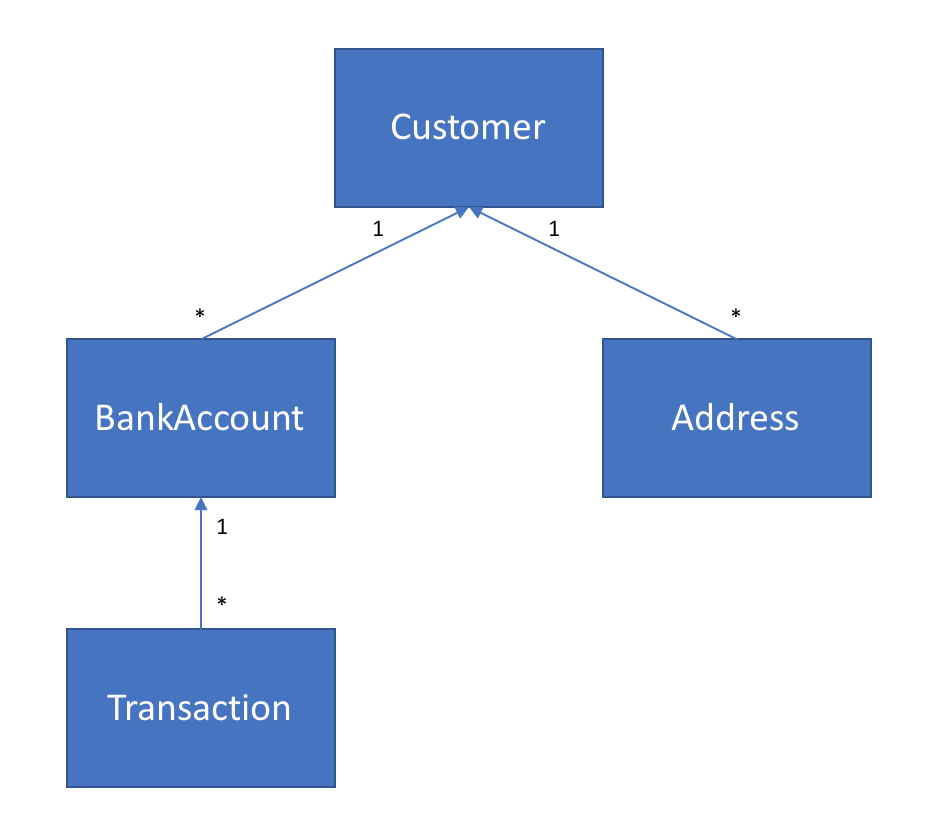

And here is a [dummy file](https://gist.github.com/pvillard31/7c371e345e5816ab801117c2f54726d4) I'm receiving that I'll use for this example:

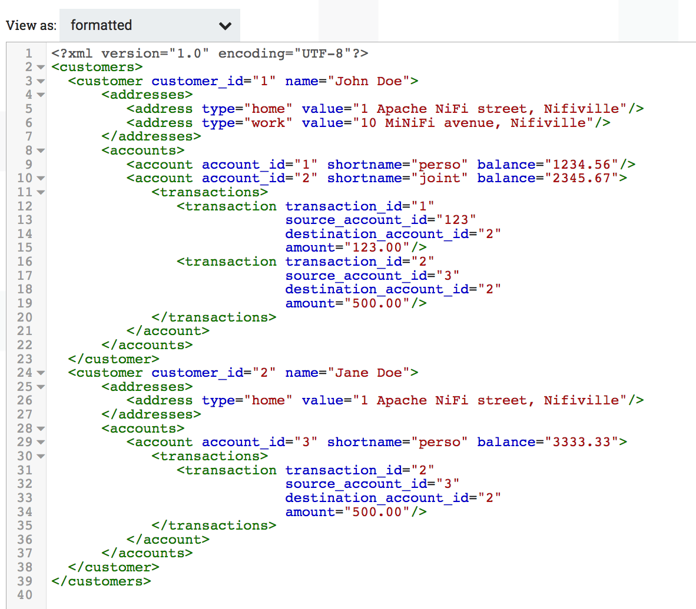

The corresponding Avro schema can be found [here](https://gist.github.com/pvillard31/bf30f0dccc474ba1fd91dccab09752a9). Defining the Avro schema corresponding to your data is the most "difficult" part but once it's done, everything else is really easy with the Record processors. You can get some help using the InferAvroSchema processor but this should only be used to get an initial version of your Avro schema when you start developing your workflows (it should not be used as a processor used in your production workflows).

I'm going to quickly explain the following workflow ([template available here](https://gist.github.com/pvillard31/eeea8a462992e034ffeefc87dd7e4731)):

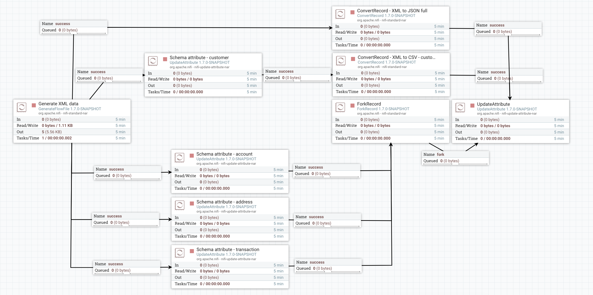

### Example - XML to JSON conversion

The GenerateFlowFile is used to generate my XML data and to send the content to the Record processors I'm using. The upper part of the workflow is just a ConvertRecord processor to perform the XML to JSON conversion thanks to the schema. The other parts of the workflows are used to extract each "object" of my schema (customer, address, account and transaction).

Here are the configuration details for the XML to JSON conversion. The GenerateFlowFile is very simple:

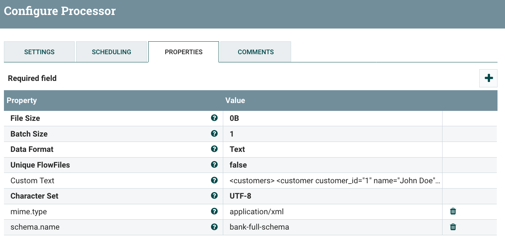

Note the attribute 'schema.name' set with the value of the schema I added in my Avro schema registry controller service:

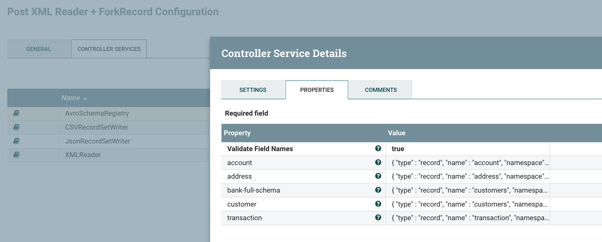

The XML Reader is configured to get the schema name from the 'schema.name' attribute of the processed flow files:

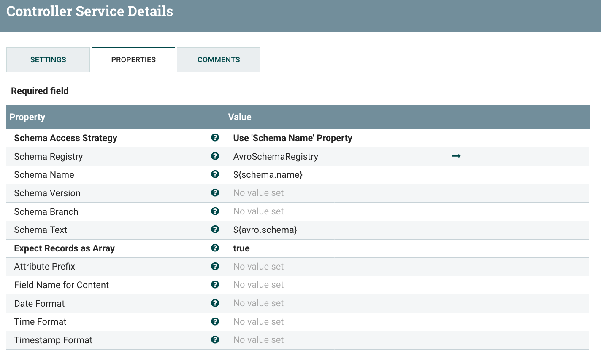

The JSON writer does not contain any specific configuration, it'll write the data using the schema inherited at the reader level:

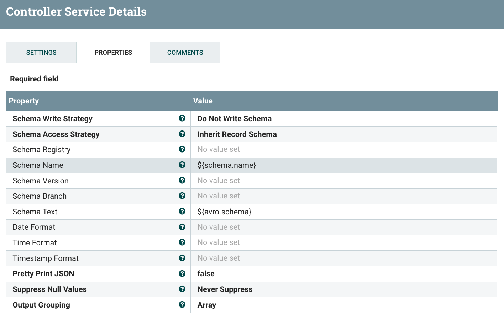

The ConvertRecord processor can now be configured for the XML to JSON conversion:

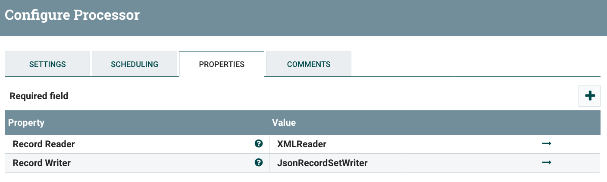

That's it! You now have a very easy and powerful way to perform your XML to JSON conversion. Here the flow file content before the processor:

Here is the JSON generated by the processor:

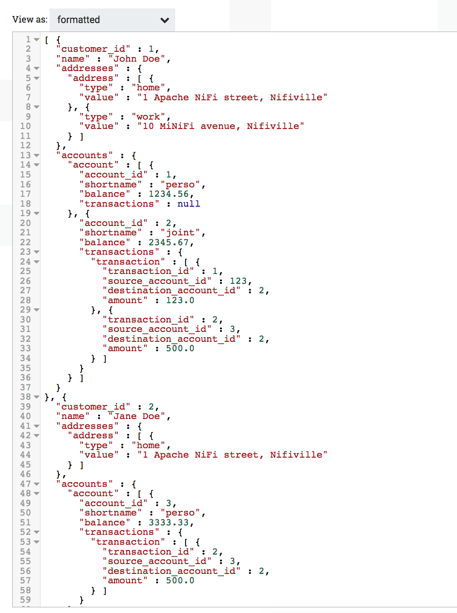

If you need to manipulate your records to go from one schema to another, you can use the UpdateRecord processor.

Note - using the XML Reader/Writer and Record processors, you can expect performances as good as the best options presented in my [previous post about XML data processing](http://pierrevillard.com/2017/09/07/xml-data-processing-with-apache-nifi/).

### Example - ForkRecord processor

The goal here is to extract the data contained in the arrays into separated CSV files. From one XML file, I want to generate 4 CSV files that I could use, for instance, to send data into database tables.

Let's start with the first one regarding customer data. I'm adding a 'customer' Avro schema in the Avro schema registry:

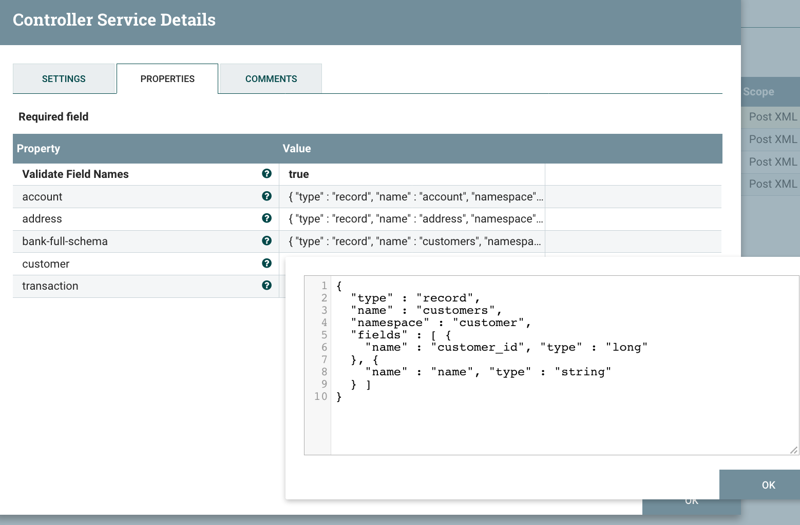

I'm using an UpdateAttribute, to set the name of the 'output.schema' that I want to be used by the CSV Record Writer. Then, I'm just using a ConvertRecord processor to process from XML to JSON and I only keep the root level fields (customer data). Here is the configuration of my CSV writer:

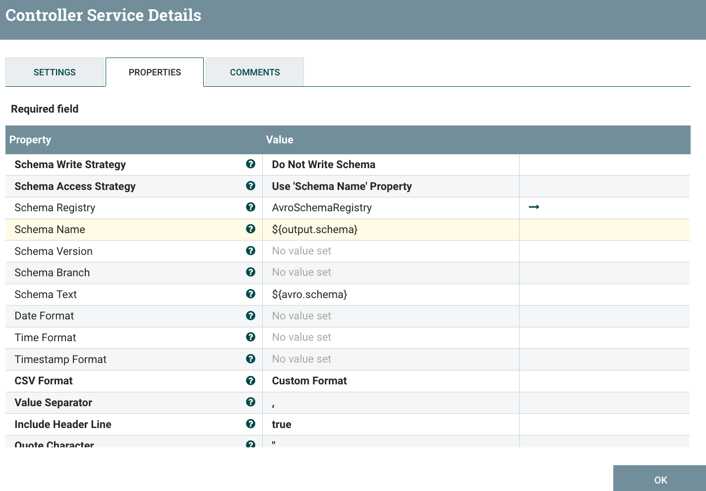

Here is the output when processing my XML data:

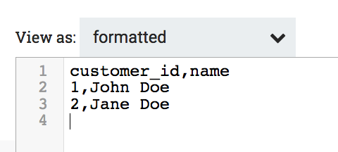

Now, I want to extract data contained in arrays and that's where the ForkRecord is useful. To use it, I need to specify a custom property containing the Record path to the array that the processor should process, then you have two modes for the processor:

- Split - that will preserve the input schema but will create one flow file per element contained in the array.
- Extract - that will generate flow files using the element of the arrays with the possibility to include the parent fields up to the root level in case you want to keep some fields as keys/identifiers of your arrays elements. Note that you can define which parent fields you want to preserve by setting the appropriate schema with only the fields you want.

In our case we're using the Extract mode and we are including the parent fields: for the 'address' data for instance, we want to keep the customer\_id field in the output (that field would be used as a key between the customer data and the address data in the database world). Here is the schema I define in my Avro schema registry for the 'address' object:

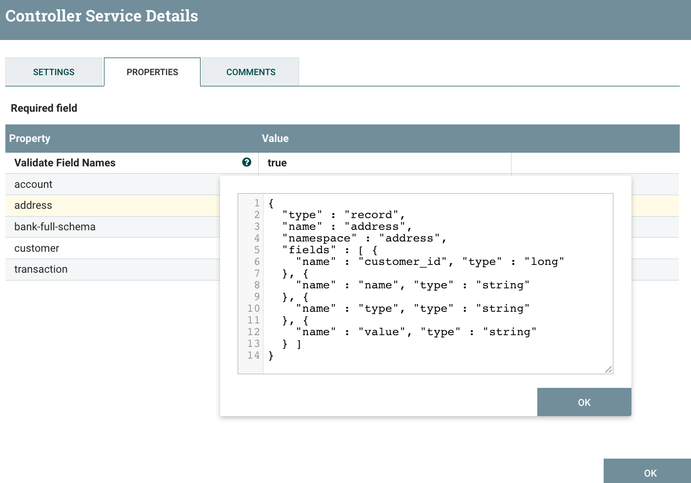

I'm using an UpdateAttribute to set the attributes I'm using in my reader and the ForkRecord processor:

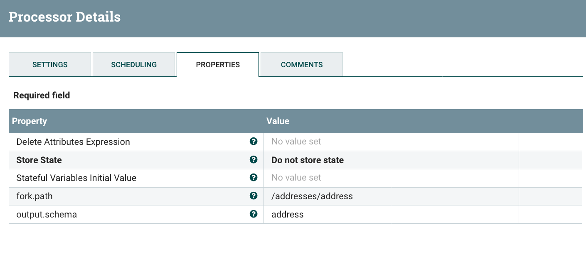

And I'm configuring the ForkRecord processor to use the 'fork.path' attribute defining the array of elements to be processed:

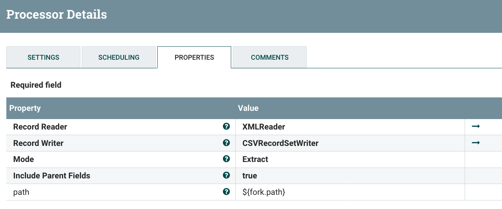

Note - if you have multiple Record paths pointing to multiple arrays with elements using the same output schema, you can define as many custom properties as you want.

And here is the output after the ForkRecord processor:

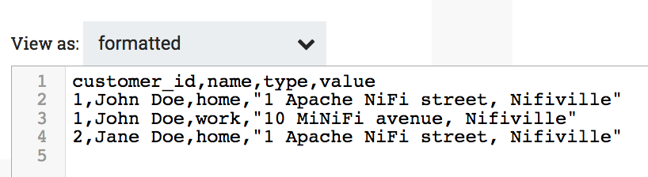

Here are the Record paths I'm setting for the other type of objects I want to extract:

- Account - fork.path = /accounts/account
- Transaction - fork.path = /accounts/account\[\*\]/transactions/transaction In this case, I need to specify account\[\*\] because I want to access all the transactions of all the elements in the account array. But I could use the Record path features to only access some specific accounts based on some [predicates](https://nifi.apache.org/docs/nifi-docs/html/record-path-guide.html#predicates).

And here the output I get (after defining the appropriate schema in my schema registry):

- Account data (I only keep the customer\_id from the parent fields):

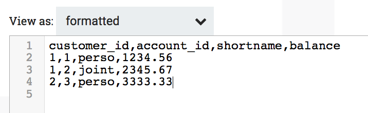

- Transaction data (I only keep the customer\_id and account\_id from the parent fields):

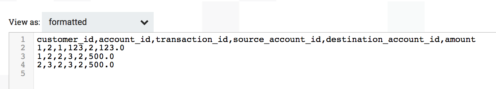

### Conclusion

The XML Reader & Writer are a really nice addition to NiFi if you need to process XML data and it will make your existing workflows much simpler! You really have to look at the Record processors and concepts as soon as you've a use case manipulating data complying to a schema.

The ForkRecord processor is a new processor that you can use if you need to manipulate schema oriented data containing a lot of arrays. That can be useful in case you need to normalize data before ingestion into databases.

Thanks for reading this post and, as always, feel free to comment and/or ask questions!
