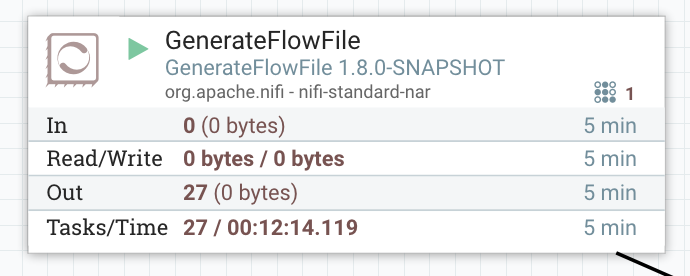

One of the new features coming with NiFi 1.7.0 is the possibility to terminate stuck threads directly from the UI. Before this release, when you had a processor getting stuck (like a custom processor with a deadlock) you had no option but to restart NiFi... and that's not really great in a multi-tenant setup.

Let's see this new feature with an example: I'm using a GenerateFlowFile and, using the debug mode of my IDE, I'm going to simulate an issue with the thread by adding a break point in the _onTrigger()_ method of the processor.



When the processor is running, we can see the number of threads currently used by the processor (top right). If the number of tasks is not increasing (and equal to 0 after 5 minutes) and the number of threads is constant, it probably means you have a stuck thread. In this case, it is **always** recommended to do a thread dump of NiFi to see what is going on. To do that:

```
./bin/nifi.sh dump /tmp/thread-dump.txt
```

If we look at the content of the generated file and looking for my GenerateFlowFile processor, we can see something like:

```
"Timer-Driven Process Thread-5" Id=57 RUNNABLE (suspended)
 at org.apache.nifi.processors.standard.GenerateFlowFile.onTrigger(GenerateFlowFile.java:210)
 at org.apache.nifi.processor.AbstractProcessor.onTrigger(AbstractProcessor.java:27)
 at org.apache.nifi.controller.StandardProcessorNode.onTrigger(StandardProcessorNode.java:1165)
 at org.apache.nifi.controller.tasks.ConnectableTask.invoke(ConnectableTask.java:203)
 at org.apache.nifi.controller.scheduling.TimerDrivenSchedulingAgent$1.run(TimerDrivenSchedulingAgent.java:117)
 at java.util.concurrent.Executors$RunnableAdapter.call(Executors.java:511)
 at java.util.concurrent.FutureTask.runAndReset(FutureTask.java:308)
 at java.util.concurrent.ScheduledThreadPoolExecutor$ScheduledFutureTask.access$301(ScheduledThreadPoolExecutor.java:180)
 at java.util.concurrent.ScheduledThreadPoolExecutor$ScheduledFutureTask.run(ScheduledThreadPoolExecutor.java:294)
 at java.util.concurrent.ThreadPoolExecutor.runWorker(ThreadPoolExecutor.java:1142)
 at java.util.concurrent.ThreadPoolExecutor$Worker.run(ThreadPoolExecutor.java:617)
 at java.lang.Thread.run(Thread.java:745)
 Number of Locked Synchronizers: 1
 - java.util.concurrent.ThreadPoolExecutor$Worker@2388307
```

In this case, the thread is shown as "suspended" at the line where I put my break point in my IDE.

Note that having a stuck thread is usually a symptom of a badly designed processor or an underlying issue with the code dependencies of the processor. Having the thread dump can help locating and fixing the issue.

If trying to stop the processor:


I'll now see two threads being used by the processor:


The processor is now in the process of being stopped but you won't be able to update or restart the processor until it is actually stopped. However, if the initial thread is stuck, you'll remain in this state forever (and, eventually, you'll have to restart NiFi if you're running a version below 1.7.0).

With NiFi 1.7.0, you now have the possibility to terminate the thread (meaning you don't have to wait for the thread to be completely stopped):


If I terminate the thread, here is what I'll see:


Meaning there is no more active thread and there is one thread being terminated.

Under the hood, the framework is issuing an "[interrupt](https://docs.oracle.com/javase/tutorial/essential/concurrency/interrupt.html)" for the thread and will perform a "reload" of the processor meaning there is a new instance of the processor class being created. This allows the old class to eventually shut down gracefully, close connections, etc. However this needs to be used with care: if the class is maintaining some values in internal variables, this information will be lost in the process (I'm not talking about state information that can be saved at framework level by the processors).

An _interrupt_ is an indication to a thread that it should stop what it is doing and do something else. It's up to the programmer to decide exactly how a thread responds to an interrupt, but it is very common for the thread to terminate. However if, for some reasons, the thread does not respond to interrupt, then you will keep the thread as being terminated forever (in my above example, I can see the thread staying in the state of being terminated because of my break point).

You can now update the configuration and start again the processor (even if a thread is being terminated). Once the thread is terminated, you'll get back to a nominal situation:


If you don't want to setup a debug environment, you can simulate a stuck thread with the following ExecuteScript processor:


If starting/stopping the processor:


And I'll get the following message when terminating the thread:


You also can use the DebugFlow processor with "@OnStopped Pause Time" set to something like "5 min" and "Ignore Interrupts When Paused" set to "true":


That's it for this post! This new feature is really nice in a multi-tenant environment where you can't afford a restart of the service. If you're in a situation where you need to use this feature, remember to take a thread dump before actually terminating the thread. This will be really useful to investigate the issue. Also, remember that terminating a thread is not a "normal" operation, it means there is something wrong somewhere and it could very likely happen again.

Thanks for reading this post and, as always, feel free to comment / ask questions!
