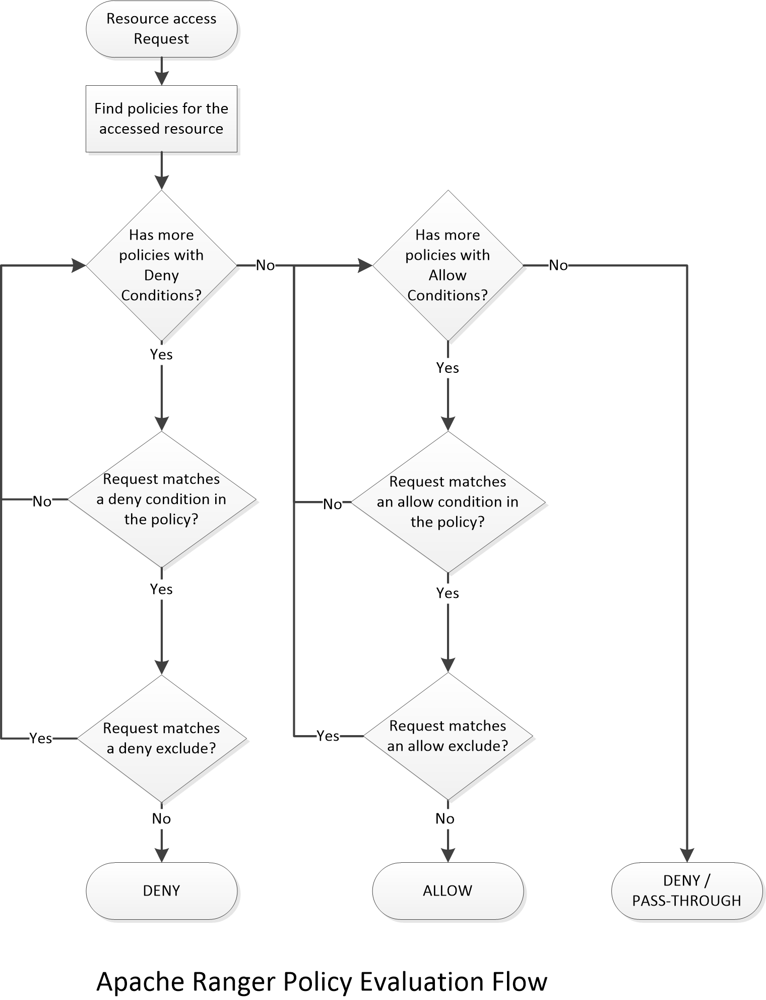
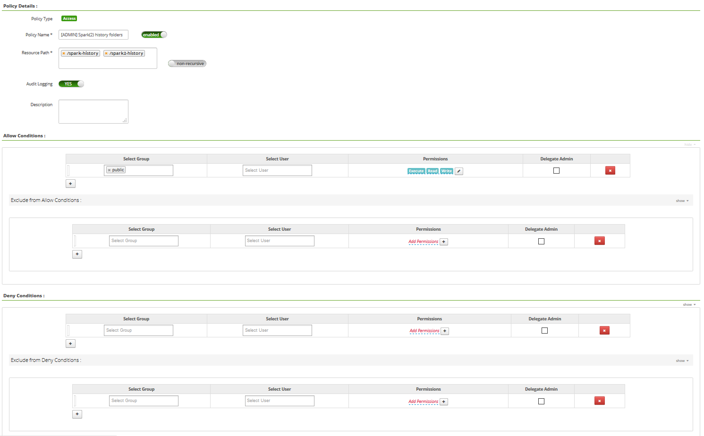
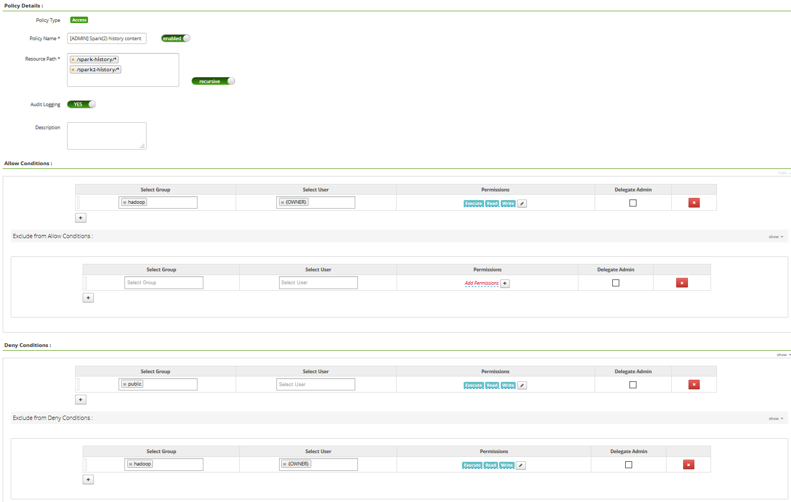

OK... so... [Apache Ranger](https://ranger.apache.org/) is the piece you want to use to define authorizations in your cluster (and, most importantly, get all the audits coming with all the policies you define). Not only for HDFS but for all the components you're using. In this post I just want to discuss about policies to secure how HDFS is used.

More specifically, here is my scenario:

- I have a project called 'myProject' consisting of a Spark job accessing and processing sensitive data sitting in HDFS and the result of this processing is written back into HDFS as well. This data is so sensitive that users should not be able to access it unless specific permissions are granted. The job is running with the user 'myProjectUser'.

Now... let's say the team working on the project does not have permissions to access the production data and has mock datasets for development and staging environments. OK great, that's usual situation. BUT... we have a rogue user, John Doe, in the development team and, somehow, he is able to introduce some lines of code so that the Spark job is writing the result in two places: the expected location where results should be written, and another unexpected place where John Doe has access on the production cluster. How can you prevent that?

Well... the immediate answer is a proper development process with pull requests and peer reviewing on any commit pushed to the code repository you're using. But... let's say that's not enough, or, that two rogue users agreed to commit that code through a pull request. How can you set the Ranger policies to prevent this specific scenario?

_Note - for this post, when I'm saying a folder has hdfs:hadoop:755, it means that chmod 755 and chown hdfs:hadoop have been set on that folder._

Let's talk quickly about how Ranger works and, more specifically, how it works with HDFS. By default, Ranger allows you to define "allow" policies. Meaning that you grant specific access (read, write, execute) to a specific resource (file, folder) in HDFS. But something you need to recall is that, by default, **HDFS ACLs will apply in combination with Ranger policies** (both are used to check whether a user can access a resource). It means that, if you have:

- a folder /myFolder with hdfs:hadoop:755 in HDFS
- an "allow" policy saying that people belonging to group "sales" have RWX access to /myFolder

In reality, this "allow" policy does not prevent any access from people not belonging to the "sales" group. Since chmod is 755 anyone having access to HDFS can read the data inside that folder.

However, if you set chmod 000 to that folder, then, only the "allow" policy will apply and only people belonging to the "sales" group will have access to the folder.

_Note - that's not entirely true since there is one exception: the HDFS superusers you defined. Any HDFS superuser can access any folder. When sending a request to the Name Node (NN), the NN will check the identity of the requester and if it's a superuser, it'll not go through the authorization parts of the code. If you want to prevent HDFS superusers to access some data, then you probably want to look at Ranger KMS that will help ensuring segregation of duties by encrypting the data in HDFS using encrypting keys only available to specific users._

_Note - it's possible to prevent Ranger fallbacking on HDFS ACLs by setting **xasecure.add-hadoop-authorization=false** but it means you have to set Ranger policies for everything. That's doable but can require some efforts to do it properly._

Now that you're aware of that behavior, you probably want to look at [this post with some best practices about Ranger and HDFS](https://fr.hortonworks.com/blog/best-practices-in-hdfs-authorization-with-apache-ranger/). The first thing I'd recommend is **to change the default umask from 022 to 077** to ensure that, by default, a newly created file/directory can only be read by the owner unless a Ranger policy states otherwise.

Then, you want to take care of some specific folders in HDFS such as the ones under /apps (folders used by Hive, HBase, Zeppelin, etc). The idea is to set chmod 000 on the folders so that HDFS ACLs do not apply and only Ranger policies are enforced. Let's say you have /apps/hive/warehouse where all your Hive databases are stored. If you set chmod 000 on /apps/hive, then no one can go inside a subfolder of /apps/hive unless there is an "allow" policy in Ranger for that user.

OK, that's great... but let's go back to our scenario where we have a rogue user... Our John Doe can SSH to an edge node on the production cluster where he has his home directory on HDFS (/user/jdoe with jdoe:jdoe:700). We could say that we are safe: the job running as myProjectUser does not have permissions to write in /user/jdoe. But there is nothing preventing jdoe to change the permissions on his home directory with a chmod 777 (however, only an HDFS superuser can execute a chown command to change ownership on a directory). Once John Doe changed the permissions, the job can write into that folder and then John can do whatever he wants with the data... Even though you're defining "allow" policies in Ranger.

Let's have a look at the folders potentially exposing this issue. We have:

- /user
- /tmp
- /app-logs
- /mr-history
- /spark-history
- /spark2-history

The above folders (except /user) have, by default, a chmod 777 technically allowing anyone to create a folder there and use that folder for an unexpected purpose. Let's have a look and let's try to ensure no one can create something we don't want.

### Example - /spark-history & /spark2-history (part 1)

That's where the Spark History Server(s) are going to store data about ongoing Spark jobs, and completed jobs based on retention policies you defined. If we look at the structure:

```
/spark-history is spark:hadoop:777
```

and then we have folders such as:

```
/spark-history/<folder> with <user running the job>:hadoop:770
```

Folders are complying with a naming convention but we don't really care here.

The objective is to get rid of the chmod 777 at the top level BUT... the issue here is that a user running a job needs the right to create a directory. So, basically, anyone needs the right to create a directory in /spark-history. I can't just set chmod 000 and define "allow" policies... And that's where Ranger introduced a very nice feature: the "deny" policies.

### The "deny" policies in Ranger

If you want all the details, [have a look here](https://cwiki.apache.org/confluence/display/RANGER/Deny-conditions+and+excludes+in+Ranger+policies) and [here](https://cwiki.apache.org/confluence/display/RANGER/How+Deny+Policies+Work+in+Apache+Ranger). The main idea is to add the option, when defining a policy, to:

- exclude groups or users from the allow policy
- deny access to users/groups on the resource
- exclude groups or users from the deny policy

Then, here is how the policy is evaluated in the authorizer:



Basically, if there is no "deny" policy, the most permissive access between Ranger policies and HDFS ACLs will be used to grant access to the resource. In other words, unless you specifically defined a "deny" policy that applies for the accessed resource, the HDFS ACLs will always be considered for authorization.

### Enabling the "deny" policies

By default, the "deny" policies are not available in the Ranger UI. It's mainly because the concept can be hard to understand and things can quickly become a mess when using the "deny" policies. Also, for most of the users, this feature will never be used. One needs to be careful and rigorous when using that feature.

To enable it, retrieve the HDFS service definition from the Ranger Admin server:

```
$ curl -k -u <user> https://<ranger_admin_server>:6182/service/public/v2/api/servicedef/1 > hdfs.json
```

Then, have a look at the content:

```
$ cat hdfs.json
{...,"isEnabled":true,"name":"hdfs","options":{"enableDenyAndExceptionsInPolicies":"false"}...}
```

In the "options" field, you can add (or modify it if it's already there):

```
"options":{"enableDenyAndExceptionsInPolicies":"true"}
```

Then you just have to update the service definition:

```
$ curl -k -u <user> -X PUT -H "Accept: application/json" -H "Content-Type: application/json" -d @hdfs.json https://<ranger_admin_server>:6182/service/public/v2/api/servicedef/1
```

### Variables in Ranger

In addition to the "deny" policies (introduced in Ranger 0.6), we're going to use the [variables](https://cwiki.apache.org/confluence/display/RANGER/Support+for+%24username+variable) (introduced in Ranger 0.7). We can use:

- {OWNER} - owner of the resource
- {USER} - user accessing the resource

It's a very convenient way to define policies without specifically specifying users.

### Example - /spark-history & /spark2-history (part 2)

We now have the tools to secure our /spark-history server by creating the following rules:

- on /spark-history
    - Allow policy for group "public", RWX permissions, non-recursive. This rule allows us to set chmod 000 in HDFS to keep things clean.



- on /spark-history/\*
    - Allow policy for group "hadoop" and user "{OWNER}", RWX permissions.
    - Deny policy for group "public", RWX permissions. For any resource in /spark-history, no one has access.
    - Exclude deny policy for group "hadoop" and user "{OWNER}", RWX permissions. For any resource in /spark-history, only users of the "hadoop" group (such as spark), and owner of the resources have RWX permissions.



_Note - "public" group is a convention meaning anyone. Note - same approach applies for /spark2-history_

With the policies we defined, anyone can create a folder, but only the owner of that folder can access the data inside, or write data inside. We have now secured our /spark-history and /spark2-history folders.

### Example - /mr-history

Let's have a look at the folders structure for /mr-history

/mr-history with mapred:hadoop:777

/mr-history/done with mapred:hadoop:777 /mr-history/tmp with mapred:hadoop:777

/mr-history/tmp/<user> with <user>:hadoop:770

/mr-history/done/<year> with mapred:hadoop:770 /mr-history/done/<year>/<month> with mapred:hadoop:770 /mr-history/done/<year>/<month>/<day> with mapred:hadoop:770 /mr-history/done/<year>/<month>/<day>/<folderID> with mapred:hadoop:770

And in that last folder, we only have files (usually an XML file and a JHIST file for each job) with <user running the job>:hadoop:770.

When a job is launched by _myUser_, a folder (if not already existing) named _myUser_ is created in /mr-history/tmp and this folder will be used to store metadata files about the running job. Once the job is completed, the user _mapred_ will move the file from that folder into the corresponding /mr-history/done subfolder.

In conclusion, we can set chmod 000 on /mr-history and define the following rules:

- on /mr-history/done
    - grant RWX permissions to group "hadoop" and user "activity\_analyzer" (if you're using SmartSense to provide statistics on your cluster)
- on /mr-history/tmp, non-recursive
    - grant RWX permissions to group "public" so that anyone can create a folder
- on /mr-history/tmp/\*
    - grant RWX permissions to group "hadoop", users "activity\_analyzer" and "{OWNER}"
    - deny RWX permissions to group "public"
    - exclude deny RWX permissions to group "hadoop", users "activity\_analyzer" and "{OWNER}"

_Note - it's quite similar to the /spark-history approach._

### Example - /user

For that specific folder, we know that no one except HDFS superusers should be able to create a folder in /user, and every folder in /user should be something like /user/<user> with permissions <user>:hdfs:700 (just like usual home directories).

Then, we just have to set chmod 000 on the /user folder and add an "allow" policy:

- on /user/{USER}
    - allow policy granting RWX permissions to user "{USER}"

But we also have a particular situation to manage: the share lib folder of Oozie, by default, is located at /user/oozie/share/lib. We need to allow RX access to that folder to anyone launching Oozie jobs:

- on /user/oozie/share/lib
    - allow policy granting RX access to group "public"
    - allow policy granting RWX access to group "hadoop"

Since /user is set with chmod 000 we are sure no one can go inside that folder unless an allow policy is created.

### Example - /app-logs

Structure of /app-logs is very similar to what we've seen so far:

/app-logs with yarn:hadoop:777 /app-logs/<user> with <user>:hadoop:770

We're adding the following rules:

- on /app-logs, non-recursive
    - grant RWX permissions to group "public" so that anyone can create a folder (when a user is launching a job for the first time on the cluster, the user needs permission to create the folder)
- on /app-logs/\*
    - grant RWX permissions to group "hadoop" and user "{OWNER}"
    - deny RWX permissions to group "public"
    - exclude deny RWX permissions to group "hadoop" and user "{OWNER}"

We can now set chmod 000 on /app-logs to secure that folder.

### Example - /tmp

The /tmp folder is similar to what we did so far, but with an exception: there is a /tmp/hive folder used by Hive to store temporary data when Hive queries are executed. Because of [HIVE-18287](https://issues.apache.org/jira/browse/HIVE-18287), this folder needs to have chmod 733 or above (at HDFS ACLs level).

In /tmp/hive, we have folders like /tmp/hive/<user> with <user>:hdfs:700.

To summarize, we need to:

- Allow users creating folders in /tmp
- Keep chmod 733 on /tmp/hive
- Allow users creating folders in /tmp/hive/
- Only allow owners to modify data in /tmp/\*

As you can see, it's going to be difficult to manage because of the embedded folder used by Hive. The best approach is to change the Hive's configuration to change the location of the scratch directory. What I suggest is:

```
hive.exec.scratchdir=/apps/hive/tmp
```

This way you can easily define policies on that particular folder by following the same approach we did so far on the other folders. Once this is done, it's also easy to have the same approach to secure the /tmp folder:

- on /apps/hive/tmp, non-recursive
    - grant RWX permissions to group "public" so that anyone can create a folder (when a user is launching a job for the first time on the cluster, the user needs permission to create the folder)
- on /apps/hive/tmp/\*
    - grant RWX permissions to group "hadoop" and user "{OWNER}"
    - deny RWX permissions to group "public"
    - exclude deny RWX permissions to group "hadoop" and user "{OWNER}"

- on /tmp, non-recursive
    - grant RWX permissions to group "public" so that anyone can create a folder
- on /tmp/\*
    - grant RWX permissions to group "hadoop" and user "{OWNER}"
    - deny RWX permissions to group "public"
    - exclude deny RWX permissions to group "hadoop" and user "{OWNER}"

_Note - if you are using Spark/Spark2, don't forget that it relies on Hive's configuration files. In case you're using an Ambari managed Hortonworks cluster, you would have to add custom properties in "Custom spark-hive-site-override" for both Spark and Spark2 services._

_Note - if you are using Oozie and have workflows using Spark actions, then you'd have to leverage the action configuration feature in Oozie. [You can have a look here](https://oozie.apache.org/docs/4.2.0/AG_ActionConfiguration.html). In the case of the Hortonworks distribution, by default, you have_

```
oozie.service.HadoopAccessorService.action.configurations=*=action-conf
```

_And you have the following files/folders:_

_/etc/oozie/conf/action-conf/hive.xml_ _/etc/oozie/conf/action-conf/hive/hive-site.xml_ _/etc/oozie/conf/action-conf/hive/tez-site.xml_ _/etc/oozie/conf/action-conf/hive/atlas-application.properties_

_The hive-site.xml is automatically copied from /etc/hive/conf folder when Oozie server is restarted. But you need to do a change to have this data loaded for Spark actions. You can create spark and spark2 folders and create a symbolic link to the hive-site.xml file._

### Conclusion

Objective of this post was to give a quick overview of how Ranger is working for HDFS and what you need to consider if you want to secure your cluster. As you saw in this post, if you also want to prevent rogue users accessing data by changing the behavior of an application, you need to set few rules in order to secure the folders having a default chmod 777 at the HDFS ACLs level.

This post is certainly not exhaustive but should give you an idea of what you can do. As usual, feel free to comment / ask questions, and thanks for reading thus far.
