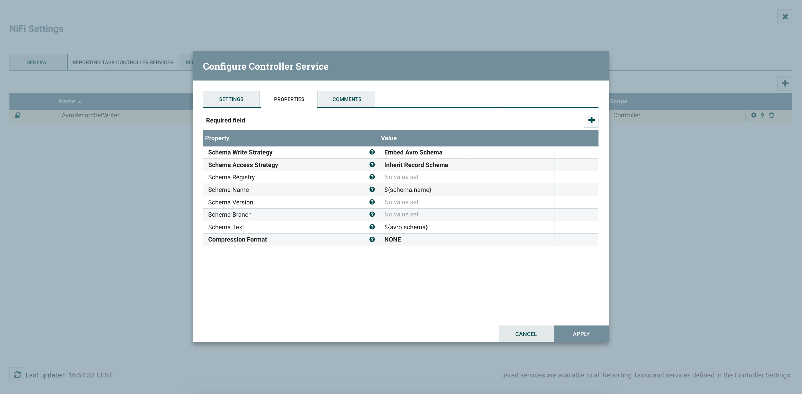
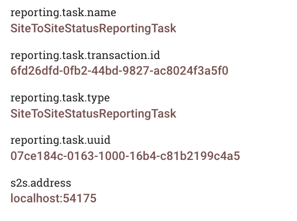

I already discussed the Monitoring Driven Development (MDD) approach [in this post](http://pierrevillard.com/2018/02/07/fod-paris-jan-18-nifi-registry-and-workflow-monitoring-with-a-use-case/) and already covered some monitoring topics around NiFi [in few posts](http://pierrevillard.com/2017/05/11/monitoring-nifi-introduction/) (reading the posts would probably help you for reading this one - or at least refresh your memory on some concepts). In this post I want to present once again the MDD approach with some new features of NiFi 1.7 making things a bit easier and cleaner.

**What do I mean when talking about MDD in NiFi?** When I say MDD, I refer to the fact that, when a team is developing a "core workflow" for a use case, the team should also develop a "monitoring workflow" that will be in charge of monitoring and reporting the health of the "core workflow" based on their business requirements.

**How does this work in NiFi?** This approach completely relies on two things:

- A proper naming convention for the components used in the workflows
- The use of the Site-to-Site Reporting Tasks ([see here](http://pierrevillard.com/2017/05/13/monitoring-nifi-site2site-reporting-tasks/))

Basically, the idea is to setup the S2S reporting tasks to send data to an input port dedicated to monitoring, then basic routing and filtering is performed assuming projects are following the naming convention so that all the data related to a given "core workflow" is automatically routed to the associated "monitoring workflow". This way, it's up to each project to implement the monitoring they want for their use case based on the requirements and SLA they have.

**What's new in NiFi that's going to help me with MDD?**

There are quite few interesting JIRAs but the two most important ones are:

- \[[NIFI-4814](https://issues.apache.org/jira/browse/NIFI-4814)\] - Add distinctive attribute to S2S reporting tasks (NiFi 1.6.0)
- \[[NIFI-5122](https://issues.apache.org/jira/browse/NIFI-5122)\] - Add record writer to S2S Reporting Tasks (NiFi 1.7.0)

* * *

**Example**

For my example, the naming convention is the following: any component that should be monitored should be named with a prefix ABC\_ where ABC is the three letters abbreviation representing the use case/project.

I have two projects, one named PJA and one named PJB.

Let's say the project A is using HandleHttpRequest/Response to receive XML data over HTTP and has two monitoring requirements:

- Send an email to the team in case a bulletin is generated
- Monitor in Grafana the amount of valid/invalid data being processed

Let's say the project B is using ListenTCPRecord for a use case around logs ingestion and has one monitoring requirement:

- Send an email to the team in case back pressure is enabled

The development of the workflows is outside the scope of this post. I'll keep things simple as the objective is to demonstrate the MDD approach, not how to implement the workflows of the specific use cases I chose.

A \*very basic\* implementation of the "core workflow" of PJA could be:

A \*very basic\* implementation of the "core workflow" of PJB could be:

Now I'm going to configure the S2S Reporting Tasks - one for Controller Status data and one for Bulletins data. Note that there is a new feature allowing users to select a Record Writer for the generated data. I'm going to use the Avro one for the reporting tasks so that I don't have to care about the schemas at all. For that I need to create a Controller Service (in Controller Settings menu since this controller service is exclusively used by reporting tasks).

After enabling the CS, I can configure my reporting tasks.

The one for bulletins:

And the one for controller status:

Note that you have additional S2S Reporting Tasks if needed. The one about provenance events can be particularly useful for some monitoring requirements such as latency.

At the root level of my canvas, I've something looking like:

I'm receiving all the monitoring data sent by the reporting tasks in the 'monitoring' input port. Then in my 'Monitoring' process group, I have something looking like:

You can notice I'm sending all the data to a 'Technical Monitoring'. That's because, the team in charge of administrating/monitoring the platform probably wants to also have a look at the monitoring data to ensure the full system is performing OK (common examples: send the bulletins to an external tool like ES/Kibana, send email alerts in case back pressure is enabled on a connection, etc).

On the upper part of the workflow, that's where I'm processing the monitoring data to split it and route the monitoring data by project. First I'm using a RouteOnAttribute to route the data based on the type (bulletins, controller status, etc):

Then I'm using an UpdateRecord processor to add a 'project' field that I'm computing based on the component name.

For bulletins:

For controller status:

Since the data has been sent in Avro format by the reporting task, I'm using an Avro reader Controller Service with default settings. And, from now on, I want the data to be in JSON (as it'll be easier in case I want to send the data via an email or via HTTP). I'm configuring few controller services: one Avro Schema Registry containing the schemas (that you can retrieve in the additional details of the reporting task documentation, see below), one JSON Reader and one JSON Writer.

For instance, to get the schema of the S2S Bulletin Reporting Task, go on the reporting task list:

Click on the documentation icon on the left:

And then click Additional Details:

When adding the schemas in the Avro Schema Registry, use the type of the reporting task as the name of the schema and don't forget to add a 'project' field in the schemas:

Now you can easily reference the schemas to use in the configuration of the JSON Reader/Writer using the expression language because the flow files generated by the reporting tasks have an attribute with the type of the source reporting task.

Example of attributes on a flow file generated by a RT:

JSON Reader:

JSON Writer:

Now I've a 'project' field in my data with the project name (if the naming convention has been correctly used), then you can use a QueryRecord processor to route the data for each project:

And we can confirm that only the data for project A is routed to the 'Monitoring Workflow' for project A. If looking at the data in the relationship routing data for PJA:

Now, when deploying a new project for the first time (ie importing the process group of the "core workflow"), you just need to update the QueryRecord processor to add a dynamic property for the new project as well as deploying the process group for the "monitoring workflow" of the project. In combination with the NiFi Registry it makes things really smooth when you need to update the workflows with a new version.

I'm not going to develop the monitoring workflows for PJA and PJB but it'd only be a matter of few record processors to filter the data (bulletin? back pressure enabled?), and then use a processor to send the data (ElasticSearch, PutEmail, InvokeHttp, etc):

- "send an email when a bulletin is generated" - RouteOnAttribute to get the bulletins data and PutEmail to send an email
- "monitor the number of valid/invalid XML files being processed" - filter the controller status statistics on the 'Connection' elements and keep only the statistics of the connections after the ValidateRecord processor, this can be easily done with a QueryRecord processor. The numbers can then be sent to an external system such as ElasticSearch for a dashboard in Kibana/Grafana
- "send an email when back pressure is enabled" - use a QueryRecord processor on the controller status data by querying the field 'isBackPressureEnabled' and then use PutEmail processor.

[The full workflow of this example is available as a gist here](https://gist.github.com/pvillard31/5b16813861d56987b60a92563649674b). Note that, since it's a template, it does not contain the Reporting Tasks configuration. But you should be up and running quite quickly with the above screenshots.

As always, thanks for reading this post, feel free to comment and/or ask questions. In case you have suggestions to make things even better, just let me know and, maybe, I'll have to publish a new version of this post to present the new features of a next release ;-)
