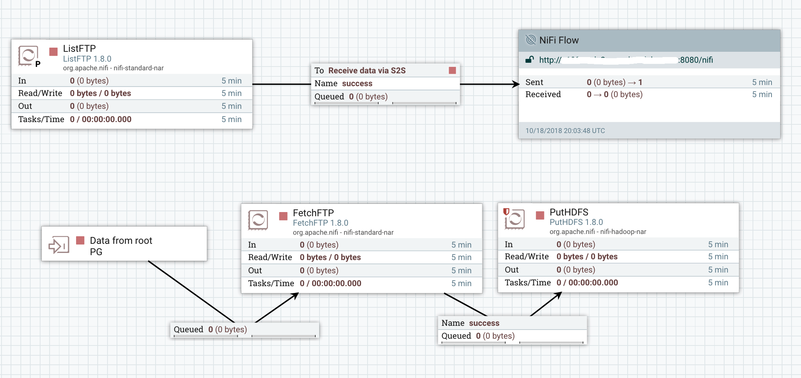
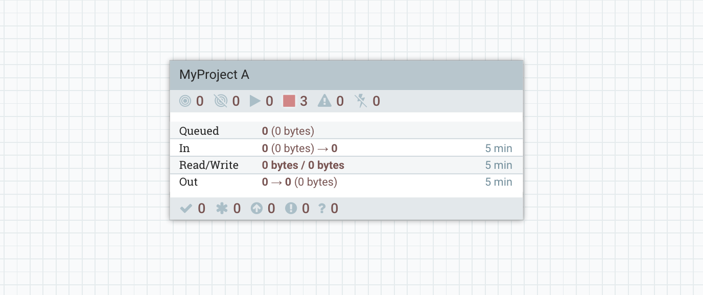

If you read [my post about List/Fetch pattern](http://pierrevillard.com/2017/02/23/listfetch-pattern-and-remote-process-group-in-apache-nifi/) and if you're using this approach for some of your workflows, this new feature coming with [NiFi 1.8.0](https://nifi.apache.org/download.html) is going to be a revolution.

A quick recap about the context: in NiFi, unless you specifically do something to make the nodes of a NiFi cluster exchange data, a flow file will remain on the same node from the beginning to the end of the workflow. For some use cases, it is necessary to load-balance the flow files among the nodes of the cluster to take advantage of all the nodes (like [the List/Fetch pattern](http://pierrevillard.com/2017/02/23/listfetch-pattern-and-remote-process-group-in-apache-nifi/)).

The only way to load balance data in a NiFi cluster before NiFi 1.8 is to use the Site-to-Site (S2S) protocol in NiFi with a Remote Process Group (RPG) connected to the cluster itself with an input/output port. In addition to that the S2S forces you to have the input/output port defined at the root level of the canvas.  In a multi-tenant environment this can be a bit annoying and can make the workflows a little bit more complex.

**What's the revolution with NiFi 1.8+?** For intra-cluster load balancing of the flow files, you now can do it directly by configuring it on the relationship between two processors. It could sound like a minor thing, but that's HUGE! In addition to that, you have few options to configure the load-balancing which opens up new possibilities for new use cases!

The [List/Fetch pattern is described in my previous post](http://pierrevillard.com/2017/02/23/listfetch-pattern-and-remote-process-group-in-apache-nifi/): in short... it's the action to use a first processor (ListX) only running on the primary node to list the available data on X and generate one flow file per object to retrieve on X (the flow file does not have any content but contains the metadata to be used to fetch the object), then flow files are distributed among the NiFi nodes and then the FetchX processor running on all nodes will take care of actually retrieving the data. This way you ensure there is no concurrent access to the same object and you distribute the work in your cluster.

**List/Fetch pattern before NiFi 1.8.0**

If we have a project A retrieving data from a FTP server using the List/Fetch pattern to push the data into HDFS, it'd look like this:

- Root Process Group level

- Inside the Process Group dedicated to Project A

The ListFTP is running on the primary node and sends the data to the RPG which load balances the flow files among the nodes. Flow files are pushed to the input port at the root level and the data can then be moved back down to the process group of the project. Then the FetchFTP actually retrieves the data and the data is sent to HDFS.

**List/Fetch pattern with NiFi 1.8+**

Now... it looks like this:

- Root Process Group level

- Inside the Process Group dedicated to Project A

It's crazy, no? You don't have anything outside of the process group anymore, the workflow is cleaner/simpler, and authorizations are much easier to manage.

Where is the trick? Did you notice the small icon on the relationship between the ListFTP and the FetchFTP? It looks small but it's HUGE :).

**Load balancing strategies in NiFi 1.8+**

Let's have a look at the configuration of a connection:

There is a new parameter available: the load balance strategy. By default it defaults to "do not load balance" and, unless you need to, you won't change that parameter (you don't want to move data between your nodes at each step of the workflow if there is no reason to do so).

Here are the available strategies:

The **Round robin strategy** is the one you would probably use in a List/Fetch use case. It will ensure your data is evenly balanced between your nodes.

The **Single node strategy** allows you to send the data back to one single node. You can see it a bit like a reducer in a MapReduce job: you process the data on all the nodes and then you want to perform a step on a single node. One example could be: I have a zip file containing hundreds of files, I unzip the file on one node, load balance all the flow files (using Round Robin strategy for example) among the nodes, process the files on all the nodes and then send back the flow files to a single node to compress back the data into a single file. It could look like this:

Then you have the **Partition by attribute strategy** allowing you to have all the flow files sharing the same value for an attribute to be sent on the same node. For example, let's say you receive data on NiFi behind a load balancer, you might want to have all the data coming from a given group of sources on the same node.

I won't go into much more details, but [feel free to have a look at the documentation](https://nifi.apache.org/docs/nifi-docs/html/user-guide.html#load-balancing). Besides, I'm sure other members of the Apache NiFi community will publish blog posts on this subject... [such as this excellent one](https://blogs.apache.org/nifi/entry/load-balancing-across-the-cluster)!

Let's just give it a try with each strategy... I'm using a GenerateFlowFile (GFF) connected to an UpdateAttribute and we will list the flow files queuing in the relationship to check where the flow files are located. Besides, the GenerateFlowFile is configured to set a random integer between 2 and 4 for the attribute 'filename'.

Let's start with a GFF running on the primary node only with no load balancing strategy:

My primary node being my node2 (I have node2, node3 and node4 in my cluster):

I can confirm all the flow files are on the primary node:

Let's change the Load Balance strategy to Round Robin. We can confirm the data is evenly distributed:

Let's change the strategy to One single node. We can confirm the data is now back to a single node (not necessarily the primary node):

And now let's try the partitioning by attribute using the 'filename' attribute. We can confirm that all the flow files sharing the same value in the Filename column are on the same node:

Again, I expect to see additional blog posts on this subject with more technical insights on how it actually works and what you should consider in case your cluster is scaling up and down.

Also... **this new feature comes with another one which is as much exciting**: the offloading of nodes in a cluster ([look at the Admin guide in the documentation](https://nifi.apache.org/docs/nifi-docs/html/administration-guide.html#offload-nodes)). In case you want to decommission a node in a cluster, this will take care of getting back the data on the other nodes before you actually remove the node for good. This will be particularly useful when deploying NiFi on Kubernetes and scaling up and down your cluster!

As always, feel free to comment and/or ask questions! Thanks for reading!
