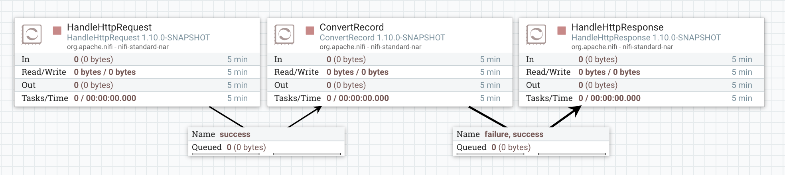
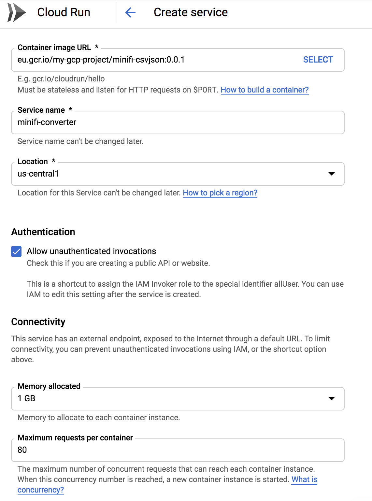
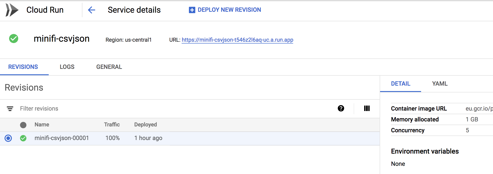
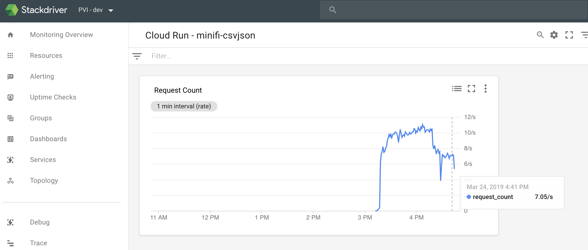

[Google Cloud](https://cloud.google.com/gcp/) just launched a new managed service call [Cloud Run](https://cloud.google.com/run/docs/) which is currently in public beta.

Cloud Run is a managed compute platform that enables you to run **stateless containers** that are **invocable via HTTP requests**. Cloud Run is **serverless**: it abstracts away all infrastructure management, so you can focus on what matters most — building great applications. It is built from [Knative](https://cloud.google.com/knative/) and let you run your containers fully managed with Cloud Run.

The huge benefit of this approach is: if there is no call to your service, there won't be any container running and you won't be charged. When a call is received, the container is instantiated to serve the request. If there are new requests, the container remains alive until there is no more request to answer. Besides, in case of traffic increase, your app will scale and more containers will be instantiated.

Also, when deploying a new version (revision) of your service, requests are automatically routed as soon as possible to the latest healthy service revision. This makes the whole CI/CD and service lifecycle much easier.

I wanted to play with this new service using NiFi: the idea is to have a workflow starting with HandleHttpRequest processor and ending with HandleHttpResponse processor to easily develop "functions" and deploy the web services in Cloud Run.

**Note** - everything used for this demo is available on [this Github repo](https://github.com/pvillard31/nifi-cloudrun-example).

## The workflow

Here is a simple workflow I developed and deployed on Cloud Run: this is a workflow expecting CSV data as input and converting the CSV data into JSON.

**I want to emphasize that this is a very simple case. But think about all the great features you can use in NiFi following this approach. Possible use cases are pretty much infinite.**

Basically, once the workflow is running I can use a POST HTTP request to get my JSON:

```bash
$ cat test.csv
name,company
Pierre Villard,Google

$ curl --data-binary "@test.csv" -H "Content-Type: text/csv" -X POST http://localhost:9090/
[ {
  "name" : "Pierre Villard",
  "company" : "Google"
} ]
```

This is a very simple workflow:

- HandleHttpRequest - will start listening on a given port for HTTP(S) requests
- ConvertRecord - will convert my CSV data into JSON using the header to infer the schema
- HandleHttpResponse - return the result to the user

<figure>



<figcaption>

Simple workflow to convert CSV to JSON using a HTTP endpoint

</figcaption>

</figure>

## Considerations for the container

The container must be stateless and listen for HTTP requests on `$PORT` that will be passed to the container as an environment variable. Have a look at the [container runtime contract](https://cloud.google.com/run/docs/reference/container-contract).

In the NiFi world, that means that the property defining the listening port in the HandleHttpRequest processor must accept Expression Language. Unfortunately, that is not the case and I submitted a fix with [NIFI-6144](https://issues.apache.org/jira/browse/NIFI-6144). However, in Cloud Run container instances, the `PORT` environment variable is always set to `8080` (but for portability reasons, your code should not hardcode this value). This means, you don't strictly need the fix I submitted to play with Cloud Run and NiFi, but it's safer if you do.

The container, when started, must be able to serve the request within 4 minutes which means that we want a container able to start as quick as possible and with a low footprint. To do that, I chose to work with the MiNiFi Docker image instead of the NiFi one.

## Converting the workflow for MiNiFi

Once the workflow is developed, you can save it as a template (XML file) and use the MiNiFi toolkit to convert the XML file into a YAML file that will be useable by MiNiFi.

```bash
# command to convert the template into yml file for MiNiFi
$MINIFI_HOME/bin/config.sh transform templateConvertRecord.xml config.yml
```

You can have a look at the YAML file on [the Github repository](https://github.com/pvillard31/nifi-cloudrun-example).

## Building the container

By default, the MiNiFi Docker image comes with a limited set of features and it's up to you to add the elements you need to run your workflow if required. In my case, I added:

- a custom build of the standard processors NAR to include my fix,
- the HTTP context NAR that is required when using HandleHttpRequest/Response processors,
- and the Record serialization NAR required for the ConvertRecord processor.

Here is my Dockerfile:

```bash
FROM apache/nifi-minifi:latest
USER root

ENV MINIFI_HOME /opt/minifi/minifi-0.5.0

ADD config.yml $MINIFI_HOME/conf/config.yml
ADD *.nar $MINIFI_HOME/lib/

RUN chown -R minifi:minifi $MINIFI_HOME

USER minifi
```

You then need to create your image and push it to the [Container Registry](https://cloud.google.com/container-registry/) service in the Google Cloud Platform. You can have a look at the documentation [here](https://cloud.google.com/container-registry/docs/pushing-and-pulling).

```bash
git clone git@github.com:pvillard31/nifi-cloudrun-example.git
cd nifi-cloudrun-example
gcloud auth configure-docker
# docker build -t [HOSTNAME]/[PROJECT-ID]/[IMAGE]:[TAG] .
docker build -t eu.gcr.io/my-gcp-project/minifi-csvjson:0.0.1 .
# docker push [HOSTNAME]/[PROJECT-ID]/[IMAGE]:[TAG] .
docker push eu.gcr.io/my-gcp-project/minifi-csvjson:0.0.1
```

## Deploy in Cloud Run

Once your Docker image is pushed in the Container Registry, you can go to the Cloud Run service and deploy your service!

Click on Create Service and fill the information:

<figure>



<figcaption>

Create a service in Cloud Run

</figcaption>

</figure>

Once your service is deployed, you will get a service HTTPS URL exposing your service:



I can now directly send requests to the exposed service:

```bash
$ time curl --data-binary "@test.csv" -H "Content-Type: text/csv" -X POST https://minifi-csvjson-t546z2l6aq-uc.a.run.app
[ {
  "name" : "Pierre Villard",
  "company" : "Google"
} ]
real	0m0.725s
user	0m0.036s
sys	0m0.026s
```

And I can also monitor my service in Stackdriver:



## Conclusion

That's it! You know how to deploy a new service in Cloud Run using the features of NiFi to develop your workflow and using the MiNiFi Docker image for running your containers.

Hopefully this demonstrates how easy it is to create and deploy a service and everything is managed for you in terms of scaling and lifecycle... and you're paying only for what you really use!

In combination with the NiFi Registry and all the tools you have on the Google Cloud Platform you can have a very neat pipeline to automate all of it and deploy new services in seconds!

As always, feel free to ask questions and/or leave a comment.
