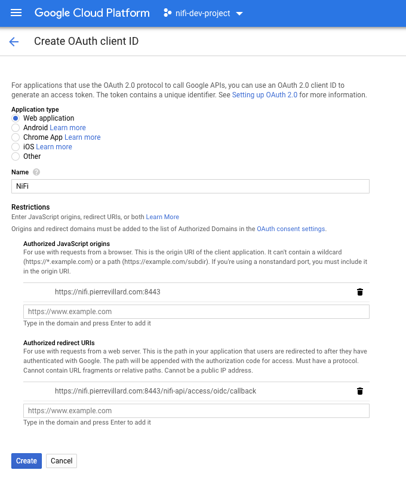
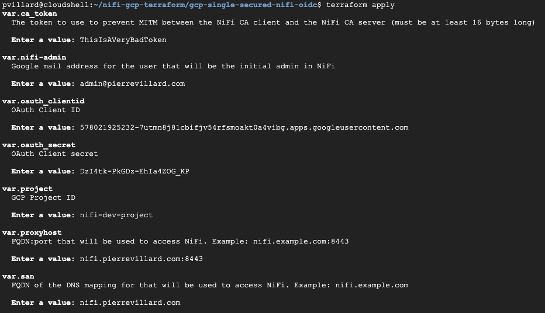
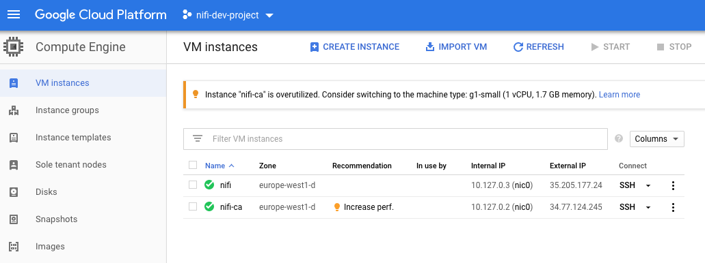
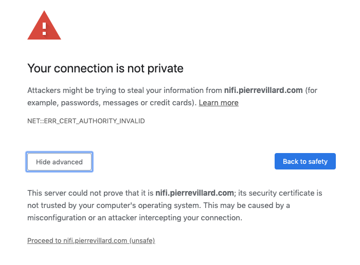
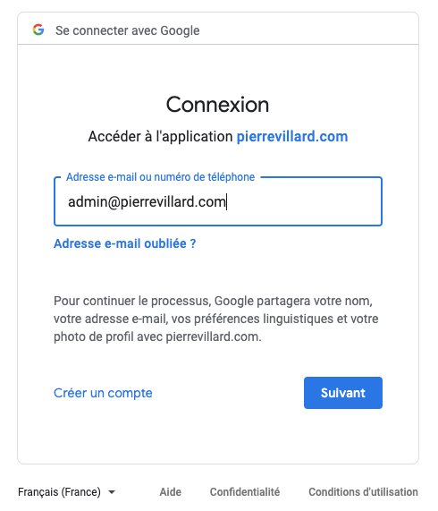
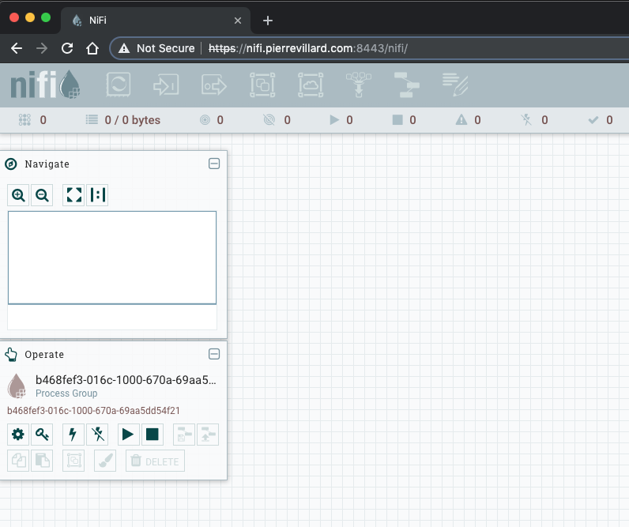
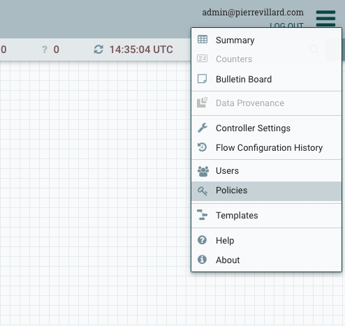

When I present [Apache NiFi](https://nifi.apache.org) during talks or meetings, I have to quickly start and stop instances. It’s very easy to do it on your own laptop with Docker, but it’s even better to have it running in the cloud and use IAC (Infrastructure As Code).

It’s very easy to start Apache NiFi on the Google Cloud Platform in a Compute instance, expose it on the Internet and have everything running. It just takes two commands and few seconds… Go in your [GCP project](https://console.cloud.google.com/), start the [Cloud Shell console](https://cloud.google.com/shell/docs/) and run the two below commands:

```
gcloud beta compute instances create-with-container my-nifi-instance --tags=nifi --container-image=apache/nifi
gcloud compute firewall-rules create allow-nifi-unsecured --action=ALLOW --rules=tcp:8080 --target-tags=nifi
```

You just started a Compute instance with the latest version of Apache NiFi and exposed it to anyone on the internet. You just need to get the external IP of your instance and you can access the UI on [http://external\_ip:8080/nifi.](http://external_ip:8080/nifi.)

It’s great but you need to understand that your instance is not secured and exposed to anyone. In short… you should never do that. At the very least, get your IP and restrict the access to the instance to your own IP.

But please… **Security must be a first class citizen** and the Apache NiFi community is really doing an amazing job to give you the best options to secure your instances.

* * *

In this post I show you how to use Terraform to start a secured NiFi instance configured to use OpenID Connect (OIDC) for authentication.

_Note_ — I assume you have a domain that you own ([you can get one with Google](https://domains.google/)). It will be used to map a domain to the web interface exposed by NiFi. In this post, I use my own domain: pierrevillard.com and will map nifi.pierrevillard.com to my NiFi instance.

_Disclaimer_ — the below steps should not be used for a production instance, I’m just using the below to start a secured instance with a single user access for short demos (there is no configuration that one would expect for a production or long-lived instance).

* * *

### OAuth Credentials

First step is to create the OAuth Credentials (at this moment, this cannot be done using Terraform). 

- Go in your GCP project, APIs & Services, Credentials.
- Click on Create credentials, OAuth client ID. Select Web application.
- Give a name like “NiFi”. For Authorized JavaScript origins, use your own domain. I’m using: [https://nifi.pierrevillard.com:8443](https://nifi.pierrevillard.com:8443.). For Authorized redirect URIs, I’m using: [https://nifi.pierrevillard.com:8443/nifi-api/access/oidc/callback](https://nifi.pierrevillard.com:8443/nifi-api/access/oidc/callback). Please adapt with your own domain.
- Click Create



Once the credentials are created, you will get a client ID and a client secret that you will need in the Terraform variables.

By creating the credentials, your domain will be automatically added to the list of the “Authorized domains” in the OAuth consent screen configuration. It protects you and your users by ensuring that OAuth authentication is only coming from authorized domains.

* * *

### Deploy NiFi with Terraform

I’ll go a bit deeper of what I’m doing in the next parts, below are just commands to deploy everything. Go in your GCP Project, and start the Cloud Shell console.

```
git clone https://github.com/pvillard31/nifi-gcp-terraform.git
cd nifi-gcp-terraform/gcp-single-secured-nifi-oidc/
terraform init
terraform apply
```

When applying the Terraform configuration, it’ll ask for some information:

- The token to be used between the NiFi CA and the NiFi instance to generate certificates. You can use a random string which is at least 16 bytes long.
- The Google email address of the user that will be the initial admin for the NiFi instance.
- The OAuth Client ID and Secret you got before.
- And the sub-domain that you will configure and use to access your NiFi instance. In my case: nifi.pierrevillard.com.



* * *

### Access NiFi

Once the Terraform configuration is applied. You need to map your subdomain to the static IP of the NiFi instance. Go on your GCP Project, on the Compute Engine page and get the external IP of the NiFi instance:



Once you have the external IP, go to your DNS provider page and add a ‘A’ record to your DNS records with the subdomain pointing to the external IP. The exact steps depend on your DNS provider.

Once done, you should be able to access the NiFi UI using your subdomain on the port 8443: [https://nifi.pierrevillard.com:8443/nifi](https://nifi.pierrevillard.com:8443/nifi).

You will most probably get a warning from your browser because of the untrusted certificate authority. That’s because we generated a CA certificate to sign the NiFi certificate. You can ignore the warning for a demo but otherwise you should use a trusted CA certificate:



Once you proceed to the website, you’ll be redirected to the Google authentication page asking for your credentials. That’s because we configured NiFi to use OpenID Connect to delegate the authentication to Google. At this point, you can only authenticate using the Google address you provided as initial admin for NiFi:



Then you are connected as the user and can access the canvas:



Before being able to design you first workflow, you’ll need to go to the “Policies” menu to grant you the required permissions. You can also go to the “Users” menu to add additional users that will be able to authenticate on the UI and give them the appropriate permissions. 



* * *

### Details

The [Terraform configuration files are on Github](https://github.com/pvillard31/nifi-gcp-terraform/tree/master/gcp-single-secured-nifi-oidc):

- **provider.tf** to define the Google Cloud provider with the basic GCP project information
- **network.tf** to create a network and subnetwork dedicated to the NiFi CA instance and the NiFi instance
- **firewall.tf** to create the rules to allow internal communications, SSH access to the instances and access to the NiFi instance on the port 8443
- **nifi-ca.tf** to install the NiFi Certificate Authority ([provided with the TLS toolkit](https://nifi.apache.org/docs/nifi-docs/html/toolkit-guide.html#tls_toolkit)) in server mode in order to create a certificate authority and sign the certificates for the NiFi instance
- **nifi.tf** to install the NiFi instance, get the certificate from the NiFi CA, generate the keystore and truststore and configure the NiFi instance to be secured and use OpenID Connect for authentication
- **variables.tf** to define some variables to be used to customize the deployment (more variables could be added)

Remember, this is a basic deployment of NiFi but you have a secured instance with Google delegated authentication.

_Note_ — To delete all the created resources, you can use ‘_terraform destroy_’.

There is much more to do to get closer to a production ready deployment but it gets you started to play with NiFi on the Google Cloud Platform. I’ll add more features in my next posts (the immediate next step will be to add a secured NiFi Registry instance that is connected to the Google Cloud Source Repositories).

Thanks for reading, feel free to ask questions or comment this post!
