On the 23rd of October 2019, I gave a talk at the Apache Con in Berlin about running visual quality inspection at the edge. This is the story describing the talk and helping you use both Google Cloud and Apache NiFi & MiNiFi to continuously run updated TensorFlow models at the edge.

### Context

Picture this: you are in a factory making cookies… you have thousands of cookies going through your production lines every day and you want to make your customers happy. Problem is… a broken cookie makes an unhappy customer! So you want a way to detect the broken cookies before they get into the final packaging.

This is the example I am choosing to support this story but it could really be anything related to visual quality inspection which spans across multiple industries such as retail, manufacturing, energy, etc. Anything that you can think of that would need a ML model trained over a dataset of images.

### What is Apache NiFi & MiNiFi?

[Apache NiFi](https://nifi.apache.org/) is an easy to use, powerful, and reliable system to process and distribute data. Apache NiFi supports powerful and scalable directed graphs of data routing, transformation, and system mediation logic. [MiNiFi](https://nifi.apache.org/minifi/index.html) — a subproject of Apache NiFi — is a complementary data collection approach that supplements the core tenets of NiFi in data flow management, focusing on the collection of data at the source of its creation.

In simpler words, Apache NiFi and MiNiFi provide a great combination of tools and features to collect and move data around, process it, clean it and integrate it with other systems. As soon as you need to bring data in, you want to use Apache NiFi.

### What is Google Cloud Vision?

[Google Cloud Vision](https://cloud.google.com/vision/) allows you to derive insights from your images in the cloud or at the edge with AutoML Vision or use pre-trained Vision API models to detect emotion, understand text, and more.

With Google Cloud Vision, you have two options:

- **AutoML Vision**: automate the training of your own custom machine learning models. Simply upload images and train custom image models with [AutoML Vision](https://cloud.google.com/automl/)’s easy-to-use graphical interface; optimize your models for accuracy, latency, and size; and export them to your application in the cloud, or to an array of devices at the edge.
- **Vision API**: Google Cloud’s Vision API offers powerful pre-trained machine learning models through REST and RPC APIs. The APIs cover: image classification and labelling into millions of predefined categories, detect objects and faces, read printed and handwritten text, build valuable metadata into your image catalog, moderate content, etc.

In this story we are going to build our own custom machine learning models with our own labels and images using **AutoML Vision**.

### Objective: continuous model retrain

<figure>

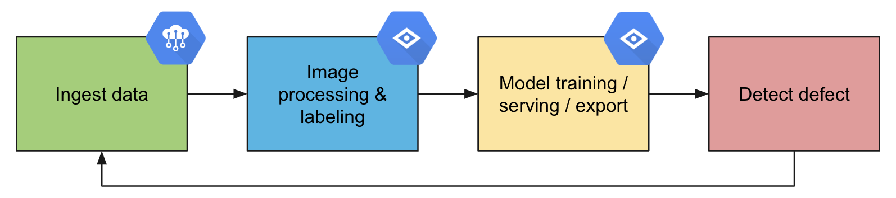

<figcaption>

**_Automatic retrain of the custom model_**

</figcaption>

</figure>

The objective is to have an end-to-end system to detect the defects while having a continuous model retrain with the newly collected images. Key benefits are:

- Automatically train customized ML models in the cloud
- Efficiently acquire images, label images, deploy model and run inference
- Continuously refresh models using fresh data from the production lines
- Minimal human interaction
- ML model accuracy improving over time

### Using a Raspberry Pi at the edge

To collect data from the production lines, I’m going to use a Raspberry Pi on which I’ll be running Apache MiNiFi. I added a camera to take pictures as well as LEDs to give visual indications of what is currently being processed.

<figure>

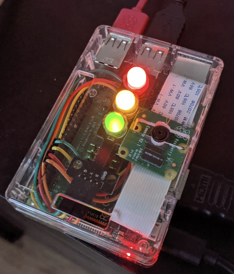

<figcaption>

**_Raspberry Pi 3 used to collect data_**

</figcaption>

</figure>

In order to collect data from the edge with the Raspberry Pi, I’m going to use [Google IoT Core](https://cloud.google.com/iot-core/) which is a fully managed service to easily and securely connect, manage, and ingest data from globally dispersed devices.

First step is to create a Device Registry which is a container of devices with shared properties. Once the Registry is created, you can register your device with its device identity. To do that you need to generate a public/private key pair that will be used by the device to authenticate against Google IoT Core (you can also use Certificate Authorities). Here are [the commands I used to generate my key pair for the Raspberry Pi](https://github.com/GoogleCloudPlatform/java-docs-samples/blob/master/iot/api-client/generate_keys.sh).

<figure>


<figcaption>

**_My device is registered in my device registry_**

</figcaption>

</figure>

Then I’ll be using the MQTT protocol to send data between my device and Google Cloud, it will automatically make the data available into a Pub/Sub topic:

<figure>

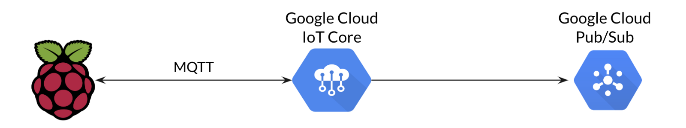

<figcaption>

**_Interface between the device and Google Cloud IoT Core_**

</figcaption>

</figure>

To communicate with Google Cloud IoT Core through MQTT, I’ll be using [a processor that is currently under code review in a Pull Request on Github](https://github.com/apache/nifi/pull/3392). I’ll also make this processor available [in a repo I created to share the code snippets of my talk](https://github.com/pvillard31/aceu19).

### One problem, two architectures

When we’ll have collected pictures from our devices, we’ll be able to train our custom model. Then we’ll have to choose between two options:

- Deploy the model in Google Cloud and do the inference in the cloud. It means that for each picture, the Raspberry Pi with Apache MiNiFi will make an HTTPS call to the served model to get the label of the picture. While this is efficient and is easy to implement and scale, this means making a call over the Internet and a longer inference time. In this story that what I’ll call the mode “**_cloud_**” when configuring the device. In the **_cloud_** mode, here is what the architecture looks like:

<figure>

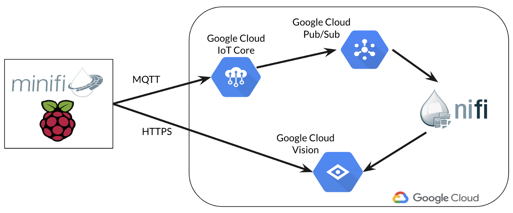

<figcaption>

**_Architecture in the “cloud” mode_**

</figcaption>

</figure>

- Download the model from Google Cloud on the Raspberry Pi and do the inference at the edge using Apache MiNiFi. Google Cloud provides multiple options to download your custom models with various accuracy versus latency parameters. Running the model on the edge will lead to much faster inference time. In this story that’s what I’ll call the mode “**_edge_**” when configuring the device. In the **_edge_** mode, here is what the architecture looks like:

<figure>

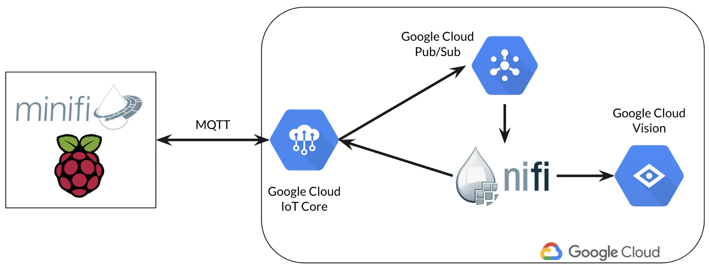

<figcaption>

**_Architecture in the “edge” mode_**

</figcaption>

</figure>

We’ll also see that, in the **_edge_** mode, it’s possible to get an even better inference time using Google’s hardware with the Coral Edge TPU.

### Collecting pictures

Here is what the workflow running in MiNiFi (on the Raspberry Pi) looks like:

<figure>

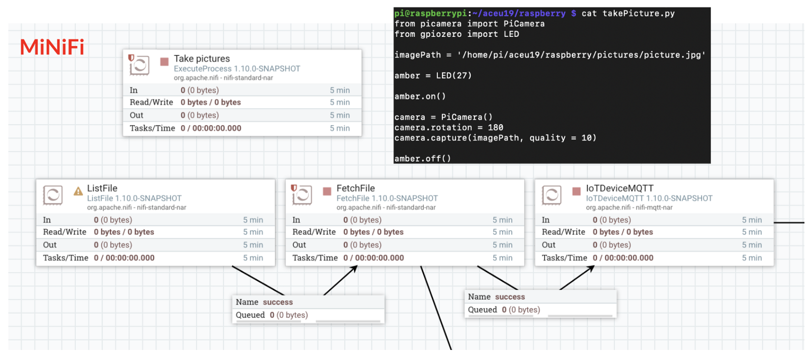

<figcaption>

**_Workflow running in MiNiFi on the Raspberry Pi to collect images_**

</figcaption>

</figure>

The workflow is really simple: a “standalone” processor executes a Python script to take pictures at a given frequency using the Pi camera. Then the pictures are fetched into MiNiFi to be sent to Google Cloud IoT Core through the MQTT processor. I’m also switching on/off the amber LED when this process occurs to give a visual indication on the Pi about what’s going on.

As we said, the data will be automatically sent to a Pub/Sub topic and made available for consumption. In the Google Cloud Platform, [I’m running a standalone secured Apache NiFi instance](https://medium.com/@pierre.villard/nifi-with-oidc-using-terraform-on-the-google-cloud-platform-8686ac247ee9) (see my previous post for a very quick deployment using Terraform) on which the below workflow is running:

<figure>

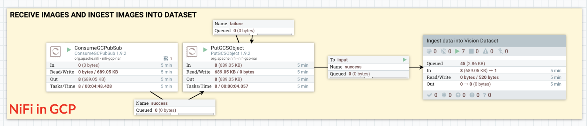

<figcaption>

**_Workflow running in NiFi in GCP to ingest images_**

</figcaption>

</figure>

The pictures are pulled from my topic’s subscription, then the images are stored in Google Cloud Storage and I’m using the Google Cloud Vision API to add the pictures into my dataset (which is the collection of images I’m using to train my custom models).

I won’t go too much into the details as [the documentation is self-explanatory](https://cloud.google.com/vision/automl/docs/create-datasets) but here is the call I’m making — it gives the GCS path of the CSV file I created listing the GCS paths of all the images I ingested during the last X minutes:

```bash
curl \
  -X POST \
  -H "Authorization: Bearer $(gcloud auth application-default print-access-token)" \
  -H "Content-Type: application/json" \
https://automl.googleapis.com/v1beta1/projects/${projectID}/locations/us-central1/datasets/${datasetID}:importData \
  -d '{
        "inputConfig": {
          "gcsSource": {
            "inputUris": "gs://${gcs.bucket}/dataset.csv"
          }
        }
      }'
```

**Note 1**: the dataset ID is something looking like: ICN4695798657952251904. 
**Note 2**: in NiFi, I externalized a lot of variables (project ID, GCS bucket, dataset ID, etc) that I reuse across the workflow to make it much more easier to use and configure.

### Managing your device configuration

Once your device is registered in the Device Registry in Google Cloud IoT Core, you can use the UI to send configuration updates or commands to your devices. Here is what it looks like:

<figure>


<figcaption>

**_Updating the configuration of my device through MQTT_**

</figcaption>

</figure>

On the Raspberry Pi, in MiNiFi, the configuration updates and commands are received by the MQTT processor and I process the received data to update the configuration of my device:

<figure>


<figcaption>

**_Reception of configuration updates and commands_**

</figcaption>

</figure>

<figure>

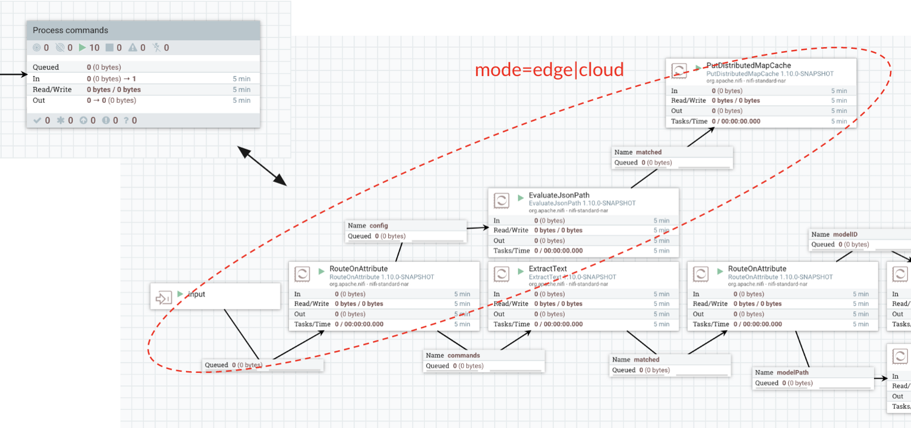

<figcaption>

**_Processing configuration updates_**

</figcaption>

</figure>

When I receive a configuration update, I process the JSON payload to extract the mode and if I should use the Edge TPU or not, I then store this information into a local cache that is also persisted on disk in case of device restart.

### Training and serving your model

We now have a device that we are able to configure from anywhere, that is automatically sending pictures from our production lines, and the pictures are automatically stored and added to our Google Cloud Vision dataset to train our custom models.

The next step, in Google Cloud Vision, is to create labels that will be used to classify our images. In this case, I only create two labels:

- **OK**: the cookie looks good and can go into the packaging
- **NOK**: the cookie is broken and should be removed

In the UI, I’m able to manually label the images and I need, at least, 10 images per label to start training my custom model (the more you have, the better the results are, and that’s why we want to continually ingest new images and retrain our model over time):

<figure>


<figcaption>

**_My dataset with the pictures of my cookies and my labels_**

</figcaption>

</figure>

In my NiFi instance running in GCP, I created a workflow which is used to trigger a model training every day in order to take into account the newly captured images and improve the model’s accuracy over time:

<figure>

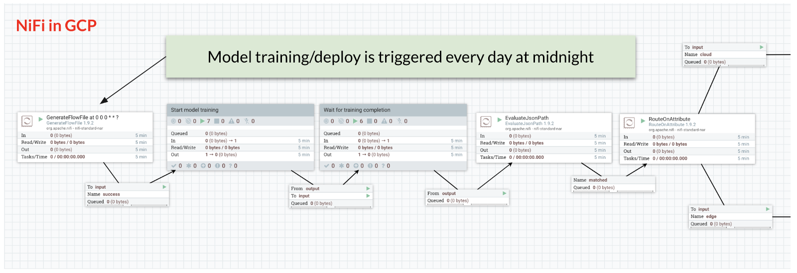

<figcaption>

**_Model training is triggered daily in NiFi_**

</figcaption>

</figure>

To start the custom model training and wait until the training is completed I’m using the REST APIs described in the documentation. However, at this stage, you have to specify if you want to train a model that will run in the cloud (**_cloud mode_**) or at the edge (**_edge mode_**):

- [Training a cloud-hosted model](https://cloud.google.com/vision/automl/docs/train)
- [Training an edge exportable model](https://cloud.google.com/vision/automl/docs/train-edge)

When training a model to be exported at the edge, you can specify a parameter allowing you to choose if you prefer latency over accuracy:

- `mobile-low-latency-1` for low latency,
- `mobile-versatile-1` for general purpose usage, or
- `mobile-high-accuracy-1` for higher prediction quality.

When a cloud-hosted model is being trained, the Google Cloud Vision UI would look like this:

<figure>


<figcaption>

**_Cloud-hosted model currently being trained_**

</figcaption>

</figure>

Once the model training is completed, NiFi will receive a JSON payload such as:

<figure>


<figcaption>

**_JSON payload when model training is completed_**

</figcaption>

</figure>

Once the model is trained, we can access a lot of information regarding the model training and its accuracy compared to the provided dataset:

<figure>


<figcaption>

**_Custom model information about precision, recall, etc_**

</figcaption>

</figure>

### Cloud-hosted model

Once the model is trained, we can call [the REST APIs to deploy the model](https://cloud.google.com/vision/automl/docs/deploy). Here is the part of the NiFi workflow in charge of this:

<figure>

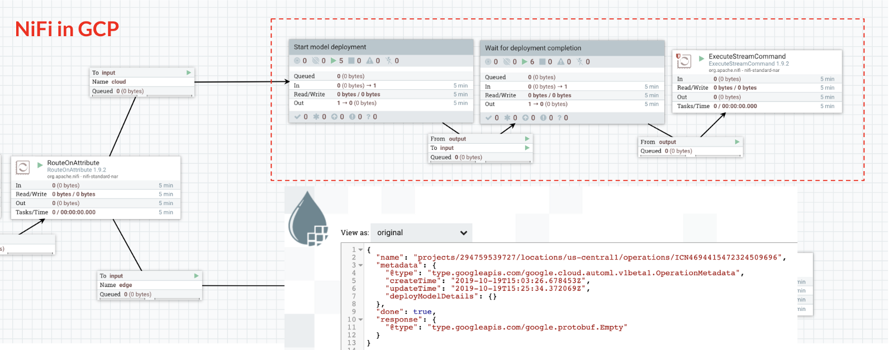

<figcaption>

**_NiFi deploying the cloud-hostel custom model_**

</figcaption>

</figure>

Once the deployment is completed, the model will be automatically exposed through a REST API in Google Cloud (you don’t have to worry about the how and the where, Google takes care of it). The only information you need is the model ID and this is the information we are sending to the Raspberry Pi using the Google IoT Core commands with the ExecuteStreamCommand processor:

```bash
gcloud iot devices commands send \
    --command-data=ICN147321363982450688
    --region=REGION  \
    --registry=REGISTRY_ID \
    --device=DEVICE_ID
```

In MiNiFi, we are receiving the command and storing the model ID in the cache:

<figure>

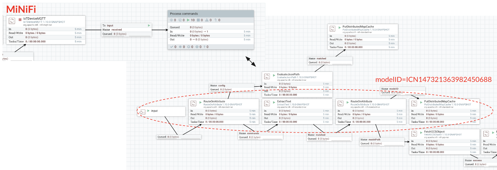

<figcaption>

**_Receiving the model ID through the Google IoT Core MQTT command_**

</figcaption>

</figure>

We can now perform the inference for each picture we capture by making an HTTPS call against the exposed API:

<figure>

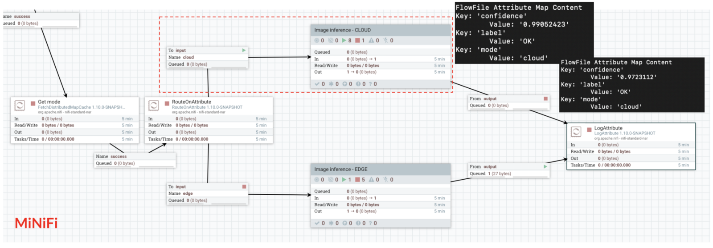

<figcaption>

**_Inference in the cloud using the exposed API_**

</figcaption>

</figure>

Note the RouteOnAttribute processor that will check in which mode the device is configured. In this case, the device is configured in **_cloud_** mode.

The picture payload needs to be base64 encoded and [the API to use](https://cloud.google.com/vision/automl/docs/predict#automl_vision_predict-cli) is:

```bash
curl -X POST \
  -H "Authorization: Bearer $(gcloud auth application-default print-access-token)" \
  -H "Content-Type: application/json" \
https://automl.googleapis.com/v1beta1/projects/${PROJECT_ID}/locations/us-central1/models/${MODEL_ID}:predict \
  -d '{
        "payload" : {
          "image": {
            "imageBytes" : "/9j/4AAQSkZJRgABAQAAAQ … "
          }
        }
      }'
```

### Edge exportable model

In this mode, once the TensorFlow model is trained, we just need to make an API call to export the trained model into Google Cloud Storage:

<figure>

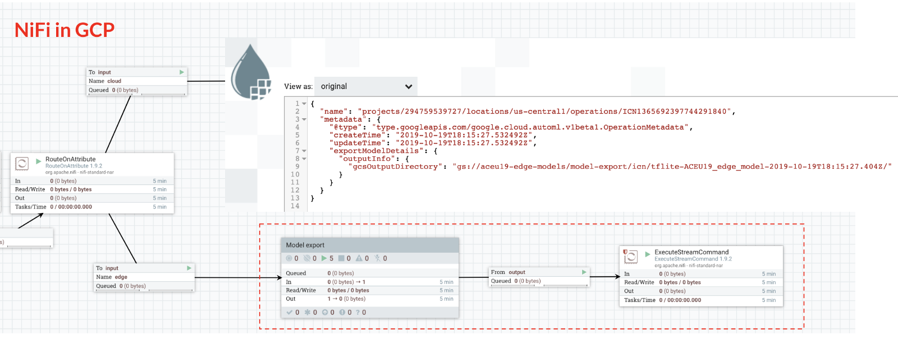

<figcaption>

**_API calls to export the custom edge model into Google Cloud Storage_**

</figcaption>

</figure>

The [API to use](https://cloud.google.com/vision/automl/docs/export-edge) is:

```bash
curl \
  -H "Authorization: Bearer $(gcloud auth application-default print-access-token)" \
  -H "Content-Type: application/json" \
  https://${ENDPOINT}/v1beta1/projects/${PROJECT_ID}/locations/us-central1/models/${MODEL_ID}:export \
  -d '{
        "output_config": {
          "model_format": "tflite",
          "gcs_destination": {
              "output_uri_prefix": "${USER_GCS_PATH}"
          }
        }
      }'
```

In case you want to export a model that is optimised for the Edge TPU (we’ll talk about this in a bit), then [you have to use](https://cloud.google.com/vision/automl/docs/export-edge#edge-tpu):

```bash
curl \
  -H "Authorization: Bearer $(gcloud auth application-default print-access-token)" \
  -H "Content-Type: application/json" \
  https://${ENDPOINT}/v1beta1/projects/${PROJECT_ID}/locations/us-central1/models/${MODEL_ID}:export \
  -d '{
        "output_config": {
          "model_format": "edgetpu_tflite",
          "gcs_destination": {
              "output_uri_prefix": "${USER_GCS_PATH}"
          }
        }
      }'
```

With this API call, NiFi will receive a JSON payload with the GCS path to the tflite file representing your custom model. Here again we are using a Google Cloud IoT Core command to send this information to our device through MQTT:

```bash
gcloud iot devices commands send \
    --command-data=gs://.../model.tflite
    --region=REGION  \
    --registry=REGISTRY_ID \
    --device=DEVICE_ID
```

On MiNiFi, we are receiving this information and downloading the model directly on the device so we can do local inference:

<figure>

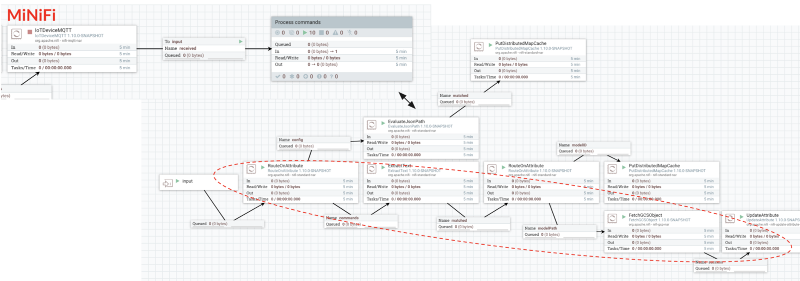

<figcaption>

**_Receiving the GCS path of the model through MQTT and downloading the model locally_**

</figcaption>

</figure>

Now we have the TensorFlow lite model downloaded on the Raspberry Pi, we can perform the inference on every captured image:

<figure>

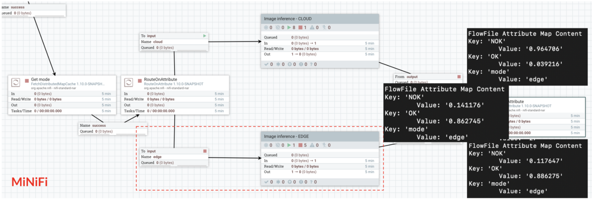

<figcaption>

**_Inference on the edge using the downloaded TensorFlow lite model_**

</figcaption>

</figure>

To execute the model locally, [I’m executing a Python script that you can find here](https://github.com/tensorflow/tensorflow/tree/master/tensorflow/lite/examples/python/).

### Boosting your device with the Coral Edge TPU

Since the 22nd of October 2019, [Coral is now GA](https://coral.ai/)! Coral is a hardware and software platform for building intelligent devices with fast neural network inferencing.

At the heart of the devices is the Edge TPU coprocessor. This is a small ASIC built by Google that’s specially-designed to execute state-of-the-art neural networks at high speed, with a low power cost. The Edge TPU is capable of performing 4 trillion operations (tera-operations) per second (TOPS), using 0.5 watts for each TOPS (2 TOPS per watt).

<figure>

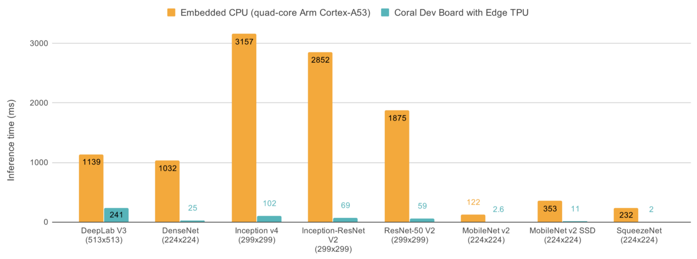

<figcaption>

**_Edge TPU benchmark by Google_**

</figcaption>

</figure>

In my use case, I’m using [the USB accelerator](https://coral.ai/products/accelerator) that I’m directly plugging to the Raspberry Pi.

<figure>

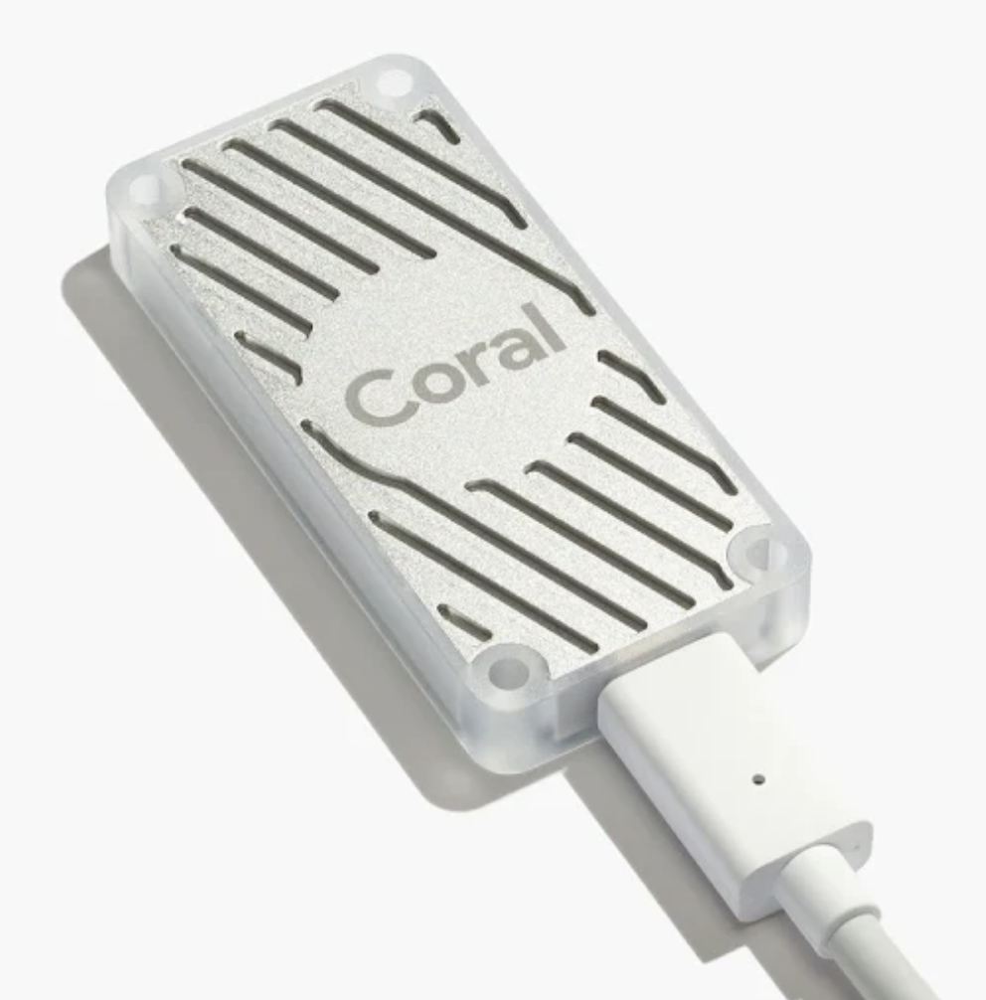

<figcaption>

**_Coral USB accelerator_**

</figcaption>

</figure>

Using the custom ML models I trained on Google Cloud Vision, I can easily compare the TensorFlow “invoke” time when using or not the Edge TPU:

- **When not using the Edge TPU optimised model:**

<figure>


<figcaption>

**_TF Lite invoke time when not using the Edge TPU — about 127ms/image_**

</figcaption>

</figure>

- **When using the Edge TPU and the optimised model:**

<figure>


<figcaption>

**_TF Lite invoke time when using the Edge TPU — about 9ms/image_**

</figcaption>

</figure>

We get about 127ms without using the Edge TPU while we only need 9ms when using the Edge TPU on a low latency optimised model generated for my cookies use case with Google Cloud Vision AutoML.

### Preliminary results

So far we have sent the pictures through MQTT and performed the classification inference into two distinct branches of the MiNiFi workflow (in other words: pictures ingestion and pictures inference are done in parallel). Here are the results we get (processing time is the duration between the moment we take the picture and the moment we get the label and the confidence score of the classification ; inference time is the duration of the “invoke” call to get the classification using the TensorFlow Lite model):

- **_cloud mode_** (inference in the cloud through HTTPS):  
    \- Processing time: about 6 seconds per image  
    \- Inference time: about 2.5 seconds per image
- **_edge mode_** (without the Edge TPU):  
    \- Processing time: about 750 milliseconds per image  
    \- Inference time: about 127 milliseconds per image
- **_edge mode + TPU_**(with the Edge TPU):  
    \- Processing time: about 500 milliseconds per image  
    \- Inference time: about 9 milliseconds per image

### Monitoring and auto-labelling

What we have done so far is great but, once we made the inference on the Raspberry Pi, we take the action to keep or not the cookie on the production line (in my case, I switch on and off the red or green lights) and we forget about the inference results. The next step is to perform the inference **before** sending the pictures through MQTT so that we can send the inference results along with the pictures. Pictures inference and pictures ingestion are done sequentially. This has two main key benefits:

- We can collect additional data to deploy **monitoring dashboards** in order to have accurate information about how our custom models are performing on our devices
- We can introduce **auto-labelling of the images**: if the confidence score of the inferred label is over, for example, 90%, we could auto-label the image when ingesting it into the Google Cloud Vision dataset so that minimal human interaction is required when it comes to labelling: only the images representing new types of defects might need human labelling.

I won’t go into the details of the required changes in the workflows but on MiNiFi it looks like this:

<figure>


<figcaption>

**_MiNiFi workflow when sending inference results along with pictures through MQTT_**

</figcaption>

</figure>

Once we receive all the information in NiFi, we can add this information into Stackdriver monitoring dashboards and see in real-time how our custom models are performing:

<figure>

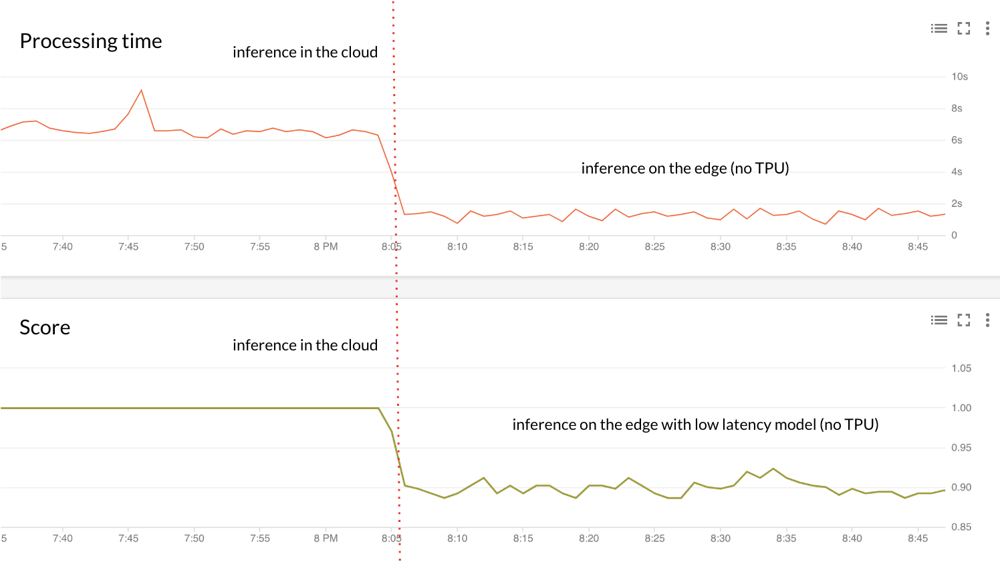

<figcaption>

**_Processing time and score for cloud mode versus edge mode_**

</figcaption>

</figure>

In the above picture we can see how the processing time and the confidence score is changing while going from the **_cloud_** mode to the **_edge_** mode after updating the device configuration. We clearly see that the processing is much faster but we are losing a little bit in accuracy (still above 90% though!).

We can also compare the results when using the Edge TPU or not while the device is configured in **_edge_** mode:

<figure>

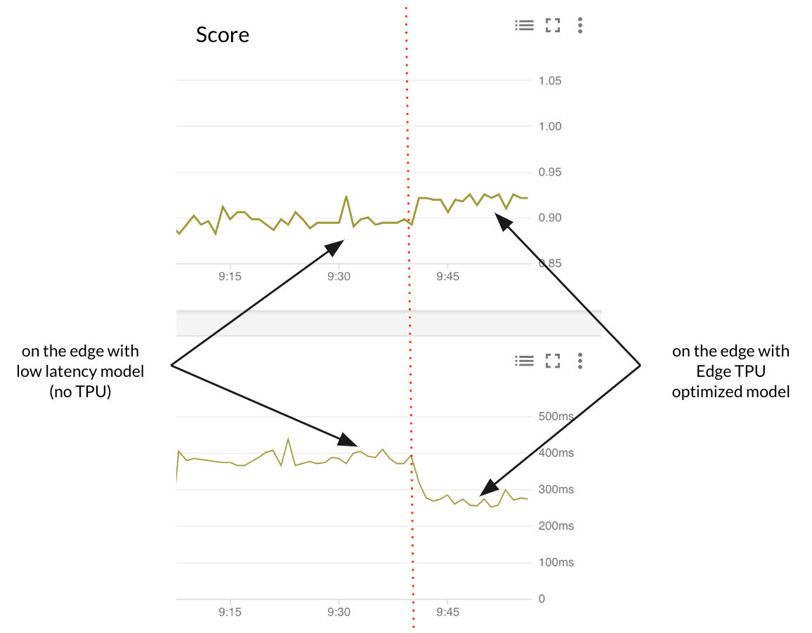

<figcaption>

**_Processing time and score for edge mode with and without Edge TPU_**

</figcaption>

</figure>

In the above picture,we can see an interesting result: when using the Edge TPU with the Edge TPU optimised model, we get a lower processing time while also getting a higher confidence score for the inference. No reason not to use it!

### Conclusion

First, thank you for reading this very long story… Then, here is the conclusion of it: thanks to Apache NiFi, MiNiFi, the products of the Google Cloud Platform and the Coral products, we implemented an efficient end-to-end solution to run custom ML models on the edge while continuously refresh our models with new data to improve the models accuracy over time with no code and minimal human interaction. I’ll leave it to your imagination to transpose all of this to your very own use case!

The slides of the talk, the recording as well as code snippets, custom processors, workflows, scripts, etc, will be added in the coming days on this [Github repository](https://github.com/pvillard31/aceu19). As usual, feel free to comment/ask questions.
