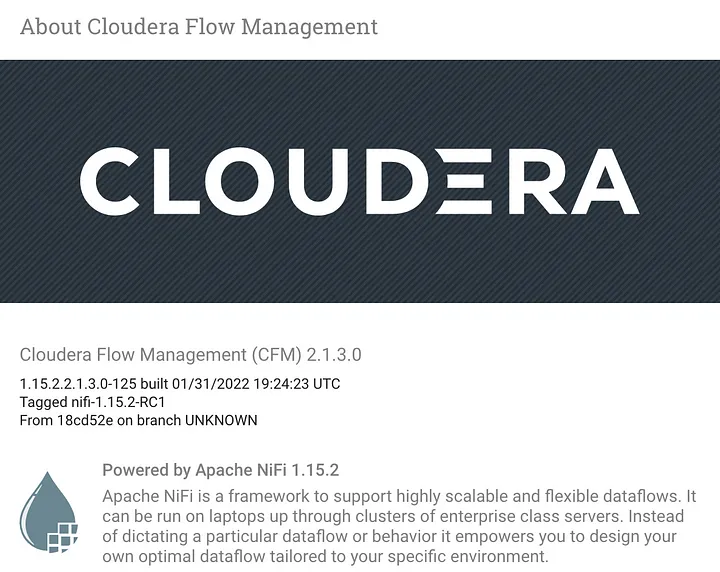
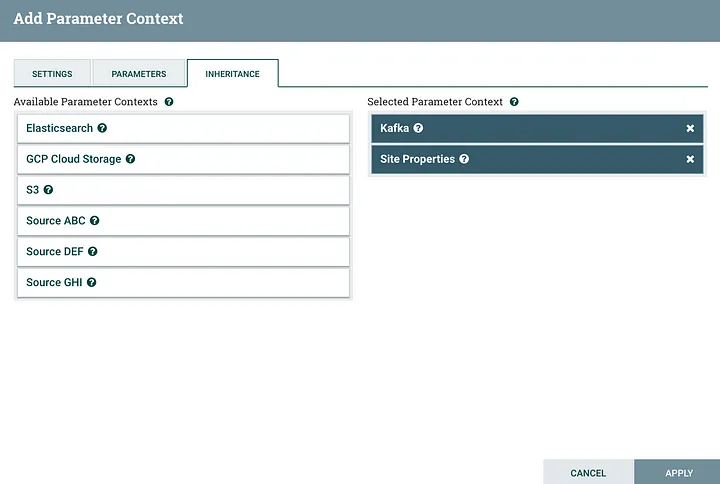
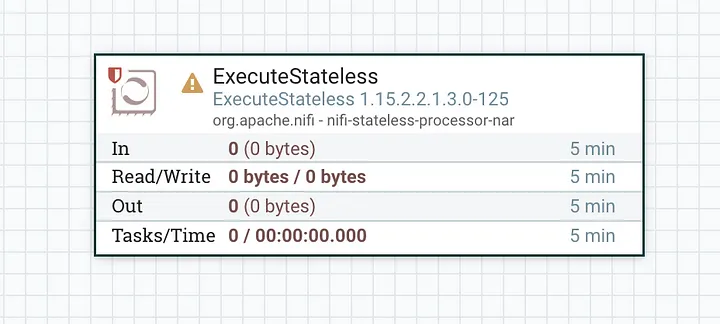
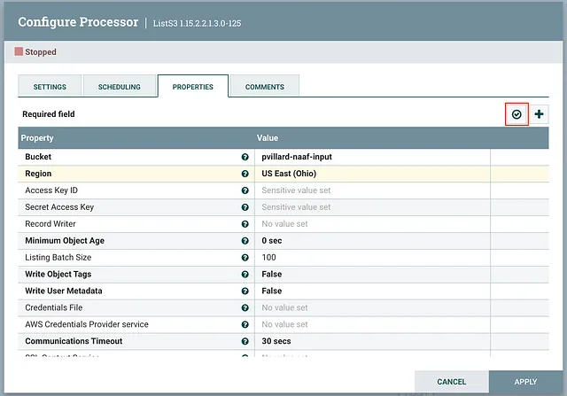
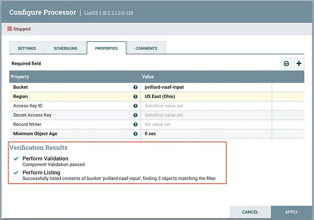

# What’s new in Cloudera Flow Management 2.1.3, based on Apache NiFi 1.15?

Cloudera is happy to announce the release of Cloudera Flow Management 2.1.3 to be used in combination with Cloudera Manager and CDP Private Cloud Base 7.1.7. It’s the first Cloudera release including a version of NiFi that is based on top of Apache NiFi 1.15.

Apache NiFi 1.15.0 has been released early November and contains a ton of improvements, new features, as well as bug fixes. With a very active community and contributions from many companies across the world, this release brings a lot of exciting features to the table and we believe that any existing user should be super excited and upgrade or migrate to this release.

What should anyone consider moving to this release? Let me go through a very personal list of 5 new features/improvements you might be interested in.

## Improve NiFi UI responsiveness (NIFI-9309)

Some of our customers are using NiFi very extensively in a multi-tenant way with many teams using the same NiFi cluster. While this is perfectly fine, you’re likely going to have hundreds of flows with tens of thousands of processors with a lot of parameter contexts.

When you’re going through the UI and listing the parameters used by your flow, NiFi is going to issue a request to the framework and look for a ton of information. In reality, NiFi will return way more information compared to what is really needed by the UI. This is because everything in NiFi is API-based and everything a user may be doing through the UI should be scriptable for automation and such. But we can drastically improve things when we know the API is called via a user on the UI itself. That’s what this JIRA is about: adding an optional flag in the API so that we know the call is made by the NiFi UI. This way the framework can drop a ton of information that is not required by the UI. This makes the UI responsiveness much better. With some specific configurations, we noticed up to 1000x improvements in API calls made by the UI.

Parameter Contexts Inheritance (NIFI-8490)
Parameter Context is the NiFi concept one should use to parameterize a flow by defining a set of key/value pairs at a process group level allowing to easily promote a flow across multiple environments or transform flows into generic assets that can be reused across many teams.

There is a lot of efforts going into Parameter Contexts right now and I can’t wait to share more about what’s coming next with Parameter Context Providers allowing NiFi to source parameter values from external sources. With CFM 2.1.3, we already have a great new feature which is the ability to define Parameters Context inheritance. Parameter Contexts have a one to one mapping with process groups and it was hard reusing parameters across multiple flows in case of multi-tenant environments. This new feature makes it super easy to have “high level” parameters at the root process group level that can be used across many flows while defining a specific set of parameters for each use case at lower process group levels. You can find more information about this feature and how it works in [this blog post](https://bryanbende.com/development/2021/11/08/apache-nifi-1-15-0-parameter-context-inheritance).

## ExecuteStateless processor (NIFI-9239)

NiFi Stateless has been around in the NiFi community for a while now but it has always been hard to consume for new NiFi users. Over the last few months, the team has been improving this feature in NiFi to make it easier to use and to provide many options for running NiFi flows in different ways.

First of all, NiFi stateless is an alternate implementation of the NiFi framework that makes different design decisions / tradeoffs bringing some nice advantages to a specific set of use cases such as transactional executions of the flows, in-memory processing, etc. To better understand what NiFi Stateless is about, I recommend reading [this blog post](https://bryanbende.com/development/2021/11/10/apache-nifi-stateless) first.

Then, you may want to watch the [on-demand replay of the webinar](https://www.cloudera.com/about/events/webinars/live-demo-jam-when-and-how-to-use-nifi-stateless-to-run-data-flows.html?internal_keyplay=SEC&internal_campaign=FY22-Q4_CW_AMER_Demo_Jam_Nifi_EP_2021-11-17&cid=7012H000001dyORQAY&internal_link=p07) we gave at Cloudera to talk about NiFi Stateless and how it can be leveraged in many ways including [NiFi as a Function](https://blog.cloudera.com/nifi-as-a-function-in-dataflow-service/).

With CFM 2.1.3, we also add a new processor called ExecuteStateless bringing you the option to run a flow using the Stateless approach directly within the NiFi UI. This enables use cases that were very hard to solve in traditional NiFi such as exactly-once processing with Kafka for which you can see a demo in this [Youtube video](https://www.youtube.com/watch?v=VyzoD8eh-t0).

Don’t forget to read the additional details of this processor to make sure you understand the underlying concepts and the use cases where this processor makes sense.

## Components Validation (NIFI-9009)

When configuring a processor, it may require a lot of back and forth between the configuration view and the canvas where the user would start the component, check if it’s working, and, if not, go back to the configuration’s view to adjust its properties and try again. With CFM 2.1.3, there is now a new Component Validation button available in the configuration’s view of the component allowing the user to not only confirm that the configuration is valid (all required properties are provided, etc) but also, depending on the component’s implementation, execute code to really test the configuration against the system the component is interacting with. For example, when validating the configuration of a ListS3 processor, the processor would list the content of the configured bucket and would tell the user how many items would actually be listed when the processor is started. This greatly improves the user experience when it comes to configuring processors interacting with external systems. The number of components implementing these new interfaces will grow over time but CFM 2.1.3 provides a great starting point for this new feature.

## Improving the Hadoop-related processors class loading (NIFI-9382)

Many of our customers are using NiFi extensively to interact with Hadoop related components (HDFS, Hive, etc) in a multi-tenant fashion (meaning different sets of Kerberos credentials would be used across NiFi flows within the same NiFi cluster). Given how the Hadoop client is using the UserGroupInformation class and given how class loading isolation is working in NiFi, NiFi would duplicate the ClassLoader for each processor. This may cause NiFi to take up to one or two hours to start when using thousands of HDFS processors for example.

This improvement is making sure we don’t need to create a separate ClassLoader that would load hundreds or thousands of classes for each instance of the processors. In such cases, this reduces the startup time from 1 or 2 hours to a couple of minutes.

## Conclusion

This release of Cloudera Flow Management brings a lot of additional features, improvements, fixes, etc, and I hope you’ll upgrade to this release in no time. For our users already leveraging Cloudera Manager to manage their NiFi clusters, we also added new monitoring capabilities that I’ll mention in an upcoming post.

As we’re starting discussions about an Apache NiFi 1.16 release, we, at Cloudera, can’t wait to share with you all the great things we’re building to make you successful!
